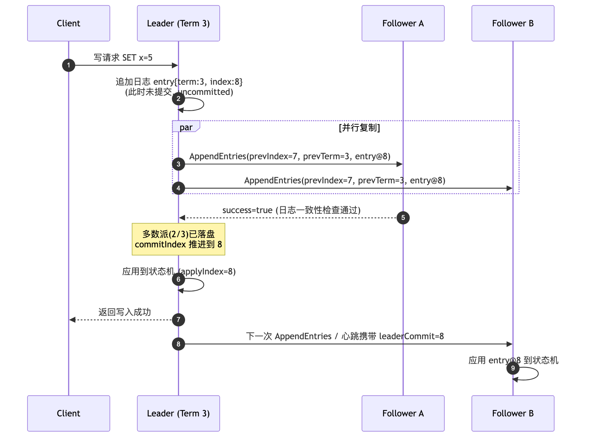
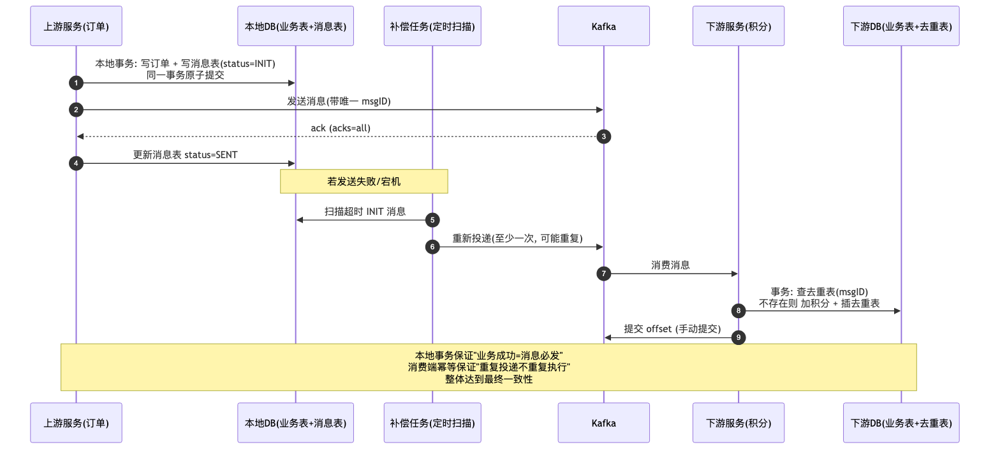
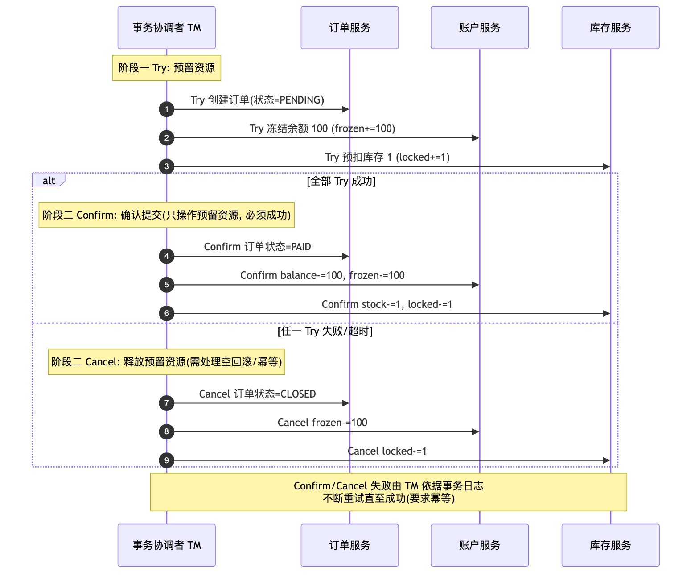

# Golang 分布式系统与数据结构面试 QA：分布式锁、Raft、分布式事务、协程池、跳表、LSM Tree、布隆过滤器、前缀树、一致性哈希

> 面向后端 Golang 岗位的分布式系统与数据结构深度问答。覆盖 Redis / etcd 两种分布式锁实现范式、Redis 锁的数据不一致隐患与改进（看门狗、Redlock、Fencing Token）、Raft 共识协议与 etcd 工程实践、分布式事务原理（2PC / 本地消息表 / Kafka 事务消息 / TCC）、以及 Go 协程池的完整实现。下篇覆盖跳表与并发跳表、LSM Tree、布隆过滤器、前缀树与 Radix Tree、一致性哈希等高级数据结构。所有代码均为可编译的 Go 风格实现，重点在原理与工程取舍。

## 目录

- [一、分布式锁总览](#一-分布式锁总览)
  - [Q1: 为什么需要分布式锁？它和单机锁的本质区别是什么？](#q1-为什么需要分布式锁-它和单机锁的本质区别是什么)
  - [Q2: 一把合格的分布式锁需要满足哪些性质？](#q2-一把合格的分布式锁需要满足哪些性质)
- [二、Redis 主动轮询型分布式锁](#二-redis-主动轮询型分布式锁)
  - [Q3: Redis 分布式锁的核心原语是什么？为什么必须 SET NX PX 一条命令完成？](#q3-redis-分布式锁的核心原语是什么-为什么必须-set-nx-px-一条命令完成)
  - [Q4: 为什么解锁必须用 Lua 脚本？](#q4-为什么解锁必须用-lua-脚本)
  - [Q5: 什么是主动轮询（自旋）模式？如何用 Go 实现一把完整的 Redis 锁？](#q5-什么是主动轮询-自旋-模式-如何用-go-实现一把完整的-redis-锁)
- [三、Redis 锁的数据不一致隐患与改进](#三-redis-锁的数据不一致隐患与改进)
  - [Q6: Redis 分布式锁有哪些会导致数据不一致的隐患？](#q6-redis-分布式锁有哪些会导致数据不一致的隐患)
  - [Q7: 什么是看门狗（Watchdog）自动续期？如何用 Go 实现？](#q7-什么是看门狗-watchdog-自动续期-如何用-go-实现)
  - [Q8: 什么是红锁 Redlock？它如何缓解主从切换导致的锁丢失？](#q8-什么是红锁-redlock-它如何缓解主从切换导致的锁丢失)
  - [Q9: Redlock 有哪些争议？Fencing Token 是什么？](#q9-redlock-有哪些争议-fencing-token-是什么)
- [四、etcd 监听回调型分布式锁](#四-etcd-监听回调型分布式锁)
  - [Q10: etcd 锁为什么天然比 Redis 锁安全？它依赖哪些机制？](#q10-etcd-锁为什么天然比-redis-锁安全-它依赖哪些机制)
  - [Q11: etcd 锁的"监听回调 + 前缀排队"是怎么工作的？](#q11-etcd-锁的-监听回调-前缀排队-是怎么工作的)
  - [Q12: Redis 锁与 etcd 锁如何选型？](#q12-redis-锁与-etcd-锁如何选型)
- [五、Raft 共识协议](#五-raft-共识协议)
  - [Q13: 用通俗的语言解释 Raft 解决了什么问题](#q13-用通俗的语言解释-raft-解决了什么问题)
  - [Q14: Raft 的 Leader 选举是如何进行的？](#q14-raft-的-leader-选举是如何进行的)
  - [Q15: Raft 的日志复制与提交规则是什么？](#q15-raft-的日志复制与提交规则是什么)
  - [Q16: Raft 如何保证安全性（不丢已提交数据、脑裂下不双写）？](#q16-raft-如何保证安全性-不丢已提交数据-脑裂下不双写)
  - [Q17: raft-etcd 工程案例：etcd 是如何把 Raft 落地的？](#q17-raft-etcd-工程案例-etcd-是如何把-raft-落地的)
- [六、分布式事务](#六-分布式事务)
  - [Q18: 分布式事务的本质问题是什么？有哪些主流方案？](#q18-分布式事务的本质问题是什么-有哪些主流方案)
  - [Q19: 2PC 两阶段提交的原理与缺陷](#q19-2pc-两阶段提交的原理与缺陷)
  - [Q20: 如何使用 Kafka 实现分布式事务（最终一致性）？](#q20-如何使用-kafka-实现分布式事务-最终一致性)
  - [Q21: Kafka 自身的事务机制（Transactional Producer）是怎么回事？](#q21-kafka-自身的事务机制-transactional-producer-是怎么回事)
  - [Q22: 如何实现 TCC？空回滚、悬挂、幂等三大难题怎么解？](#q22-如何实现-tcc-空回滚-悬挂-幂等三大难题怎么解)
  - [Q23: TCC、消息事务、2PC 如何选型？](#q23-tcc-消息事务-2pc-如何选型)
- [七、协程池](#七-协程池)
  - [Q24: goroutine 已经很轻量了，为什么还需要协程池？](#q24-goroutine-已经很轻量了-为什么还需要协程池)
  - [Q25: 如何实现一个生产级协程池？](#q25-如何实现一个生产级协程池)
  - [Q26: ants 等成熟协程池做了哪些进一步优化？](#q26-ants-等成熟协程池做了哪些进一步优化)
- [八、跳表 (Skip List)](#八-跳表-skip-list)
  - [Q27: 跳表的原理与动机是什么？](#q27-跳表的原理与动机是什么)
  - [Q28: 跳表的结构与核心操作是怎样的？](#q28-跳表的结构与核心操作是怎样的)
  - [Q29: 跳表的复杂度如何分析？](#q29-跳表的复杂度如何分析)
  - [Q30: 如何用 Go 实现跳表？](#q30-如何用-go-实现跳表)
  - [Q31: 跳表有哪些面试高频问题？](#q31-跳表有哪些面试高频问题)
- [九、并发跳表 (Concurrent Skip List)](#九-并发跳表-concurrent-skip-list)
  - [Q32: 并发跳表面临哪些挑战？锁粒度如何设计？](#q32-并发跳表面临哪些挑战-锁粒度如何设计)
  - [Q33: 无锁 CAS 方案的原理是什么？](#q33-无锁-cas-方案的原理是什么)
  - [Q34: 如何用 Go 实现并发跳表？](#q34-如何用-go-实现并发跳表)
  - [Q35: 并发跳表有哪些面试高频问题？](#q35-并发跳表有哪些面试高频问题)
- [十、日志结构合并树 (LSM Tree)](#十-日志结构合并树-lsm-tree)
  - [Q36: LSM Tree 的设计动机与整体架构是什么？](#q36-lsm-tree-的设计动机与整体架构是什么)
  - [Q37: MemTable 与 WAL 如何协作？](#q37-memtable-与-wal-如何协作)
  - [Q38: SSTable 格式与 Compaction 策略有哪些？](#q38-sstable-格式与-compaction-策略有哪些)
  - [Q39: LSM Tree 的读取路径与优化手段是什么？](#q39-lsm-tree-的读取路径与优化手段是什么)
  - [Q40: 如何用 Go 简化实现 LSM Tree？](#q40-如何用-go-简化实现-lsm-tree)
  - [Q41: LSM Tree 有哪些面试高频问题？](#q41-lsm-tree-有哪些面试高频问题)
- [十一、布隆过滤器 (Bloom Filter)](#十一-布隆过滤器-bloom-filter)
  - [Q42: 布隆过滤器的原理与数学基础是什么？](#q42-布隆过滤器的原理与数学基础是什么)
  - [Q43: 布隆过滤器有哪些变体？](#q43-布隆过滤器有哪些变体)
  - [Q44: 如何用 Go 实现布隆过滤器？](#q44-如何用-go-实现布隆过滤器)
  - [Q45: 布隆过滤器有哪些面试高频问题？](#q45-布隆过滤器有哪些面试高频问题)
- [十二、前缀树 (Trie)](#十二-前缀树-trie)
  - [Q46: 前缀树的原理与适用场景是什么？](#q46-前缀树的原理与适用场景是什么)
  - [Q47: 压缩前缀树 (Radix Tree) 如何优化？](#q47-压缩前缀树-radix-tree-如何优化)
  - [Q48: 如何用 Go 实现前缀树与 Radix Tree？](#q48-如何用-go-实现前缀树与-radix-tree)
  - [Q49: 前缀树有哪些面试高频问题？](#q49-前缀树有哪些面试高频问题)
- [十三、一致性哈希 (Consistent Hashing)](#十三-一致性哈希-consistent-hashing)
  - [Q50: 一致性哈希的问题背景与哈希环原理是什么？](#q50-一致性哈希的问题背景与哈希环原理是什么)
  - [Q51: 虚拟节点如何缓解数据倾斜？](#q51-虚拟节点如何缓解数据倾斜)
  - [Q52: 如何用 Go 实现一致性哈希？](#q52-如何用-go-实现一致性哈希)
  - [Q53: 一致性哈希有哪些面试高频问题？](#q53-一致性哈希有哪些面试高频问题)
- [附录: 数据结构选型速查](#附录-数据结构选型速查)
- [参考资料](#参考资料)

---

## 一、分布式锁总览

### Q1: 为什么需要分布式锁？它和单机锁的本质区别是什么？

单机锁（如 Go 的 `sync.Mutex`）保护的是同一进程内多个 goroutine 对共享内存的并发访问，锁状态存在进程自己的内存里。

分布式锁保护的是多个进程 / 多台机器对共享资源（数据库行、库存、文件、定时任务）的并发访问。此时锁状态必须存放在一个所有节点都能访问的外部存储中（Redis、etcd、ZooKeeper、MySQL）。

本质区别有三点：

1. 状态存储位置不同：单机锁在进程内存；分布式锁在外部共享存储，因此锁本身也成了一个分布式系统组件，会遭遇网络分区、节点宕机、时钟漂移等问题。
2. 持有者可能"失联而不释放"：单机进程崩溃锁自然消失；分布式场景下持锁进程崩溃或网络断开，锁若无过期机制会永久死锁——所以分布式锁必须有 TTL / 租约，而 TTL 又引入"业务没做完锁先过期"的新问题（见 Q6）。
3. 没有真正的原子性保证边界：单机锁的 acquire/release 与临界区在同一故障域；分布式锁的"拿到锁"与"操作资源"之间隔着网络，任何一步都可能延迟任意长时间（GC 停顿、网络抖动），这是所有分布式锁安全性问题的根源。

典型场景：秒杀扣库存防超卖、分布式定时任务防重复执行、缓存击穿时只放一个请求回源（singleflight 解决的是单进程版本的同类问题，跨进程就需要分布式锁）。

### Q2: 一把合格的分布式锁需要满足哪些性质？

| 性质                             | 含义                           | 不满足的后果     |
| -------------------------------- | ------------------------------ | ---------------- |
| 互斥性 (Mutual Exclusion)        | 任意时刻至多一个客户端持有锁   | 并发写冲突、超卖 |
| 无死锁 (Deadlock Free)           | 持锁者崩溃后锁最终可被他人获得 | 系统永久卡死     |
| 谁加锁谁解锁 (Safety of Release) | 只能释放自己持有的锁           | A 的锁被 B 误删  |
| 可用性 / 容错                    | 锁服务部分节点故障仍可加解锁   | 锁服务成为单点   |
| 可重入（可选）                   | 同一持有者可重复加锁           | 递归调用死锁     |
| 公平性（可选）                   | 按请求顺序获得锁               | 饥饿             |

按客户端等待锁的方式，分布式锁分两大流派，这也是本文的主线：

- 主动轮询型（自旋型）：客户端不断重试"抢锁"动作，抢不到就 sleep 后再试。代表：Redis SET NX、MySQL 唯一键。实现简单、对锁服务无事件推送能力要求，但有惊群与无效轮询开销。
- 监听回调型（Watch 型）：抢锁失败后不轮询，而是订阅锁的释放事件，锁释放时由服务端回调唤醒等待者。代表：etcd Watch、ZooKeeper 临时顺序节点 + Watcher。唤醒精准、无轮询空转，但要求存储服务支持事件推送与会话机制。

---

## 二、Redis 主动轮询型分布式锁

### Q3: Redis 分布式锁的核心原语是什么？为什么必须 SET NX PX 一条命令完成？

核心原语只有一条命令：

```
SET lock_key <unique_value> NX PX 30000
```

- `NX`（Not eXists）：key 不存在时才设置成功，保证互斥。
- `PX 30000`：30 秒自动过期，保证无死锁（持锁者崩溃后锁自动释放）。
- `<unique_value>`：每个客户端每次加锁生成的唯一标识（如 UUID 或 `hostname:pid:goroutineID:random`），保证谁加锁谁解锁（解锁前校验 value）。

为什么必须一条命令？ 早期错误写法是 `SETNX` + `EXPIRE` 两条命令：

```
SETNX lock_key 1      # 第 1 步成功
# <-- 客户端在这里崩溃
EXPIRE lock_key 30    # 第 2 步永远不会执行
```

两条命令不是原子的，第 1 步和第 2 步之间客户端崩溃，就产生一把永不过期的死锁。`SET ... NX PX` 把"占锁"和"设置过期"合并为单条原子命令，Redis 命令执行的单线程模型保证其原子性。

另一个历史错误方案是 `SETNX + GETSET` 比较时间戳，它依赖各客户端时钟一致，且释放时可能覆盖他人的锁，已被淘汰。

### Q4: 为什么解锁必须用 Lua 脚本？

解锁需要两步逻辑："先检查锁是不是我的，是才删除"。如果拆成 GET + DEL 两条命令：

```
1. 客户端 A: GET lock_key  返回 A 的 value, 校验通过
2. (此刻锁恰好过期, 客户端 B SET NX 成功, 锁现在属于 B)
3. 客户端 A: DEL lock_key  把 B 的锁删了!
4. 客户端 C 又能加锁, 于是 B 和 C 同时进入临界区
```

GET 和 DEL 之间存在时间窗口，check-and-delete 不原子。必须用 Lua 脚本让 Redis 原子地执行：

```lua
-- KEYS[1] = lock_key, ARGV[1] = 我的 unique_value
if redis.call("GET", KEYS[1]) == ARGV[1] then
    return redis.call("DEL", KEYS[1])
else
    return 0
end
```

Redis 执行 Lua 脚本期间不会插入其他命令，check 与 delete 之间不再有窗口。同理，看门狗续期也必须用 Lua（先校验 value 再 PEXPIRE），见 Q7。

### Q5: 什么是主动轮询（自旋）模式？如何用 Go 实现一把完整的 Redis 锁？

抢锁失败后，Redis 不会通知你锁何时释放（不考虑 keyspace notification 的弱保证），客户端只能定时重试——这就是主动轮询：

```
for {
    尝试 SET NX, 成功则返回
    失败则 sleep(重试间隔), 检查 ctx 是否超时, 继续重试
}
```

完整 Go 实现（含阻塞获取、Lua 解锁、错误区分）：

```go
package redislock

import (
	"context"
	"crypto/rand"
	"encoding/hex"
	"errors"
	"time"

	"github.com/redis/go-redis/v9"
)

var (
	ErrNotObtained = errors.New("redislock: 锁被他人持有")
	ErrNotHeld     = errors.New("redislock: 锁已不属于当前持有者")
)

// 原子解锁脚本: 校验 value 匹配才 DEL
var unlockScript = redis.NewScript(`
if redis.call("GET", KEYS[1]) == ARGV[1] then
    return redis.call("DEL", KEYS[1])
else
    return 0
end`)

type Lock struct {
	client *redis.Client
	key    string
	value  string        // 唯一标识, 防误删
	ttl    time.Duration // 锁过期时间
}

func randToken() string {
	b := make([]byte, 16)
	rand.Read(b)
	return hex.EncodeToString(b)
}

// TryLock 非阻塞抢锁: 一次 SET NX, 成败立现
func TryLock(ctx context.Context, c *redis.Client, key string, ttl time.Duration) (*Lock, error) {
	lock := &Lock{client: c, key: key, value: randToken(), ttl: ttl}
	ok, err := c.SetNX(ctx, key, lock.value, ttl).Result()
	if err != nil {
		return nil, err // 网络/Redis 错误, 与"锁被占"区分开
	}
	if !ok {
		return nil, ErrNotObtained
	}
	return lock, nil
}

// Lock 阻塞抢锁: 主动轮询, 直到成功或 ctx 取消
// retry 建议 50~200ms, 可加随机抖动避免惊群
func Lock(ctx context.Context, c *redis.Client, key string, ttl, retry time.Duration) (*Lock, error) {
	ticker := time.NewTicker(retry)
	defer ticker.Stop()
	for {
		lock, err := TryLock(ctx, c, key, ttl)
		if err == nil {
			return lock, nil
		}
		if !errors.Is(err, ErrNotObtained) {
			return nil, err
		}
		select {
		case <-ctx.Done():
			return nil, ctx.Err() // 等锁超时, 由调用方决定降级/报错
		case <-ticker.C:
		}
	}
}

// Unlock 原子解锁: 只删自己的锁
func (l *Lock) Unlock(ctx context.Context) error {
	res, err := unlockScript.Run(ctx, l.client, []string{l.key}, l.value).Int64()
	if err != nil {
		return err
	}
	if res == 0 {
		// 锁已过期被别人抢走: 说明 TTL 过短或业务超时, 需要告警
		return ErrNotHeld
	}
	return nil
}
```

工程要点：

1. 重试间隔加随机抖动（如 `retry + rand(0, retry/2)`），避免大量客户端同一时刻惊群冲击 Redis。
2. 等锁必须有超时（通过 `ctx`），否则流量高峰时请求无限堆积。
3. 区分三类结果：拿到锁 / 锁被占（业务可降级）/ Redis 故障（需要熔断或 fail-fast，绝不能当作"拿到锁"继续执行）。
4. `Unlock` 返回 `ErrNotHeld` 时说明锁曾经丢失过，期间的业务操作可能已发生并发冲突，必须打日志告警，这是发现 TTL 配置问题的重要信号。

---

## 三、Redis 锁的数据不一致隐患与改进

### Q6: Redis 分布式锁有哪些会导致数据不一致的隐患？

这是 Redis 锁最核心的面试题。隐患按根因分为两大类：

第一类：锁提前过期——TTL 与业务时长的矛盾（单实例即可发生）

```
时间线:
t0   A 拿到锁, TTL=30s
t1   A 执行业务: 发生 STW GC / 网络抖动 / 慢 SQL, 卡了 35s
t30  锁过期自动释放
t31  B 拿到锁, 开始改数据
t35  A 苏醒, 并不知道锁已丢, 继续改数据   <-- A、B 同时在临界区, 数据不一致
```

根因：TTL 是拍脑袋设的，而业务耗时不可预测。TTL 设太短容易提前失效，设太长崩溃后其他客户端要傻等很久。缓解手段：

- 看门狗自动续期（Q7）：业务没做完就不断延长 TTL。但注意，看门狗解决的是"正常慢"；若客户端整个进程被 GC/调度冻结，续期 goroutine 同样被冻结，锁照样丢——这就是需要 Fencing Token 的原因（Q9）。
- 解锁校验 + 告警：发现 `ErrNotHeld` 即说明发生过锁丢失。
- 业务层兜底：数据库乐观锁 / 唯一约束作为最后一道防线。

第二类：主从异步复制——故障切换导致锁丢失（集群部署特有）

Redis 的主从复制是异步的，Sentinel/Cluster 的故障切换不保证数据零丢失：

```
t0  A 向 master 执行 SET NX 成功, 拿到锁
t1  master 还没来得及把这个 key 复制给 slave 就宕机了
t2  Sentinel 把 slave 提升为新 master, 新 master 上没有这把锁
t3  B 向新 master SET NX 成功, 于是 A、B 同时持锁
```

根因：Redis 是 AP 系统，追求可用性与性能，主从间没有共识协议，切主时允许丢最近写入。缓解手段：

- Redlock 红锁（Q8）：向多个独立 master 多数派加锁。
- 换 CP 存储：etcd/ZooKeeper 用共识协议保证写入多数派落盘后才返回成功，切主不丢锁（Q10）。

其他次要隐患：

- 时钟跳变：运维 ntp 大幅回拨/前拨系统时钟，可能导致 TTL 提前到期（Redlock 对时钟尤其敏感）。
- 误删他锁：不用唯一 value + Lua 校验就会发生（Q4）。
- 锁未释放的残留等待：客户端崩溃后其他人要等满 TTL，可用性下降（etcd 的 Lease 会话机制对此更优雅）。

一句话总结：Redis 锁的互斥保证是"概率性"的——单实例受 TTL 与进程停顿威胁，集群受异步复制威胁；要求绝对互斥的场景必须叠加 Fencing Token 或改用 CP 存储。

### Q7: 什么是看门狗（Watchdog）自动续期？如何用 Go 实现？

看门狗是一个伴随锁生命周期的后台 goroutine：加锁成功后启动，每隔约 TTL/3 检查一次业务是否还在执行，在锁仍然属于自己时把 TTL 重置回初始值；业务完成解锁时停止。它把"固定 TTL"变成了"持有者活着就一直续、持有者死了最多 TTL 后自动释放"的租约语义。Java Redisson 的 watchdog（默认 30s 锁、每 10s 续期）就是这个机制的代表实现。

设计要点：

1. 续期必须用 Lua 校验身份：只给"仍然属于我"的锁续期，否则可能给别人的锁续期。
2. 续期周期取 TTL 的 1/3：留出两次重试机会，单次续期失败（网络抖动）不至于立刻丢锁。
3. 续期连续失败要通知业务：锁可能已丢，业务应尽快中止（通过取消 context 实现）。
4. 解锁时必须停掉看门狗，否则 goroutine 泄漏，且可能把已释放的 key 复活。

```go
// 续期脚本: 锁还是我的才重置 TTL
var renewScript = redis.NewScript(`
if redis.call("GET", KEYS[1]) == ARGV[1] then
    return redis.call("PEXPIRE", KEYS[1], ARGV[2])
else
    return 0
end`)

type WatchdogLock struct {
	*Lock
	cancel   context.CancelFunc
	done     chan struct{}
	LostChan <-chan struct{} // 关闭时表示锁已丢失, 业务应中止
}

// LockWithWatchdog 加锁并启动看门狗自动续期
func LockWithWatchdog(ctx context.Context, c *redis.Client,
	key string, ttl, retry time.Duration) (*WatchdogLock, error) {

	inner, err := Lock(ctx, c, key, ttl, retry)
	if err != nil {
		return nil, err
	}
	wctx, cancel := context.WithCancel(context.Background())
	lost := make(chan struct{})
	wl := &WatchdogLock{Lock: inner, cancel: cancel,
		done: make(chan struct{}), LostChan: lost}

	go func() { // 看门狗 goroutine
		defer close(wl.done)
		ticker := time.NewTicker(ttl / 3)
		defer ticker.Stop()
		failures := 0
		for {
			select {
			case <-wctx.Done():
				return // 正常解锁, 停止续期
			case <-ticker.C:
				res, err := renewScript.Run(wctx, c,
					[]string{inner.key}, inner.value, ttl.Milliseconds()).Int64()
				switch {
				case err == nil && res == 1:
					failures = 0 // 续期成功
				case err == nil && res == 0:
					close(lost) // 锁已被他人持有, 立即通知业务中止
					return
				default:
					failures++ // 网络错误, 容忍有限次重试
					if failures >= 2 {
						close(lost)
						return
					}
				}
			}
		}
	}()
	return wl, nil
}

func (wl *WatchdogLock) Unlock(ctx context.Context) error {
	wl.cancel() // 先停看门狗
	<-wl.done   // 等它退出, 避免解锁后又续期
	return wl.Lock.Unlock(ctx)
}
```

业务侧用法——监听 LostChan 及时刹车：

```go
wl, err := LockWithWatchdog(ctx, rdb, "lock:order:1001", 10*time.Second, 100*time.Millisecond)
if err != nil {
	return err
}
defer wl.Unlock(context.Background())

bizCtx, bizCancel := context.WithCancel(ctx)
defer bizCancel()
go func() {
	<-wl.LostChan
	bizCancel() // 锁丢了, 取消业务上下文, 尽快停止写操作
}()
doBusiness(bizCtx) // 业务内部所有 IO 都传递 bizCtx
```

看门狗的局限（必考追问）：看门狗与业务在同一进程，若进程整体被冻结（长 GC、cgroup 限流、虚拟机迁移），看门狗也被冻结，锁照样过期。苏醒后业务继续写，依然数据不一致。所以看门狗只解决"业务确实需要更长时间"的问题，不解决进程停顿问题，后者需要 Fencing Token（Q9）或资源端幂等/版本校验兜底。

### Q8: 什么是红锁 Redlock？它如何缓解主从切换导致的锁丢失？

Redlock 是 Redis 作者 antirez 提出的多实例锁算法，直面 Q6 第二类问题：既然一主多从的异步复制会在切主时丢锁，那就不用主从了——部署 N 个（通常 5 个）完全独立、互不复制的 Redis master，加锁要求多数派成功。

加锁流程（N=5 为例）：

1. 记录当前时间 `t1`。
2. 依次向 5 个实例执行 `SET key value NX PX ttl`，对每个实例的请求设置很短的超时（如 50ms，远小于 ttl），失败/超时立刻跳下一个，避免被单个故障实例拖死。
3. 记录完成时间 `t2`，计算加锁耗时 `elapsed = t2 - t1`。
4. 判定成功的条件（两个都要满足）：
   - 在至少 3 个（N/2+1）实例上加锁成功；
   - `elapsed < ttl`，即锁的有效时间还有剩余：`validity = ttl - elapsed - 时钟漂移补偿`。
5. 若判定失败，向所有实例（包括没加成功的）发起解锁，然后随机延迟后重试（随机延迟为了错开多个客户端的竞争节奏）。

为什么能缓解锁丢失：单个 master 宕机或数据丢失，只影响 5 票中的 1 票；持锁者手里仍有大于等于 3 票，新竞争者最多只能凑出 2 票（5-3），无法达到多数派。锁的互斥性从"单点不丢数据"弱化为"少数实例可以任意故障"。

Go 侧可直接使用 `go-redsync/redsync` 库，其内部即实现了多数派加锁、有效期校验与全量释放。

### Q9: Redlock 有哪些争议？Fencing Token 是什么？

Redlock 曾引发分布式领域著名论战（Martin Kleppmann《How to do distributed locking》 vs antirez 的回应），核心批评有三点：

1. 依赖时钟安全假设：Redlock 的正确性要求各实例时钟漂移有界。若某实例时钟突然前跳，它上面的锁会提前过期，被新客户端抢到，多数派被"偷走"。共识协议（Raft/Paxos）不依赖墙上时钟的正确性，而 Redlock 依赖。
2. 崩溃重启破坏多数派：实例 C 给客户端 A 投了票后崩溃，若重启时未持久化这把锁（Redis 默认 AOF everysec 允许丢 1 秒数据），重启后 C 可以再给客户端 B 投票，于是 A、B 同时拿到多数派。antirez 给的缓解是延迟重启（崩溃后等一个最大 TTL 时长再启动）。
3. 即使算法完美，也挡不住进程停顿：客户端 A 拿到锁后长 GC 停顿，锁过期，B 拿锁写入；A 苏醒后带着"过期的锁"写入。任何基于 TTL 的锁都有这个问题，Redlock 花了 5 倍成本仍然没解决它。

Kleppmann 给出的根治方案是 Fencing Token（栅栏令牌）：

- 锁服务在每次授予锁时返回一个单调递增的令牌（etcd 里可直接用全局递增的 revision，ZooKeeper 用 zxid/节点序号；Redis 可用 `INCR` 生成）。
- 客户端写资源时必须携带令牌，资源端（数据库/存储）记录已见过的最大令牌，拒绝所有小于它的写请求：

```
A 拿到锁, token=33, 随后 GC 停顿, 锁过期
B 拿到锁, token=34, 写入存储, 存储记录 max_token=34
A 苏醒, 带 token=33 写入, 存储发现 33 < 34, 拒绝   <-- 数据一致性保住了
```

本质是把"时间上的互斥"转化为"版本上的单调性"，把最后一道校验放在资源端。代价是资源端必须可改造（支持条件写/版本比较），例如 SQL 落地形态：

```sql
UPDATE inventory SET stock = stock - 1, fence = 34
WHERE id = 1001 AND fence < 34;   -- 影响行数为 0 即为过期写, 拒绝
```

结论表述（面试推荐说法）：Redis 锁（含 Redlock）适合效率型场景——防止重复劳动（重复发邮件、重复跑任务），偶发的互斥失效可接受；正确性型场景（钱、库存等绝不允许并发写）应使用共识型锁（etcd/ZooKeeper）并叠加 Fencing Token，或干脆用数据库事务/乐观锁在资源端解决。

---

## 四、etcd 监听回调型分布式锁

### Q10: etcd 锁为什么天然比 Redis 锁安全？它依赖哪些机制？

etcd 是基于 Raft 共识协议的强一致（CP）KV 存储，它的锁建立在四个原语上：

1. Raft 多数派写入：每次写操作（含加锁的 Put）必须复制到多数派节点并提交后才返回成功。Leader 宕机切换后，新 Leader 一定拥有所有已提交的写入——Redis 主从切换丢锁的问题在 etcd 结构性不存在。
2. Lease（租约）：客户端创建一个带 TTL 的租约并将锁 key 绑定其上；客户端通过 `KeepAlive` 心跳自动续约（这是 etcd 内建的"看门狗"，不需要自己实现）；客户端崩溃则心跳停止、租约到期、该租约上所有 key 被自动删除、锁释放。无死锁性质由租约保证。
3. Revision（全局单调递增版本号）：etcd 每次写操作递增全局 revision。锁的公平排队靠比较 revision 实现，且 revision 天然就是一个 Fencing Token（Q9），可直接透传给资源端做过期写校验。
4. Watch（事件监听）：客户端可订阅某个 key 的变更事件，key 被删除时 etcd 主动推送通知——这是"监听回调型"锁的基础，等锁者无需轮询。

事务原语 Txn（compare-and-swap）示例，"key 不存在才创建"：

```go
txn := cli.Txn(ctx).
	If(clientv3.Compare(clientv3.CreateRevision(key), "=", 0)). // key 从未被创建
	Then(clientv3.OpPut(key, myID, clientv3.WithLease(leaseID))).
	Else(clientv3.OpGet(key))
```

### Q11: etcd 锁的"监听回调 + 前缀排队"是怎么工作的？

etcd 官方 `concurrency` 包（`go.etcd.io/etcd/client/v3/concurrency`）的 Mutex 实现是教科书级的监听回调锁，流程如下：

```
加锁 Lock("/mylock"):
1. 创建 Lease(TTL=10s), 启动 KeepAlive 自动续约
2. 以事务写入带自身标识的 key: /mylock/<leaseID>, 记下写入时的 revision = R
3. 读取前缀 /mylock/ 下所有 key, 按 CreateRevision 排序:
   - 若自己的 R 是最小的: 抢锁成功, 返回
   - 否则: 找到 revision 恰好排在自己前一位的 key P
4. Watch(P): 阻塞等待 P 被删除的事件
   - P 被删除(前一位主动解锁或其租约过期)后回到第 3 步复查
     (复查而非直接成功, 防止中间还有更小 revision 的等待者)

解锁 Unlock:
1. 删除自己的 key /mylock/<leaseID>
   etcd 向 Watch 该 key 的下一位等待者推送 DELETE 事件, 精准唤醒
2. 撤销 Lease
```

关键设计点：

- 每人只 Watch 前一位，而不是所有人 Watch 锁本身——锁释放时只唤醒一个等待者，避免惊群；同时 revision 排序天然实现 FIFO 公平锁，不会饥饿。这与 ZooKeeper 临时顺序节点方案完全同构。
- 无空转：等待期间客户端完全阻塞在 Watch 流上，不消耗 etcd 的请求处理能力；对比 Redis 自旋轮询每 100ms 打一次请求，高竞争时差距显著。
- 崩溃即释放：等待者或持有者崩溃后 KeepAlive 停止、租约过期、它的 key 被删、后继者被唤醒。不需要像 Redis 那样等满一个固定 TTL。

官方库用法：

```go
import (
	clientv3 "go.etcd.io/etcd/client/v3"
	"go.etcd.io/etcd/client/v3/concurrency"
)

cli, _ := clientv3.New(clientv3.Config{Endpoints: []string{"127.0.0.1:2379"}})
defer cli.Close()

// Session 封装了 Lease 创建与 KeepAlive 续约(内建看门狗)
sess, _ := concurrency.NewSession(cli, concurrency.WithTTL(10))
defer sess.Close() // 撤销租约, 释放本会话所有锁

mu := concurrency.NewMutex(sess, "/locks/order-1001")

if err := mu.Lock(ctx); err != nil { // 阻塞直到拿锁或 ctx 取消
	return err
}
defer mu.Unlock(context.Background())

// mu.Header().Revision 可作为 Fencing Token 透传给资源端
doBusiness(ctx)
```

还需要处理一个细节：Session 过期通知。若客户端与 etcd 网络分区超过 TTL，租约在服务端过期、锁被释放，但客户端可能还以为自己持锁。`sess.Done()` channel 会在租约失效时关闭，业务应监听它并中止操作（作用等同 Q7 中的 `LostChan`）：

```go
select {
case <-sess.Done():
	bizCancel() // 会话失效, 锁已不可信
case <-finished:
}
```

### Q12: Redis 锁与 etcd 锁如何选型？

| 维度             | Redis 锁（主动轮询）                                           | etcd 锁（监听回调）                                              |
| ---------------- | -------------------------------------------------------------- | ---------------------------------------------------------------- |
| 一致性模型       | AP，异步复制，切主可能丢锁                                     | CP，Raft 多数派，切主不丢锁                                      |
| 互斥强度         | 概率性（TTL、进程停顿、复制均可破坏）                          | 强（配合 revision fencing 可达最强）                             |
| 等锁方式         | 客户端自旋轮询，有空转和惊群                                   | Watch 事件回调，精准唤醒，FIFO 公平                              |
| 续期             | 需自研看门狗                                                   | Lease KeepAlive 内建                                             |
| 崩溃后锁释放延迟 | 等满 TTL                                                       | 租约过期即释放，且等待者立即被唤醒                               |
| 性能             | 极高（单实例十万级 QPS），延迟亚毫秒级                         | 较低（写要走 Raft 多数派落盘，毫秒级），量级约数千到上万写 QPS   |
| 运维成本         | 通常复用已有缓存集群                                           | 需维护 3/5 节点 etcd 集群                                        |
| 适用场景         | 高并发、短临界区、效率型（防重复劳动、缓存击穿保护、秒杀入口） | 正确性优先（主备选举、任务调度互斥、涉及资金库存的低频关键操作） |

决策口诀：吞吐要快、锁丢了能兜底选 Redis；锁丢了会出事故选 etcd（加 Fencing Token）；两边都不想引入额外组件就用数据库乐观锁/唯一约束。

---

## 五、Raft 共识协议

### Q13: 用通俗的语言解释 Raft 解决了什么问题

问题：想让一份数据在多台机器上有完全一致的副本（这样少数机器宕机数据也不丢、服务不停）。但网络会丢包、延迟、分区，机器会宕机重启——多台机器如何对"数据到底是什么"达成一致？这就是共识（Consensus）问题。

Raft 的思路：复制状态机（Replicated State Machine）。不直接同步数据本身，而是同步操作日志：只要每台机器以相同顺序执行相同的操作序列（`SET x=1`、`DEL y` ……），从相同初始状态出发，最终状态必然一致。于是问题简化为：让所有节点的日志保持一致。

Raft 为了可理解性（论文标题就叫 _In Search of an Understandable Consensus Algorithm_）把问题拆成三个子问题：

1. Leader 选举：任何时刻至多一个 Leader，所有写请求只经过 Leader，天然定序，避免多点写冲突。
2. 日志复制：Leader 把日志复制给 Follower，多数派确认后提交。
3. 安全性：宕机、分区、选举交替发生时，保证已提交的日志绝不丢失、绝不被改写。

通俗类比：一个班选班长（Leader 选举），班长记班级日志并抄送给同学，超过半数同学抄完这一条，这条记录就"作数"了（提交）；班长失联，同学们等不到心跳就发起改选，且大家约定只投给笔记至少和自己一样全的候选人（安全性），保证新班长手里一定有全部作数的记录。

节点只有三种角色，转换规则简单：

```
Follower --选举超时未收到心跳--> Candidate --获多数派选票--> Leader
Candidate/Leader --看到更大任期(term)--> 退回 Follower
```

### Q14: Raft 的 Leader 选举是如何进行的？

核心概念 Term（任期）：全局单调递增的逻辑时钟，每发起一次选举 term+1。每个 term 至多一个 Leader。节点间所有 RPC 都携带 term，任何节点看到比自己大的 term 立刻更新并退回 Follower——这是 Raft 处理过期消息、旧主复活的统一武器。

选举流程：

1. Follower 有一个随机化的选举超时（如 150-300ms 之间随机）。超时内没收到 Leader 心跳（AppendEntries）就转为 Candidate。
2. Candidate：`term+1`，投自己一票，向所有节点并行发送 `RequestVote(term, candidateID, lastLogIndex, lastLogTerm)`。
3. 其他节点的投票规则（两个条件都满足才投）：
   - 该 term 内还没投过票（一人一票，投票记录持久化，重启不忘）；
   - 候选人日志不落后于自己：`lastLogTerm` 更大，或 term 相同且 `lastLogIndex` 更大——这就是选举限制，保证只有日志足够全的节点能当选（安全性关键，见 Q16）。
4. 结果三选一：
   - 获得多数派选票：成为 Leader，立即广播心跳阻止新选举；
   - 收到合法 Leader 的心跳（term 不小于自己）：退回 Follower；
   - 超时无人胜出（选票被瓜分）：term 再 +1，重新选举。

两个精妙的工程设计：

- 随机超时打散选举：如果所有节点超时时间相同，会同时变 Candidate、互相瓜分选票、无限僵持。随机化让大概率只有一个节点率先发起选举并迅速胜出。
- 多数派交集原理：任意两个多数派必有交集。上一 term 的日志提交需要多数派确认，本 term 的当选需要多数派投票，因此新 Leader 的投票者中至少有一人持有全部已提交日志，配合选举限制，新 Leader 必然拥有全部已提交日志。

预防抖动的扩展（etcd 均已实现）：PreVote——Candidate 先发起预投票试探能否赢，避免分区中孤立节点无限自增 term、回归后扰乱集群；CheckQuorum——Leader 定期确认能联系到多数派，否则主动下台。

### Q15: Raft 的日志复制与提交规则是什么？

每条日志项：`{term, index, command}`。复制流程见下图：



1. 客户端把写请求发给 Leader（发给 Follower 会被重定向）。
2. Leader 将命令追加到本地日志（此时是 uncommitted 状态）。
3. Leader 通过 `AppendEntries(term, prevLogIndex, prevLogTerm, entries[], leaderCommit)` 并行推送给所有 Follower。
4. 一致性检查：Follower 校验本地日志在 `prevLogIndex` 处的 term 是否等于 `prevLogTerm`：
   - 匹配：追加新条目（若本地已有冲突条目则删除冲突点及其后所有日志，以 Leader 为准），返回成功；
   - 不匹配：拒绝。Leader 将该 Follower 的 `nextIndex` 回退再试，直到找到两者日志的最后一致点，然后用 Leader 日志覆盖之后的全部。这保证了日志匹配性质：两个日志中若某条目的 index 和 term 都相同，则该条目及之前的所有条目完全一致。
5. 提交（commit）：当某条日志被多数派持久化，Leader 推进 `commitIndex`，将其应用到状态机，向客户端返回成功。
6. Follower 通过后续 AppendEntries/心跳里携带的 `leaderCommit` 得知提交进度，随后应用到自己的状态机。

必须强调的细微规则（高频深挖点）：Leader 只能通过统计副本数直接提交"当前任期"的日志。旧任期日志即使已复制到多数派也不能单独提交，只能随当前任期新日志的提交被间接提交（论文 Figure 8 反例：直接提交旧任期日志可能在后续选举中被覆盖，导致"已提交"数据丢失）。etcd 新 Leader 上任第一件事就是提交一条本任期的空日志（no-op）来尽快间接提交前任遗留日志。

### Q16: Raft 如何保证安全性（不丢已提交数据、脑裂下不双写）？

安全性由一组环环相扣的机制共同保证：

1. Election Safety（一个 term 至多一个 Leader）：一人一票 + 多数派当选。两个候选人不可能在同一 term 各拿多数派（多数派必相交）。
2. Leader Completeness（新 Leader 拥有全部已提交日志）：选举限制（只投给日志不落后于自己的人）+ 多数派交集。这条性质使 Raft 的日志只从 Leader 单向流向 Follower，Leader 永不改写自己的日志，算法大幅简化（对比 Paxos 需要双向补齐）。
3. State Machine Safety（各节点以相同顺序应用相同日志）：由日志匹配性质 + 提交规则推出。
4. 脑裂下的写入安全：网络分区把 5 节点分成 2|3 两组：
   - 少数派侧的旧 Leader 还能收请求，但凑不齐多数派确认，日志永远无法提交，客户端得不到成功响应；
   - 多数派侧选出新 Leader（term 更大），正常提交；
   - 分区愈合，旧 Leader 看到更大 term 退位，其未提交日志被新 Leader 覆盖。任何时刻至多一个"能提交日志的 Leader"，这才是 Raft 真正的互斥保证。
5. 持久化边界：`currentTerm`、`votedFor`、日志必须在响应 RPC 前落盘（etcd 写 WAL + fsync），否则重启后可能在同一 term 内投两次票，破坏一切前提。

读请求的安全性（工程必考）：读也不能随便读，否则旧 Leader（尚未察觉自己已被替代）可能返回过期数据。三种方案：

- 日志读：读请求也走一遍 Raft 日志，最安全最慢；
- ReadIndex（etcd 线性一致读默认方案）：Leader 记下当前 `commitIndex` 作为读屏障，向多数派发一轮心跳确认自己仍是 Leader，等状态机应用到该屏障后再读本地数据——省掉日志落盘，仍是线性一致；
- Lease Read：Leader 假设"选举超时时间内不会有新 Leader"，租约内直接读本地。最快，但正确性依赖时钟漂移有界。etcd 客户端也提供 serializable read 选项，允许读任意节点本地数据，用一致性换性能。

### Q17: raft-etcd 工程案例：etcd 是如何把 Raft 落地的？

etcd 是 Raft 最著名的生产级实现（Kubernetes 的元数据存储），其架构展示了从论文算法到工程系统的全部补齐工作：

1. 库与应用分离：`etcd-raft` 是一个只实现纯算法的状态机库——不含网络、不含存储、甚至不含定时器（靠外部调用 `Tick()` 驱动逻辑时钟）。应用层通过一个循环与它交互：

```go
// etcd raft 库的经典驱动循环 (简化)
for {
	select {
	case <-ticker.C:
		node.Tick() // 驱动选举/心跳超时
	case rd := <-node.Ready(): // 库告诉应用: 有活要干了
		saveToWAL(rd.HardState, rd.Entries) // 1. 持久化日志+任期(必须先 fsync)
		send(rd.Messages)                   // 2. 发送 RPC 给其他节点
		if !raft.IsEmptySnap(rd.Snapshot) {
			applySnapshot(rd.Snapshot)
		}
		for _, ent := range rd.CommittedEntries {
			applyToStateMachine(ent) // 3. 应用已提交日志到 MVCC 存储
		}
		node.Advance() // 4. 告诉库这批处理完了
	case m := <-recvFromPeers:
		node.Step(ctx, m) // 收到其他节点的 Raft 消息, 喂给状态机
	}
}
```

这种"纯算法 + Ready/Step 接口"的设计让算法可被确定性测试（CockroachDB、TiKV 的 Raft 实现都借鉴了它）。

2. 存储分层：

- WAL（预写日志）：Raft 日志与 HardState 顺序追加写 + fsync，响应 RPC 前必须落盘；
- Snapshot：日志无限增长会拖慢重启回放，定期把状态机全量快照落盘，截断旧日志；落后太多的 Follower 直接发快照追赶；
- MVCC 状态机（bbolt）：已提交日志应用到多版本 KV 存储，每次写全局 revision+1——这个 revision 就是 Q10/Q11 中锁排队与 Fencing Token 的来源。

3. 论文之外的工程增强：

- 线性一致读用 ReadIndex 而非走日志（Q16），大幅提升读性能；
- PreVote + CheckQuorum 防止分区节点回归时扰乱集群；
- 成员变更：支持单步变更与 Joint Consensus，实现在线扩缩容；
- Learner（非投票成员）：新节点先以 Learner 身份追日志，追平后再提升为投票成员，避免新节点拉低多数派可用性；
- Lease 机制建立在 Raft 之上：租约的授予与过期删除都是 Raft 日志操作，所以主从切换后租约状态依然一致——这就是 etcd 锁"切主不丢锁"的底层原因。

4. 部署形态：3 或 5 节点（容忍 1 或 2 台故障）。节点数越多写越慢（多数派更大），因此奇数小集群 + Learner 扩展读是标准姿势。

一句话串联本文前半部分：etcd 锁的安全性 = Raft 多数派提交（不丢写）+ Lease（活性）+ revision（fencing）+ Watch（高效排队），四者都直接构建在上述工程化 Raft 之上。

---

## 六、分布式事务

### Q18: 分布式事务的本质问题是什么？有哪些主流方案？

单机事务由数据库用 undo/redo log + 锁实现 ACID。当一个业务操作要跨多个独立数据库/服务（下单服务写订单库、账户服务扣余额、库存服务扣库存），没有任何单点能同时锁住所有资源，本地事务的原子性失效：可能订单写成功了、扣款失败——这就是分布式事务要解决的问题。

理论基础：

- CAP：分区容错（P）必选，只能在强一致（C）与可用性（A）间取舍。
- BASE：Basically Available、Soft state、Eventually consistent——放弃时刻强一致，保证最终一致，换取可用性与性能。绝大多数互联网分布式事务方案是 BASE 型。

主流方案谱系（一致性从强到弱、侵入性与性能各异）：

| 方案                  | 一致性               | 原理一句话                                         | 典型实现                              |
| --------------------- | -------------------- | -------------------------------------------------- | ------------------------------------- |
| 2PC/XA                | 强（同步阻塞）       | 协调者统一指挥所有库先预备后提交                   | 数据库 XA、Seata AT（改良版自动补偿） |
| TCC                   | 较强（业务层两阶段） | 业务自己实现 Try 预留 / Confirm 确认 / Cancel 撤销 | Seata TCC、dtm                        |
| Saga                  | 最终一致             | 长事务拆成子事务链，失败则逆序执行补偿             | dtm、Temporal 编排                    |
| 本地消息表 / 事务消息 | 最终一致             | 本地事务 + 消息必达 + 消费幂等三件套               | 自建 + Kafka、RocketMQ 事务消息       |
| 最大努力通知          | 弱                   | 尽力重试通知 + 对方主动对账                        | 支付回调                              |

选择的第一性原则：能用最终一致就不要用强一致；强一致方案（2PC/TCC）成本高、吞吐低，只用于真正的资金级场景。

### Q19: 2PC 两阶段提交的原理与缺陷

角色：一个协调者（Coordinator）+ 多个参与者（Participant，即各资源库）。

- 阶段一 Prepare（投票）：协调者问所有参与者"能否提交？"。参与者执行事务、写好 undo/redo 日志、锁住资源，但不提交，回复 Yes/No。
- 阶段二 Commit/Rollback（执行）：全部 Yes 则广播 Commit；任一 No 或超时则广播 Rollback。参与者执行并释放锁。

缺陷（也是后续所有方案的改进动机）：

1. 同步阻塞：从 Prepare 到 Commit 期间所有参与者锁住资源，其他事务只能等待，吞吐急剧下降；
2. 协调者单点：协调者在阶段二前崩溃，参与者卡在"已预备"状态，锁无法释放也不知道该提交还是回滚（阻塞直到协调者恢复）；
3. 数据不一致窗口：阶段二协调者只发出部分 Commit 就崩溃，导致部分参与者提交了、部分没有；
4. 3PC 增加 CanCommit 阶段和超时自动提交来缓解阻塞，但网络分区下仍可能不一致，且多一轮 RPC，工程界很少直接使用。

因此互联网场景演化出两条务实路线：牺牲强一致，走消息最终一致（Q20）；把两阶段上移到业务层、用资源预留代替资源锁定，即 TCC（Q22）。

### Q20: 如何使用 Kafka 实现分布式事务（最终一致性）？

Kafka 本身不提供"业务库 + 消息"的跨系统事务，标准做法是本地消息表（Transactional Outbox）+ 可靠投递 + 消费幂等三件套，实现"上游本地事务成功等价于下游最终一定执行"的最终一致：



上游（订单服务）——保证"业务成功则消息必发"：

1. 在同一个本地数据库事务里：写业务数据（订单表）+ 写消息表（`msg_id, topic, payload, status=INIT`）。本地事务的原子性保证两者要么都在要么都不在——这是整个方案的基石。
2. 事务提交后异步发 Kafka（`acks=all` + 幂等 producer），成功则把消息表置为 `SENT`。
3. 补偿任务定时扫描超时未 SENT 的 INIT 消息重发。发送与更新状态之间任何一步崩溃，扫表都会兜住，实现至少一次投递（可能重复，绝不丢失）。

```go
// 上游: 业务与消息写入同一事务
func CreateOrder(ctx context.Context, db *sql.DB, order Order) error {
	tx, err := db.BeginTx(ctx, nil)
	if err != nil {
		return err
	}
	defer tx.Rollback()

	if _, err := tx.ExecContext(ctx,
		`INSERT INTO orders(id, user_id, amount, status) VALUES(?,?,?, 'CREATED')`,
		order.ID, order.UserID, order.Amount); err != nil {
		return err
	}
	payload, _ := json.Marshal(OrderCreatedEvent{OrderID: order.ID, UserID: order.UserID, Amount: order.Amount})
	if _, err := tx.ExecContext(ctx,
		`INSERT INTO outbox(msg_id, topic, payload, status, created_at)
		 VALUES(?, 'order.created', ?, 'INIT', NOW())`,
		uuid.NewString(), payload); err != nil {
		return err
	}
	return tx.Commit() // 原子: 订单与消息同生共死
}

// 投递者: 事务提交后立即触发 + 定时任务扫表兜底
func RelayOutbox(ctx context.Context, db *sql.DB, w *kafka.Writer) {
	rows, _ := db.QueryContext(ctx,
		`SELECT msg_id, topic, payload FROM outbox
		 WHERE status='INIT' AND created_at < NOW() - INTERVAL 5 SECOND LIMIT 100`)
	defer rows.Close()
	for rows.Next() {
		var msgID, topic string
		var payload []byte
		rows.Scan(&msgID, &topic, &payload)
		err := w.WriteMessages(ctx, kafka.Message{
			Topic:   topic,
			Key:     []byte(msgID), // 同 key 进同分区, 下游按序消费
			Headers: []kafka.Header{{Key: "msg_id", Value: []byte(msgID)}},
			Value:   payload,
		}) // Writer 需配置 RequiredAcks = RequireAll
		if err == nil {
			db.ExecContext(ctx, `UPDATE outbox SET status='SENT' WHERE msg_id=?`, msgID)
		} // 失败下轮重扫, 至少一次
	}
}
```

下游（积分服务）——保证"重复消息不重复执行"（幂等消费）：

至少一次投递必然带来重复，幂等由去重表 + 本地事务实现：

```go
func ConsumeOrderCreated(ctx context.Context, db *sql.DB, msg kafka.Message) error {
	msgID := headerValue(msg, "msg_id")
	tx, err := db.BeginTx(ctx, nil)
	if err != nil {
		return err
	}
	defer tx.Rollback()

	// 去重表 msg_id 唯一索引: 插入冲突 => 已处理过, 直接返回成功以提交 offset
	if _, err := tx.ExecContext(ctx,
		`INSERT INTO consumed_msg(msg_id) VALUES(?)`, msgID); err != nil {
		if isDuplicateKey(err) {
			return nil // 幂等: 重复消息静默跳过
		}
		return err
	}
	var evt OrderCreatedEvent
	json.Unmarshal(msg.Value, &evt)
	if _, err := tx.ExecContext(ctx,
		`UPDATE user_points SET points = points + ? WHERE user_id = ?`,
		evt.Amount/10, evt.UserID); err != nil {
		return err
	}
	return tx.Commit() // 业务与去重记录原子落库, 之后再手动提交 offset
}
```

逐环节可靠性论证（面试加分项）：

| 环节                            | 故障          | 兜底                                         |
| ------------------------------- | ------------- | -------------------------------------------- |
| 写业务 + 写消息表               | 崩溃          | 同一事务回滚，无脏数据                       |
| 发 Kafka 前崩溃                 | 消息停留 INIT | 定时扫表重发                                 |
| 发 Kafka 成功但更新 SENT 前崩溃 | 重复发送      | 下游 msg_id 去重                             |
| Broker 丢消息                   | -             | `acks=all` + `min.insync.replicas>=2` + 重试 |
| 消费成功但 offset 提交前崩溃    | 重复消费      | 去重表幂等                                   |
| 下游一直失败                    | 消息堆积      | 重试 N 次入死信队列 DLQ + 人工/对账          |

该方案的局限：只能保证"下游最终执行"，不能回滚上游。若下游是"扣库存"且可能业务性失败（库存不足），要么改用 TCC（Q22），要么增加反向补偿消息（Saga 化：下游失败发 `order.cancel` 消息通知上游关单）。

### Q21: Kafka 自身的事务机制（Transactional Producer）是怎么回事？

常被混淆的一点：Kafka 的"事务"解决的是 Kafka 内部多分区写入与消费位点提交的原子性，不是跨数据库的分布式事务。两者常配合使用。

- 幂等 Producer（`enable.idempotence=true`）：broker 为每个 producer 分配 PID，对每个分区校验消息序号，重试不会造成单分区内重复——解决网络重试导致的重复写入。
- 事务 Producer（配置 `transactional.id`）：在幂等基础上，通过事务协调器（Transaction Coordinator）+ 内部 topic `__transaction_state` 记录事务状态，实现多条消息跨多个分区的原子可见，本质是一个两阶段提交：`beginTransaction`、发若干消息、`commitTransaction`（协调器先写 PREPARE_COMMIT 到事务日志，再向各分区写入 commit marker）。中途失败则 abort，消息带 abort 标记。
- 消费端 `isolation.level=read_committed`：只消费已提交事务的消息，未提交/已中止的被过滤。
- 典型用途是流处理的 exactly-once（EOS）：consume-process-produce 链路中，把"产出消息"和"提交消费 offset"（offset 本身也是写入 `__consumer_offsets` topic）放进同一个 Kafka 事务，实现读-处理-写的端到端一次语义（Kafka Streams 的 `processing.guarantee=exactly_once_v2`）。

为什么它替代不了本地消息表：Kafka 事务的原子性边界只覆盖"写 Kafka"这一侧，无法把你的 MySQL 本地事务纳入进来——数据库提交和 Kafka 提交依然是两个独立的提交点。所以跨"DB + Kafka"仍需 Outbox 模式（Q20）；Kafka 事务用于其内部的多写原子性和流式 EOS。

### Q22: 如何实现 TCC？空回滚、悬挂、幂等三大难题怎么解？

TCC（Try-Confirm-Cancel）是业务层的两阶段提交，用于对一致性要求高、又不能忍受 2PC 长时间锁资源的场景（资金、库存）。核心思想：把"锁资源"改成"预留资源"——Try 阶段只冻结不动真格，锁粒度从数据库行锁降为业务字段，并发能力大幅提升。



三个阶段（每个参与方都要实现三个接口）：

- Try：检查 + 预留资源。如扣款：检查余额充足，`balance` 不动、`frozen += 100`；库存：`stock` 不动、`locked += 1`。
- Confirm：所有参与者 Try 成功后调用。只操作预留部分、不再做业务检查（检查在 Try 已做完），如 `balance -= 100, frozen -= 100`。设计上要求 Confirm 必然能成功，失败只能重试。
- Cancel：任一 Try 失败/超时后调用，释放预留：`frozen -= 100`。

协调者（TM）持久化事务日志（全局事务 ID + 各分支状态），Confirm/Cancel 失败后依据日志不断重试直到成功——这要求两个接口幂等。

三大工程难题及标准解法（TCC 面试的真正考点）：

设每个参与方维护一张分支事务状态表 `tcc_branch(gid, branch_id, status)`，status 取值 {TRIED, CONFIRMED, CANCELED}，(gid, branch_id) 唯一索引。三个问题一张表全解：

1. 幂等：网络重试导致 Confirm/Cancel 被调用多次。解法：状态机检查——已 CONFIRMED 再收到 Confirm 直接返回成功；靠唯一索引 + 状态条件更新保证同一操作只生效一次。
2. 空回滚：Try 因网络阻塞没到达参与者，但 TM 已超时发起 Cancel。参与者收到"没有对应 Try 的 Cancel"，若照常执行 `frozen -= 100` 就把别人的钱扣了。解法：Cancel 时查状态表，无 TRIED 记录则插入一条 CANCELED 记录并直接返回成功（不做业务动作）。
3. 悬挂：接上例，Cancel 执行完后，阻塞在网络里的 Try 迟到抵达并执行成功，资源被永久冻结，再也没人来 Confirm/Cancel 它。解法：Try 执行前查状态表，发现已有 CANCELED 记录则拒绝执行。空回滚插入的那条 CANCELED 记录，正是给迟到 Try 设的路障。

Go 实现骨架（账户服务参与方）：

```go
// Try: 冻结金额 —— 防悬挂 + 幂等 + 预留资源, 三步一个事务
func TryDeduct(ctx context.Context, db *sql.DB, gid, branchID string, userID, amount int64) error {
	tx, err := db.BeginTx(ctx, nil)
	if err != nil {
		return err
	}
	defer tx.Rollback()

	// 1. 防悬挂/幂等: 尝试登记 TRIED, 唯一索引冲突说明 Try 已执行或已被 Cancel 抢先
	res, err := tx.ExecContext(ctx,
		`INSERT IGNORE INTO tcc_branch(gid, branch_id, status) VALUES(?,?,'TRIED')`,
		gid, branchID)
	if err != nil {
		return err
	}
	if n, _ := res.RowsAffected(); n == 0 {
		var status string
		tx.QueryRowContext(ctx,
			`SELECT status FROM tcc_branch WHERE gid=? AND branch_id=?`,
			gid, branchID).Scan(&status)
		if status == "CANCELED" {
			return ErrSuspended // 悬挂: Cancel 已先行, 拒绝这个迟到的 Try
		}
		return nil // 重复 Try, 幂等返回成功
	}
	// 2. 检查 + 预留: 余额够才冻结 (条件更新天然防超扣)
	res, err = tx.ExecContext(ctx,
		`UPDATE account SET frozen = frozen + ? WHERE user_id = ? AND balance - frozen >= ?`,
		amount, userID, amount)
	if err != nil {
		return err
	}
	if n, _ := res.RowsAffected(); n == 0 {
		return ErrInsufficientBalance // Try 业务性失败, TM 将发起全局 Cancel
	}
	return tx.Commit()
}

// Confirm: 真实扣款 —— 只处理预留资源, 幂等
func ConfirmDeduct(ctx context.Context, db *sql.DB, gid, branchID string, userID, amount int64) error {
	tx, err := db.BeginTx(ctx, nil)
	if err != nil {
		return err
	}
	defer tx.Rollback()
	// 状态从 TRIED 迁移到 CONFIRMED, 影响行数为 0 说明已确认过(幂等返回)
	res, _ := tx.ExecContext(ctx,
		`UPDATE tcc_branch SET status='CONFIRMED' WHERE gid=? AND branch_id=? AND status='TRIED'`,
		gid, branchID)
	if n, _ := res.RowsAffected(); n == 0 {
		return nil
	}
	if _, err := tx.ExecContext(ctx,
		`UPDATE account SET balance = balance - ?, frozen = frozen - ? WHERE user_id = ?`,
		amount, amount, userID); err != nil {
		return err
	}
	return tx.Commit()
}

// Cancel: 解冻 —— 空回滚 + 幂等
func CancelDeduct(ctx context.Context, db *sql.DB, gid, branchID string, userID, amount int64) error {
	tx, err := db.BeginTx(ctx, nil)
	if err != nil {
		return err
	}
	defer tx.Rollback()
	// 空回滚: 没有任何记录则登记 CANCELED 占位(阻断未来迟到的 Try), 不做业务动作
	res, err := tx.ExecContext(ctx,
		`INSERT IGNORE INTO tcc_branch(gid, branch_id, status) VALUES(?,?,'CANCELED')`,
		gid, branchID)
	if err != nil {
		return err
	}
	if n, _ := res.RowsAffected(); n > 0 {
		return tx.Commit() // 空回滚完成
	}
	// 已有记录: TRIED -> CANCELED 才需要解冻; 已 CANCELED 则幂等返回
	res, _ = tx.ExecContext(ctx,
		`UPDATE tcc_branch SET status='CANCELED' WHERE gid=? AND branch_id=? AND status='TRIED'`,
		gid, branchID)
	if n, _ := res.RowsAffected(); n == 0 {
		return nil
	}
	if _, err := tx.ExecContext(ctx,
		`UPDATE account SET frozen = frozen - ? WHERE user_id = ?`, amount, userID); err != nil {
		return err
	}
	return tx.Commit()
}
```

生产中通常不自研 TM，而使用 dtm（Go 生态，原生支持 TCC/Saga/二阶段消息，子事务屏障 barrier 自动处理空回滚/悬挂/幂等）或 Seata。dtm 的调用侧大致形如：

```go
err := dtmcli.TccGlobalTransaction(dtmServer, gid, func(tcc *dtmcli.Tcc) (*resty.Response, error) {
	if _, err := tcc.CallBranch(&req, host+"/tryDeduct", host+"/confirmDeduct", host+"/cancelDeduct"); err != nil {
		return nil, err
	}
	return tcc.CallBranch(&req, host+"/tryLockStock", host+"/confirmStock", host+"/cancelStock")
})
```

### Q23: TCC、消息事务、2PC 如何选型？

| 维度         | 2PC/XA                     | TCC                                  | 本地消息表/事务消息 (Kafka)      |
| ------------ | -------------------------- | ------------------------------------ | -------------------------------- |
| 一致性       | 强一致                     | 准强一致（存在短暂中间态：冻结）     | 最终一致（秒到分钟级窗口）       |
| 资源占用     | 数据库长事务锁，吞吐差     | 业务字段级预留，锁短                 | 无跨服务锁                       |
| 业务侵入     | 无（数据库层）             | 极高（每个操作写 3 个接口 + 状态表） | 低（一张消息表 + 幂等消费）      |
| 能否回滚上游 | 能                         | 能（Cancel）                         | 不能（只能靠反向消息补偿）       |
| 参与者要求   | 支持 XA 的数据库           | 可改造的业务服务                     | 只需消费消息                     |
| 适用         | 遗留系统内部、低并发强一致 | 资金/库存等核心链路，高一致 + 高并发 | 订单到积分/通知/统计等可异步下游 |

实践组合拳：核心资金链路用 TCC 保一致，非核心下游用消息最终一致解耦。无论用哪种，幂等是分布式事务的地基，所有接口默认按"会被重复调用"设计。

---

## 七、协程池

### Q24: goroutine 已经很轻量了，为什么还需要协程池？

goroutine 初始栈仅 2KB、由 runtime 的 GMP 调度器管理，创建成本远低于线程，多数场景确实直接 `go f()` 即可。协程池的价值在高并发 + 任务源不可控的场景：

1. 限制并发数，保护下游：每个请求 `go` 一个 goroutine 去查数据库，10 万 QPS 就是 10 万并发连接打到 DB——协程池本质是一个并发度上限阀门（信号量语义）。
2. 防止内存失控：goroutine 栈会按需增长（2KB 起，上限可达 1GB），百万级 goroutine 轻松吃掉数 GB 内存；且大量 runnable goroutine 会加重调度与 GC 扫描负担。
3. 复用降低创建/销毁开销：单次 goroutine 创建是微秒级与若干内存分配，海量短任务（如网关每条消息一个任务）下累积开销可观；池化后 worker 常驻，任务通过 channel 传递，分配次数大幅下降。
4. 统一治理：池是天然的切面——统一 panic recover（一个未 recover 的 goroutine panic 会杀死整个进程）、超时控制、任务排队与拒绝策略、运行指标（队列长度、活跃 worker 数）暴露。

反面提醒（体现判断力）：并发量可控、任务生命周期与请求绑定的普通业务代码，直接 `go` 配合 `errgroup`/`semaphore` 更简单；协程池是针对"海量、短小、不可控"任务的优化，不要处处滥用。

### Q25: 如何实现一个生产级协程池？

先给最小可用版（30 秒白板题）——固定 worker + 任务 channel：

```go
type SimplePool struct {
	tasks chan func()
	wg    sync.WaitGroup
}

func NewSimplePool(workers, queueSize int) *SimplePool {
	p := &SimplePool{tasks: make(chan func(), queueSize)}
	p.wg.Add(workers)
	for i := 0; i < workers; i++ {
		go func() {
			defer p.wg.Done()
			for task := range p.tasks { // channel 关闭且取空后退出
				task()
			}
		}()
	}
	return p
}

func (p *SimplePool) Submit(task func()) { p.tasks <- task } // 队列满则阻塞
func (p *SimplePool) Shutdown()          { close(p.tasks); p.wg.Wait() }
```

生产级版本需要补齐五件事：panic 隔离、非阻塞/超时提交、动态扩缩容、优雅关闭、运行指标。完整实现：

```go
package pool

import (
	"context"
	"errors"
	"log"
	"runtime/debug"
	"sync"
	"sync/atomic"
	"time"
)

var (
	ErrPoolClosed = errors.New("pool: 已关闭")
	ErrPoolFull   = errors.New("pool: 队列已满")
)

type Pool struct {
	tasks       chan func()
	coreWorkers int32         // 常驻 worker 数
	maxWorkers  int32         // 弹性上限
	curWorkers  int32         // 当前 worker 数 (atomic)
	running     int32         // 正在执行任务的 worker 数 (atomic)
	idleTimeout time.Duration // 弹性 worker 空闲回收时间
	closed      atomic.Bool
	wg          sync.WaitGroup
}

func New(core, max, queueSize int, idleTimeout time.Duration) *Pool {
	p := &Pool{
		tasks:       make(chan func(), queueSize),
		coreWorkers: int32(core),
		maxWorkers:  int32(max),
		idleTimeout: idleTimeout,
	}
	for i := 0; i < core; i++ {
		p.spawnWorker(true) // 常驻 worker
	}
	return p
}

func (p *Pool) spawnWorker(resident bool) {
	atomic.AddInt32(&p.curWorkers, 1)
	p.wg.Add(1)
	go func() {
		defer func() {
			atomic.AddInt32(&p.curWorkers, -1)
			p.wg.Done()
		}()
		idle := time.NewTimer(p.idleTimeout)
		defer idle.Stop()
		for {
			if resident {
				task, ok := <-p.tasks
				if !ok {
					return
				}
				p.run(task)
				continue
			}
			// 弹性 worker: 空闲超时自动回收, 收缩池规模
			idle.Reset(p.idleTimeout)
			select {
			case task, ok := <-p.tasks:
				if !ok {
					return
				}
				p.run(task)
			case <-idle.C:
				return
			}
		}
	}()
}

// run 执行单个任务: panic 只杀任务, 不杀 worker, 更不杀进程
func (p *Pool) run(task func()) {
	atomic.AddInt32(&p.running, 1)
	defer atomic.AddInt32(&p.running, -1)
	defer func() {
		if r := recover(); r != nil {
			log.Printf("pool: task panic: %v\n%s", r, debug.Stack())
		}
	}()
	task()
}

// Submit 非阻塞提交: 队列满时尝试弹性扩容, 仍满则快速失败(拒绝策略)
func (p *Pool) Submit(task func()) error {
	if p.closed.Load() {
		return ErrPoolClosed
	}
	select {
	case p.tasks <- task:
		return nil
	default:
	}
	// 队列满: 未达 maxWorkers 则扩一个弹性 worker 再试
	if atomic.LoadInt32(&p.curWorkers) < p.maxWorkers {
		p.spawnWorker(false)
	}
	select {
	case p.tasks <- task:
		return nil
	default:
		return ErrPoolFull // 由调用方决定: 丢弃/降级/同步执行/重试
	}
}

// SubmitWait 带超时的阻塞提交: 用 ctx 控制排队等待上限
func (p *Pool) SubmitWait(ctx context.Context, task func()) error {
	if p.closed.Load() {
		return ErrPoolClosed
	}
	select {
	case p.tasks <- task:
		return nil
	case <-ctx.Done():
		return ctx.Err()
	}
}

// Shutdown 优雅关闭: 拒绝新任务, 排空队列, 等所有 worker 退出
func (p *Pool) Shutdown() {
	if !p.closed.CompareAndSwap(false, true) {
		return
	}
	close(p.tasks)
	p.wg.Wait()
}

// Stats 暴露指标, 接入监控告警
func (p *Pool) Stats() (workers, running, queued int) {
	return int(atomic.LoadInt32(&p.curWorkers)),
		int(atomic.LoadInt32(&p.running)), len(p.tasks)
}
```

带结果返回的任务用泛型 + channel（Future 模式）包装即可：

```go
func SubmitFunc[T any](p *Pool, fn func() (T, error)) (<-chan T, <-chan error) {
	resCh, errCh := make(chan T, 1), make(chan error, 1)
	err := p.Submit(func() {
		v, err := fn()
		if err != nil {
			errCh <- err
			return
		}
		resCh <- v
	})
	if err != nil {
		errCh <- err
	}
	return resCh, errCh
}
```

设计决策问答（面试常见追问）：

- 队列满了怎么办？ 四种拒绝策略对应不同业务：阻塞（背压传导给上游）、快速失败（返回 ErrPoolFull 让调用方降级）、调用方自己执行（caller-runs，天然限流）、丢弃最旧任务。绝不能用无界队列——那只是把 OOM 从"goroutine 太多"换成"任务对象太多"。
- panic 为什么必须 recover？ worker 里任务 panic 若不 recover，整个进程退出；recover 后该 worker 继续消费下一个任务，实现故障隔离。
- 优雅关闭的顺序：先置关闭标志拒绝新任务，再 close(tasks) 通知 worker，worker 把队列剩余任务执行完（`for range` 会取空），最后 wg.Wait()。若需要"立即停止"，给每个任务传递可取消的 context。

### Q26: ants 等成熟协程池做了哪些进一步优化？

以最流行的 `panjf2000/ants` 为例，它相对朴素实现的核心优化点：

1. worker 复用采用"栈式空闲队列"而非共享 channel：空闲 worker 被压入一个 LIFO 栈，提交任务时弹出栈顶 worker、把任务通过该 worker 专属的 channel 递交。LIFO 使最近活跃的 worker 优先复用（CPU cache 友好），而栈底长期空闲的 worker 由清理 goroutine 按 `ExpiryDuration` 批量回收——实现容量随负载自动伸缩。
2. 锁优化：管理空闲队列用自旋锁（指数退避的 `runtime.Gosched()` 自旋）替代 mutex，短临界区下减少 goroutine 挂起/唤醒开销。
3. worker 对象用 `sync.Pool` 缓存，进一步降低分配；对比每任务一个 goroutine 的基线，百万级短任务基准下内存分配显著下降。
4. 功能完备性：`Nonblocking` 与 `MaxBlockingTasks`（阻塞提交的排队上限）、`PanicHandler` 自定义、`PoolWithFunc`（绑定固定函数的池，参数传递更省）、`Tune()` 运行时调整容量、`Reboot()` 复活已关闭的池。

选型建议：一般业务直接用 `ants` 或 `sourcegraph/conc`；只需要"限并发"语义时，`golang.org/x/sync/semaphore` 或带缓冲 channel 加 `errgroup.SetLimit` 更轻；自研池只在有特殊调度需求（优先级队列、亲和性、按租户隔离配额）时才值得。

---

---

## 八、跳表 (Skip List)

### Q27: 跳表的原理与动机是什么？

跳表由 William Pugh 于 1990 年提出，是一种基于有序链表的多层索引结构，用以替代平衡树（AVL / 红黑树）实现 O(log n) 的查找、插入、删除。

为什么需要跳表而不是直接用平衡树？

| 维度       | 平衡树                       | 跳表                               |
| ---------- | ---------------------------- | ---------------------------------- |
| 实现复杂度 | 旋转逻辑复杂，易出 bug       | 链表操作，直观简单                 |
| 范围查询   | 需要中序遍历，涉及回溯       | 底层链表天然有序，直接遍历         |
| 并发友好度 | 旋转涉及多节点修改，锁范围大 | 局部链表修改，锁粒度小             |
| 内存局部性 | 树节点分散                   | 底层链表连续（可优化）             |
| 典型应用   | Java TreeMap, C++ std::map   | Redis Sorted Set, LevelDB MemTable |

### Q28: 跳表的结构与核心操作是怎样的？

跳表的核心思想：在有序链表之上建立多级索引，每级索引是下级的"快车道"。


关键设计要素：

- 层数 (Level)：每个节点在插入时通过随机函数决定其出现在几层索引中
- 晋升概率 (p)：通常取 1/2 或 1/4，Redis 取 1/4（节省内存）
- 最大层数 (MaxLevel)：限制索引层数上界，通常 16~32 层足够覆盖 2^32 个元素
- 头节点 (Head)：哨兵节点，持有所有层的指针

#### 查找 (Search)

从最高层开始，逐层向右、向下：

```
1. 从 Head 的最高层指针开始
2. 在当前层向右移动，直到下一个节点 >= target
3. 下降一层，重复步骤 2
4. 到达第 0 层时，判断当前节点是否等于 target
```

#### 插入 (Insert)

```
1. 执行 Search 过程，记录每层最后一个 < target 的节点 (update[] 数组)
2. 随机生成新节点层数 level
3. 如果 level > 当前最大层数，扩展 Head 的指针
4. 在每层执行链表插入: newNode.next = update[i].next; update[i].next = newNode
```

#### 删除 (Delete)

```
1. 执行 Search 过程，记录 update[] 数组
2. 从第 0 层到节点最高层，逐层断开: update[i].next = target.next
3. 释放节点
4. 如果最高层变空，收缩层数
```

### Q29: 跳表的复杂度如何分析？

设 n 为元素数量，p 为晋升概率：

| 操作   | 期望时间复杂度 | 最坏时间复杂度 |
| ------ | -------------- | -------------- |
| Search | O(log n)       | O(n)           |
| Insert | O(log n)       | O(n)           |
| Delete | O(log n)       | O(n)           |
| 空间   | O(n / (1-p))   | -              |

期望层数推导：节点出现在第 k 层的概率为 p^k，期望层数 = 1/(1-p)。当 p=1/2 时期望层数为 2；p=1/4 时为 4/3。

查找步数推导：每层期望遍历 1/p 个节点，共 log*{1/p}(n) 层，总步数 = (1/p) \* log*{1/p}(n) = O(log n)。

### Q30: 如何用 Go 实现跳表？

```go
package skiplist

import (
	"math"
	"math/rand"
)

const (
	DefaultMaxLevel = 32
	DefaultP        = 0.25
)

type Node struct {
	Key     float64
	Value   interface{}
	Forward []*Node
}

type SkipList struct {
	Head  *Node
	Level int
	Size  int
	P     float64
	MaxLevel int
}

func NewSkipList() *SkipList {
	return &SkipList{
		Head: &Node{
			Key:     math.Inf(-1),
			Forward: make([]*Node, DefaultMaxLevel),
		},
		Level:    1,
		P:        DefaultP,
		MaxLevel: DefaultMaxLevel,
	}
}

func (sl *SkipList) randomLevel() int {
	level := 1
	for level < sl.MaxLevel && rand.Float64() < sl.P {
		level++
	}
	return level
}

func (sl *SkipList) Search(key float64) (*Node, bool) {
	current := sl.Head
	for i := sl.Level - 1; i >= 0; i-- {
		for current.Forward[i] != nil && current.Forward[i].Key < key {
			current = current.Forward[i]
		}
	}
	current = current.Forward[0]
	if current != nil && current.Key == key {
		return current, true
	}
	return nil, false
}

func (sl *SkipList) Insert(key float64, value interface{}) {
	update := make([]*Node, sl.MaxLevel)
	current := sl.Head

	for i := sl.Level - 1; i >= 0; i-- {
		for current.Forward[i] != nil && current.Forward[i].Key < key {
			current = current.Forward[i]
		}
		update[i] = current
	}

	current = current.Forward[0]

	if current != nil && current.Key == key {
		current.Value = value
		return
	}

	level := sl.randomLevel()
	if level > sl.Level {
		for i := sl.Level; i < level; i++ {
			update[i] = sl.Head
		}
		sl.Level = level
	}

	newNode := &Node{
		Key:     key,
		Value:   value,
		Forward: make([]*Node, level),
	}

	for i := 0; i < level; i++ {
		newNode.Forward[i] = update[i].Forward[i]
		update[i].Forward[i] = newNode
	}

	sl.Size++
}

func (sl *SkipList) Delete(key float64) bool {
	update := make([]*Node, sl.MaxLevel)
	current := sl.Head

	for i := sl.Level - 1; i >= 0; i-- {
		for current.Forward[i] != nil && current.Forward[i].Key < key {
			current = current.Forward[i]
		}
		update[i] = current
	}

	current = current.Forward[0]
	if current == nil || current.Key != key {
		return false
	}

	for i := 0; i < sl.Level; i++ {
		if update[i].Forward[i] != current {
			break
		}
		update[i].Forward[i] = current.Forward[i]
	}

	for sl.Level > 1 && sl.Head.Forward[sl.Level-1] == nil {
		sl.Level--
	}

	sl.Size--
	return true
}

func (sl *SkipList) Range(start, end float64) []*Node {
	var result []*Node
	current := sl.Head

	for i := sl.Level - 1; i >= 0; i-- {
		for current.Forward[i] != nil && current.Forward[i].Key < start {
			current = current.Forward[i]
		}
	}

	current = current.Forward[0]
	for current != nil && current.Key <= end {
		result = append(result, current)
		current = current.Forward[0]
	}
	return result
}
```

### Q31: 跳表有哪些面试高频问题？

Q1: Redis 的 Sorted Set 为什么用跳表而不用红黑树？

三个核心原因：

1. 范围查询效率：ZRANGEBYSCORE 需要返回连续区间，跳表底层是有序链表，找到起点后直接遍历；红黑树需要中序遍历且涉及父指针回溯。
2. 实现简单：跳表插入/删除只需修改局部指针，无需旋转；代码量约为红黑树的 1/3。
3. 并发扩展性：局部修改意味着锁粒度天然更小（Redis 单线程下这点不关键，但设计哲学上一致）。

Redis 跳表的特殊设计：

- p = 1/4（而非教科书 1/2），每个节点平均 1.33 个指针，节省内存
- 每个节点带有 score 和 member 双重排序
- 同时维护一个 dict（hash table）实现 O(1) 的 ZSCORE 查询
- 带有 backward 指针（仅第 0 层），支持 ZREVRANGE

Q2: 跳表的层数为什么用随机而不是严格交替？

严格交替（如每 2 个节点提升 1 层）在插入/删除时需要级联调整索引，退化为 O(n)。随机层数使得每次插入/删除只影响局部，期望复杂度 O(log n)，且无需全局再平衡。

Q3: 跳表与 B+ 树对比？

| 维度     | 跳表              | B+ 树                 |
| -------- | ----------------- | --------------------- |
| 适用场景 | 内存数据结构      | 磁盘数据结构          |
| 扇出     | 每层 2 个指针     | 每节点数百个 key      |
| IO 次数  | 不涉及磁盘        | O(log_m n) 次磁盘 IO  |
| 范围查询 | 链表遍历          | 叶节点链表遍历        |
| 更新代价 | O(log n) 指针修改 | 可能触发节点分裂/合并 |

---

## 九、并发跳表 (Concurrent Skip List)

### Q32: 并发跳表面临哪些挑战？锁粒度如何设计？

并发跳表需要解决的核心问题：

1. 结构一致性：插入/删除修改多层指针，如何保证其他 goroutine 看到的结构始终有效
2. ABA 问题：CAS 操作时，指针值相同但节点已被替换
3. 层数扩展：新节点层数超过当前最大层数时的并发安全
4. 删除与查找竞争：查找正在 traversing 的节点被另一个 goroutine 删除

三种常见方案：

方案一：全局锁 (Mutex)

- 最简单，所有操作串行化
- 适用于低并发场景
- 吞吐量随 goroutine 数增加不增长

方案二：节点级锁 (Fine-grained Locking)

- 每个节点持有一把 Mutex
- 插入/删除时锁住 update[] 中的前驱节点
- 需要 lock coupling（锁耦合）：先锁下一个，再释放上一个
- 复杂度较高，需要处理死锁

方案三：读写锁 (RWMutex)

- 读操作获取 RLock，写操作获取 Lock
- 适合读多写少场景
- 比全局锁好，但写操作仍然串行

### Q33: 无锁 CAS 方案的原理是什么？

核心思想：用 `sync/atomic` 的 CAS (Compare-And-Swap) 替代锁。

```
插入流程 (Lock-Free):
1. 无锁查找，记录 update[] (每层前驱)
2. 创建新节点
3. 从底层到顶层，CAS 设置每层前驱的 Forward 指针
4. 如果 CAS 失败（前驱已被修改），重新查找并重试

删除流程 (Lock-Free):
1. 无锁查找目标节点
2. 从顶层到底层，CAS 将前驱的 Forward 从 target 改为 target.Forward[i]
3. 标记节点为已删除 (logical delete)
4. 物理删除可延迟 (lazy unlink)
```

标记删除 (Marked Pointer)：

利用指针低位做标记位（Go 中可用 atomic.Value 或额外 flag 字段）：

- 节点增加 `deleted uint32` 字段，用 atomic 操作标记
- 查找时跳过已标记节点
- 后台 goroutine 定期物理清理

### Q34: 如何用 Go 实现并发跳表？

以下实现采用无锁 CAS (atomic.Pointer) + 逻辑删除方案，兼顾正确性与可读性：

```go
package concurrent_skiplist

import (
	"math"
	"math/rand"
	"sync"
	"sync/atomic"
)

const (
	MaxLevel    = 32
	Probability = 0.25
)

type Node struct {
	Key      float64
	Value    atomic.Value // interface{}
	Forward  []*atomic.Pointer[Node]
	TopLevel int32
	Deleted  atomic.Bool
}

func NewNode(key float64, value interface{}, level int) *Node {
	n := &Node{
		Key:      key,
		Forward:  make([]*atomic.Pointer[Node], level),
		TopLevel: int32(level),
	}
	n.Value.Store(value)
	for i := range n.Forward {
		n.Forward[i] = &atomic.Pointer[Node]{}
	}
	return n
}

type ConcurrentSkipList struct {
	Head     *Node
	MaxLevel atomic.Int32
	Size     atomic.Int64
	mu       sync.Mutex // 仅保护层数扩展
}

func New() *ConcurrentSkipList {
	head := NewNode(math.Inf(-1), nil, MaxLevel)
	csl := &ConcurrentSkipList{Head: head}
	csl.MaxLevel.Store(1)
	return csl
}

func randomLevel() int {
	level := 1
	for level < MaxLevel && rand.Float64() < Probability {
		level++
	}
	return level
}

func (csl *ConcurrentSkipList) findPredecessors(key float64) []*Node {
	preds := make([]*Node, MaxLevel)
	current := csl.Head
	maxLevel := int(csl.MaxLevel.Load())

	for i := maxLevel - 1; i >= 0; i-- {
		next := current.Forward[i].Load()
		for next != nil && next.Key < key {
			if next.Deleted.Load() {
				// 帮助清理: CAS 跳过已删除节点
				current.Forward[i].CompareAndSwap(next, next.Forward[i].Load())
				next = current.Forward[i].Load()
				continue
			}
			current = next
			next = current.Forward[i].Load()
		}
		preds[i] = current
	}
	return preds
}

func (csl *ConcurrentSkipList) Search(key float64) (interface{}, bool) {
	current := csl.Head
	maxLevel := int(csl.MaxLevel.Load())

	for i := maxLevel - 1; i >= 0; i-- {
		next := current.Forward[i].Load()
		for next != nil && next.Key < key {
			current = next
			next = current.Forward[i].Load()
		}
	}

	current = current.Forward[0].Load()
	if current != nil && current.Key == key && !current.Deleted.Load() {
		return current.Value.Load(), true
	}
	return nil, false
}

func (csl *ConcurrentSkipList) Insert(key float64, value interface{}) bool {
	for {
		preds := csl.findPredecessors(key)

		// 检查是否已存在
		next := preds[0].Forward[0].Load()
		if next != nil && next.Key == key && !next.Deleted.Load() {
			next.Value.Store(value)
			return false
		}

		level := randomLevel()
		newNode := NewNode(key, value, level)

		// 设置新节点的 Forward 指针
		for i := 0; i < level; i++ {
			newNode.Forward[i].Store(preds[i].Forward[i].Load())
		}

		// 从底层开始 CAS 链接
		// 底层成功即视为插入成功
		if !preds[0].Forward[0].CompareAndSwap(next, newNode) {
			continue // 重试
		}

		// 链接上层
		for i := 1; i < level; i++ {
			for {
				pred := preds[i]
				expected := pred.Forward[i].Load()
				newNode.Forward[i].Store(expected)
				if pred.Forward[i].CompareAndSwap(expected, newNode) {
					break
				}
				// 重新获取该层前驱
				preds = csl.findPredecessors(key)
			}
		}

		// 更新最大层数
		currentMax := csl.MaxLevel.Load()
		if int32(level) > currentMax {
			csl.mu.Lock()
			if int32(level) > csl.MaxLevel.Load() {
				csl.MaxLevel.Store(int32(level))
			}
			csl.mu.Unlock()
		}

		csl.Size.Add(1)
		return true
	}
}

func (csl *ConcurrentSkipList) Delete(key float64) bool {
	for {
		preds := csl.findPredecessors(key)
		target := preds[0].Forward[0].Load()

		if target == nil || target.Key != key || target.Deleted.Load() {
			return false
		}

		// 逻辑删除: 标记节点
		if !target.Deleted.CompareAndSwap(false, true) {
			continue
		}

		// 物理断开: 从顶层到底层
		topLevel := int(target.TopLevel)
		for i := topLevel - 1; i >= 0; i-- {
			for {
				pred := preds[i]
				if pred.Forward[i].Load() != target {
					break
				}
				if pred.Forward[i].CompareAndSwap(target, target.Forward[i].Load()) {
					break
				}
				preds = csl.findPredecessors(key)
			}
		}

		csl.Size.Add(-1)
		return true
	}
}

func (csl *ConcurrentSkipList) Range(start, end float64) []struct {
	Key   float64
	Value interface{}
} {
	var result []struct {
		Key   float64
		Value interface{}
	}

	current := csl.Head
	maxLevel := int(csl.MaxLevel.Load())
	for i := maxLevel - 1; i >= 0; i-- {
		next := current.Forward[i].Load()
		for next != nil && next.Key < start {
			current = next
			next = current.Forward[i].Load()
		}
	}

	current = current.Forward[0].Load()
	for current != nil && current.Key <= end {
		if !current.Deleted.Load() {
			result = append(result, struct {
				Key   float64
				Value interface{}
			}{current.Key, current.Value.Load()})
		}
		current = current.Forward[0].Load()
	}
	return result
}
```

### Q35: 并发跳表有哪些面试高频问题？

Q1: 无锁跳表如何处理 ABA 问题？

Go 中 `atomic.Pointer` 的 CAS 本身不解决 ABA。解决方案：

1. 逻辑删除 + 延迟回收：节点标记删除后不立即释放，等所有读者退出后再回收（类似 RCU / Hazard Pointer）
2. 版本号：指针打包 (pointer, version) 对，CAS 时同时比较版本号
3. Go GC 天然解决：Go 的垃圾回收器保证只要有引用就不会释放对象，因此指针值不会被复用，ABA 在 Go 中不是问题

Q2: 为什么从底层开始 CAS 而不是顶层？

底层（Level 0）包含所有节点，是数据完整性的基础。如果底层 CAS 成功，即使上层暂时未链接，查找仍然正确（只是少了快车道，退化为线性遍历底层）。反之如果先链接上层而底层失败，会出现"悬空索引"指向不存在的节点。

Q3: Java ConcurrentSkipListMap 的实现策略？

Java 的 `ConcurrentSkipListMap` 采用无锁 CAS：

- 节点有 `value` 字段，删除时 CAS 将 value 设为 null（逻辑删除）
- 使用 `Index` 对象管理高层索引，索引也可被 CAS 摘除
- 不维护精确 size，用 `LongAdder` 风格的计数器
- 查找时跳过 value==null 的节点

---

## 十、日志结构合并树 (LSM Tree)

### Q36: LSM Tree 的设计动机与整体架构是什么？

传统 B+ 树的写入瓶颈：

- 每次写入需要随机 IO 找到目标页
- 页分裂产生额外随机写
- 在 HDD 上随机写吞吐仅 ~100 IOPS

LSM Tree (Log-Structured Merge Tree) 由 Patrick O'Neil 于 1996 年提出，核心思想：将随机写转化为顺序写。

适用场景：写密集型负载（日志、时序数据、消息队列、缓存持久化）

典型系统：LevelDB, RocksDB, Cassandra, HBase, TiKV


分层结构：

```
写入路径: Write -> WAL -> MemTable -> (flush) -> L0 SSTable
读取路径: MemTable -> L0 -> L1 -> L2 -> ... -> Ln
合并路径: L(n) compaction -> L(n+1)
```

各层特点：

| 层级     | 存储位置 | 数据组织                     | 大小比例                |
| -------- | -------- | ---------------------------- | ----------------------- |
| MemTable | 内存     | 跳表/红黑树                  | 64MB (可配置)           |
| L0       | 磁盘     | 多个 SSTable，key 范围可重叠 | 4 个文件触发 compaction |
| L1       | 磁盘     | 多个 SSTable，key 范围不重叠 | 10MB \* 10              |
| L2       | 磁盘     | 多个 SSTable，key 范围不重叠 | 10MB \* 100             |
| Ln       | 磁盘     | 多个 SSTable，key 范围不重叠 | 10MB \* 10^n            |

### Q37: MemTable 与 WAL 如何协作？

MemTable：

- 内存中的有序数据结构（通常用跳表）
- 支持 O(log n) 的 Put/Get/Delete
- 达到阈值（如 64MB）后转为 Immutable MemTable，等待 flush
- 新的写入进入新的 Active MemTable

WAL (Write-Ahead Log)：

- 每次写入先追加到 WAL 文件（顺序写，极快）
- 保证进程崩溃后可以从 WAL 恢复 MemTable
- MemTable flush 到 SSTable 后，对应 WAL 可删除
- 写入流程: `append(WAL) -> insert(MemTable) -> ack(client)`

Delete 的处理：

- 不能直接删除（数据可能在更低层）
- 写入 Tombstone 标记（key + 特殊删除标记）
- Compaction 时遇到 Tombstone 才真正丢弃数据

### Q38: SSTable 格式与 Compaction 策略有哪些？

SSTable (Sorted String Table) 是 LSM Tree 的磁盘存储单元：

```
+-------------------+
|   Data Block 1    |  <- 排序的 key-value 对
+-------------------+
|   Data Block 2    |
+-------------------+
|       ...         |
+-------------------+
|   Data Block N    |
+-------------------+
|  Meta Block       |  <- 布隆过滤器、统计信息
+-------------------+
|  Index Block      |  <- 每个 Data Block 的起始 key + offset
+-------------------+
|  Footer           |  <- Index Block 的 offset + magic number
+-------------------+
```

关键设计：

- Data Block：通常 4KB~64KB，内部 key-value 对按 key 排序，可使用前缀压缩
- Index Block：稀疏索引，记录每个 Data Block 的第一个 key 和文件偏移
- Bloom Filter：每个 SSTable 一个，快速判断 key 是否可能存在
- Block Cache：LRU 缓存热点 Data Block，避免重复磁盘读取

Compaction 是 LSM Tree 的核心后台操作，负责合并多层数据、清理过期数据。

Size-Tiered Compaction (STCS)：

- 同一层中大小相近的 SSTable 合并为更大的 SSTable
- 写放大小（一次 compaction 只涉及少量文件）
- 读放大大（同层可能有多个重叠文件需要查找）
- 空间放大大（合并前新旧文件共存）
- 适用：写密集、对读延迟不敏感（Cassandra 默认）

Leveled Compaction (LCS)：

- L0 层文件可重叠，L1+ 层文件 key 范围不重叠
- L0 满时选择一个文件与 L1 中重叠的文件合并
- 读放大小（每层最多查一个文件，L0 除外）
- 写放大大（一次合并可能涉及 L(n+1) 的多个文件）
- 适用：读密集、需要稳定读延迟（LevelDB/RocksDB 默认）

FIFO Compaction：

- 按时间顺序删除最老的 SSTable
- 无合并开销
- 适用：TTL 数据、时序数据

写放大 (Write Amplification) 分析：

Leveled Compaction 下，一个 key 从写入到最终稳定，每层被重写一次：

- 写放大 = 层数 _ 每层合并比 ≈ log\_{10}(数据量) _ 10
- 10 层 LSM Tree 写放大约 10~30 倍

### Q39: LSM Tree 的读取路径与优化手段是什么？

```
Get(key):
1. 查 Active MemTable          -> 命中则返回
2. 查 Immutable MemTable(s)    -> 命中则返回
3. 查 L0 所有 SSTable (新->旧) -> 每个先查 Bloom Filter
4. 查 L1 SSTable (二分定位)    -> 先查 Bloom Filter
5. 查 L2 ... Ln
6. 未找到 -> 返回 NotFound
```

优化手段：

- Bloom Filter：每个 SSTable 前置布隆过滤器，false positive 率 ~1%，避免 99% 的无效磁盘读取
- Block Cache：LRU/LFU 缓存 Data Block
- Index Cache：缓存 Index Block，避免每次读取都加载索引
- Partitioned Index/Filter：大 SSTable 的索引/过滤器分片，按需加载

### Q40: 如何用 Go 简化实现 LSM Tree？

以下实现一个教学级 LSM Tree，包含 MemTable、WAL、SSTable flush、基本读取：

```go
package lsm

import (
	"bufio"
	"encoding/binary"
	"fmt"
	"os"
	"path/filepath"
	"sort"
	"sync"
)

const (
	MemTableThreshold = 4 * 1024 * 1024 // 4MB
	TombstoneValue    = "__TOMBSTONE__"
)

// --- MemTable (基于跳表的简化版，此处用 sorted slice 演示) ---

type KV struct {
	Key   string
	Value string
}

type MemTable struct {
	mu   sync.RWMutex
	data map[string]string
	size int
}

func NewMemTable() *MemTable {
	return &MemTable{data: make(map[string]string)}
}

func (m *MemTable) Put(key, value string) {
	m.mu.Lock()
	defer m.mu.Unlock()
	m.data[key] = value
	m.size += len(key) + len(value)
}

func (m *MemTable) Get(key string) (string, bool) {
	m.mu.RLock()
	defer m.mu.RUnlock()
	v, ok := m.data[key]
	return v, ok
}

func (m *MemTable) Size() int {
	m.mu.RLock()
	defer m.mu.RUnlock()
	return m.size
}

func (m *MemTable) SortedEntries() []KV {
	m.mu.RLock()
	defer m.mu.RUnlock()
	entries := make([]KV, 0, len(m.data))
	for k, v := range m.data {
		entries = append(entries, KV{Key: k, Value: v})
	}
	sort.Slice(entries, func(i, j int) bool {
		return entries[i].Key < entries[j].Key
	})
	return entries
}

// --- WAL ---

type WAL struct {
	file   *os.File
	writer *bufio.Writer
}

func OpenWAL(path string) (*WAL, error) {
	f, err := os.OpenFile(path, os.O_CREATE|os.O_WRONLY|os.O_APPEND, 0644)
	if err != nil {
		return nil, err
	}
	return &WAL{file: f, writer: bufio.NewWriter(f)}, nil
}

func (w *WAL) Append(key, value string) error {
	// 格式: [keyLen:4][key][valLen:4][value]
	buf := make([]byte, 4+len(key)+4+len(value))
	binary.BigEndian.PutUint32(buf[0:4], uint32(len(key)))
	copy(buf[4:4+len(key)], key)
	offset := 4 + len(key)
	binary.BigEndian.PutUint32(buf[offset:offset+4], uint32(len(value)))
	copy(buf[offset+4:], value)

	if _, err := w.writer.Write(buf); err != nil {
		return err
	}
	return w.writer.Flush()
}

func (w *WAL) Close() error {
	w.writer.Flush()
	return w.file.Close()
}

// --- SSTable ---

type SSTable struct {
	path    string
	entries []KV
}

func FlushToSSTable(entries []KV, path string) (*SSTable, error) {
	f, err := os.Create(path)
	if err != nil {
		return nil, err
	}
	defer f.Close()

	writer := bufio.NewWriter(f)

	for _, kv := range entries {
		buf := make([]byte, 4+len(kv.Key)+4+len(kv.Value))
		binary.BigEndian.PutUint32(buf[0:4], uint32(len(kv.Key)))
		copy(buf[4:4+len(kv.Key)], kv.Key)
		offset := 4 + len(kv.Key)
		binary.BigEndian.PutUint32(buf[offset:offset+4], uint32(len(kv.Value)))
		copy(buf[offset+4:], kv.Value)
		if _, err := writer.Write(buf); err != nil {
			return nil, err
		}
	}

	if err := writer.Flush(); err != nil {
		return nil, err
	}

	return &SSTable{path: path, entries: entries}, nil
}

func (sst *SSTable) Get(key string) (string, bool) {
	// 二分查找
	idx := sort.Search(len(sst.entries), func(i int) bool {
		return sst.entries[i].Key >= key
	})
	if idx < len(sst.entries) && sst.entries[idx].Key == key {
		return sst.entries[idx].Value, true
	}
	return "", false
}

// --- LSM Tree ---

type LSMTree struct {
	mu        sync.RWMutex
	dir       string
	mem       *MemTable
	immutable []*MemTable
	wal       *WAL
	sstables  []*SSTable // 按时间倒序，最新的在前
	walSeq    int
	sstSeq    int
}

func Open(dir string) (*LSMTree, error) {
	if err := os.MkdirAll(dir, 0755); err != nil {
		return nil, err
	}

	walPath := filepath.Join(dir, "wal_0.log")
	wal, err := OpenWAL(walPath)
	if err != nil {
		return nil, err
	}

	return &LSMTree{
		dir: dir,
		mem: NewMemTable(),
		wal: wal,
	}, nil
}

func (t *LSMTree) Put(key, value string) error {
	t.mu.Lock()
	defer t.mu.Unlock()

	if err := t.wal.Append(key, value); err != nil {
		return err
	}

	t.mem.Put(key, value)

	if t.mem.Size() >= MemTableThreshold {
		return t.flush()
	}
	return nil
}

func (t *LSMTree) flush() error {
	// 当前 mem 转为 immutable
	t.immutable = append(t.immutable, t.mem)

	// 创建新 mem 和 WAL
	t.walSeq++
	walPath := filepath.Join(t.dir, fmt.Sprintf("wal_%d.log", t.walSeq))
	wal, err := OpenWAL(walPath)
	if err != nil {
		return err
	}
	oldWal := t.wal
	t.wal = wal
	t.mem = NewMemTable()

	// flush 所有 immutable 到 SSTable
	for _, imm := range t.immutable {
		entries := imm.SortedEntries()
		sstPath := filepath.Join(t.dir, fmt.Sprintf("sst_%d.db", t.sstSeq))
		t.sstSeq++
		sst, err := FlushToSSTable(entries, sstPath)
		if err != nil {
			return err
		}
		// 最新的在前面
		t.sstables = append([]*SSTable{sst}, t.sstables...)
	}
	t.immutable = nil

	oldWal.Close()
	return nil
}

func (t *LSMTree) Get(key string) (string, bool) {
	t.mu.RLock()
	defer t.mu.RUnlock()

	// 1. Active MemTable
	if v, ok := t.mem.Get(key); ok {
		if v == TombstoneValue {
			return "", false
		}
		return v, true
	}

	// 2. Immutable MemTables (新->旧)
	for i := len(t.immutable) - 1; i >= 0; i-- {
		if v, ok := t.immutable[i].Get(key); ok {
			if v == TombstoneValue {
				return "", false
			}
			return v, true
		}
	}

	// 3. SSTables (新->旧)
	for _, sst := range t.sstables {
		if v, ok := sst.Get(key); ok {
			if v == TombstoneValue {
				return "", false
			}
			return v, true
		}
	}

	return "", false
}

func (t *LSMTree) Delete(key string) error {
	return t.Put(key, TombstoneValue)
}

func (t *LSMTree) Close() error {
	t.mu.Lock()
	defer t.mu.Unlock()
	if t.mem.Size() > 0 {
		if err := t.flush(); err != nil {
			return err
		}
	}
	return t.wal.Close()
}
```

### Q41: LSM Tree 有哪些面试高频问题？

Q1: LSM Tree 的读放大、写放大、空间放大分别是多少？

以 Leveled Compaction、层数 L、每层大小比 T=10 为例：

- 读放大：最坏需查 L 层，每层 1 个 SSTable（L0 除外），约 L 次磁盘 IO + Bloom Filter 开销
- 写放大：一个 key 每层被重写一次，总写放大 ≈ T \* L（约 20~30 倍）
- 空间放大：同一 key 可能存在于多层（未 compaction 前），约 1 + 1/T + 1/T^2 ≈ 1.11 倍

Q2: 为什么 L0 层允许 key 范围重叠？

L0 直接由 MemTable flush 产生，每次 flush 生成一个完整 SSTable。如果要求 L0 不重叠，则每次 flush 都需要与已有 L0 文件合并，增加写延迟。允许重叠的代价是读取 L0 时需要查所有文件（通常 4~20 个），但 L0 文件数量少，可接受。

Q3: LSM Tree vs B+ Tree 选型？

| 场景                 | 选择     | 原因                          |
| -------------------- | -------- | ----------------------------- |
| 写密集（日志、消息） | LSM Tree | 顺序写，写吞吐高              |
| 读密集（OLTP 查询）  | B+ Tree  | 读路径短，延迟稳定            |
| 范围扫描             | 两者均可 | LSM 需合并迭代器，B+ 树叶链表 |
| 空间敏感             | B+ Tree  | LSM 有空间放大                |
| 写延迟敏感           | B+ Tree  | LSM compaction 可能造成写停顿 |

Q4: Compaction 期间的读写如何不受影响？

- 读：Compaction 读取旧文件，写入新文件；在原子替换前，读请求仍访问旧文件（引用计数保护）
- 写：写入 MemTable，与 Compaction 无冲突
- 文件替换：使用原子 rename 或 manifest 文件记录当前有效 SSTable 列表

---

## 十一、布隆过滤器 (Bloom Filter)

### Q42: 布隆过滤器的原理与数学基础是什么？

布隆过滤器由 Burton Howard Bloom 于 1970 年提出，是一种空间效率极高的概率型数据结构，用于判断元素是否可能存在于集合中。

核心特性：

- 空间效率极高：每个元素仅需 ~10 bits
- 存在误判 (False Positive)：可能说"存在"但实际不存在
- 无漏判 (No False Negative)：说"不存在"则一定不存在
- 不支持删除（标准版本）

设：

- m = 位数组长度 (bits)
- n = 预期插入元素数量
- k = 哈希函数个数

误判率公式：

```
p = (1 - e^(-kn/m))^k
```

最优哈希函数个数：

```
k_opt = (m/n) * ln(2) ≈ 0.693 * (m/n)
```

给定误判率 p，所需位数：

```
m = -n * ln(p) / (ln2)^2 ≈ -1.44 * n * log2(p)
```

| 误判率 p | 每元素位数 m/n | 最优 k |
| -------- | -------------- | ------ |
| 1%       | 9.6 bits       | 7      |
| 0.1%     | 14.4 bits      | 10     |
| 0.01%    | 19.2 bits      | 13     |

实际工程中的参数决策流程：

```
输入: 预期元素数 n, 可接受误判率 p
计算:
  m = ceil(-n * ln(p) / (ln2)^2)    // 位数组长度
  k = round(m/n * ln2)               // 哈希函数个数
```

示例：n = 1,000,000, p = 0.01 (1%)

- m = 9,585,059 bits ≈ 1.14 MB
- k = 7

### Q43: 布隆过滤器有哪些变体？

Counting Bloom Filter：

- 每个位替换为计数器（通常 4 bits）
- 支持删除：插入时计数器+1，删除时-1
- 空间开销增加 4 倍
- 计数器溢出问题：4 bits 最大 15，需处理溢出

Cuckoo Filter：

- 存储元素的指纹（fingerprint，通常 8~16 bits）
- 支持删除
- 空间效率优于 Counting Bloom Filter
- 查找需最多 2 个候选桶（cuckoo hashing）
- 插入可能失败（桶满），需驱逐

Scalable Bloom Filter：

- 动态增长：当误判率接近阈值时，添加新的 Bloom Filter 层
- 查询需遍历所有层
- 新层使用更严格的误判率（几何级数递减）

### Q44: 如何用 Go 实现布隆过滤器？

```go
package bloom

import (
	"hash"
	"hash/fnv"
	"math"
	"sync"
)

type BloomFilter struct {
	mu      sync.RWMutex
	bits    []uint64
	m       uint // 位数组长度
	k       uint // 哈希函数个数
	count   uint // 已插入元素数
}

func New(expectedN uint, falsePositiveRate float64) *BloomFilter {
	m := optimalM(expectedN, falsePositiveRate)
	k := optimalK(m, expectedN)
	return &BloomFilter{
		bits: make([]uint64, (m+63)/64),
		m:    m,
		k:    k,
	}
}

func optimalM(n uint, p float64) uint {
	m := -float64(n) * math.Log(p) / (math.Ln2 * math.Ln2)
	return uint(math.Ceil(m))
}

func optimalK(m, n uint) uint {
	k := float64(m) / float64(n) * math.Ln2
	return uint(math.Max(1, math.Round(k)))
}

// 双哈希模拟 k 个哈希: h_i(x) = h1(x) + i * h2(x)
func (bf *BloomFilter) hashValues(data []byte) []uint {
	h1 := fnvHash(data, 0)
	h2 := fnvHash(data, h1)

	positions := make([]uint, bf.k)
	for i := uint(0); i < bf.k; i++ {
		positions[i] = uint((h1 + uint64(i)*h2) % uint64(bf.m))
	}
	return positions
}

func fnvHash(data []byte, seed uint64) uint64 {
	var h hash.Hash64 = fnv.New64a()
	// 混入 seed
	seedBytes := make([]byte, 8)
	for i := 0; i < 8; i++ {
		seedBytes[i] = byte(seed >> (i * 8))
	}
	h.Write(seedBytes)
	h.Write(data)
	return h.Sum64()
}

func (bf *BloomFilter) Add(data []byte) {
	bf.mu.Lock()
	defer bf.mu.Unlock()

	for _, pos := range bf.hashValues(data) {
		wordIdx := pos / 64
		bitIdx := pos % 64
		bf.bits[wordIdx] |= 1 << bitIdx
	}
	bf.count++
}

func (bf *BloomFilter) Contains(data []byte) bool {
	bf.mu.RLock()
	defer bf.mu.RUnlock()

	for _, pos := range bf.hashValues(data) {
		wordIdx := pos / 64
		bitIdx := pos % 64
		if bf.bits[wordIdx]&(1<<bitIdx) == 0 {
			return false
		}
	}
	return true
}

func (bf *BloomFilter) AddString(s string) {
	bf.Add([]byte(s))
}

func (bf *BloomFilter) ContainsString(s string) bool {
	return bf.Contains([]byte(s))
}

// EstimatedFP 返回当前估计误判率
func (bf *BloomFilter) EstimatedFP() float64 {
	bf.mu.RLock()
	defer bf.mu.RUnlock()
	// p = (1 - e^(-kn/m))^k
	exponent := -float64(bf.k) * float64(bf.count) / float64(bf.m)
	return math.Pow(1-math.Exp(exponent), float64(bf.k))
}

// --- Counting Bloom Filter ---

type CountingBloomFilter struct {
	mu         sync.RWMutex
	counters   []uint8
	m          uint
	k          uint
}

func NewCounting(expectedN uint, falsePositiveRate float64) *CountingBloomFilter {
	m := optimalM(expectedN, falsePositiveRate)
	k := optimalK(m, expectedN)
	return &CountingBloomFilter{
		counters: make([]uint8, m),
		m:        m,
		k:        k,
	}
}

func (cbf *CountingBloomFilter) hashValues(data []byte) []uint {
	h1 := fnvHash(data, 0)
	h2 := fnvHash(data, h1)
	positions := make([]uint, cbf.k)
	for i := uint(0); i < cbf.k; i++ {
		positions[i] = uint((h1 + uint64(i)*h2) % uint64(cbf.m))
	}
	return positions
}

func (cbf *CountingBloomFilter) Add(data []byte) {
	cbf.mu.Lock()
	defer cbf.mu.Unlock()
	for _, pos := range cbf.hashValues(data) {
		if cbf.counters[pos] < 255 {
			cbf.counters[pos]++
		}
	}
}

func (cbf *CountingBloomFilter) Remove(data []byte) {
	cbf.mu.Lock()
	defer cbf.mu.Unlock()
	for _, pos := range cbf.hashValues(data) {
		if cbf.counters[pos] > 0 {
			cbf.counters[pos]--
		}
	}
}

func (cbf *CountingBloomFilter) Contains(data []byte) bool {
	cbf.mu.RLock()
	defer cbf.mu.RUnlock()
	for _, pos := range cbf.hashValues(data) {
		if cbf.counters[pos] == 0 {
			return false
		}
	}
	return true
}
```

### Q45: 布隆过滤器有哪些面试高频问题？

Q1: 布隆过滤器为什么不能删除？如何解决？

标准 Bloom Filter 的位是多个元素共享的。将某位清零可能影响其他元素的判断（造成 False Negative，违反核心保证）。

解决方案：

1. Counting Bloom Filter：位 -> 计数器，删除时计数器-1
2. Cuckoo Filter：存储指纹，支持删除
3. 定期重建：积累删除标记，达到阈值后重建整个过滤器

Q2: 如何只用 2 个哈希函数模拟 k 个？

利用双哈希技术 (Double Hashing)：

```
h_i(x) = h1(x) + i * h2(x)  mod m
```

数学证明：当 h1, h2 独立均匀时，生成的 k 个位置的联合分布与 k 个独立哈希函数等价（渐近意义上）。

Q3: 布隆过滤器在分布式系统中的应用？

1. Cassandra/HBase：每个 SSTable 附带 Bloom Filter，读取时先过滤不可能存在的文件
2. 分布式缓存：判断 key 是否可能存在于某节点，避免无效网络请求
3. Chrome 安全浏览：本地 Bloom Filter 存储恶意 URL 前缀
4. Medium 推荐系统：过滤用户已读文章
5. HDFS NameNode：快速判断文件块是否存在

Q4: 10 亿条数据，1% 误判率，需要多少内存？

```
m = -n * ln(p) / (ln2)^2
  = -10^9 * ln(0.01) / 0.4805
  = 10^9 * 4.605 / 0.4805
  ≈ 9.585 * 10^9 bits
  ≈ 1.14 GB
k = 7
```

---

## 十二、前缀树 (Trie)

### Q46: 前缀树的原理与适用场景是什么？

Trie（来自 "retrieval"）是一种多叉树结构，利用字符串的公共前缀减少比较次数。

适用场景：

- 自动补全 / 搜索建议
- 拼写检查
- IP 路由表（最长前缀匹配）
- 词频统计
- 前缀匹配查询

复杂度（设字符串平均长度为 L，字符集大小为 C）：

| 操作       | 时间复杂度        | 说明               |
| ---------- | ----------------- | ------------------ |
| Insert     | O(L)              | 与字符串长度成正比 |
| Search     | O(L)              | 与字符串长度成正比 |
| StartsWith | O(L)              | 前缀匹配           |
| Delete     | O(L)              | 需要回溯清理空节点 |
| 空间       | O(N _ L _ C) 最坏 | N 为字符串数量     |

```
每个节点:
- children: map[char]*Node  (或固定大小数组 [C]*Node)
- isEnd: bool               (标记是否为完整单词结尾)
- count: int                (经过该节点的前缀数量)
- value: interface{}        (可选，存储关联值)
```

children 的实现选择：

| 方式                | 空间                 | 查找      | 适用           |
| ------------------- | -------------------- | --------- | -------------- |
| 固定数组 [26]\*Node | 大（每节点 26 指针） | O(1)      | 字符集小且密集 |
| map[rune]\*Node     | 小（按需分配）       | O(1) 平均 | 字符集大或稀疏 |
| 有序数组 + 二分     | 最小                 | O(log C)  | 内存极度敏感   |
| 三叉搜索树          | 中等                 | O(log C)  | 平衡空间与速度 |

### Q47: 压缩前缀树 (Radix Tree) 如何优化？

标准 Trie 的问题：当字符串没有公共前缀时，退化为链表，空间浪费严重。

Radix Tree（基数树 / Patricia Tree）将只有一个子节点的路径压缩为单个节点：

```
标准 Trie:          Radix Tree:
    root                root
     |                   |
     t                  "test" (isEnd)
     |                   |
     e                  "team" (isEnd)
     |
    / \
   s   a
   |   |
   t   m
   |
  "test"
```

Go 生态中 `github.com/armon/go-radix` 和 HTTP 路由框架 (httprouter, gin) 均使用 Radix Tree。

### Q48: 如何用 Go 实现前缀树与 Radix Tree？

```go
package trie

type TrieNode struct {
	Children map[rune]*TrieNode
	IsEnd    bool
	Count    int // 经过此节点的前缀数
	Value    interface{}
}

type Trie struct {
	Root *TrieNode
	Size int // 存储的单词数
}

func NewTrie() *Trie {
	return &Trie{
		Root: &TrieNode{Children: make(map[rune]*TrieNode)},
	}
}

func (t *Trie) Insert(word string) {
	node := t.Root
	for _, ch := range word {
		if node.Children[ch] == nil {
			node.Children[ch] = &TrieNode{Children: make(map[rune]*TrieNode)}
		}
		node = node.Children[ch]
		node.Count++
	}
	if !node.IsEnd {
		node.IsEnd = true
		t.Size++
	}
}

func (t *Trie) Search(word string) bool {
	node := t.findNode(word)
	return node != nil && node.IsEnd
}

func (t *Trie) StartsWith(prefix string) bool {
	return t.findNode(prefix) != nil
}

func (t *Trie) findNode(s string) *TrieNode {
	node := t.Root
	for _, ch := range s {
		child, ok := node.Children[ch]
		if !ok {
			return nil
		}
		node = child
	}
	return node
}

func (t *Trie) Delete(word string) bool {
	return t.deleteHelper(t.Root, []rune(word), 0)
}

func (t *Trie) deleteHelper(node *TrieNode, runes []rune, depth int) bool {
	if depth == len(runes) {
		if !node.IsEnd {
			return false
		}
		node.IsEnd = false
		t.Size--
		return len(node.Children) == 0
	}

	ch := runes[depth]
	child, ok := node.Children[ch]
	if !ok {
		return false
	}

	child.Count--
	shouldDelete := t.deleteHelper(child, runes, depth+1)

	if shouldDelete {
		delete(node.Children, ch)
		return !node.IsEnd && len(node.Children) == 0
	}
	return false
}

// WordsWithPrefix 返回所有以 prefix 开头的单词
func (t *Trie) WordsWithPrefix(prefix string) []string {
	node := t.findNode(prefix)
	if node == nil {
		return nil
	}
	var results []string
	t.collect(node, []rune(prefix), &results)
	return results
}

func (t *Trie) collect(node *TrieNode, path []rune, results *[]string) {
	if node.IsEnd {
		*results = append(*results, string(path))
	}
	for ch, child := range node.Children {
		t.collect(child, append(path, ch), results)
	}
}

// CountPrefix 返回以 prefix 为前缀的单词数量
func (t *Trie) CountPrefix(prefix string) int {
	node := t.findNode(prefix)
	if node == nil {
		return 0
	}
	return node.Count
}

// --- Radix Tree (压缩前缀树) ---

type RadixNode struct {
	Prefix   string
	Children []*RadixNode
	IsEnd    bool
	Value    interface{}
}

type RadixTree struct {
	Root *RadixNode
	Size int
}

func NewRadixTree() *RadixTree {
	return &RadixTree{Root: &RadixNode{}}
}

func (rt *RadixTree) Insert(word string, value interface{}) {
	rt.insert(rt.Root, word, value)
}

func (rt *RadixTree) insert(node *RadixNode, remaining string, value interface{}) {
	if remaining == "" {
		if !node.IsEnd {
			rt.Size++
		}
		node.IsEnd = true
		node.Value = value
		return
	}

	for _, child := range node.Children {
		commonLen := longestCommonPrefix(remaining, child.Prefix)

		if commonLen == 0 {
			continue
		}

		if commonLen == len(child.Prefix) {
			// 完全匹配 child 前缀，继续向下
			rt.insert(child, remaining[commonLen:], value)
			return
		}

		// 部分匹配，需要分裂节点
		// 创建新的中间节点
		splitNode := &RadixNode{
			Prefix: child.Prefix[:commonLen],
		}

		// 原 child 变为 splitNode 的子节点
		child.Prefix = child.Prefix[commonLen:]
		splitNode.Children = append(splitNode.Children, child)

		// 替换原 child
		for i, c := range node.Children {
			if c == child {
				node.Children[i] = splitNode
				break
			}
		}

		// 插入剩余部分
		rt.insert(splitNode, remaining[commonLen:], value)
		return
	}

	// 没有匹配的子节点，创建新节点
	node.Children = append(node.Children, &RadixNode{
		Prefix: remaining,
		IsEnd:  true,
		Value:  value,
	})
	rt.Size++
}

func (rt *RadixTree) Search(word string) (interface{}, bool) {
	node := rt.Root
	remaining := word

	for remaining != "" {
		found := false
		for _, child := range node.Children {
			if len(remaining) >= len(child.Prefix) &&
				remaining[:len(child.Prefix)] == child.Prefix {
				remaining = remaining[len(child.Prefix):]
				node = child
				found = true
				break
			}
		}
		if !found {
			return nil, false
		}
	}

	if node.IsEnd {
		return node.Value, true
	}
	return nil, false
}

func longestCommonPrefix(a, b string) int {
	maxLen := len(a)
	if len(b) < maxLen {
		maxLen = len(b)
	}
	for i := 0; i < maxLen; i++ {
		if a[i] != b[i] {
			return i
		}
	}
	return maxLen
}
```

### Q49: 前缀树有哪些面试高频问题？

Q1: Trie 与 Hash Table 对比？

| 维度     | Trie             | Hash Table               |
| -------- | ---------------- | ------------------------ |
| 前缀查询 | O(L) 天然支持    | 不支持（需遍历所有 key） |
| 精确查找 | O(L)             | O(1) 平均                |
| 空间     | 共享前缀节省空间 | 每个 key 独立存储        |
| 有序遍历 | 天然有序（DFS）  | 无序                     |
| 最坏情况 | O(L) 稳定        | O(n) 哈希冲突            |

Q2: HTTP 路由中的 Trie 应用？

Gin/httprouter 使用压缩 Trie（Radix Tree）做路由匹配：

- 静态路径 `/users/list` 直接匹配
- 参数路径 `/users/:id` 使用特殊节点
- 通配符 `/files/*path` 匹配剩余所有
- 优先级：静态 > 参数 > 通配符

Q3: 如何实现一个支持模糊搜索的 Trie？

模糊搜索（允许 k 个编辑距离）结合 DFS + 动态规划：

```
1. 维护一个 DP 行 (Levenshtein distance 的当前行)
2. DFS 遍历 Trie 的每个节点
3. 每深入一层，计算新的 DP 行
4. 如果 DP 行最小值 > k，剪枝
5. 到达 isEnd 节点且 DP 行最后一个值 <= k，记录结果
```

---

## 十三、一致性哈希 (Consistent Hashing)

### Q50: 一致性哈希的问题背景与哈希环原理是什么？

分布式系统中，需要将请求/数据路由到多个节点。

朴素方案：hash(key) % N

问题：当节点数 N 变化时（扩容/缩容/故障），几乎所有 key 的映射都会改变，导致：

- 缓存大面积失效
- 数据大规模迁移
- 系统短暂不可用

一致性哈希的目标：节点变化时，只影响相邻节点的数据，迁移量为 O(K/N)。


核心思想：

1. 将哈希值空间组织为一个环 [0, 2^32)
2. 每个节点通过 hash(nodeID) 映射到环上的一个位置
3. 每个 key 通过 hash(key) 映射到环上，然后顺时针找到第一个节点

```
节点增删的影响:
- 增加节点 X: 只有 X 逆时针方向到 X 之间的 key 需要迁移到 X
- 删除节点 X: X 上的 key 迁移到 X 顺时针方向的下一个节点
- 其他节点的数据完全不受影响
```

### Q51: 虚拟节点如何缓解数据倾斜？

问题：物理节点少时，哈希环上的分布不均匀，导致数据倾斜。

解决方案：虚拟节点 (Virtual Node / VNode)

每个物理节点映射为多个虚拟节点（通常 100~200 个）：

```
Node-A -> hash("Node-A#0"), hash("Node-A#1"), ..., hash("Node-A#149")
Node-B -> hash("Node-B#0"), hash("Node-B#1"), ..., hash("Node-B#149")
```

效果：

- 虚拟节点数越多，分布越均匀
- 150 个虚拟节点时，标准差约 5%~10%
- 节点增减时，负载变化更平滑

设 N 个物理节点，每个 V 个虚拟节点，总虚拟节点 M = N\*V：

- 增加 1 个物理节点：新增 V 个虚拟节点，约迁移 K \* V/(M+V) 的数据（K 为总数据量）
- 删除 1 个物理节点：约迁移 K \* V/M 的数据
- 理想情况：每次变化仅影响 1/N 的数据

### Q52: 如何用 Go 实现一致性哈希？

```go
package consistenthash

import (
	"hash/crc32"
	"sort"
	"strconv"
	"sync"
)

type HashFunc func(data []byte) uint32

type ConsistentHash struct {
	mu       sync.RWMutex
	hashFunc HashFunc
	replicas int            // 每个物理节点的虚拟节点数
	ring     []uint32       // 排序的虚拟节点哈希值
	hashMap  map[uint32]string // 虚拟节点哈希 -> 物理节点名
	members  map[string]bool   // 物理节点集合
}

func New(replicas int, fn HashFunc) *ConsistentHash {
	if fn == nil {
		fn = crc32.ChecksumIEEE
	}
	return &ConsistentHash{
		hashFunc: fn,
		replicas: replicas,
		hashMap:  make(map[uint32]string),
		members:  make(map[string]bool),
	}
}

func (ch *ConsistentHash) Add(nodes ...string) {
	ch.mu.Lock()
	defer ch.mu.Unlock()

	for _, node := range nodes {
		if ch.members[node] {
			continue
		}
		ch.members[node] = true
		for i := 0; i < ch.replicas; i++ {
			key := node + "#" + strconv.Itoa(i)
			h := ch.hashFunc([]byte(key))
			ch.ring = append(ch.ring, h)
			ch.hashMap[h] = node
		}
	}
	sort.Slice(ch.ring, func(i, j int) bool {
		return ch.ring[i] < ch.ring[j]
	})
}

func (ch *ConsistentHash) Remove(node string) {
	ch.mu.Lock()
	defer ch.mu.Unlock()

	if !ch.members[node] {
		return
	}
	delete(ch.members, node)

	// 移除该节点的所有虚拟节点
	newRing := make([]uint32, 0, len(ch.ring)-ch.replicas)
	for _, h := range ch.ring {
		if ch.hashMap[h] == node {
			delete(ch.hashMap, h)
		} else {
			newRing = append(newRing, h)
		}
	}
	ch.ring = newRing
}

func (ch *ConsistentHash) Get(key string) string {
	ch.mu.RLock()
	defer ch.mu.RUnlock()

	if len(ch.ring) == 0 {
		return ""
	}

	h := ch.hashFunc([]byte(key))

	// 二分查找第一个 >= h 的虚拟节点
	idx := sort.Search(len(ch.ring), func(i int) bool {
		return ch.ring[i] >= h
	})

	// 环形: 如果超出末尾，回到开头
	if idx == len(ch.ring) {
		idx = 0
	}

	return ch.hashMap[ch.ring[idx]]
}

// GetN 返回 key 对应的 N 个不同物理节点 (用于副本放置)
func (ch *ConsistentHash) GetN(key string, n int) []string {
	ch.mu.RLock()
	defer ch.mu.RUnlock()

	if len(ch.ring) == 0 {
		return nil
	}

	h := ch.hashFunc([]byte(key))
	idx := sort.Search(len(ch.ring), func(i int) bool {
		return ch.ring[i] >= h
	})
	if idx == len(ch.ring) {
		idx = 0
	}

	var result []string
	seen := make(map[string]bool)

	for i := 0; i < len(ch.ring) && len(result) < n; i++ {
		pos := (idx + i) % len(ch.ring)
		node := ch.hashMap[ch.ring[pos]]
		if !seen[node] {
			seen[node] = true
			result = append(result, node)
		}
	}
	return result
}

func (ch *ConsistentHash) Members() []string {
	ch.mu.RLock()
	defer ch.mu.RUnlock()
	result := make([]string, 0, len(ch.members))
	for m := range ch.members {
		result = append(result, m)
	}
	return result
}

func (ch *ConsistentHash) IsEmpty() bool {
	ch.mu.RLock()
	defer ch.mu.RUnlock()
	return len(ch.ring) == 0
}
```

带权重的扩展：

```go
func (ch *ConsistentHash) AddWeighted(node string, weight int) {
	ch.mu.Lock()
	defer ch.mu.Unlock()

	replicas := ch.replicas * weight
	ch.members[node] = true
	for i := 0; i < replicas; i++ {
		key := node + "#" + strconv.Itoa(i)
		h := ch.hashFunc([]byte(key))
		ch.ring = append(ch.ring, h)
		ch.hashMap[h] = node
	}
	sort.Slice(ch.ring, func(i, j int) bool {
		return ch.ring[i] < ch.ring[j]
	})
}
```

### Q53: 一致性哈希有哪些面试高频问题？

Q1: 一致性哈希 vs 哈希槽 (Redis Cluster)？

| 维度       | 一致性哈希            | 哈希槽 (Redis Cluster)        |
| ---------- | --------------------- | ----------------------------- |
| 映射方式   | key -> 环 -> 最近节点 | key -> slot (0~16383) -> 节点 |
| 节点变化   | 只影响相邻区间        | 迁移整个 slot                 |
| 数据倾斜   | 虚拟节点缓解          | slot 粒度迁移，更精确         |
| 实现复杂度 | 简单                  | 需要 slot 映射表 + gossip     |
| 适用       | 缓存、CDN、负载均衡   | 数据库分片                    |

Redis Cluster 选择哈希槽而非一致性哈希的原因：

- slot 粒度固定 (16384)，迁移单位明确
- 可以精确控制每个 slot 的归属
- 避免虚拟节点带来的映射表膨胀

Q2: 虚拟节点数量如何选择？

经验法则：

- 节点数 < 10：每个物理节点 100~200 个虚拟节点
- 节点数 10~~100：50~~150 个虚拟节点
- 节点数 > 100：20~50 个虚拟节点

过多虚拟节点的问题：

- 哈希环数组膨胀，二分查找常数增大
- 节点增删时需要更新更多映射
- 内存开销增加

Q3: 一致性哈希在哪些系统中使用？

1. Memcached 客户端：libmemcached 使用一致性哈希分配 key
2. Amazon Dynamo：原始论文使用一致性哈希 + 虚拟节点
3. Cassandra：早期版本使用，后改为 token range
4. CDN 负载均衡：Nginx upstream consistent 模块
5. 分布式缓存：groupcache (Go) 使用一致性哈希选择 peer
6. Kafka Consumer Group：partition 分配策略之一

Q4: 如何处理节点故障？

```
策略一: 快速摘除
- 健康检查失败 -> 从环中移除节点
- 该节点的流量自动转移到下一个节点
- 恢复后重新加入

策略二: 副本机制
- GetN(key, 3) 获取 3 个不同节点存储副本
- 主节点故障时从副本读取
- 异步修复缺失副本

策略三: 有界负载 (Bounded Load)
- Google 2017 论文: Consistent Hashing with Bounded Loads
- 设置每节点最大负载 = (1+epsilon) * K/N
- 超过负载时跳过该节点，选择下一个
- 保证最坏情况下负载不超过平均值的 (1+epsilon) 倍
```

---

## 附录: 数据结构选型速查

| 需求                | 推荐数据结构            | 典型应用                     |
| ------------------- | ----------------------- | ---------------------------- |
| 有序集合 + 范围查询 | 跳表                    | Redis ZSet, LevelDB MemTable |
| 高并发有序集合      | 并发跳表                | Java ConcurrentSkipListMap   |
| 写密集存储引擎      | LSM Tree                | RocksDB, Cassandra           |
| 快速存在性判断      | Bloom Filter            | 缓存穿透防护, SSTable 过滤   |
| 前缀匹配/自动补全   | Trie / Radix Tree       | 搜索引擎, HTTP 路由          |
| 分布式数据路由      | 一致性哈希              | Memcached, Dynamo, CDN       |
| 精确去重            | HashSet / Cuckoo Filter | 爬虫 URL 去重                |
| 磁盘有序存储        | B+ Tree                 | MySQL InnoDB, etcd bbolt     |

---

## 参考资料

- Diego Ongaro, John Ousterhout. _In Search of an Understandable Consensus Algorithm (Raft)_, 2014
- Martin Kleppmann. _How to do distributed locking_; antirez. _Is Redlock safe?_（Redlock 论战双方原文）
- Redis 官方文档: _Distributed Locks with Redis (Redlock)_
- etcd 官方文档与 `go.etcd.io/etcd/client/v3/concurrency` 源码
- etcd-raft 库设计文档（raft/README）、etcd Linearizable Read (ReadIndex) 设计文档
- Kafka 官方文档: _Transactions / Exactly-Once Semantics_; Confluent: _Transactions in Apache Kafka_
- dtm 文档（子事务屏障与 TCC 三大问题）、Seata TCC 模式文档
- `panjf2000/ants` 源码与设计文档
