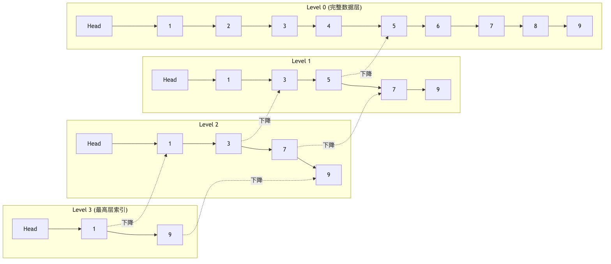
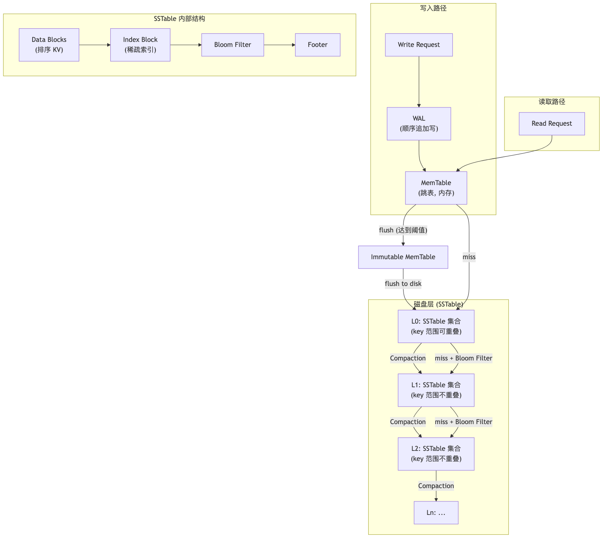
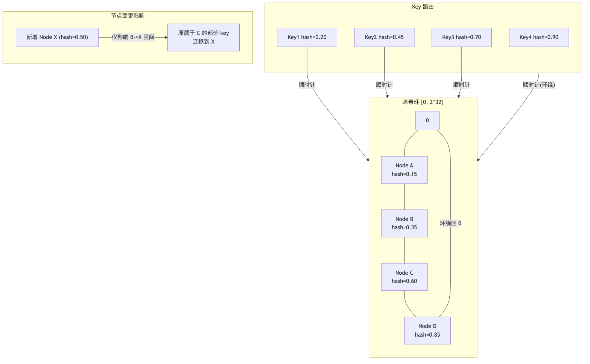

# 高级数据结构面试 QA

## 目录

- [1. 跳表 (Skip List)](#1-跳表-skip-list)
  - [1.1 原理与动机](#11-原理与动机)
  - [1.2 结构详解](#12-结构详解)
  - [1.3 核心操作](#13-核心操作)
  - [1.4 复杂度分析](#14-复杂度分析)
  - [1.5 Go 完整实现](#15-go-完整实现)
  - [1.6 面试高频问题](#16-面试高频问题)
- [2. 并发跳表 (Concurrent Skip List)](#2-并发跳表-concurrent-skip-list)
  - [2.1 并发挑战](#21-并发挑战)
  - [2.2 锁粒度设计](#22-锁粒度设计)
  - [2.3 无锁方案: CAS](#23-无锁方案-cas)
  - [2.4 Go 并发跳表完整实现](#24-go-并发跳表完整实现)
  - [2.5 面试高频问题](#25-面试高频问题)
- [3. 日志结构合并树 (LSM Tree)](#3-日志结构合并树-lsm-tree)
  - [3.1 设计动机](#31-设计动机)
  - [3.2 整体架构](#32-整体架构)
  - [3.3 MemTable 与 WAL](#33-memtable-与-wal)
  - [3.4 SSTable 格式](#34-sstable-格式)
  - [3.5 Compaction 策略](#35-compaction-策略)
  - [3.6 读取路径与布隆过滤器优化](#36-读取路径与布隆过滤器优化)
  - [3.7 Go 简化实现](#37-go-简化实现)
  - [3.8 面试高频问题](#38-面试高频问题)
- [4. 布隆过滤器 (Bloom Filter)](#4-布隆过滤器-bloom-filter)
  - [4.1 原理](#41-原理)
  - [4.2 数学基础](#42-数学基础)
  - [4.3 参数选择](#43-参数选择)
  - [4.4 变体: Counting / Cuckoo / Scalable](#44-变体-counting--cuckoo--scalable)
  - [4.5 Go 完整实现](#45-go-完整实现)
  - [4.6 面试高频问题](#46-面试高频问题)
- [5. 前缀树 (Trie)](#5-前缀树-trie)
  - [5.1 原理与适用场景](#51-原理与适用场景)
  - [5.2 基本结构](#52-基本结构)
  - [5.3 压缩前缀树 (Radix Tree)](#53-压缩前缀树-radix-tree)
  - [5.4 Go 完整实现](#54-go-完整实现)
  - [5.5 面试高频问题](#55-面试高频问题)
- [6. 一致性哈希 (Consistent Hashing)](#6-一致性哈希-consistent-hashing)
  - [6.1 问题背景](#61-问题背景)
  - [6.2 哈希环原理](#62-哈希环原理)
  - [6.3 虚拟节点](#63-虚拟节点)
  - [6.4 数据迁移分析](#64-数据迁移分析)
  - [6.5 Go 完整实现](#65-go-完整实现)
  - [6.6 面试高频问题](#66-面试高频问题)

---

## 1. 跳表 (Skip List)

### 1.1 原理与动机

跳表由 William Pugh 于 1990 年提出，是一种基于有序链表的多层索引结构，用以替代平衡树（AVL / 红黑树）实现 O(log n) 的查找、插入、删除。

**为什么需要跳表而不是直接用平衡树？**

| 维度       | 平衡树                       | 跳表                               |
| ---------- | ---------------------------- | ---------------------------------- |
| 实现复杂度 | 旋转逻辑复杂，易出 bug       | 链表操作，直观简单                 |
| 范围查询   | 需要中序遍历，涉及回溯       | 底层链表天然有序，直接遍历         |
| 并发友好度 | 旋转涉及多节点修改，锁范围大 | 局部链表修改，锁粒度小             |
| 内存局部性 | 树节点分散                   | 底层链表连续（可优化）             |
| 典型应用   | Java TreeMap, C++ std::map   | Redis Sorted Set, LevelDB MemTable |

### 1.2 结构详解

跳表的核心思想：在有序链表之上建立多级索引，每级索引是下级的"快车道"。



关键设计要素：

- **层数 (Level)**：每个节点在插入时通过随机函数决定其出现在几层索引中
- **晋升概率 (p)**：通常取 1/2 或 1/4，Redis 取 1/4（节省内存）
- **最大层数 (MaxLevel)**：限制索引层数上界，通常 16~32 层足够覆盖 2^32 个元素
- **头节点 (Head)**：哨兵节点，持有所有层的指针

### 1.3 核心操作

#### 查找 (Search)

从最高层开始，逐层向右、向下：

```
1. 从 Head 的最高层指针开始
2. 在当前层向右移动，直到下一个节点 >= target
3. 下降一层，重复步骤 2
4. 到达第 0 层时，判断当前节点是否等于 target
```

#### 插入 (Insert)

```
1. 执行 Search 过程，记录每层最后一个 < target 的节点 (update[] 数组)
2. 随机生成新节点层数 level
3. 如果 level > 当前最大层数，扩展 Head 的指针
4. 在每层执行链表插入: newNode.next = update[i].next; update[i].next = newNode
```

#### 删除 (Delete)

```
1. 执行 Search 过程，记录 update[] 数组
2. 从第 0 层到节点最高层，逐层断开: update[i].next = target.next
3. 释放节点
4. 如果最高层变空，收缩层数
```

### 1.4 复杂度分析

设 n 为元素数量，p 为晋升概率：

| 操作   | 期望时间复杂度 | 最坏时间复杂度 |
| ------ | -------------- | -------------- |
| Search | O(log n)       | O(n)           |
| Insert | O(log n)       | O(n)           |
| Delete | O(log n)       | O(n)           |
| 空间   | O(n / (1-p))   | -              |

**期望层数推导**：节点出现在第 k 层的概率为 p^k，期望层数 = 1/(1-p)。当 p=1/2 时期望层数为 2；p=1/4 时为 4/3。

**查找步数推导**：每层期望遍历 1/p 个节点，共 log*{1/p}(n) 层，总步数 = (1/p) \* log*{1/p}(n) = O(log n)。

### 1.5 Go 完整实现

```go
package skiplist

import (
	"math"
	"math/rand"
)

const (
	DefaultMaxLevel = 32
	DefaultP        = 0.25
)

type Node struct {
	Key     float64
	Value   interface{}
	Forward []*Node
}

type SkipList struct {
	Head  *Node
	Level int
	Size  int
	P     float64
	MaxLevel int
}

func NewSkipList() *SkipList {
	return &SkipList{
		Head: &Node{
			Key:     math.Inf(-1),
			Forward: make([]*Node, DefaultMaxLevel),
		},
		Level:    1,
		P:        DefaultP,
		MaxLevel: DefaultMaxLevel,
	}
}

func (sl *SkipList) randomLevel() int {
	level := 1
	for level < sl.MaxLevel && rand.Float64() < sl.P {
		level++
	}
	return level
}

func (sl *SkipList) Search(key float64) (*Node, bool) {
	current := sl.Head
	for i := sl.Level - 1; i >= 0; i-- {
		for current.Forward[i] != nil && current.Forward[i].Key < key {
			current = current.Forward[i]
		}
	}
	current = current.Forward[0]
	if current != nil && current.Key == key {
		return current, true
	}
	return nil, false
}

func (sl *SkipList) Insert(key float64, value interface{}) {
	update := make([]*Node, sl.MaxLevel)
	current := sl.Head

	for i := sl.Level - 1; i >= 0; i-- {
		for current.Forward[i] != nil && current.Forward[i].Key < key {
			current = current.Forward[i]
		}
		update[i] = current
	}

	current = current.Forward[0]

	if current != nil && current.Key == key {
		current.Value = value
		return
	}

	level := sl.randomLevel()
	if level > sl.Level {
		for i := sl.Level; i < level; i++ {
			update[i] = sl.Head
		}
		sl.Level = level
	}

	newNode := &Node{
		Key:     key,
		Value:   value,
		Forward: make([]*Node, level),
	}

	for i := 0; i < level; i++ {
		newNode.Forward[i] = update[i].Forward[i]
		update[i].Forward[i] = newNode
	}

	sl.Size++
}

func (sl *SkipList) Delete(key float64) bool {
	update := make([]*Node, sl.MaxLevel)
	current := sl.Head

	for i := sl.Level - 1; i >= 0; i-- {
		for current.Forward[i] != nil && current.Forward[i].Key < key {
			current = current.Forward[i]
		}
		update[i] = current
	}

	current = current.Forward[0]
	if current == nil || current.Key != key {
		return false
	}

	for i := 0; i < sl.Level; i++ {
		if update[i].Forward[i] != current {
			break
		}
		update[i].Forward[i] = current.Forward[i]
	}

	for sl.Level > 1 && sl.Head.Forward[sl.Level-1] == nil {
		sl.Level--
	}

	sl.Size--
	return true
}

func (sl *SkipList) Range(start, end float64) []*Node {
	var result []*Node
	current := sl.Head

	for i := sl.Level - 1; i >= 0; i-- {
		for current.Forward[i] != nil && current.Forward[i].Key < start {
			current = current.Forward[i]
		}
	}

	current = current.Forward[0]
	for current != nil && current.Key <= end {
		result = append(result, current)
		current = current.Forward[0]
	}
	return result
}
```

### 1.6 面试高频问题

**Q1: Redis 的 Sorted Set 为什么用跳表而不用红黑树？**

三个核心原因：

1. **范围查询效率**：ZRANGEBYSCORE 需要返回连续区间，跳表底层是有序链表，找到起点后直接遍历；红黑树需要中序遍历且涉及父指针回溯。
2. **实现简单**：跳表插入/删除只需修改局部指针，无需旋转；代码量约为红黑树的 1/3。
3. **并发扩展性**：局部修改意味着锁粒度天然更小（Redis 单线程下这点不关键，但设计哲学上一致）。

Redis 跳表的特殊设计：

- p = 1/4（而非教科书 1/2），每个节点平均 1.33 个指针，节省内存
- 每个节点带有 score 和 member 双重排序
- 同时维护一个 dict（hash table）实现 O(1) 的 ZSCORE 查询
- 带有 backward 指针（仅第 0 层），支持 ZREVRANGE

**Q2: 跳表的层数为什么用随机而不是严格交替？**

严格交替（如每 2 个节点提升 1 层）在插入/删除时需要级联调整索引，退化为 O(n)。随机层数使得每次插入/删除只影响局部，期望复杂度 O(log n)，且无需全局再平衡。

**Q3: 跳表与 B+ 树对比？**

| 维度     | 跳表              | B+ 树                 |
| -------- | ----------------- | --------------------- |
| 适用场景 | 内存数据结构      | 磁盘数据结构          |
| 扇出     | 每层 2 个指针     | 每节点数百个 key      |
| IO 次数  | 不涉及磁盘        | O(log_m n) 次磁盘 IO  |
| 范围查询 | 链表遍历          | 叶节点链表遍历        |
| 更新代价 | O(log n) 指针修改 | 可能触发节点分裂/合并 |

---

## 2. 并发跳表 (Concurrent Skip List)

### 2.1 并发挑战

并发跳表需要解决的核心问题：

1. **结构一致性**：插入/删除修改多层指针，如何保证其他 goroutine 看到的结构始终有效
2. **ABA 问题**：CAS 操作时，指针值相同但节点已被替换
3. **层数扩展**：新节点层数超过当前最大层数时的并发安全
4. **删除与查找竞争**：查找正在 traversing 的节点被另一个 goroutine 删除

### 2.2 锁粒度设计

三种常见方案：

**方案一：全局锁 (Mutex)**

- 最简单，所有操作串行化
- 适用于低并发场景
- 吞吐量随 goroutine 数增加不增长

**方案二：节点级锁 (Fine-grained Locking)**

- 每个节点持有一把 Mutex
- 插入/删除时锁住 update[] 中的前驱节点
- 需要 lock coupling（锁耦合）：先锁下一个，再释放上一个
- 复杂度较高，需要处理死锁

**方案三：读写锁 (RWMutex)**

- 读操作获取 RLock，写操作获取 Lock
- 适合读多写少场景
- 比全局锁好，但写操作仍然串行

### 2.3 无锁方案: CAS

核心思想：用 `sync/atomic` 的 CAS (Compare-And-Swap) 替代锁。

```
插入流程 (Lock-Free):
1. 无锁查找，记录 update[] (每层前驱)
2. 创建新节点
3. 从底层到顶层，CAS 设置每层前驱的 Forward 指针
4. 如果 CAS 失败（前驱已被修改），重新查找并重试

删除流程 (Lock-Free):
1. 无锁查找目标节点
2. 从顶层到底层，CAS 将前驱的 Forward 从 target 改为 target.Forward[i]
3. 标记节点为已删除 (logical delete)
4. 物理删除可延迟 (lazy unlink)
```

**标记删除 (Marked Pointer)**：

利用指针低位做标记位（Go 中可用 atomic.Value 或额外 flag 字段）：

- 节点增加 `deleted uint32` 字段，用 atomic 操作标记
- 查找时跳过已标记节点
- 后台 goroutine 定期物理清理

### 2.4 Go 并发跳表完整实现

以下实现采用**无锁 CAS (atomic.Pointer) + 逻辑删除**方案，兼顾正确性与可读性：

```go
package concurrent_skiplist

import (
	"math"
	"math/rand"
	"sync"
	"sync/atomic"
)

const (
	MaxLevel    = 32
	Probability = 0.25
)

type Node struct {
	Key      float64
	Value    atomic.Value // interface{}
	Forward  []*atomic.Pointer[Node]
	TopLevel int32
	Deleted  atomic.Bool
}

func NewNode(key float64, value interface{}, level int) *Node {
	n := &Node{
		Key:      key,
		Forward:  make([]*atomic.Pointer[Node], level),
		TopLevel: int32(level),
	}
	n.Value.Store(value)
	for i := range n.Forward {
		n.Forward[i] = &atomic.Pointer[Node]{}
	}
	return n
}

type ConcurrentSkipList struct {
	Head     *Node
	MaxLevel atomic.Int32
	Size     atomic.Int64
	mu       sync.Mutex // 仅保护层数扩展
}

func New() *ConcurrentSkipList {
	head := NewNode(math.Inf(-1), nil, MaxLevel)
	csl := &ConcurrentSkipList{Head: head}
	csl.MaxLevel.Store(1)
	return csl
}

func randomLevel() int {
	level := 1
	for level < MaxLevel && rand.Float64() < Probability {
		level++
	}
	return level
}

func (csl *ConcurrentSkipList) findPredecessors(key float64) []*Node {
	preds := make([]*Node, MaxLevel)
	current := csl.Head
	maxLevel := int(csl.MaxLevel.Load())

	for i := maxLevel - 1; i >= 0; i-- {
		next := current.Forward[i].Load()
		for next != nil && next.Key < key {
			if next.Deleted.Load() {
				// 帮助清理: CAS 跳过已删除节点
				current.Forward[i].CompareAndSwap(next, next.Forward[i].Load())
				next = current.Forward[i].Load()
				continue
			}
			current = next
			next = current.Forward[i].Load()
		}
		preds[i] = current
	}
	return preds
}

func (csl *ConcurrentSkipList) Search(key float64) (interface{}, bool) {
	current := csl.Head
	maxLevel := int(csl.MaxLevel.Load())

	for i := maxLevel - 1; i >= 0; i-- {
		next := current.Forward[i].Load()
		for next != nil && next.Key < key {
			current = next
			next = current.Forward[i].Load()
		}
	}

	current = current.Forward[0].Load()
	if current != nil && current.Key == key && !current.Deleted.Load() {
		return current.Value.Load(), true
	}
	return nil, false
}

func (csl *ConcurrentSkipList) Insert(key float64, value interface{}) bool {
	for {
		preds := csl.findPredecessors(key)

		// 检查是否已存在
		next := preds[0].Forward[0].Load()
		if next != nil && next.Key == key && !next.Deleted.Load() {
			next.Value.Store(value)
			return false
		}

		level := randomLevel()
		newNode := NewNode(key, value, level)

		// 设置新节点的 Forward 指针
		for i := 0; i < level; i++ {
			newNode.Forward[i].Store(preds[i].Forward[i].Load())
		}

		// 从底层开始 CAS 链接
		// 底层成功即视为插入成功
		if !preds[0].Forward[0].CompareAndSwap(next, newNode) {
			continue // 重试
		}

		// 链接上层
		for i := 1; i < level; i++ {
			for {
				pred := preds[i]
				expected := pred.Forward[i].Load()
				newNode.Forward[i].Store(expected)
				if pred.Forward[i].CompareAndSwap(expected, newNode) {
					break
				}
				// 重新获取该层前驱
				preds = csl.findPredecessors(key)
			}
		}

		// 更新最大层数
		currentMax := csl.MaxLevel.Load()
		if int32(level) > currentMax {
			csl.mu.Lock()
			if int32(level) > csl.MaxLevel.Load() {
				csl.MaxLevel.Store(int32(level))
			}
			csl.mu.Unlock()
		}

		csl.Size.Add(1)
		return true
	}
}

func (csl *ConcurrentSkipList) Delete(key float64) bool {
	for {
		preds := csl.findPredecessors(key)
		target := preds[0].Forward[0].Load()

		if target == nil || target.Key != key || target.Deleted.Load() {
			return false
		}

		// 逻辑删除: 标记节点
		if !target.Deleted.CompareAndSwap(false, true) {
			continue
		}

		// 物理断开: 从顶层到底层
		topLevel := int(target.TopLevel)
		for i := topLevel - 1; i >= 0; i-- {
			for {
				pred := preds[i]
				if pred.Forward[i].Load() != target {
					break
				}
				if pred.Forward[i].CompareAndSwap(target, target.Forward[i].Load()) {
					break
				}
				preds = csl.findPredecessors(key)
			}
		}

		csl.Size.Add(-1)
		return true
	}
}

func (csl *ConcurrentSkipList) Range(start, end float64) []struct {
	Key   float64
	Value interface{}
} {
	var result []struct {
		Key   float64
		Value interface{}
	}

	current := csl.Head
	maxLevel := int(csl.MaxLevel.Load())
	for i := maxLevel - 1; i >= 0; i-- {
		next := current.Forward[i].Load()
		for next != nil && next.Key < start {
			current = next
			next = current.Forward[i].Load()
		}
	}

	current = current.Forward[0].Load()
	for current != nil && current.Key <= end {
		if !current.Deleted.Load() {
			result = append(result, struct {
				Key   float64
				Value interface{}
			}{current.Key, current.Value.Load()})
		}
		current = current.Forward[0].Load()
	}
	return result
}
```

### 2.5 面试高频问题

**Q1: 无锁跳表如何处理 ABA 问题？**

Go 中 `atomic.Pointer` 的 CAS 本身不解决 ABA。解决方案：

1. **逻辑删除 + 延迟回收**：节点标记删除后不立即释放，等所有读者退出后再回收（类似 RCU / Hazard Pointer）
2. **版本号**：指针打包 (pointer, version) 对，CAS 时同时比较版本号
3. **Go GC 天然解决**：Go 的垃圾回收器保证只要有引用就不会释放对象，因此指针值不会被复用，ABA 在 Go 中不是问题

**Q2: 为什么从底层开始 CAS 而不是顶层？**

底层（Level 0）包含所有节点，是数据完整性的基础。如果底层 CAS 成功，即使上层暂时未链接，查找仍然正确（只是少了快车道，退化为线性遍历底层）。反之如果先链接上层而底层失败，会出现"悬空索引"指向不存在的节点。

**Q3: Java ConcurrentSkipListMap 的实现策略？**

Java 的 `ConcurrentSkipListMap` 采用无锁 CAS：

- 节点有 `value` 字段，删除时 CAS 将 value 设为 null（逻辑删除）
- 使用 `Index` 对象管理高层索引，索引也可被 CAS 摘除
- 不维护精确 size，用 `LongAdder` 风格的计数器
- 查找时跳过 value==null 的节点

---

## 3. 日志结构合并树 (LSM Tree)

### 3.1 设计动机

传统 B+ 树的写入瓶颈：

- 每次写入需要随机 IO 找到目标页
- 页分裂产生额外随机写
- 在 HDD 上随机写吞吐仅 ~100 IOPS

LSM Tree (Log-Structured Merge Tree) 由 Patrick O'Neil 于 1996 年提出，核心思想：**将随机写转化为顺序写**。

适用场景：写密集型负载（日志、时序数据、消息队列、缓存持久化）

典型系统：LevelDB, RocksDB, Cassandra, HBase, TiKV

### 3.2 整体架构



分层结构：

```
写入路径: Write -> WAL -> MemTable -> (flush) -> L0 SSTable
读取路径: MemTable -> L0 -> L1 -> L2 -> ... -> Ln
合并路径: L(n) compaction -> L(n+1)
```

各层特点：

| 层级     | 存储位置 | 数据组织                     | 大小比例                |
| -------- | -------- | ---------------------------- | ----------------------- |
| MemTable | 内存     | 跳表/红黑树                  | 64MB (可配置)           |
| L0       | 磁盘     | 多个 SSTable，key 范围可重叠 | 4 个文件触发 compaction |
| L1       | 磁盘     | 多个 SSTable，key 范围不重叠 | 10MB \* 10              |
| L2       | 磁盘     | 多个 SSTable，key 范围不重叠 | 10MB \* 100             |
| Ln       | 磁盘     | 多个 SSTable，key 范围不重叠 | 10MB \* 10^n            |

### 3.3 MemTable 与 WAL

**MemTable**：

- 内存中的有序数据结构（通常用跳表）
- 支持 O(log n) 的 Put/Get/Delete
- 达到阈值（如 64MB）后转为 Immutable MemTable，等待 flush
- 新的写入进入新的 Active MemTable

**WAL (Write-Ahead Log)**：

- 每次写入先追加到 WAL 文件（顺序写，极快）
- 保证进程崩溃后可以从 WAL 恢复 MemTable
- MemTable flush 到 SSTable 后，对应 WAL 可删除
- 写入流程: `append(WAL) -> insert(MemTable) -> ack(client)`

**Delete 的处理**：

- 不能直接删除（数据可能在更低层）
- 写入 Tombstone 标记（key + 特殊删除标记）
- Compaction 时遇到 Tombstone 才真正丢弃数据

### 3.4 SSTable 格式

SSTable (Sorted String Table) 是 LSM Tree 的磁盘存储单元：

```
+-------------------+
|   Data Block 1    |  <- 排序的 key-value 对
+-------------------+
|   Data Block 2    |
+-------------------+
|       ...         |
+-------------------+
|   Data Block N    |
+-------------------+
|  Meta Block       |  <- 布隆过滤器、统计信息
+-------------------+
|  Index Block      |  <- 每个 Data Block 的起始 key + offset
+-------------------+
|  Footer           |  <- Index Block 的 offset + magic number
+-------------------+
```

关键设计：

- **Data Block**：通常 4KB~64KB，内部 key-value 对按 key 排序，可使用前缀压缩
- **Index Block**：稀疏索引，记录每个 Data Block 的第一个 key 和文件偏移
- **Bloom Filter**：每个 SSTable 一个，快速判断 key 是否可能存在
- **Block Cache**：LRU 缓存热点 Data Block，避免重复磁盘读取

### 3.5 Compaction 策略

Compaction 是 LSM Tree 的核心后台操作，负责合并多层数据、清理过期数据。

**Size-Tiered Compaction (STCS)**：

- 同一层中大小相近的 SSTable 合并为更大的 SSTable
- 写放大小（一次 compaction 只涉及少量文件）
- 读放大大（同层可能有多个重叠文件需要查找）
- 空间放大大（合并前新旧文件共存）
- 适用：写密集、对读延迟不敏感（Cassandra 默认）

**Leveled Compaction (LCS)**：

- L0 层文件可重叠，L1+ 层文件 key 范围不重叠
- L0 满时选择一个文件与 L1 中重叠的文件合并
- 读放大小（每层最多查一个文件，L0 除外）
- 写放大大（一次合并可能涉及 L(n+1) 的多个文件）
- 适用：读密集、需要稳定读延迟（LevelDB/RocksDB 默认）

**FIFO Compaction**：

- 按时间顺序删除最老的 SSTable
- 无合并开销
- 适用：TTL 数据、时序数据

**写放大 (Write Amplification) 分析**：

Leveled Compaction 下，一个 key 从写入到最终稳定，每层被重写一次：

- 写放大 = 层数 _ 每层合并比 ≈ log\_{10}(数据量) _ 10
- 10 层 LSM Tree 写放大约 10~30 倍

### 3.6 读取路径与布隆过滤器优化

```
Get(key):
1. 查 Active MemTable          -> 命中则返回
2. 查 Immutable MemTable(s)    -> 命中则返回
3. 查 L0 所有 SSTable (新->旧) -> 每个先查 Bloom Filter
4. 查 L1 SSTable (二分定位)    -> 先查 Bloom Filter
5. 查 L2 ... Ln
6. 未找到 -> 返回 NotFound
```

优化手段：

- **Bloom Filter**：每个 SSTable 前置布隆过滤器，false positive 率 ~1%，避免 99% 的无效磁盘读取
- **Block Cache**：LRU/LFU 缓存 Data Block
- **Index Cache**：缓存 Index Block，避免每次读取都加载索引
- **Partitioned Index/Filter**：大 SSTable 的索引/过滤器分片，按需加载

### 3.7 Go 简化实现

以下实现一个教学级 LSM Tree，包含 MemTable、WAL、SSTable flush、基本读取：

```go
package lsm

import (
	"bufio"
	"encoding/binary"
	"fmt"
	"os"
	"path/filepath"
	"sort"
	"sync"
)

const (
	MemTableThreshold = 4 * 1024 * 1024 // 4MB
	TombstoneValue    = "__TOMBSTONE__"
)

// --- MemTable (基于跳表的简化版，此处用 sorted slice 演示) ---

type KV struct {
	Key   string
	Value string
}

type MemTable struct {
	mu   sync.RWMutex
	data map[string]string
	size int
}

func NewMemTable() *MemTable {
	return &MemTable{data: make(map[string]string)}
}

func (m *MemTable) Put(key, value string) {
	m.mu.Lock()
	defer m.mu.Unlock()
	m.data[key] = value
	m.size += len(key) + len(value)
}

func (m *MemTable) Get(key string) (string, bool) {
	m.mu.RLock()
	defer m.mu.RUnlock()
	v, ok := m.data[key]
	return v, ok
}

func (m *MemTable) Size() int {
	m.mu.RLock()
	defer m.mu.RUnlock()
	return m.size
}

func (m *MemTable) SortedEntries() []KV {
	m.mu.RLock()
	defer m.mu.RUnlock()
	entries := make([]KV, 0, len(m.data))
	for k, v := range m.data {
		entries = append(entries, KV{Key: k, Value: v})
	}
	sort.Slice(entries, func(i, j int) bool {
		return entries[i].Key < entries[j].Key
	})
	return entries
}

// --- WAL ---

type WAL struct {
	file   *os.File
	writer *bufio.Writer
}

func OpenWAL(path string) (*WAL, error) {
	f, err := os.OpenFile(path, os.O_CREATE|os.O_WRONLY|os.O_APPEND, 0644)
	if err != nil {
		return nil, err
	}
	return &WAL{file: f, writer: bufio.NewWriter(f)}, nil
}

func (w *WAL) Append(key, value string) error {
	// 格式: [keyLen:4][key][valLen:4][value]
	buf := make([]byte, 4+len(key)+4+len(value))
	binary.BigEndian.PutUint32(buf[0:4], uint32(len(key)))
	copy(buf[4:4+len(key)], key)
	offset := 4 + len(key)
	binary.BigEndian.PutUint32(buf[offset:offset+4], uint32(len(value)))
	copy(buf[offset+4:], value)

	if _, err := w.writer.Write(buf); err != nil {
		return err
	}
	return w.writer.Flush()
}

func (w *WAL) Close() error {
	w.writer.Flush()
	return w.file.Close()
}

// --- SSTable ---

type SSTable struct {
	path    string
	entries []KV
}

func FlushToSSTable(entries []KV, path string) (*SSTable, error) {
	f, err := os.Create(path)
	if err != nil {
		return nil, err
	}
	defer f.Close()

	writer := bufio.NewWriter(f)

	for _, kv := range entries {
		buf := make([]byte, 4+len(kv.Key)+4+len(kv.Value))
		binary.BigEndian.PutUint32(buf[0:4], uint32(len(kv.Key)))
		copy(buf[4:4+len(kv.Key)], kv.Key)
		offset := 4 + len(kv.Key)
		binary.BigEndian.PutUint32(buf[offset:offset+4], uint32(len(kv.Value)))
		copy(buf[offset+4:], kv.Value)
		if _, err := writer.Write(buf); err != nil {
			return nil, err
		}
	}

	if err := writer.Flush(); err != nil {
		return nil, err
	}

	return &SSTable{path: path, entries: entries}, nil
}

func (sst *SSTable) Get(key string) (string, bool) {
	// 二分查找
	idx := sort.Search(len(sst.entries), func(i int) bool {
		return sst.entries[i].Key >= key
	})
	if idx < len(sst.entries) && sst.entries[idx].Key == key {
		return sst.entries[idx].Value, true
	}
	return "", false
}

// --- LSM Tree ---

type LSMTree struct {
	mu        sync.RWMutex
	dir       string
	mem       *MemTable
	immutable []*MemTable
	wal       *WAL
	sstables  []*SSTable // 按时间倒序，最新的在前
	walSeq    int
	sstSeq    int
}

func Open(dir string) (*LSMTree, error) {
	if err := os.MkdirAll(dir, 0755); err != nil {
		return nil, err
	}

	walPath := filepath.Join(dir, "wal_0.log")
	wal, err := OpenWAL(walPath)
	if err != nil {
		return nil, err
	}

	return &LSMTree{
		dir: dir,
		mem: NewMemTable(),
		wal: wal,
	}, nil
}

func (t *LSMTree) Put(key, value string) error {
	t.mu.Lock()
	defer t.mu.Unlock()

	if err := t.wal.Append(key, value); err != nil {
		return err
	}

	t.mem.Put(key, value)

	if t.mem.Size() >= MemTableThreshold {
		return t.flush()
	}
	return nil
}

func (t *LSMTree) flush() error {
	// 当前 mem 转为 immutable
	t.immutable = append(t.immutable, t.mem)

	// 创建新 mem 和 WAL
	t.walSeq++
	walPath := filepath.Join(t.dir, fmt.Sprintf("wal_%d.log", t.walSeq))
	wal, err := OpenWAL(walPath)
	if err != nil {
		return err
	}
	oldWal := t.wal
	t.wal = wal
	t.mem = NewMemTable()

	// flush 所有 immutable 到 SSTable
	for _, imm := range t.immutable {
		entries := imm.SortedEntries()
		sstPath := filepath.Join(t.dir, fmt.Sprintf("sst_%d.db", t.sstSeq))
		t.sstSeq++
		sst, err := FlushToSSTable(entries, sstPath)
		if err != nil {
			return err
		}
		// 最新的在前面
		t.sstables = append([]*SSTable{sst}, t.sstables...)
	}
	t.immutable = nil

	oldWal.Close()
	return nil
}

func (t *LSMTree) Get(key string) (string, bool) {
	t.mu.RLock()
	defer t.mu.RUnlock()

	// 1. Active MemTable
	if v, ok := t.mem.Get(key); ok {
		if v == TombstoneValue {
			return "", false
		}
		return v, true
	}

	// 2. Immutable MemTables (新->旧)
	for i := len(t.immutable) - 1; i >= 0; i-- {
		if v, ok := t.immutable[i].Get(key); ok {
			if v == TombstoneValue {
				return "", false
			}
			return v, true
		}
	}

	// 3. SSTables (新->旧)
	for _, sst := range t.sstables {
		if v, ok := sst.Get(key); ok {
			if v == TombstoneValue {
				return "", false
			}
			return v, true
		}
	}

	return "", false
}

func (t *LSMTree) Delete(key string) error {
	return t.Put(key, TombstoneValue)
}

func (t *LSMTree) Close() error {
	t.mu.Lock()
	defer t.mu.Unlock()
	if t.mem.Size() > 0 {
		if err := t.flush(); err != nil {
			return err
		}
	}
	return t.wal.Close()
}
```

### 3.8 面试高频问题

**Q1: LSM Tree 的读放大、写放大、空间放大分别是多少？**

以 Leveled Compaction、层数 L、每层大小比 T=10 为例：

- **读放大**：最坏需查 L 层，每层 1 个 SSTable（L0 除外），约 L 次磁盘 IO + Bloom Filter 开销
- **写放大**：一个 key 每层被重写一次，总写放大 ≈ T \* L（约 20~30 倍）
- **空间放大**：同一 key 可能存在于多层（未 compaction 前），约 1 + 1/T + 1/T^2 ≈ 1.11 倍

**Q2: 为什么 L0 层允许 key 范围重叠？**

L0 直接由 MemTable flush 产生，每次 flush 生成一个完整 SSTable。如果要求 L0 不重叠，则每次 flush 都需要与已有 L0 文件合并，增加写延迟。允许重叠的代价是读取 L0 时需要查所有文件（通常 4~20 个），但 L0 文件数量少，可接受。

**Q3: LSM Tree vs B+ Tree 选型？**

| 场景                 | 选择     | 原因                          |
| -------------------- | -------- | ----------------------------- |
| 写密集（日志、消息） | LSM Tree | 顺序写，写吞吐高              |
| 读密集（OLTP 查询）  | B+ Tree  | 读路径短，延迟稳定            |
| 范围扫描             | 两者均可 | LSM 需合并迭代器，B+ 树叶链表 |
| 空间敏感             | B+ Tree  | LSM 有空间放大                |
| 写延迟敏感           | B+ Tree  | LSM compaction 可能造成写停顿 |

**Q4: Compaction 期间的读写如何不受影响？**

- **读**：Compaction 读取旧文件，写入新文件；在原子替换前，读请求仍访问旧文件（引用计数保护）
- **写**：写入 MemTable，与 Compaction 无冲突
- **文件替换**：使用原子 rename 或 manifest 文件记录当前有效 SSTable 列表

---

## 4. 布隆过滤器 (Bloom Filter)

### 4.1 原理

布隆过滤器由 Burton Howard Bloom 于 1970 年提出，是一种空间效率极高的概率型数据结构，用于判断元素**是否可能存在**于集合中。

核心特性：

- **空间效率极高**：每个元素仅需 ~10 bits
- **存在误判 (False Positive)**：可能说"存在"但实际不存在
- **无漏判 (No False Negative)**：说"不存在"则一定不存在
- **不支持删除**（标准版本）

### 4.2 数学基础

设：

- m = 位数组长度 (bits)
- n = 预期插入元素数量
- k = 哈希函数个数

**误判率公式**：

```
p = (1 - e^(-kn/m))^k
```

**最优哈希函数个数**：

```
k_opt = (m/n) * ln(2) ≈ 0.693 * (m/n)
```

**给定误判率 p，所需位数**：

```
m = -n * ln(p) / (ln2)^2 ≈ -1.44 * n * log2(p)
```

| 误判率 p | 每元素位数 m/n | 最优 k |
| -------- | -------------- | ------ |
| 1%       | 9.6 bits       | 7      |
| 0.1%     | 14.4 bits      | 10     |
| 0.01%    | 19.2 bits      | 13     |

### 4.3 参数选择

实际工程中的参数决策流程：

```
输入: 预期元素数 n, 可接受误判率 p
计算:
  m = ceil(-n * ln(p) / (ln2)^2)    // 位数组长度
  k = round(m/n * ln2)               // 哈希函数个数
```

示例：n = 1,000,000, p = 0.01 (1%)

- m = 9,585,059 bits ≈ 1.14 MB
- k = 7

### 4.4 变体: Counting / Cuckoo / Scalable

**Counting Bloom Filter**：

- 每个位替换为计数器（通常 4 bits）
- 支持删除：插入时计数器+1，删除时-1
- 空间开销增加 4 倍
- 计数器溢出问题：4 bits 最大 15，需处理溢出

**Cuckoo Filter**：

- 存储元素的指纹（fingerprint，通常 8~16 bits）
- 支持删除
- 空间效率优于 Counting Bloom Filter
- 查找需最多 2 个候选桶（cuckoo hashing）
- 插入可能失败（桶满），需驱逐

**Scalable Bloom Filter**：

- 动态增长：当误判率接近阈值时，添加新的 Bloom Filter 层
- 查询需遍历所有层
- 新层使用更严格的误判率（几何级数递减）

### 4.5 Go 完整实现

```go
package bloom

import (
	"hash"
	"hash/fnv"
	"math"
	"sync"
)

type BloomFilter struct {
	mu      sync.RWMutex
	bits    []uint64
	m       uint // 位数组长度
	k       uint // 哈希函数个数
	count   uint // 已插入元素数
}

func New(expectedN uint, falsePositiveRate float64) *BloomFilter {
	m := optimalM(expectedN, falsePositiveRate)
	k := optimalK(m, expectedN)
	return &BloomFilter{
		bits: make([]uint64, (m+63)/64),
		m:    m,
		k:    k,
	}
}

func optimalM(n uint, p float64) uint {
	m := -float64(n) * math.Log(p) / (math.Ln2 * math.Ln2)
	return uint(math.Ceil(m))
}

func optimalK(m, n uint) uint {
	k := float64(m) / float64(n) * math.Ln2
	return uint(math.Max(1, math.Round(k)))
}

// 双哈希模拟 k 个哈希: h_i(x) = h1(x) + i * h2(x)
func (bf *BloomFilter) hashValues(data []byte) []uint {
	h1 := fnvHash(data, 0)
	h2 := fnvHash(data, h1)

	positions := make([]uint, bf.k)
	for i := uint(0); i < bf.k; i++ {
		positions[i] = uint((h1 + uint64(i)*h2) % uint64(bf.m))
	}
	return positions
}

func fnvHash(data []byte, seed uint64) uint64 {
	var h hash.Hash64 = fnv.New64a()
	// 混入 seed
	seedBytes := make([]byte, 8)
	for i := 0; i < 8; i++ {
		seedBytes[i] = byte(seed >> (i * 8))
	}
	h.Write(seedBytes)
	h.Write(data)
	return h.Sum64()
}

func (bf *BloomFilter) Add(data []byte) {
	bf.mu.Lock()
	defer bf.mu.Unlock()

	for _, pos := range bf.hashValues(data) {
		wordIdx := pos / 64
		bitIdx := pos % 64
		bf.bits[wordIdx] |= 1 << bitIdx
	}
	bf.count++
}

func (bf *BloomFilter) Contains(data []byte) bool {
	bf.mu.RLock()
	defer bf.mu.RUnlock()

	for _, pos := range bf.hashValues(data) {
		wordIdx := pos / 64
		bitIdx := pos % 64
		if bf.bits[wordIdx]&(1<<bitIdx) == 0 {
			return false
		}
	}
	return true
}

func (bf *BloomFilter) AddString(s string) {
	bf.Add([]byte(s))
}

func (bf *BloomFilter) ContainsString(s string) bool {
	return bf.Contains([]byte(s))
}

// EstimatedFP 返回当前估计误判率
func (bf *BloomFilter) EstimatedFP() float64 {
	bf.mu.RLock()
	defer bf.mu.RUnlock()
	// p = (1 - e^(-kn/m))^k
	exponent := -float64(bf.k) * float64(bf.count) / float64(bf.m)
	return math.Pow(1-math.Exp(exponent), float64(bf.k))
}

// --- Counting Bloom Filter ---

type CountingBloomFilter struct {
	mu         sync.RWMutex
	counters   []uint8
	m          uint
	k          uint
}

func NewCounting(expectedN uint, falsePositiveRate float64) *CountingBloomFilter {
	m := optimalM(expectedN, falsePositiveRate)
	k := optimalK(m, expectedN)
	return &CountingBloomFilter{
		counters: make([]uint8, m),
		m:        m,
		k:        k,
	}
}

func (cbf *CountingBloomFilter) hashValues(data []byte) []uint {
	h1 := fnvHash(data, 0)
	h2 := fnvHash(data, h1)
	positions := make([]uint, cbf.k)
	for i := uint(0); i < cbf.k; i++ {
		positions[i] = uint((h1 + uint64(i)*h2) % uint64(cbf.m))
	}
	return positions
}

func (cbf *CountingBloomFilter) Add(data []byte) {
	cbf.mu.Lock()
	defer cbf.mu.Unlock()
	for _, pos := range cbf.hashValues(data) {
		if cbf.counters[pos] < 255 {
			cbf.counters[pos]++
		}
	}
}

func (cbf *CountingBloomFilter) Remove(data []byte) {
	cbf.mu.Lock()
	defer cbf.mu.Unlock()
	for _, pos := range cbf.hashValues(data) {
		if cbf.counters[pos] > 0 {
			cbf.counters[pos]--
		}
	}
}

func (cbf *CountingBloomFilter) Contains(data []byte) bool {
	cbf.mu.RLock()
	defer cbf.mu.RUnlock()
	for _, pos := range cbf.hashValues(data) {
		if cbf.counters[pos] == 0 {
			return false
		}
	}
	return true
}
```

### 4.6 面试高频问题

**Q1: 布隆过滤器为什么不能删除？如何解决？**

标准 Bloom Filter 的位是多个元素共享的。将某位清零可能影响其他元素的判断（造成 False Negative，违反核心保证）。

解决方案：

1. Counting Bloom Filter：位 -> 计数器，删除时计数器-1
2. Cuckoo Filter：存储指纹，支持删除
3. 定期重建：积累删除标记，达到阈值后重建整个过滤器

**Q2: 如何只用 2 个哈希函数模拟 k 个？**

利用双哈希技术 (Double Hashing)：

```
h_i(x) = h1(x) + i * h2(x)  mod m
```

数学证明：当 h1, h2 独立均匀时，生成的 k 个位置的联合分布与 k 个独立哈希函数等价（渐近意义上）。

**Q3: 布隆过滤器在分布式系统中的应用？**

1. **Cassandra/HBase**：每个 SSTable 附带 Bloom Filter，读取时先过滤不可能存在的文件
2. **分布式缓存**：判断 key 是否可能存在于某节点，避免无效网络请求
3. **Chrome 安全浏览**：本地 Bloom Filter 存储恶意 URL 前缀
4. **Medium 推荐系统**：过滤用户已读文章
5. **HDFS NameNode**：快速判断文件块是否存在

**Q4: 10 亿条数据，1% 误判率，需要多少内存？**

```
m = -n * ln(p) / (ln2)^2
  = -10^9 * ln(0.01) / 0.4805
  = 10^9 * 4.605 / 0.4805
  ≈ 9.585 * 10^9 bits
  ≈ 1.14 GB
k = 7
```

---

## 5. 前缀树 (Trie)

### 5.1 原理与适用场景

Trie（来自 "retrieval"）是一种多叉树结构，利用字符串的公共前缀减少比较次数。

**适用场景**：

- 自动补全 / 搜索建议
- 拼写检查
- IP 路由表（最长前缀匹配）
- 词频统计
- 前缀匹配查询

**复杂度**（设字符串平均长度为 L，字符集大小为 C）：

| 操作       | 时间复杂度        | 说明               |
| ---------- | ----------------- | ------------------ |
| Insert     | O(L)              | 与字符串长度成正比 |
| Search     | O(L)              | 与字符串长度成正比 |
| StartsWith | O(L)              | 前缀匹配           |
| Delete     | O(L)              | 需要回溯清理空节点 |
| 空间       | O(N _ L _ C) 最坏 | N 为字符串数量     |

### 5.2 基本结构

```
每个节点:
- children: map[char]*Node  (或固定大小数组 [C]*Node)
- isEnd: bool               (标记是否为完整单词结尾)
- count: int                (经过该节点的前缀数量)
- value: interface{}        (可选，存储关联值)
```

**children 的实现选择**：

| 方式                | 空间                 | 查找      | 适用           |
| ------------------- | -------------------- | --------- | -------------- |
| 固定数组 [26]\*Node | 大（每节点 26 指针） | O(1)      | 字符集小且密集 |
| map[rune]\*Node     | 小（按需分配）       | O(1) 平均 | 字符集大或稀疏 |
| 有序数组 + 二分     | 最小                 | O(log C)  | 内存极度敏感   |
| 三叉搜索树          | 中等                 | O(log C)  | 平衡空间与速度 |

### 5.3 压缩前缀树 (Radix Tree)

标准 Trie 的问题：当字符串没有公共前缀时，退化为链表，空间浪费严重。

Radix Tree（基数树 / Patricia Tree）将只有一个子节点的路径压缩为单个节点：

```
标准 Trie:          Radix Tree:
    root                root
     |                   |
     t                  "test" (isEnd)
     |                   |
     e                  "team" (isEnd)
     |
    / \
   s   a
   |   |
   t   m
   |
  "test"
```

Go 生态中 `github.com/armon/go-radix` 和 HTTP 路由框架 (httprouter, gin) 均使用 Radix Tree。

### 5.4 Go 完整实现

```go
package trie

type TrieNode struct {
	Children map[rune]*TrieNode
	IsEnd    bool
	Count    int // 经过此节点的前缀数
	Value    interface{}
}

type Trie struct {
	Root *TrieNode
	Size int // 存储的单词数
}

func NewTrie() *Trie {
	return &Trie{
		Root: &TrieNode{Children: make(map[rune]*TrieNode)},
	}
}

func (t *Trie) Insert(word string) {
	node := t.Root
	for _, ch := range word {
		if node.Children[ch] == nil {
			node.Children[ch] = &TrieNode{Children: make(map[rune]*TrieNode)}
		}
		node = node.Children[ch]
		node.Count++
	}
	if !node.IsEnd {
		node.IsEnd = true
		t.Size++
	}
}

func (t *Trie) Search(word string) bool {
	node := t.findNode(word)
	return node != nil && node.IsEnd
}

func (t *Trie) StartsWith(prefix string) bool {
	return t.findNode(prefix) != nil
}

func (t *Trie) findNode(s string) *TrieNode {
	node := t.Root
	for _, ch := range s {
		child, ok := node.Children[ch]
		if !ok {
			return nil
		}
		node = child
	}
	return node
}

func (t *Trie) Delete(word string) bool {
	return t.deleteHelper(t.Root, []rune(word), 0)
}

func (t *Trie) deleteHelper(node *TrieNode, runes []rune, depth int) bool {
	if depth == len(runes) {
		if !node.IsEnd {
			return false
		}
		node.IsEnd = false
		t.Size--
		return len(node.Children) == 0
	}

	ch := runes[depth]
	child, ok := node.Children[ch]
	if !ok {
		return false
	}

	child.Count--
	shouldDelete := t.deleteHelper(child, runes, depth+1)

	if shouldDelete {
		delete(node.Children, ch)
		return !node.IsEnd && len(node.Children) == 0
	}
	return false
}

// WordsWithPrefix 返回所有以 prefix 开头的单词
func (t *Trie) WordsWithPrefix(prefix string) []string {
	node := t.findNode(prefix)
	if node == nil {
		return nil
	}
	var results []string
	t.collect(node, []rune(prefix), &results)
	return results
}

func (t *Trie) collect(node *TrieNode, path []rune, results *[]string) {
	if node.IsEnd {
		*results = append(*results, string(path))
	}
	for ch, child := range node.Children {
		t.collect(child, append(path, ch), results)
	}
}

// CountPrefix 返回以 prefix 为前缀的单词数量
func (t *Trie) CountPrefix(prefix string) int {
	node := t.findNode(prefix)
	if node == nil {
		return 0
	}
	return node.Count
}

// --- Radix Tree (压缩前缀树) ---

type RadixNode struct {
	Prefix   string
	Children []*RadixNode
	IsEnd    bool
	Value    interface{}
}

type RadixTree struct {
	Root *RadixNode
	Size int
}

func NewRadixTree() *RadixTree {
	return &RadixTree{Root: &RadixNode{}}
}

func (rt *RadixTree) Insert(word string, value interface{}) {
	rt.insert(rt.Root, word, value)
}

func (rt *RadixTree) insert(node *RadixNode, remaining string, value interface{}) {
	if remaining == "" {
		if !node.IsEnd {
			rt.Size++
		}
		node.IsEnd = true
		node.Value = value
		return
	}

	for _, child := range node.Children {
		commonLen := longestCommonPrefix(remaining, child.Prefix)

		if commonLen == 0 {
			continue
		}

		if commonLen == len(child.Prefix) {
			// 完全匹配 child 前缀，继续向下
			rt.insert(child, remaining[commonLen:], value)
			return
		}

		// 部分匹配，需要分裂节点
		// 创建新的中间节点
		splitNode := &RadixNode{
			Prefix: child.Prefix[:commonLen],
		}

		// 原 child 变为 splitNode 的子节点
		child.Prefix = child.Prefix[commonLen:]
		splitNode.Children = append(splitNode.Children, child)

		// 替换原 child
		for i, c := range node.Children {
			if c == child {
				node.Children[i] = splitNode
				break
			}
		}

		// 插入剩余部分
		rt.insert(splitNode, remaining[commonLen:], value)
		return
	}

	// 没有匹配的子节点，创建新节点
	node.Children = append(node.Children, &RadixNode{
		Prefix: remaining,
		IsEnd:  true,
		Value:  value,
	})
	rt.Size++
}

func (rt *RadixTree) Search(word string) (interface{}, bool) {
	node := rt.Root
	remaining := word

	for remaining != "" {
		found := false
		for _, child := range node.Children {
			if len(remaining) >= len(child.Prefix) &&
				remaining[:len(child.Prefix)] == child.Prefix {
				remaining = remaining[len(child.Prefix):]
				node = child
				found = true
				break
			}
		}
		if !found {
			return nil, false
		}
	}

	if node.IsEnd {
		return node.Value, true
	}
	return nil, false
}

func longestCommonPrefix(a, b string) int {
	maxLen := len(a)
	if len(b) < maxLen {
		maxLen = len(b)
	}
	for i := 0; i < maxLen; i++ {
		if a[i] != b[i] {
			return i
		}
	}
	return maxLen
}
```

### 5.5 面试高频问题

**Q1: Trie 与 Hash Table 对比？**

| 维度     | Trie             | Hash Table               |
| -------- | ---------------- | ------------------------ |
| 前缀查询 | O(L) 天然支持    | 不支持（需遍历所有 key） |
| 精确查找 | O(L)             | O(1) 平均                |
| 空间     | 共享前缀节省空间 | 每个 key 独立存储        |
| 有序遍历 | 天然有序（DFS）  | 无序                     |
| 最坏情况 | O(L) 稳定        | O(n) 哈希冲突            |

**Q2: HTTP 路由中的 Trie 应用？**

Gin/httprouter 使用压缩 Trie（Radix Tree）做路由匹配：

- 静态路径 `/users/list` 直接匹配
- 参数路径 `/users/:id` 使用特殊节点
- 通配符 `/files/*path` 匹配剩余所有
- 优先级：静态 > 参数 > 通配符

**Q3: 如何实现一个支持模糊搜索的 Trie？**

模糊搜索（允许 k 个编辑距离）结合 DFS + 动态规划：

```
1. 维护一个 DP 行 (Levenshtein distance 的当前行)
2. DFS 遍历 Trie 的每个节点
3. 每深入一层，计算新的 DP 行
4. 如果 DP 行最小值 > k，剪枝
5. 到达 isEnd 节点且 DP 行最后一个值 <= k，记录结果
```

---

## 6. 一致性哈希 (Consistent Hashing)

### 6.1 问题背景

分布式系统中，需要将请求/数据路由到多个节点。

**朴素方案：hash(key) % N**

问题：当节点数 N 变化时（扩容/缩容/故障），几乎所有 key 的映射都会改变，导致：

- 缓存大面积失效
- 数据大规模迁移
- 系统短暂不可用

**一致性哈希的目标**：节点变化时，只影响相邻节点的数据，迁移量为 O(K/N)。

### 6.2 哈希环原理



核心思想：

1. 将哈希值空间组织为一个环 [0, 2^32)
2. 每个节点通过 hash(nodeID) 映射到环上的一个位置
3. 每个 key 通过 hash(key) 映射到环上，然后**顺时针**找到第一个节点

```
节点增删的影响:
- 增加节点 X: 只有 X 逆时针方向到 X 之间的 key 需要迁移到 X
- 删除节点 X: X 上的 key 迁移到 X 顺时针方向的下一个节点
- 其他节点的数据完全不受影响
```

### 6.3 虚拟节点

**问题**：物理节点少时，哈希环上的分布不均匀，导致数据倾斜。

**解决方案：虚拟节点 (Virtual Node / VNode)**

每个物理节点映射为多个虚拟节点（通常 100~200 个）：

```
Node-A -> hash("Node-A#0"), hash("Node-A#1"), ..., hash("Node-A#149")
Node-B -> hash("Node-B#0"), hash("Node-B#1"), ..., hash("Node-B#149")
```

效果：

- 虚拟节点数越多，分布越均匀
- 150 个虚拟节点时，标准差约 5%~10%
- 节点增减时，负载变化更平滑

### 6.4 数据迁移分析

设 N 个物理节点，每个 V 个虚拟节点，总虚拟节点 M = N\*V：

- **增加 1 个物理节点**：新增 V 个虚拟节点，约迁移 K \* V/(M+V) 的数据（K 为总数据量）
- **删除 1 个物理节点**：约迁移 K \* V/M 的数据
- **理想情况**：每次变化仅影响 1/N 的数据

### 6.5 Go 完整实现

```go
package consistenthash

import (
	"hash/crc32"
	"sort"
	"strconv"
	"sync"
)

type HashFunc func(data []byte) uint32

type ConsistentHash struct {
	mu       sync.RWMutex
	hashFunc HashFunc
	replicas int            // 每个物理节点的虚拟节点数
	ring     []uint32       // 排序的虚拟节点哈希值
	hashMap  map[uint32]string // 虚拟节点哈希 -> 物理节点名
	members  map[string]bool   // 物理节点集合
}

func New(replicas int, fn HashFunc) *ConsistentHash {
	if fn == nil {
		fn = crc32.ChecksumIEEE
	}
	return &ConsistentHash{
		hashFunc: fn,
		replicas: replicas,
		hashMap:  make(map[uint32]string),
		members:  make(map[string]bool),
	}
}

func (ch *ConsistentHash) Add(nodes ...string) {
	ch.mu.Lock()
	defer ch.mu.Unlock()

	for _, node := range nodes {
		if ch.members[node] {
			continue
		}
		ch.members[node] = true
		for i := 0; i < ch.replicas; i++ {
			key := node + "#" + strconv.Itoa(i)
			h := ch.hashFunc([]byte(key))
			ch.ring = append(ch.ring, h)
			ch.hashMap[h] = node
		}
	}
	sort.Slice(ch.ring, func(i, j int) bool {
		return ch.ring[i] < ch.ring[j]
	})
}

func (ch *ConsistentHash) Remove(node string) {
	ch.mu.Lock()
	defer ch.mu.Unlock()

	if !ch.members[node] {
		return
	}
	delete(ch.members, node)

	// 移除该节点的所有虚拟节点
	newRing := make([]uint32, 0, len(ch.ring)-ch.replicas)
	for _, h := range ch.ring {
		if ch.hashMap[h] == node {
			delete(ch.hashMap, h)
		} else {
			newRing = append(newRing, h)
		}
	}
	ch.ring = newRing
}

func (ch *ConsistentHash) Get(key string) string {
	ch.mu.RLock()
	defer ch.mu.RUnlock()

	if len(ch.ring) == 0 {
		return ""
	}

	h := ch.hashFunc([]byte(key))

	// 二分查找第一个 >= h 的虚拟节点
	idx := sort.Search(len(ch.ring), func(i int) bool {
		return ch.ring[i] >= h
	})

	// 环形: 如果超出末尾，回到开头
	if idx == len(ch.ring) {
		idx = 0
	}

	return ch.hashMap[ch.ring[idx]]
}

// GetN 返回 key 对应的 N 个不同物理节点 (用于副本放置)
func (ch *ConsistentHash) GetN(key string, n int) []string {
	ch.mu.RLock()
	defer ch.mu.RUnlock()

	if len(ch.ring) == 0 {
		return nil
	}

	h := ch.hashFunc([]byte(key))
	idx := sort.Search(len(ch.ring), func(i int) bool {
		return ch.ring[i] >= h
	})
	if idx == len(ch.ring) {
		idx = 0
	}

	var result []string
	seen := make(map[string]bool)

	for i := 0; i < len(ch.ring) && len(result) < n; i++ {
		pos := (idx + i) % len(ch.ring)
		node := ch.hashMap[ch.ring[pos]]
		if !seen[node] {
			seen[node] = true
			result = append(result, node)
		}
	}
	return result
}

func (ch *ConsistentHash) Members() []string {
	ch.mu.RLock()
	defer ch.mu.RUnlock()
	result := make([]string, 0, len(ch.members))
	for m := range ch.members {
		result = append(result, m)
	}
	return result
}

func (ch *ConsistentHash) IsEmpty() bool {
	ch.mu.RLock()
	defer ch.mu.RUnlock()
	return len(ch.ring) == 0
}
```

**带权重的扩展**：

```go
func (ch *ConsistentHash) AddWeighted(node string, weight int) {
	ch.mu.Lock()
	defer ch.mu.Unlock()

	replicas := ch.replicas * weight
	ch.members[node] = true
	for i := 0; i < replicas; i++ {
		key := node + "#" + strconv.Itoa(i)
		h := ch.hashFunc([]byte(key))
		ch.ring = append(ch.ring, h)
		ch.hashMap[h] = node
	}
	sort.Slice(ch.ring, func(i, j int) bool {
		return ch.ring[i] < ch.ring[j]
	})
}
```

### 6.6 面试高频问题

**Q1: 一致性哈希 vs 哈希槽 (Redis Cluster)？**

| 维度       | 一致性哈希            | 哈希槽 (Redis Cluster)        |
| ---------- | --------------------- | ----------------------------- |
| 映射方式   | key -> 环 -> 最近节点 | key -> slot (0~16383) -> 节点 |
| 节点变化   | 只影响相邻区间        | 迁移整个 slot                 |
| 数据倾斜   | 虚拟节点缓解          | slot 粒度迁移，更精确         |
| 实现复杂度 | 简单                  | 需要 slot 映射表 + gossip     |
| 适用       | 缓存、CDN、负载均衡   | 数据库分片                    |

Redis Cluster 选择哈希槽而非一致性哈希的原因：

- slot 粒度固定 (16384)，迁移单位明确
- 可以精确控制每个 slot 的归属
- 避免虚拟节点带来的映射表膨胀

**Q2: 虚拟节点数量如何选择？**

经验法则：

- 节点数 < 10：每个物理节点 100~200 个虚拟节点
- 节点数 10~~100：50~~150 个虚拟节点
- 节点数 > 100：20~50 个虚拟节点

过多虚拟节点的问题：

- 哈希环数组膨胀，二分查找常数增大
- 节点增删时需要更新更多映射
- 内存开销增加

**Q3: 一致性哈希在哪些系统中使用？**

1. **Memcached 客户端**：libmemcached 使用一致性哈希分配 key
2. **Amazon Dynamo**：原始论文使用一致性哈希 + 虚拟节点
3. **Cassandra**：早期版本使用，后改为 token range
4. **CDN 负载均衡**：Nginx upstream consistent 模块
5. **分布式缓存**：groupcache (Go) 使用一致性哈希选择 peer
6. **Kafka Consumer Group**：partition 分配策略之一

**Q4: 如何处理节点故障？**

```
策略一: 快速摘除
- 健康检查失败 -> 从环中移除节点
- 该节点的流量自动转移到下一个节点
- 恢复后重新加入

策略二: 副本机制
- GetN(key, 3) 获取 3 个不同节点存储副本
- 主节点故障时从副本读取
- 异步修复缺失副本

策略三: 有界负载 (Bounded Load)
- Google 2017 论文: Consistent Hashing with Bounded Loads
- 设置每节点最大负载 = (1+epsilon) * K/N
- 超过负载时跳过该节点，选择下一个
- 保证最坏情况下负载不超过平均值的 (1+epsilon) 倍
```

---

## 附录: 数据结构选型速查

| 需求                | 推荐数据结构            | 典型应用                     |
| ------------------- | ----------------------- | ---------------------------- |
| 有序集合 + 范围查询 | 跳表                    | Redis ZSet, LevelDB MemTable |
| 高并发有序集合      | 并发跳表                | Java ConcurrentSkipListMap   |
| 写密集存储引擎      | LSM Tree                | RocksDB, Cassandra           |
| 快速存在性判断      | Bloom Filter            | 缓存穿透防护, SSTable 过滤   |
| 前缀匹配/自动补全   | Trie / Radix Tree       | 搜索引擎, HTTP 路由          |
| 分布式数据路由      | 一致性哈希              | Memcached, Dynamo, CDN       |
| 精确去重            | HashSet / Cuckoo Filter | 爬虫 URL 去重                |
| 磁盘有序存储        | B+ Tree                 | MySQL InnoDB, etcd bbolt     |
