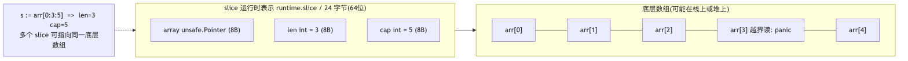
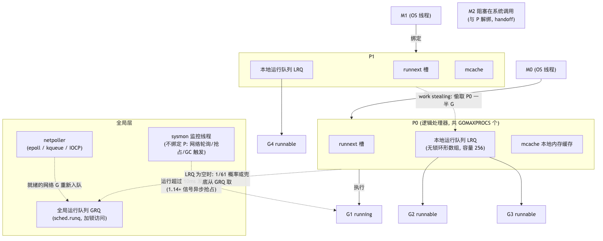
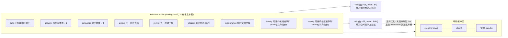
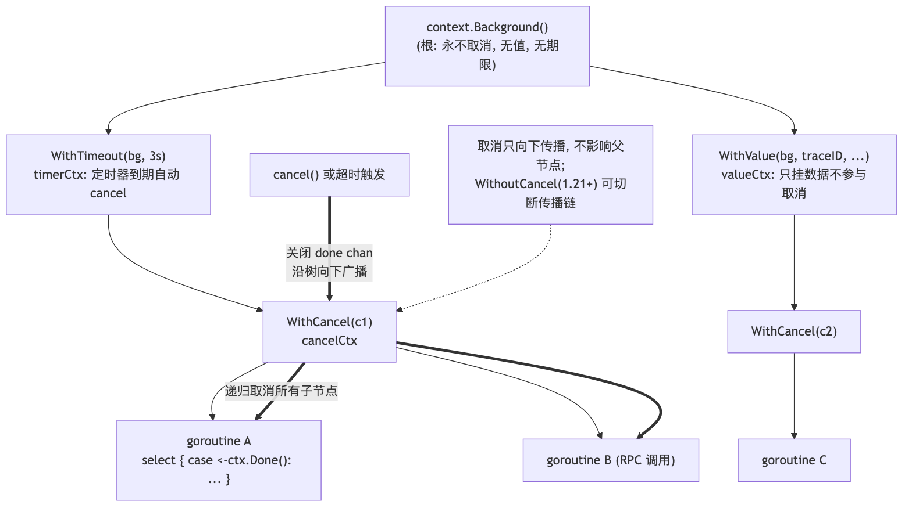

# Go 高级后端工程师面试 QA（底层原理专题）

> 本文面向高级 Go 后端工程师面试，聚焦语言底层实现：slice、map、string、interface、GMP 调度、channel、context、sync、内存分配与 GC、defer、跨平台编译与工程实践。文中运行时行为以 Go 1.22+ 为基准，并标注关键版本差异；部分工程实践结合作者的 Go 项目 swifty.go（swifty_cache：groupcache 风格分布式缓存；swifty_rpc：TCP 自研 RPC 框架）中经核实的真实源码模式说明。

## 目录

- [1. slice 底层原理](#1-slice-底层原理)
  - [1.1 slice 的运行时结构是什么](#11-slice-的运行时结构是什么)
  - [1.2 append 的扩容策略与内存对齐](#12-append-的扩容策略与内存对齐)
  - [1.3 共享底层数组的经典陷阱](#13-共享底层数组的经典陷阱)
  - [1.4 nil slice 与空 slice 的区别](#14-nil-slice-与空-slice-的区别)
  - [1.5 slice 作为函数参数的传递语义](#15-slice-作为函数参数的传递语义)
  - [1.6 slice 删除元素与内存泄漏](#16-slice-删除元素与内存泄漏)
- [2. map 底层原理](#2-map-底层原理)
  - [2.1 经典 hmap/bmap 实现](#21-经典-hmapbmap-实现)
  - [2.2 扩容机制：翻倍扩容与等量扩容](#22-扩容机制翻倍扩容与等量扩容)
  - [2.3 Go 1.24 的 Swiss Table 重写](#23-go-124-的-swiss-table-重写)
  - [2.4 map 的几个语言级约束及原因](#24-map-的几个语言级约束及原因)
  - [2.5 并发安全：fatal 而非 panic，以及 sync.Map](#25-并发安全fatal-而非-panic以及-syncmap)
  - [2.6 分片锁并发 map 的实现要点](#26-分片锁并发-map-的实现要点)
- [3. string 与 []byte](#3-string-与-byte)
- [4. interface 底层原理](#4-interface-底层原理)
  - [4.1 eface 与 iface](#41-eface-与-iface)
  - [4.2 nil interface 陷阱](#42-nil-interface-陷阱)
  - [4.3 动态派发的成本与逃逸](#43-动态派发的成本与逃逸)
- [5. GMP 调度器](#5-gmp-调度器)
  - [5.1 G、M、P 各自的职责](#51-gmp-各自的职责)
  - [5.2 一次完整的调度循环](#52-一次完整的调度循环)
  - [5.3 抢占机制的演进](#53-抢占机制的演进)
  - [5.4 系统调用与 handoff](#54-系统调用与-handoff)
  - [5.5 netpoller 与网络 IO](#55-netpoller-与网络-io)
  - [5.6 goroutine 栈：从 2KB 到 1GB](#56-goroutine-栈从-2kb-到-1gb)
  - [5.7 GOMAXPROCS 与容器环境](#57-gomaxprocs-与容器环境)
  - [5.8 sysmon 与 goroutine 状态机](#58-sysmon-与-goroutine-状态机)
- [6. channel 底层原理](#6-channel-底层原理)
  - [6.1 hchan 结构与收发流程](#61-hchan-结构与收发流程)
  - [6.2 各种边界状态速查表](#62-各种边界状态速查表)
  - [6.3 channel 与 happens-before](#63-channel-与-happens-before)
  - [6.4 select 的实现与随机性](#64-select-的实现与随机性)
  - [6.5 goroutine 泄漏与工程范式](#65-goroutine-泄漏与工程范式)
  - [6.6 channel 高频并发模式](#66-channel-高频并发模式)
- [7. context](#7-context)
  - [7.1 接口设计与四种实现](#71-接口设计与四种实现)
  - [7.2 取消传播的树形机制](#72-取消传播的树形机制)
  - [7.3 context 的工程规约](#73-context-的工程规约)
  - [7.4 1.20+ 新 API：Cause、AfterFunc、WithoutCancel](#74-120-新-apicauseafterfuncwithoutcancel)
- [8. sync 包与原子操作](#8-sync-包与原子操作)
  - [8.1 Mutex：正常模式与饥饿模式](#81-mutex正常模式与饥饿模式)
  - [8.2 RWMutex 与写者优先](#82-rwmutex-与写者优先)
  - [8.3 WaitGroup、Once、Cond 的正确用法](#83-waitgrouponcecond-的正确用法)
  - [8.4 sync.Pool 与 victim cache](#84-syncpool-与-victim-cache)
  - [8.5 atomic 与无锁编程](#85-atomic-与无锁编程)
  - [8.6 singleflight：防缓存击穿的标准武器](#86-singleflight防缓存击穿的标准武器)
  - [8.7 errgroup 与并发数控制](#87-errgroup-与并发数控制)
- [9. Go 内存模型与 happens-before](#9-go-内存模型与-happens-before)
- [10. 内存分配与逃逸分析](#10-内存分配与逃逸分析)
  - [10.1 三级分配器：mcache/mcentral/mheap](#101-三级分配器mcachemcentralmheap)
  - [10.2 逃逸分析的判定规则](#102-逃逸分析的判定规则)
- [11. GC：三色标记与混合写屏障](#11-gc三色标记与混合写屏障)
- [12. defer、panic 与 recover](#12-deferpanic-与-recover)
- [13. 跨平台编译](#13-跨平台编译)
  - [13.1 GOOS/GOARCH 与交叉编译基础](#131-goosgoarch-与交叉编译基础)
  - [13.2 CGO 与静态链接](#132-cgo-与静态链接)
  - [13.3 构建约束：build tags 与文件后缀](#133-构建约束build-tags-与文件后缀)
  - [13.4 编译产物优化与发布实践](#134-编译产物优化与发布实践)
- [14. 泛型要点](#14-泛型要点)
- [15. 工程实践：pprof、race、泄漏排查](#15-工程实践pprofrace泄漏排查)
- [16. 高频代码输出题](#16-高频代码输出题)
- [17. 死锁专题](#17-死锁专题)
  - [17.1 运行时死锁检测的能力与盲区](#171-运行时死锁检测的能力与盲区)
  - [17.2 六种经典死锁形态](#172-六种经典死锁形态)
  - [17.3 死锁预防与排查](#173-死锁预防与排查)
- [18. Go 工具链：go mod、go vet、go test 与 benchmark](#18-go-工具链go-modgo-vetgo-test-与-benchmark)
  - [18.1 go mod 与最小版本选择 MVS](#181-go-mod-与最小版本选择-mvs)
  - [18.2 go vet 与静态检查体系](#182-go-vet-与静态检查体系)
  - [18.3 go test 高级用法](#183-go-test-高级用法)
  - [18.4 benchmark 写法与陷阱](#184-benchmark-写法与陷阱)

---

## 1. slice 底层原理

### 1.1 slice 的运行时结构是什么

Q：描述 slice 在运行时的内存布局，它和数组的本质区别是什么？

A：slice 在运行时对应 `runtime.slice` 结构体，在 64 位平台上恒为 24 字节：

```go
// runtime/slice.go
type slice struct {
    array unsafe.Pointer // 指向底层数组的指针
    len   int            // 当前可见长度，索引访问的合法边界
    cap   int            // 从 array 起点到底层数组末尾的容量
}
```



要点：

1. 数组是值类型，`[5]int` 的类型信息里包含长度，赋值/传参会整体拷贝 40 字节；slice 是对数组一段窗口的描述符（header），赋值只拷贝 24 字节的三元组，底层数组共享。
2. `s[i]` 的边界检查基于 `len`，`s[i:j]` 再切片的边界检查基于 `cap`。所以 `s := make([]int, 3, 5)` 时 `s[3]` 会 panic，但 `s[3:5]` 合法。
3. 完整切片表达式 `s[low:high:max]` 可以显式限制新 slice 的 cap 为 `max-low`，这是切断底层数组共享、防止 append 污染的关键手段（见 1.3）。
4. slice 本身可以在栈上，底层数组是否逃逸到堆由逃逸分析决定（见 10.2）。

### 1.2 append 的扩容策略与内存对齐

Q：append 触发扩容时，新容量是怎么算出来的？为什么实测容量经常比理论值大？

A：分两步：先按增长公式算“期望容量”，再按内存分配器的 size class 向上取整。

增长公式（Go 1.18+，`runtime.growslice`）：

```go
newcap := oldCap
doublecap := newcap + newcap
if newLen > doublecap {
    newcap = newLen // 一次 append 多个元素超过双倍时，直接用需要的长度
} else {
    const threshold = 256
    if oldCap < threshold {
        newcap = doublecap // 小 slice：翻倍
    } else {
        // 大 slice：约 1.25 倍，且随规模增大从 2x 平滑过渡到 1.25x
        for 0 < newcap && newcap < newLen {
            newcap += (newcap + 3*threshold) / 4
        }
    }
}
```

- Go 1.17 及以前阈值是 1024 且是硬切换（<1024 翻倍，>=1024 乘 1.25）；1.18 改为 256 并平滑过渡，减少大 slice 的突变。
- 第二步 `roundupsize`：期望容量乘元素大小后，会向上取整到 malloc 的 size class（如 48、64、80、96、112 字节……），所以 `append([]int{1,2,3}, 4)` 得到的 cap 是 4（3 个 int=24B，翻倍 48B 正好是 size class），而某些元素类型会出现 cap 比翻倍值更大的“怪异”结果。面试时能讲出 roundupsize 这一步是区分度所在。
- 扩容必然发生 `mallocgc` 分配新数组 + `memmove` 拷贝 + 旧数组等待 GC，因此已知规模时必须 `make([]T, 0, n)` 预分配。基准测试中，预分配对热点路径（如 RPC 编解码缓冲）常有数倍收益。

### 1.3 共享底层数组的经典陷阱

Q：下面代码输出什么？如何修复？

```go
a := []int{1, 2, 3, 4, 5}
b := a[1:3]          // len=2, cap=4，与 a 共享底层数组
b = append(b, 100)   // cap 足够，不扩容，直接写 a[3] 的位置
fmt.Println(a)       // [1 2 3 100 5]  —— a 被“隔空”修改
b2 := append(b, 200) // 仍不扩容
b3 := append(b, 300) // b2 和 b3 的最后一个元素互相覆盖！
_ = b2; _ = b3
```

A：`b` 与 `a` 共享底层数组且 `cap` 有富余，`append` 原地写入覆盖了 `a[3]`。修复方式按语义选择：

1. 完整切片表达式：`b := a[1:3:3]`，强制 cap=len，下次 append 必然扩容拷贝，与 `a` 解耦。
2. 显式拷贝：`b := make([]int, 2); copy(b, a[1:3])` 或 Go 1.21+ 的 `slices.Clone(a[1:3])`。
3. 函数返回内部缓冲区的子切片给调用方时，永远返回拷贝——这是库代码的铁律（例如 RPC 框架从读缓冲区拆帧后，若直接返回缓冲区的子切片，缓冲区被后续数据覆盖时消息就被污染。swifty_rpc 的 `transport.PacketBuffer.Read` 正是这样做的：定位到完整帧后 `packet := make([]byte, totalLen); copy(packet, pb.buf[:totalLen])` 拷出独立副本，再前移缓冲区）。

另一个衍生陷阱：大数组小切片导致的内存驻留。从 100MB 的文件内容里 `data[:100]` 保留一小段，会让整个 100MB 无法被 GC 回收，必须 copy 出来。

### 1.4 nil slice 与空 slice 的区别

Q：`var s []int` 和 `s := []int{}` 有什么区别？

A：

| 维度                         | nil slice `var s []int` | 空 slice `[]int{}` / `make([]int,0)`               |
| ---------------------------- | ----------------------- | -------------------------------------------------- |
| array 指针                   | nil                     | 指向 `runtime.zerobase`（所有 0 长对象共享的地址） |
| `len/cap`                    | 0/0                     | 0/0                                                |
| `s == nil`                   | true                    | false                                              |
| `json.Marshal`               | `null`                  | `[]`                                               |
| `append`/`len`/`range`/`for` | 全部安全                | 全部安全                                           |

工程结论：内部逻辑无需区分（`len(s) == 0` 是唯一正确的判空方式）；但对外 API（JSON 响应）要注意 `null` 与 `[]` 的语义差异，HTTP 框架返回列表字段时通常约定初始化为空 slice。

### 1.5 slice 作为函数参数的传递语义

Q：Go 只有值传递，那为什么函数内能修改调用方的 slice 元素，却不能让调用方看到 append 的结果？

A：传参拷贝的是 24 字节的 slice header，两个 header 指向同一底层数组：

- `s[0] = 1`：通过共享的 array 指针写底层数组，调用方可见。
- `s = append(s, x)`：只修改了被调函数栈上那份 header 副本的 len（或指向新数组），调用方的 header 纹丝不动。若 append 未扩容，数据其实已写进共享数组，只是调用方 len 没变看不见——这是最迷惑人的中间态。

因此需要修改长度/重新分配时，要么返回新 slice（标准库 `append` 风格），要么传 `*[]T`。

### 1.6 slice 删除元素与内存泄漏

Q：从 slice 中删除元素的标准写法？指针型 slice 删除时要注意什么？

A：

```go
// 保序删除 i：O(n)
s = append(s[:i], s[i+1:]...)
// Go 1.21+: s = slices.Delete(s, i, i+1)

// 不保序删除：O(1)
s[i] = s[len(s)-1]
s = s[:len(s)-1]
```

当元素是指针或含指针的结构体时，缩短 len 后，`len` 与 `cap` 之间的“尾巴”仍持有对象引用，GC 无法回收，需手动置零：

```go
copy(s[i:], s[i+1:])
s[len(s)-1] = nil // 断开引用
s = s[:len(s)-1]
```

`slices.Delete` 自 Go 1.22 起会自动把腾出的尾部元素置零，这也是推荐用标准库的原因。LRU 缓存这类长期持有大对象引用的结构尤其要注意淘汰时断链——swifty_cache 的 `lruStore` 就是例子：按 `MaxBytes` 字节预算分摊到各分片桶（`maxBucketBytes`），每个桶两级 LRU（`caches [][2]*cache`），一级命中后节点从一级删除并显式 `n1.v = nil` 断开引用再晋升到二级，防止“逻辑上删除、物理上驻留”。

---

## 2. map 底层原理

### 2.1 经典 hmap/bmap 实现

Q：讲讲 Go map（1.23 及以前）的底层结构和一次读写的完整流程。

A：核心结构：

```go
// runtime/map.go (Go <= 1.23)
type hmap struct {
    count     int            // len(m)
    flags     uint8          // 迭代中/写入中等状态位
    B         uint8          // 桶数量 = 2^B
    noverflow uint16         // 溢出桶近似计数
    hash0     uint32         // 哈希种子，每个 map 随机（抗 hash-DoS）
    buckets    unsafe.Pointer // 桶数组 [2^B]bmap
    oldbuckets unsafe.Pointer // 扩容时的旧桶数组
    nevacuate  uintptr        // 渐进搬迁进度
    extra      *mapextra      // 溢出桶管理
}

// 每个 bmap（桶）存 8 个键值对
type bmap struct {
    tophash [8]uint8 // 每个 key 哈希值的高 8 位，用于快速过滤
    // 编译期展开: keys [8]K; values [8]V （K/V 分开连续存放，省 padding）
    // overflow *bmap
}
```

读流程：`hash(key, hash0)` → 低 B 位选桶 → 遍历桶内 8 个 tophash（高 8 位比对，SIMD 友好的快速过滤）→ tophash 命中再比对完整 key → 未找到则沿 overflow 链继续 → 都没有则返回零值。

写流程：额外检查 `flags` 写标志（并发写检测）、触发扩容判断、必要时先搬迁当前桶再写入。

设计亮点：key/value 分开成 `k0..k7 v0..v7` 而不是 `kv` 交替，消除对齐 padding（如 `map[int64]int8`）；tophash 同时复用为槽位状态标记（empty/evacuated 等）。

### 2.2 扩容机制：翻倍扩容与等量扩容

Q：map 什么时候扩容？两种扩容有什么区别？为什么是渐进式的？

A：`mapassign` 时检查两个条件：

1. 负载因子超标：`count / 2^B > 6.5` → 翻倍扩容（B+1），解决装得太满。
2. 溢出桶过多：`noverflow` 超过阈值（约 2^B 个）→ 等量扩容（same-size grow），桶数不变重新搬迁。场景是大量删除后又插入，桶链很长但整体很稀疏，重排能压实数据、砍掉溢出链。

搬迁是渐进式的：扩容瞬间只分配新桶数组并把旧桶挂到 `oldbuckets`，之后每次对某个 key 的写/删操作顺带搬迁其所在旧桶（`growWork` 每次最多搬 2 个桶），把 O(n) 成本摊薄到多次操作上，避免大 map 一次性搬迁造成的延迟毛刺——和 Redis rehash 的思路一致。翻倍扩容时旧桶 i 的元素按哈希新增位分流到新桶 i 和 i+2^B（称 x/y 两半）。

推论：map 只增不缩。delete 全部 key 后桶数组仍在，长期持有的大 map 想释放内存只能整个换新 map（`m = make(map[K]V)`）。

### 2.3 Go 1.24 的 Swiss Table 重写

Q：听说新版 Go 重写了 map？

A：Go 1.24（2025.02）把内置 map 从链式桶实现替换为基于 Swiss Table（Google Abseil 的开放寻址方案）的实现：

- 每组（group）8 个槽位，配一个 64 位控制字（每槽 1 字节元数据，存哈希高 7 位 + 状态），查找时对控制字做整字（SWAR/SIMD 式）并行比对，一次比较 8 个槽。
- 开放寻址替代溢出链，内存局部性更好；整体大 map 按目录（directory）拆成多个独立扩容的子表，避免一次性巨型搬迁。
- 官方数据：热点 map 操作平均提速 10%~35%，负载因子上限更高（7/8），内存占用更省。
- 语义完全不变（迭代仍随机、并发写仍 fatal），属纯运行时替换；依赖 `//go:linkname` 摸 hmap 内部的黑科技代码会被破坏。

面试表达建议：先讲透经典 hmap（考察基本功），再主动提 1.24 Swiss Table（考察技术追踪），是明显加分项。

### 2.4 map 的几个语言级约束及原因

Q：为什么 map 元素不可寻址？为什么迭代顺序随机？key 有什么要求？

A：

1. `&m[k]` 编译错误、`m[k].Field = x`（V 为 struct 时）编译错误：因为扩容搬迁会移动元素，指针会悬空，语言层面直接禁止取址。修改结构体字段需整体读出改后写回，或把 value 定义为指针 `map[K]*V`。
2. 迭代顺序随机：运行时故意从随机桶、随机槽位开始迭代（`fastrand`）。这是防御性设计——早期版本顺序“看起来稳定”，开发者写出依赖顺序的代码，换版本就炸。需要有序就收集 key 排序后遍历。
3. key 必须可比较（`==` 有定义）：slice、map、func 不能做 key；含它们的 struct 也不行。interface 可以做 key，但若运行时动态类型不可比较会 panic。
4. `len(m)` 是 O(1)（hmap.count），但 map 没有 cap 概念；`make(map[K]V, hint)` 的 hint 只是预分配提示。

### 2.5 并发安全：fatal 而非 panic，以及 sync.Map

Q：并发读写 map 会怎样？能 recover 吗？sync.Map 适用什么场景？

A：运行时通过 `hmap.flags` 的 `hashWriting` 位做检测，发现并发读写会调用 `runtime.fatal("concurrent map read and map write")`——这是 fatal throw，不是 panic，recover 救不回来，进程直接退出。这是有意为之：并发写 map 意味着内部结构可能已损坏，继续运行只会产生更诡异的错误。

方案对比：

1. `map + sync.RWMutex`：默认首选，语义清晰，性能可预测。
2. `sync.Map`：内部是 read（原子只读 map）+ dirty（加锁 map）两层，读命中 read 时完全无锁；misses 累计到阈值后 dirty 升级为 read。适合两类场景：key 集合基本稳定的读多写少（如按连接/服务名缓存的元数据），或各 goroutine 读写的 key 不相交。写多或 key 频繁变化时比 RWMutex 更慢且内存翻倍。无泛型，1.20+ 可用 `CompareAndSwap` 系列。
3. 分片锁（sharded map）：按 key 哈希拆 N 把锁，写多时的高并发方案。分布式缓存的本地存储层常用这个思路降低锁竞争（见 2.6 的真实实现）。

### 2.6 分片锁并发 map 的实现要点

Q：让你手写一个高并发 map，你会怎么设计？分片锁有哪些细节？

A：核心思想：把一个"大 map + 一把大锁"拆成 N 个"小 map + 小锁"，不同 key 大概率落到不同分片，锁竞争按分片数近似线性下降。骨架：

```go
type ShardedMap struct {
    shards []shard
    mask   uint32 // 分片数为 2 的幂，用位与替代取模
}

type shard struct {
    mu sync.RWMutex
    m  map[string]any
    _  [40]byte // padding：避免相邻分片锁伪共享同一缓存行（可选）
}

func (s *ShardedMap) shardOf(key string) *shard {
    return &s.shards[hash(key)&s.mask]
}
```

设计细节（面试区分度所在）：

1. 分片数取 2 的幂，用 `hash & mask` 代替 `hash % n`（除法慢一个量级）。swifty_cache 的 `lruStore` 是完整的真实实现：`MaskOfNextPowOf2(BucketCount)` 把配置的桶数向上取整为 2 的幂，读写入口 `idx := HashBKRD(key) & s.mask` 定位分片，每个分片一把独立 `sync.Mutex` 保护该分片的两级 LRU。
2. 哈希函数要快且均匀：字符串常用 BKDR/FNV-1a/xxhash；不需要加密强度。注意不要用 Go 内置 map 的 hash（不可导出），但 1.19+ 可用 `maphash`。
3. 跨分片操作是弱点：`Len()` 要遍历全部分片累加（或另维护 atomic 计数）；`Range` 只能逐分片加锁快照，不是一致性视图；不支持跨分片事务。设计 API 时明确这些语义。
4. 分片数选择：经验值为 CPU 核数的 2~8 倍（如 32/64/128）；分片太少竞争仍高，太多浪费内存且 cache 不友好。固定分片数，不做动态 resharding（那是分布式一致性哈希该干的事）。
5. 每个分片内可以不只是 map：swifty_cache 分片内挂的是两级 LRU + 字节预算，锁的粒度与数据结构一起下沉。

三方案终选逻辑：读多写少且 key 稳定 → sync.Map；写多/混合负载 → 分片锁；简单场景/低并发 → `map + RWMutex` 别过度设计。

---

## 3. string 与 []byte

Q：string 的底层结构？和 []byte 互转的成本？如何零拷贝？

A：string 是不可变的字节序列，运行时表示为 16 字节的二元组（比 slice 少一个 cap，因为不可变不需要）：

```go
type stringStruct struct {
    str unsafe.Pointer
    len int
}
```

要点：

1. 不可变性是一切安全性的来源：string 可以作 map key、可以被多 goroutine 无锁共享、编译器可以对相同字面量做内存复用。
2. `string(b)` 和 `[]byte(s)` 默认都发生内存拷贝，因为二者可变性不同，必须隔离。热点路径上高频互转是常见性能杀手。
3. 编译器对若干模式做了免拷贝优化：`m[string(b)]` 作 map 查找、`for range []byte(s)`、`string(b) == "xx"` 比较、`switch string(b)`——这些场景临时转换不逃逸，直接复用原内存。
4. 显式零拷贝（Go 1.20+）：

```go
b := unsafe.Slice(unsafe.StringData(s), len(s)) // string -> []byte，绝不能写 b
s := unsafe.String(unsafe.SliceData(b), len(b)) // []byte -> string，此后 b 不能再改
```

    旧的 `reflect.StringHeader/SliceHeader` 写法已废弃。零拷贝的前提是你能证明生命周期内无人修改字节——典型合法场景是 RPC/HTTP 框架内部把解码出的只读 buffer 直接暴露为 string；不确定就老实拷贝。

5. `for range` string 按 rune（UTF-8 解码）迭代，`s[i]` 按字节索引；`len(s)` 是字节数，字符数要 `utf8.RuneCountInString`。中文场景切串必须用 rune 或按 rune 边界处理，否则切出半个 UTF-8 序列。6. 拼接：少量用 `+`（编译器会合并一次分配）；循环拼接用 `strings.Builder`（内部 []byte 增长 + unsafe 零拷贝转 string），并 `Grow` 预分配。`fmt.Sprintf` 最慢且引发逃逸。

---

## 4. interface 底层原理

### 4.1 eface 与 iface

Q：interface 的两种运行时表示？itab 里有什么？

A：

```go
// 空接口 interface{} / any
type eface struct {
    _type *_type         // 动态类型元信息
    data  unsafe.Pointer // 指向动态值
}

// 非空接口，如 io.Reader
type iface struct {
    tab  *itab
    data unsafe.Pointer
}

type itab struct {
    inter *interfacetype // 接口自身的类型（方法集合定义）
    _type *_type         // 动态类型
    hash  uint32         // 类型哈希，type switch 加速
    fun   [1]uintptr     // 变长：动态类型对接口各方法的实现地址表（虚函数表）
}
```

要点：

1. itab 是 `(接口类型, 具体类型)` 二元组的函数指针表，全局缓存（哈希表 + 惰性生成），同一对组合全程序只算一次；`fun[0] == 0` 表示该类型不实现该接口（缓存否定结果，加速失败的类型断言）。
2. 类型断言 `v, ok := i.(io.Writer)` 就是查 itab 缓存；`i.(ConcreteType)` 更快，直接比较 `_type` 指针。type switch 用 `itab.hash` 加速。
3. 将具体值装入 interface 通常导致堆分配：data 必须是指针，值类型装箱时要拷贝到堆上（逃逸）。例外：装入的本来就是指针；或值是小整数（0~255 有 `runtime.staticuint64s` 静态池复用）、零长对象等。

### 4.2 nil interface 陷阱

Q：为什么下面的代码打印 "not nil"？

```go
type MyErr struct{}
func (*MyErr) Error() string { return "boom" }

func do() error {
    var e *MyErr = nil
    return e // 装箱：itab=(error,*MyErr) 非空, data=nil
}

func main() {
    if err := do(); err != nil {
        fmt.Println("not nil") // 打印这行！
    }
}
```

A：interface 判 nil 是判 `tab` 和 `data` 两个字段都为 nil。这里返回时发生了 `*MyErr → error` 的装箱，itab 已经填上了类型信息，所以 `err != nil` 成立，尽管里面装的指针是 nil，调用 `err.Error()` 还会 panic（方法用指针接收者解引用 nil）。

修复原则：函数签名返回 `error` 时，成功路径必须字面量返回 `nil`，而不是返回一个可能为 nil 的具体错误指针。这是 Go 面试出现率最高的题之一，本质考察 iface 的双字结构。

### 4.3 动态派发的成本与逃逸

Q：接口调用比直接调用慢在哪？什么时候该避免接口？

A：成本有三层：

1. 间接调用：经 `itab.fun[i]` 跳转，CPU 分支预测器可缓解，但阻止内联——这才是主要损失，内联失败连带失去后续所有优化（逃逸分析、边界检查消除）。编译器的 devirtualization（含 PGO 驱动）能在能证明具体类型时把接口调用还原为直接调用并内联。
2. 装箱逃逸：值进 interface 通常逃逸到堆，增加分配和 GC 压力。`fmt.Println(x)` 让 x 逃逸就是这个原因（参数是 `...any`）。
3. 缓存不友好：`[]Iface` 里每个元素都是指针跳转，相比 `[]ConcreteStruct` 的连续内存差一个量级。

工程判断：接口的抽象价值在 99% 的代码里远大于纳秒级开销（如 swifty_rpc 的 `Codec` 接口：`Marshal/Unmarshal` 两方法，JSON、Protobuf 实现通过 `codec.Register(Type, Factory)` 注册进全局工厂，按消息头的 CodecType 动态选取——典型合理用法）；只在 profile 证明的热点内环（每秒千万次调用级别）才考虑去接口化或泛型化。

---

## 5. GMP 调度器

### 5.1 G、M、P 各自的职责

Q：详细讲讲 GMP 模型，为什么需要 P 这一层？

A：



- G（goroutine）：`runtime.g`，用户态协程，含栈指针、PC、状态（\_Grunnable/\_Grunning/\_Gwaiting/\_Gsyscall 等）、被阻塞的原因。初始栈 2KB。死亡的 G 会被缓存在空闲链表复用（`gFree`）。
- M（machine）：`runtime.m`，OS 线程的抽象。M 必须持有 P 才能执行 Go 代码。M 的数量上限默认 10000（可 `debug.SetMaxThreads`），大量 M 通常是 cgo/syscall 阻塞造成的。
- P（processor）：`runtime.p`，逻辑处理器，数量 = `GOMAXPROCS`。P 持有：本地运行队列 LRQ（256 容量的无锁环形数组）+ runnext 槽（最新唤醒的 G 优先插队，优化生产者-消费者时延）+ mcache（本地内存分配缓存）+ 本地 timer 堆 + GC 标记缓存等。

为什么需要 P（对比早期 GM 模型）：Go 1.0 只有 G 和 M，所有 G 挂在一个全局队列上，锁竞争严重、无数据局部性、M 阻塞时其队列无法转移。P 引入后（Go 1.1，Dmitry Vyukov 的设计）：

1. 运行队列拆到每个 P，本地入队出队无锁；
2. mcache 从 M 挪到 P，内存分配无锁（M 可能有 1 万个而 P 只有核数个）；
3. M 阻塞时把 P 整体交接（handoff）给别的 M，运行队列随 P 走，不丢调度能力。

### 5.2 一次完整的调度循环

Q：一个 M 是按什么顺序找下一个 G 来运行的？

A：`runtime.schedule()` → `findRunnable()` 的优先级：

1. 每调度 61 次，强制从全局队列 GRQ 取一次（防止 GRQ 中的 G 饿死，61 是个避免与其他周期共振的质数）；
2. 取 P 的 runnext；
3. 取 P 的本地队列 LRQ（无锁）；
4. GRQ（加锁，且顺手批量搬一部分到本地）；
5. netpoll（非阻塞检查网络就绪的 G）；
6. work stealing：随机（随机数种子决定起点）遍历其他 P，偷走其 LRQ 的一半，也会偷 runnext 和 timer；
7. 全都没有 → M 进入 spinning 自旋短暂等待，仍无活则释放 P、休眠（`stopm`）。

配套细节：本地队列满 256 时，入队操作会把一半 G（128 个）打包扔到 GRQ；`go func()` 创建的新 G 优先放 runnext。自旋线程（spinning M）的存在是为了压低唤醒延迟——用少量空转 CPU 换任务到达时的即时响应，运行时精确控制自旋 M 数量不超过忙碌 P 数。

### 5.3 抢占机制的演进

Q：一个 `for {}` 死循环会卡死整个调度器吗？

A：分版本：

- Go 1.13 及以前：协作式抢占。sysmon 发现某 G 运行超 10ms，把其 `stackguard0` 设为 `stackPreempt` 毒值，G 下一次函数调用时在栈增长检查（morestack）处被抢占。致命缺陷：无函数调用的纯计算循环 `for { i++ }` 永远不会触发检查，会独占 P；若 GOMAXPROCS=1 或所有 P 都被占，整个程序（包括 GC 的 STW 等待）僵死。
- Go 1.14+：基于信号的异步抢占。sysmon 检测到超时后向目标 M 发送 SIGURG，信号处理函数在被中断的 PC 处（若为安全点）伪造一次调用 `asyncPreempt`，把 G 挤下 CPU。从此纯计算循环也能被抢占，GC STW 不再被拖死。选 SIGURG 是因为它几乎不被应用使用且 debugger 友好。

补充：GC 的 stack scan 请求、`runtime.Gosched()` 主动让出、channel/锁阻塞、系统调用，都是调度点。

### 5.4 系统调用与 handoff

Q：G 陷入阻塞系统调用时，P 会被一起阻塞吗？

A：不会，这正是 handoff 机制：

1. 进入 syscall 前，M 与 P 松绑（P 状态置 `_Psyscall`，仍被 M 弱引用）；
2. 快路径：syscall 很快返回，M 尝试重新拿回原 P 继续跑；
3. 慢路径：sysmon 巡检发现 P 处于 `_Psyscall` 超过阈值（约 10μs 级）且有待运行的 G，就把 P 剥离交给其他 M（唤醒或新建 M）继续调度；
4. 原 M 从 syscall 返回后发现 P 没了：尝试抢一个空闲 P；抢不到就把 G 放回全局队列，自己休眠。

这解释了为什么大量阻塞 syscall/cgo 调用会导致线程数暴涨（每个阻塞调用占住一个 M），而纯网络 IO 不会——因为网络 IO 走 netpoller（见 5.5），G 挂起时 M 立即被复用。

注意区分：channel/mutex 阻塞是用户态的（gopark，G 挂到等待队列，M+P 直接跑下一个 G，零线程成本）；只有真正的阻塞 syscall 才涉及 handoff。

### 5.5 netpoller 与网络 IO

Q：Go 如何做到“同步代码、异步执行”的网络模型？

A：`net` 包的所有 fd 都设为非阻塞并注册进 netpoller（Linux epoll / macOS-BSD kqueue / Windows IOCP）：

1. G 执行 `conn.Read`，数据未就绪，内核返回 EAGAIN；
2. 运行时把 G 与该 fd 绑定（`pollDesc`），`gopark` 挂起 G——M 和 P 立刻去跑别的 G；
3. 调度循环、sysmon 会调用 `netpoll()`（epoll_wait 非阻塞/带超时）收割就绪事件，把对应 G 置为 runnable 放回队列；
4. G 被再次调度后从 `Read` 处继续，重新执行读取。

价值：开发者写阻塞式同步代码，运行时自动转成事件驱动，一条连接一个 goroutine 的模型可以扛几十万连接（每 G 仅 2KB 起步）。自研 TCP 框架正是建立在这套机制的廉价并发之上——swifty_rpc 的 `TCPClient` 每条连接启动一个 `readLoop()` goroutine，请求发出前用 `atomic.AddUint64` 生成 seq 存入 `pending sync.Map`（seq → Future），readLoop 按响应头里的 RequestID 从 pending 中 `LoadAndDelete` 匹配并唤醒等待者。

### 5.6 goroutine 栈：从 2KB 到 1GB

Q：goroutine 栈是怎么增长的？为什么不用分段栈？

A：初始 2KB，连续栈（contiguous stack）方案：

1. 每个函数序言检查 `SP < g.stackguard0`，不足则调用 `morestack`；
2. morestack 分配两倍大小的新栈，把旧栈内容整体拷贝过去，并逐帧调整栈上所有指向旧栈的指针（依赖精确的指针位图，这也是 Go 能做精确 GC 的同一套元数据）；
3. 上限 64 位下 1GB，超过即 `stack overflow` 崩溃；
4. GC 时若发现栈使用率低（不足 1/4），会收缩（shrink）一半。

Go 1.3 之前用分段栈（segmented stack），栈不够时链一个新段。缺点是 hot split：函数调用恰好落在段边界时，每次调用/返回都伴随段分配/释放，性能剧烈抖动。连续栈用一次性拷贝换取之后的零开销，是典型的摊销思维。

### 5.7 GOMAXPROCS 与容器环境

Q：容器里 GOMAXPROCS 有什么坑？

A：`GOMAXPROCS` 默认取机器逻辑 CPU 数。容器场景的经典问题：Pod limit 2 核，宿主机 64 核，Go 1.24 及以前默认 GOMAXPROCS=64 → 64 个 P 的调度开销、GC 标记并行度失衡、CFS 配额下频繁被内核限流（throttling），P99 明显劣化。解法：

- Go 1.25+：运行时原生感知 cgroup CPU 配额（cgroup v2），自动设置合理的 GOMAXPROCS，并能在配额变化时动态调整；
- 旧版本：`uber-go/automaxprocs` 或部署层显式注入 `GOMAXPROCS` 环境变量。

### 5.8 sysmon 与 goroutine 状态机

Q：sysmon 是什么？goroutine 有哪些状态，怎么流转？

A：sysmon（system monitor）是一个特殊的 M：不绑定 P、不进调度循环，独立死循环运行，休眠间隔在 20μs~10ms 之间自适应（系统越闲睡得越久）。它是运行时的"看门人"，职责：

1. retake 抢占：扫描所有 P——处于 `_Psyscall` 超过阈值的 P 剥离交给别的 M（5.4 的 handoff 慢路径）；`_Prunning` 上同一个 G 连续运行超 10ms，发 SIGURG 触发异步抢占（5.3）。
2. netpoll 兜底：距上次网络轮询超过 10ms 就补一次 `netpoll`，把就绪的 G 注入全局队列，防止所有 P 都忙时网络事件被饿。
3. 强制 GC：距上次 GC 超过 2 分钟（forcegcperiod），强制触发一轮，保证低分配率的服务也能定期回收。
4. 配合 scavenger 把长期空闲的堆内存归还 OS；监测长时间未 ready 的 timer。

G 的状态机（`runtime/runtime2.go`）：

| 状态          | 含义                                    | 典型转换                                                         |
| ------------- | --------------------------------------- | ---------------------------------------------------------------- |
| `_Gidle`      | 刚分配未初始化                          | → `_Gdead`（初始化完成待用）                                     |
| `_Grunnable`  | 就绪，在运行队列中等待                  | `go func()` 创建 / 被唤醒后 → 被调度 → `_Grunning`               |
| `_Grunning`   | 正在 M 上执行（持有 P）                 | 阻塞 → `_Gwaiting`；syscall → `_Gsyscall`；被抢占 → `_Grunnable` |
| `_Gsyscall`   | 陷入系统调用（M 被占，P 可能被剥离）    | 返回后 → `_Grunning` 或 `_Grunnable`                             |
| `_Gwaiting`   | 用户态阻塞：channel/锁/timer/netpoll/GC | `gopark` 进入，`goready` 唤醒 → `_Grunnable`                     |
| `_Gdead`      | 已退出或未使用，可被 gFree 池复用       | 函数返回 → goexit → `_Gdead`                                     |
| `_Gcopystack` | 栈正在扩容/收缩拷贝                     | morestack/shrinkstack 期间的临时态                               |

面试常见追问"goroutine 什么时候让出 CPU"，完整答案是六类：channel/select/锁阻塞（gopark）、系统调用、网络 IO（netpoller）、`runtime.Gosched()` 主动让出、被 sysmon 信号抢占、GC 安全点（含栈扫描请求）。`_Gwaiting` 与 `_Gsyscall` 的本质区别：前者是用户态阻塞，M 立即释放去跑别的 G（零线程成本）；后者 M 被内核占住，需要 handoff 补充线程。

---

## 6. channel 底层原理

### 6.1 hchan 结构与收发流程

Q：描述 channel 的运行时结构，以及一次 send 的完整路径。

A：`make(chan T, n)` 在堆上分配一个 `runtime.hchan`：



```go
type hchan struct {
    qcount   uint           // 缓冲区中元素个数
    dataqsiz uint           // 缓冲区容量
    buf      unsafe.Pointer // 环形缓冲区
    elemsize uint16
    closed   uint32
    elemtype *_type
    sendx    uint   // 写游标
    recvx    uint   // 读游标
    recvq    waitq  // 阻塞的接收者（sudog 链表）
    sendq    waitq  // 阻塞的发送者
    lock     mutex  // 一把锁保护所有字段
}
```

send（`ch <- v`，即 `runtime.chansend`）按优先级走三条路：

1. recvq 有等待的接收者：说明缓冲必为空，直接把 v 从发送方 memmove 到接收者 G 的栈上（绕过 buf，唯一一处 goroutine 直写另一 goroutine 栈的地方），然后 `goready` 唤醒接收者。这是"直传优化"，省一次缓冲区读写。
2. 缓冲区有空位：拷贝进 `buf[sendx]`，游标前移，解锁返回，不发生调度。
3. 缓冲区满/无缓冲且无人接收：把自己包装成 `sudog` 挂进 sendq，`gopark` 挂起让出 M；被接收方唤醒后返回。

recv 完全对称，另有一个特殊分支：缓冲区满且 sendq 有等待者时，接收方从 `buf[recvx]` 取走队头，并把 sendq 队头 sudog 的元素填到刚腾出的槽位——保证 FIFO。

性能认知：channel 内部是"一把大锁 + 两个等待队列 + 环形缓冲"，收发本身是加锁操作。高竞争纯计数场景 atomic > mutex > channel；channel 的价值在于所有权转移的语义表达和与 select 的组合能力，不在裸吞吐。

### 6.2 各种边界状态速查表

Q：对 nil channel、closed channel 的各种操作分别是什么行为？

A：这是必背表格：

| 操作           | nil channel | 已关闭 channel                                       | 正常 channel |
| -------------- | ----------- | ---------------------------------------------------- | ------------ |
| send `ch <- v` | 永久阻塞    | panic: send on closed channel                        | 阻塞或成功   |
| recv `<-ch`    | 永久阻塞    | 立即返回：缓冲区残余元素，取尽后返回零值，`ok=false` | 阻塞或成功   |
| close          | panic       | panic: close of closed channel                       | 成功         |
| len/cap        | 0 / 0       | 正常                                                 | 正常         |

推论与惯用法：

- 关闭的 channel 可以无限次读，先排空缓冲再给零值——所以 close 是安全的广播原语（`close(done)` 唤醒所有等待者），context 的 Done 正基于此。
- nil channel 永久阻塞在 select 里是特性不是 bug：把某个 case 的 channel 置 nil 即可动态禁用该分支（如某队列取尽后置 nil，select 不再轮询它）。
- close 的职责规则：只由唯一的发送方关闭；多发送方场景不 close 数据通道，而是用额外的 done channel 或 `sync.Once` 协调。接收方永远不 close。
- `for range ch` 在 channel 关闭且取尽后自动退出，是消费者的标准写法。

### 6.3 channel 与 happens-before

Q：channel 操作提供什么内存序保证？

A：Go 内存模型明确规定：

1. 第 n 次 send happens-before 第 n 次 receive 完成（含缓冲 channel）——生产者在 send 前写的所有内存，消费者 receive 后可见。这是"不要用共享内存通信，用通信共享内存"的底层依据：数据本体甚至不必经过 channel，传一个指针即可，可见性由 channel 保证。
2. close(ch) happens-before 因关闭而返回零值的 receive。
3. 对容量 C 的 channel，第 n+C 次 send 之前，第 n 次 receive 已完成（缓冲槽位形成的反向同步，信号量语义的基础，如用 `chan struct{}` 限流）。

### 6.4 select 的实现与随机性

Q：select 多个 case 就绪时怎么选？底层如何实现？

A：

1. 随机公平：`runtime.selectgo` 先按 `fastrandn` 生成随机轮询顺序（pollorder），多个就绪 case 中伪随机选一个，防止固定顺序导致的分支饥饿。加锁则按 hchan 地址排序（lockorder）加锁，避免多 select 死锁。
2. 一轮扫描无就绪 case 且无 default：为每个 case 创建 sudog 挂到对应 channel 的等待队列，gopark；任一 channel 就绪唤醒后，再把自己从其他所有 channel 的队列里摘除。
3. `default` 使 select 非阻塞：一轮扫描没有就绪就走 default，这是"尝试发送/接收"（try-send/try-recv）的实现方式。
4. 编译器优化：单 case + default 会被编译成 `selectnbsend/selectnbrecv` 直接调用，不走 selectgo。
5. 常见坑：select 中每个 case 的求值（channel 表达式和 send 的右值）在选择前全部执行一次；`time.After` 放在循环内的 select 中会每轮泄漏一个 timer（1.23 前），应改用 `time.NewTimer` + Reset 或 1.23+（timer 已可被 GC 回收，但仍建议复用）。

### 6.5 goroutine 泄漏与工程范式

Q：常见的 goroutine 泄漏模式和防御手段？

A：泄漏的本质是 G 永久阻塞在 channel/锁上，无人唤醒，其栈和引用的对象永不回收。四大经典模式：

1. 发送者泄漏：worker 往无缓冲 channel 发结果，调用方因超时提前返回不再接收 → worker 永久阻塞。修复：结果 channel 给容量 1（发完即走），或 select + ctx.Done()。
2. 接收者泄漏：生产者退出但没 close channel，消费者 `for range` 永久等待。修复：生产者 defer close。
3. 忘记退出的后台循环：`for { select {...} }` 没有退出分支。任何常驻 goroutine 必须有明确的退出路径——swifty_cache 的 `Register` 就是范本：etcd 续租 goroutine 在 `for-select` 中同时监听 `stopCh`（收到即 `Revoke` 租约并退出）与 keepalive channel（被 etcd 关闭时带退避重注册，重注册期间也响应 stopCh）；swifty_rpc 的 `TCPClient.readLoop` 在读错误时调用 fail 路径 `Range` 遍历 `pending` map，逐个以错误完成所有挂起的 Future 后退出，绝不留下永久等待的调用方。
4. 锁泄漏：持锁 panic 未 defer unlock，或 WaitGroup 计数不平衡。

防御与排查：

- 编码规约：启动 goroutine 时必须能回答"它何时退出、谁负责让它退出"（结构化并发思想）；对外暴露的阻塞 API 一律接收 ctx。
- 排查：`pprof /debug/pprof/goroutine?debug=1` 看数量与堆栈聚类；`runtime.NumGoroutine()` 打点监控趋势；测试中用 `goleak`（uber-go）在每个 test 结束时断言无泄漏。

### 6.6 channel 高频并发模式

Q：用 channel 实现 worker pool、fan-in/fan-out、限流、超时控制，各写出骨架并说明关键点。

A：

1. Worker Pool（固定并发消费）：

```go
func workerPool(ctx context.Context, jobs <-chan Job, workers int) <-chan Result {
    results := make(chan Result)
    var wg sync.WaitGroup
    for i := 0; i < workers; i++ {
        wg.Add(1)
        go func() {
            defer wg.Done()
            for job := range jobs { // jobs 关闭且取尽后自动退出
                select {
                case results <- process(job):
                case <-ctx.Done():
                    return
                }
            }
        }()
    }
    go func() { wg.Wait(); close(results) }() // 全部 worker 退出后才关结果通道
    return results
}
```

关键点：多个 worker 从同一 channel 接收，天然负载均衡（运行时按 recvq FIFO 唤醒）；`close(results)` 必须等 `wg.Wait()`，由唯一的协调 goroutine 执行——直接在某个 worker 里 close 会 panic（6.2 的规则：多发送方不能各自 close）。

2. Fan-out / Fan-in（分发-合并）：fan-out 就是上面"多 worker 读同一 channel"；fan-in 是把多个输出合并：

```go
func merge[T any](chs ...<-chan T) <-chan T {
    out := make(chan T)
    var wg sync.WaitGroup
    for _, ch := range chs {
        wg.Add(1)
        go func(c <-chan T) { defer wg.Done(); for v := range c { out <- v } }(ch)
    }
    go func() { wg.Wait(); close(out) }()
    return out
}
```

3. 信号量限流（chan struct{}）：

```go
sem := make(chan struct{}, 10) // 最多 10 个并发
for _, task := range tasks {
    sem <- struct{}{} // 获取令牌，满则阻塞
    go func(t Task) {
        defer func() { <-sem }() // 归还
        handle(t)
    }(task)
}
```

原理是 6.3 的第三条 happens-before：容量 C 的 channel 上第 n+C 次 send 前第 n 次 receive 必已完成。`struct{}` 零大小，缓冲区不占内存。生产级替代：`golang.org/x/sync/semaphore.Weighted`（支持一次请求多个配额 + ctx 取消）。

4. 超时与心跳：

```go
timer := time.NewTimer(timeout)
defer timer.Stop()
select {
case res := <-resultCh:
    return res, nil
case <-timer.C:
    return zero, ErrTimeout
case <-ctx.Done():
    return zero, ctx.Err()
}
```

循环中不要用 `time.After`（每轮新建 timer，1.23 前直到触发才释放）；周期任务用 `time.NewTicker` 且 defer Stop。

5. 优雅关闭的顺序法则：关闭信号从数据流最上游开始（生产者 close 数据 channel，关闭沿 `for range` 逐级向下游传播）；控制面广播用 `close(done)` 或 ctx。永远不要关闭有多个发送方的数据通道，改为广播 done 让发送方自行退出。swifty_rpc 服务端优雅关闭用的是另一个惯用技巧：`SetReadDeadline` 打断阻塞中的 `conn.Read`，让读循环自然退出，而不是暴力关连接。

---

## 7. context

### 7.1 接口设计与四种实现

Q：context.Context 的接口方法及标准库的几种实现？

A：

```go
type Context interface {
    Deadline() (deadline time.Time, ok bool)
    Done() <-chan struct{}   // 取消广播；惰性创建
    Err() error              // Done 关闭后返回 Canceled 或 DeadlineExceeded
    Value(key any) any       // 沿父链向上查找
}
```

标准实现：

1. emptyCtx（`Background()` / `TODO()`）：全部返回零值，是所有 context 树的根。Background 表示"我就是根"，TODO 表示"还没想好从哪传下来"（语义提示，行为相同）。
2. cancelCtx（`WithCancel`）：核心实现。持有 `done atomic.Value(chan struct{})`、`children map[canceler]struct{}`、`err`，一把 mutex 保护。
3. timerCtx（`WithTimeout`/`WithDeadline`）：cancelCtx + `time.Timer`，到期自动 cancel（err 为 DeadlineExceeded）。WithTimeout 就是 `WithDeadline(parent, time.Now().Add(d))`。
4. valueCtx（`WithValue`）：只存一对 key/value，`Value()` 未命中则递归问父节点——本质是不可变链表，查找 O(链深)。

### 7.2 取消传播的树形机制

Q：cancel 是怎么传播的？为什么取消只影响子树？

A：



构造 `WithCancel(parent)` 时，新节点要向上挂接：沿父链找到最近的 cancelCtx，把自己注册进其 `children` 集合；若父链上没有可取消节点，则启动一个 goroutine 监听 `parent.Done()`（第三方自定义 Context 的兼容路径）。

`cancel()` 执行：加锁 → 设置 err → close(done)（唤醒所有 `<-ctx.Done()` 的 goroutine）→ 递归 cancel 所有 children → 从父节点的 children 中把自己摘除。

关键性质：

- 取消只向下传播，父节点与兄弟子树不受影响——所以每个请求的 ctx 树独立，取消一个请求不影响其他请求。
- cancel 函数必须调用（`defer cancel()`），即使正常完成：否则 timerCtx 的 timer 与父节点 children 里的引用要等到期才释放，高 QPS 下积累成内存压力，`go vet` 的 lostcancel 检查会报。
- Done() 的 channel 是惰性创建的（首次调用 Done 或 cancel 时），用 atomic.Value 双检查避免加锁。

### 7.3 context 的工程规约

Q：使用 context 的最佳实践和反模式？

A：

1. ctx 作为函数第一个参数显式传递（`func Do(ctx context.Context, ...)`）；不放 struct 字段（例外：贯穿单个请求生命周期的对象，如 `http.Request`）。
2. Value 只放请求域元数据（trace id、登录态、租户），不放业务参数和依赖（DB 连接、logger 配置项该走参数或依赖注入）。key 用非导出自定义类型防碰撞：`type ctxKey struct{}`——swifty_cache 用 `peerRequestContextKey struct{}` 标记"这是对等节点转发来的请求"，防止 Set/Delete 的对等同步无限回环，是该模式的实战用例。
3. 不传 nil ctx，不确定就 `context.TODO()`。
4. 所有跨网络/可能阻塞的调用必须透传 ctx 并响应取消。swifty_rpc 是完整示例：`Client.Invoke(ctx, ...)` 先 `context.WithTimeout(ctx, c.timeout)` 收敛预算，等待结果走 `Future.WaitWithContext`——`select { case <-f.done: ...; case <-ctx.Done(): return ctx.Err() }`；超时/取消后还会主动 `future.Done(nil, ctx.Err())` 使熔断器记录失败，迟到的服务端响应成为幂等 no-op。链路贯通后才能实现"上游超时，全链路立即止损"。
5. 超时应分层收敛：入口设总预算（如 2s），下游各环节用 `WithTimeout` 分剩余预算，避免下游超时大于上游造成无效等待。
6. ctx 是协作式取消：只是关一个 channel，代码不检查 Done 就不会停。CPU 密集循环要在合适粒度上主动 `select` 检查。

### 7.4 1.20+ 新 API：Cause、AfterFunc、WithoutCancel

Q：近几个版本 context 包加了什么？

A：

- `WithCancelCause` / `Cause(ctx)`（1.20）：cancel 时携带原因 `cancel(errors.New("upstream degraded"))`，`context.Cause(ctx)` 取回具体原因，解决了 Err() 只有 Canceled/DeadlineExceeded 两种值、无法定位"谁取消的"的老大难问题。1.21 起 `WithTimeoutCause` 同理。
- `AfterFunc(ctx, f)`（1.21）：ctx 取消后异步执行 f，返回 stop 函数；替代手写 "goroutine 监听 Done 然后干活" 的样板代码，且 stop 可避免泄漏。
- `WithoutCancel(ctx)`（1.21）：得到一个继承 values 但不继承取消的 ctx。典型场景：请求已结束，但要用请求里的 trace id 继续做异步审计日志/缓存回填——旧写法是危险的 `context.Background()`（丢 trace）或自造 detach ctx。

---

## 8. sync 包与原子操作

### 8.1 Mutex：正常模式与饥饿模式

Q：sync.Mutex 的实现原理？什么是饥饿模式？

A：Mutex 是 8 字节：`state int32`（锁定位/唤醒位/饥饿位/等待者计数复用一个字）+ `sema uint32`（信号量）。加锁路径分层：

1. Fast path：CAS 把 state 从 0 改 1，一条原子指令成功即返回（无竞争时的成本就这么多）。
2. 自旋：竞争时，若多核、P 的本地队列空、自旋次数 < 4，则执行 `PAUSE` 指令自旋等待——赌持有者马上释放，避免 gopark 的调度成本。
3. 排队：自旋失败，等待者计数 +1，`runtime_SemacquireMutex` 挂起，进入 sema 的等待队列（treap 结构）。

正常模式：唤醒的等待者要与新来的（正在自旋的）goroutine 竞争锁——新来的正持有 CPU，大概率赢。吞吐好，但队首可能反复抢不到。

饥饿模式（Go 1.9 引入）：某等待者等待超过 1ms，state 置饥饿位，锁改为直接移交（handoff）给队首等待者，新来的不抢、直接排队尾。队列清空或队首等待时间 < 1ms 时切回正常模式。这是吞吐与尾延迟公平性的权衡，解决了极端场景下等待者被饿死数十秒的问题。

其他要点：Mutex 不可重入（同一 goroutine 二次 Lock 直接死锁）；零值可用；unlock 未锁定的 mutex 会 fatal；1.25+ 的 `sync.WaitGroup.Go`、`mutex` 内部实现有持续演进但语义不变。

### 8.2 RWMutex 与写者优先

Q：RWMutex 怎么避免写者饿死？什么时候 RWMutex 反而比 Mutex 慢？

A：内部为 `w Mutex`（写者互斥）+ `readerCount atomic.Int32` + `readerWait` + 两个信号量。写锁到来时把 readerCount 原子减去 `1<<30`（rwmutexMaxReaders），使其变为负值——后续新读者看到负值即排队，写者等存量读者（readerWait）清零后获锁。即写请求会阻断后续读请求，避免读多场景写者永远插不进去。

性能真相：每次 RLock/RUnlock 都要原子修改共享的 readerCount，多核下该缓存行在核间弹跳（cache line bouncing）。临界区极短时，RWMutex 的读扩展性反而不如普通 Mutex，也远不如分片或 copy-on-write（atomic.Pointer 换整个只读快照）。经验法则：临界区长（>百 ns）且读写比高才用 RWMutex。

### 8.3 WaitGroup、Once、Cond 的正确用法

Q：WaitGroup 有哪些误用？Once 怎么实现的？

A：

WaitGroup：state 是一个 64 位字（高 32 位 counter，低 32 位 waiter 数）+ sema。规则：

- `Add` 必须在 `go` 启动之前由父 goroutine 调用（否则 Wait 可能在 Add 前执行，直接通过）；
- counter 减到负数 panic；Wait 返回前又 Add 复用会 panic（"WaitGroup is reused before previous Wait has returned"）；
- WaitGroup 含 noCopy，必须传指针，值拷贝后 vet 会报 copylocks。
- Go 1.25+ 新增 `wg.Go(func())`，把 Add(1)/defer Done 封装掉，消除一类计数错误。

Once：`done atomic.Uint32` + Mutex 双检查。快路径原子读 done==1 直接返回；慢路径加锁再检查、执行 f、defer 置 done=1（f panic 也算"执行过"，后续调用不再执行且拿不到结果——所以初始化可能失败时用 `sync.OnceValue`/`OnceValues`（1.21+）或自己带 error 缓存的实现）。关键保证：Once.Do 返回时 f 已 happens-before 所有观察者。真实用例（swifty.go）：swifty_cache 的 `lruStore.closeOnce sync.Once` 保证 Close 幂等（只关一次 closeCh/Ticker）；swifty_rpc 的 `observedStream` 用 `once.Do` 保证一次流式调用只向熔断器记录一次成功/失败。而 swifty_cache 的 Group 按名注册用的是另一种模式：全局 `map[string]*Group` + `sync.RWMutex`，重复注册直接 panic——注册表（可增删查）与单例（只初始化一次）要选对工具。

Cond：`Wait` 必须在持锁下调用且用 for 循环重检条件（虚假唤醒与竞态）。工程上 90% 的 Cond 场景可以用 channel 或减小粒度的锁替代，Cond 无法与 select/ctx 组合是其硬伤。

### 8.4 sync.Pool 与 victim cache

Q：sync.Pool 的实现和适用边界？

A：目的：摊薄短生命周期对象的分配与 GC 成本，不是做连接池/资源池（元素随时可能被 GC 无声回收，绝不能放有状态资源）。

实现要点：

1. per-P 本地化：每个 P 一个 `poolLocal`，含 `private`（无锁私有槽）+ `shared`（无锁 chunked 双端队列）。Get 顺序：private → 本地 shared 头部 pop → 窃取其他 P 的 shared 尾部 → victim → New()。生产者/消费者两端分离，几乎无锁。
2. victim cache（Go 1.13+）：GC 时不再直接清空 pool，而是主缓存整体降级为 victim，原 victim 才真正释放。对象要连续两轮 GC 未被使用才回收，消除了 GC 后瞬间的分配风暴（冷启动尖峰）。
3. Put 前必须 Reset 对象，Get 出来的对象含脏数据是经典 bug；放入 buffer 类对象要注意丢弃过大的（某次请求撑大到 10MB 的 buffer 会一直驻留，官方 fmt 包就吃过这亏——超过阈值不 Put 回去）。

适用判据：对象分配频繁 + 生命周期短（请求内）+ 初始化成本可观（如编解码 buffer、bytes.Buffer、临时结构体）。RPC 框架的消息头/消息体对象、HTTP 框架的 Context 对象复用是标准场景。

### 8.5 atomic 与无锁编程

Q：atomic 提供什么保证？和 mutex 怎么选？

A：

1. `sync/atomic` 的操作是顺序一致（sequentially consistent）的，且构成 happens-before 边——Go 内存模型 1.19 起正式明确（类似 C++ 的 seq_cst，不提供更弱的 relaxed 序）。
2. 推荐使用 1.19+ 的类型化 API：`atomic.Int64`、`atomic.Bool`、`atomic.Pointer[T]`，自带对齐保证（旧的 `atomic.AddInt64(&x)` 在 32 位平台上要求手工保证 64 位对齐，是历史坑）。
3. 典型模式：
   - 计数器/指标：atomic.Int64.Add，远快于 mutex。伪共享注意：多个热点计数器放在一个 struct 里会共享缓存行，需 padding。
   - 配置热更新 / COW：`atomic.Pointer[Config]`，写者构造全新对象后 Store，读者 Load 拿到不可变快照，读侧零锁。
   - 状态门闩：CAS 保证"只有一个 goroutine 执行关闭逻辑"。真实用例：swifty_cache 的 `Group.Close` 用 `atomic.CompareAndSwapInt32(&g.closed, 0, 1)` 实现幂等关闭，Get/Set 入口用 `atomic.LoadInt32(&g.closed)` 快速拒绝；统计字段（gets/loads/peerHits 等）全部走 `atomic.AddInt64`，读写热路径零锁。
4. 选择标准：单变量读改写 → atomic；多个变量需要保持一致的复合不变式 → mutex。不要用多个 atomic 变量拼装事务语义，那是数据竞争的温床。

### 8.6 singleflight：防缓存击穿的标准武器

Q：singleflight 的原理和陷阱？

A：`golang.org/x/sync/singleflight`：同一 key 的并发调用只放一个进去真正执行，其余等待并共享同一结果。内部即 `mutex + map[string]*call`，call 里 WaitGroup 挂起后来者。

缓存读穿场景（cache miss → 回源 DB/远端）必须套 singleflight，把"万级并发同 key 回源"压成 1 次。swifty_cache 把它内建在 `Group.load`：本地 miss → `g.loader.Do(key, fn)`（自研 `SingleFlightGroup`）包住"按一致性哈希查对等节点或回源 getter"。有个容易漏掉的细节它也处理了：singleflight 只去重时间上重叠的并发调用，两个先后到达的请求会各自 miss 再各自回源，所以 fn 内部第一步是再查一次缓存（双检查），源码注释原话是 "Singleflight only dedups concurrent overlapping calls; two serial callers can both miss the cache, so check again before loading"。

陷阱：

1. 一损俱损：执行者失败/超慢，所有等待者一起失败/一起慢。可用 `DoChan` + select 加超时，或对错误结果立刻 `Forget(key)` 允许下一波重试。
2. 执行者 panic 会传播给所有等待者（包装成 panicError 重新抛出）。
3. ctx 语义：执行函数拿的是第一个请求的 ctx，第一个请求取消会连累全部等待者——需要用无取消的 ctx（WithoutCancel）执行回源，或用支持 ctx 聚合的变体实现。

### 8.7 errgroup 与并发数控制

Q：并发发起一批子任务，要求任一失败即整体取消、限制最大并发、收集第一个错误——标准做法是什么？

A：`golang.org/x/sync/errgroup`，它解决了裸 WaitGroup 的三个缺口：错误传播、失败即取消、并发上限。

```go
g, ctx := errgroup.WithContext(parentCtx)
g.SetLimit(10) // 最多 10 个并发；Go 也自 1.20+ 支持 TryGo 非阻塞提交

for _, url := range urls {
    g.Go(func() error {           // Go 1.22+ 循环变量无需手动捕获
        req, _ := http.NewRequestWithContext(ctx, "GET", url, nil) // 必须用组的 ctx
        return fetch(req)
    })
}
if err := g.Wait(); err != nil { // 返回第一个非 nil 错误
    return err
}
```

机制拆解：

1. WithContext 返回派生 ctx：任一任务返回 error，errgroup 内部 `sync.Once` 保证只记录第一个错误并调用 cancel——其余任务通过监听这个 ctx 尽快退出。注意：errgroup 不会杀掉 goroutine，只是取消 ctx，任务不检查 ctx 就会白跑到底（协作式取消，与 7.3 一致）。
2. SetLimit(n) 内部就是容量 n 的 `chan token` 信号量（6.6 模式 3 的封装）；`g.Go` 在达到上限时阻塞，`TryGo` 返回 false。
3. Wait 语义 = 所有已启动任务结束 + 返回首错。需要收集全部错误时不要用 errgroup 的返回值，各任务把 error 写入自己的下标槽位 `errs[i]`（无竞争），最后 `errors.Join(errs...)`（1.20+）。
4. 与裸方案对比：`WaitGroup` 只有"等全部完成"；`errgroup` = WaitGroup + 首错 + 取消 + 限流，是结构化并发在标准扩展库中的落地。真实案例：swifty_rpc 客户端对一次调用的"限流 → 熔断 → 连接池获取 → 发送"各环节都在 ctx 预算内完成，任一环节失败即快速返回并向熔断器记账——同样的"失败快速传播"思想。

补充一个高频陷阱：`g.Go` 里再嵌套启动裸 goroutine，其生命周期就脱离了 errgroup 的管辖，Wait 不会等它——嵌套并发要么继续用子 errgroup，要么显式 WaitGroup 兜住。

---

## 9. Go 内存模型与 happens-before

Q：什么是数据竞争？Go 内存模型给了哪些同步保证？

A：数据竞争 = 两个 goroutine 并发访问同一内存位置，至少一个是写，且无 happens-before 边。有竞争的程序行为未定义（Go 保证不会像 C++ 那样任意炸，但读到的值可能是"撕裂"的中间态，如 interface/slice/string 多字结构写一半）。

标准同步原语建立的 happens-before 边：

1. channel：send HB 对应 receive 完成；close HB 返回零值的 receive；第 n 次 receive HB 第 n+C 次 send 完成。
2. mutex：第 n 次 Unlock HB 第 n+1 次 Lock；RUnlock 与写锁同理。
3. Once.Do(f)：f 的返回 HB 任何 Do 的返回。
4. atomic 操作构成全序且是同步操作。
5. WaitGroup：Done HB Wait 返回。goroutine 创建：`go` 语句 HB goroutine 内第一行；goroutine 退出不 HB 任何事件（不能靠"它肯定跑完了"来推可见性）。

重要认知：`race detector` 检测的是实际执行到的竞争，测试没覆盖的路径查不出来；生产旁路实例开 `-race`（约 2-10 倍减速、5-10 倍内存）是大厂常见做法。"benign race"（良性竞争）在 Go 里不存在，包括双检锁裸读布尔位——要么 atomic，要么锁。

---

## 10. 内存分配与逃逸分析

### 10.1 三级分配器：mcache/mcentral/mheap

Q：new/make 一个对象时，内存从哪来？

A：Go 分配器脱胎于 tcmalloc，按大小三条路：

1. 微对象（<16B 且不含指针）：tiny allocator，多个微对象合并进一个 16B 块（如小字符串、独立的 bool），极致省内存。
2. 小对象（16B ~ 32KB）：映射到约 68 个 size class，从当前 P 的 mcache（每 P 私有，无锁）对应 class 的 mspan 分配；mcache 空了找 mcentral（全局、按 class 分桶、有锁但锁粒度细）换一个 span；mcentral 也没了找 mheap（页堆）切新 span；mheap 不够向 OS `mmap`（按 heapArena 64MB 粒度管理）。
3. 大对象（>32KB）：绕过 cache/central，直接从 mheap 分配整数页。

其他要点：span 内空闲槽位用 bitmap + `allocCache`（64 位缓存，CTZ 指令找空位）加速；每个 span 关联 GC 标记位。分配路径无锁化（mcache per-P）是 Go 高并发分配吞吐的根基，与 GMP 的 P 设计一体两面。

### 10.2 逃逸分析的判定规则

Q：哪些情况会导致变量逃逸到堆？如何观测和优化？

A：原则：编译器能证明变量生命周期不超出栈帧且大小编译期已知，就分配在栈上；证明不了就逃逸到堆。常见逃逸场景：

1. 返回局部变量指针（生命周期超出函数）。
2. 变量被 interface 装箱（`fmt.Println(x)`、往 `[]any` 里放）。
3. 闭包捕获并在函数返回后仍可能被调用。
4. 栈上放不下：编译期大小未知（`make([]byte, n)` 的 n 是变量）或超过阈值（隐式栈分配上限，大对象直接堆上）。
5. 发送指针到 channel、赋值给逃逸对象的字段（逃逸具有传染性）。
6. 调用未内联的函数并传指针，编译器无法跨函数证明时保守逃逸（内联因此间接影响逃逸）。

观测：`go build -gcflags="-m -m"` 看逃逸决策与内联决策；`pprof alloc_objects` 看分配热点。优化套路：预分配 + 复用（sync.Pool）、避免热点路径的接口装箱、小结构体传值不传指针（值拷贝换不逃逸常是赚的）、`strings.Builder` 替代 `+=`。注意：逃逸不是错误，只优化 profile 证明的热点。

---

## 11. GC：三色标记与混合写屏障

Q：讲讲 Go GC 的完整流程、写屏障的作用，以及调优手段。

A：Go 使用并发三色标记-清除（非分代、非压缩、非移动）：

三色抽象：白（未访问，终态即垃圾）、灰（自身可达，子引用未扫完）、黑（自身与直接子引用都处理完）。不变式：黑色对象不得直接指向白色对象（强三色不变式），否则并发期间用户程序（mutator）改指针会把活对象漏标。

流程（GOGC 触发，pacer 控制）：

1. sweep termination + STW（微秒级）：开启写屏障，置 GC 标志；
2. 并发标记：从根（全局变量、各 G 的栈）出发，专门的后台标记 worker（占 25% CPU 配额）与辅助标记（mallocgc 时被拉壮丁的 mutator，分配越快辅助越多——反压机制）并行扫灰对象；栈扫描逐 G 短暂暂停该 G 而非全局 STW；
3. mark termination + STW（微秒~毫秒下级）：确认标记完成，关写屏障；
4. 并发清除：按 span 惰性清扫，分配时顺带进行。

混合写屏障（Go 1.8+，Yuasa 删除屏障 + Dijkstra 插入屏障）：`*slot = ptr` 时把旧值和新值都标灰（shade(\*slot); shade(ptr)）。配合"栈上新分配对象直接标黑"，消除了 1.7 及以前 mark termination 阶段重扫全部栈的需求，把 STW 从百 ms 级压到 sub-ms。代价：写指针多一次屏障调用（仅 GC 期间启用），以及浮动垃圾（本轮多留一些到下轮回收）。

调优三旋钮：

- GOGC（默认 100）：堆增长 100% 触发下轮 GC。调大 → 少 GC 多内存；调小反之。
- GOMEMLIMIT（1.19+）：软内存上限，接近上限时 GC 更激进。容器里的标准姿势：`GOMEMLIMIT` 设为 limit 的 ~90% + `GOGC=off` 或较大值，防 OOMKill 同时避免小堆频繁 GC。
- Ballast 已过时：1.19 前用 ballast（大块虚拟分配撑大堆基数）的技巧被 GOMEMLIMIT 取代。

排查：`GODEBUG=gctrace=1` 看每轮停顿与堆增长；`runtime.ReadMemStats` / `pprof heap` 分析常驻；高分配率（allocation rate）才是 GC 压力的根源，优化方向永远是减少分配次数而不是调参。

Q（追问一）：为什么 Go GC 不做分代、不做压缩？

A：这是刻意的工程取舍，不是能力不足：

1. 分代收益被逃逸分析稀释：分代假说（多数对象朝生夕死）在 Go 里同样成立，但大量短命对象已经被逃逸分析留在栈上，函数返回即整体释放，根本不进堆——堆里的"年轻代"比例天然低于 Java。而分代需要记录跨代引用（write barrier 常驻开销），Go 选择只在 GC 标记期开屏障。官方做过分代原型（ROC），收益不达预期而放弃。
2. 压缩/移动的代价是读屏障：并发移动对象要求所有指针访问经过 read barrier，拖慢所有程序（不止 GC 期间）；而不移动对象让 Go 指针可以安全传给 cgo/syscall，指针值稳定也简化了运行时。
3. 碎片问题由分配器兜底：tcmalloc 式 size class 分桶（10.1）保证同 span 内对象等大，外部碎片有限，且 span 可整体归还 OS——压缩的主要收益已被分配器设计吃掉。

一句话总结：Go 用"逃逸分析 + size-class 分配器 + 并发标记清除"的组合，达到低延迟目标；Java ZGC/Shenandoah 走"读屏障 + 并发压缩"路线，吞吐和堆规模上限更高。是两条不同的设计路径，不是谁先进的问题。

Q（追问二）：GC 到底什么时候触发？对象一定在下一轮 GC 被回收吗？

A：三个触发源：

1. 堆增长（主路径）：pacer 按 `GOGC` 计算下一轮目标堆大小（近似 上轮存活堆 × (1+GOGC/100)，1.19+ 还叠加 GOMEMLIMIT 压力项），`mallocgc` 分配时发现越过阈值即启动。
2. 定时兜底：sysmon 发现超过 2 分钟没 GC，强制一轮（forcegc）。
3. 手动：`runtime.GC()`（阻塞到本轮完成，测试/基准里常用来隔离干扰）。

回收时机的常见误区：标记结束不等于内存立刻归还——清扫是惰性的，且归还 OS 由 scavenger 渐进执行（Linux 上用 `MADV_FREE`/`MADV_DONTNEED`，前者 RSS 下降不及时是"内存没降"的常见假象）。带 finalizer 的对象至少要两轮 GC 才能释放（第一轮执行 finalizer，第二轮回收）；`runtime.SetFinalizer` 语义脆弱（顺序不保证、循环引用失效），1.24+ 的 `runtime.AddCleanup` 与 `weak` 包是更可控的替代。

---

## 12. defer、panic 与 recover

Q：defer 的执行时机与性能演进？recover 为什么必须直接写在 defer 函数里？

A：

defer 三条铁律：

1. 参数在 defer 语句执行时立即求值（快照），函数体在外层函数 return 之后、返回前执行：

```go
func f() {
    i := 0
    defer fmt.Println(i) // 打印 0：i 在此刻已拷贝
    i++
}
```

2. LIFO 后进先出；每个 defer 挂在 G 的 `_defer` 链上（或编译期展开）。
3. defer 可以修改命名返回值：`return x` 实际是 "返回值 = x → 执行 defer → RET" 三步，defer 在第二步能改命名返回值——这是包装错误（`defer func() { err = wrap(err) }()`）的原理，也是无名返回值改不动的原因。

性能演进：1.12 前每个 defer 堆分配 `_defer` 结构（~50ns）；1.13 栈上分配；1.14 开放编码（open-coded defer）——无循环、defer 数 ≤ 8 时编译器直接把 defer 调用内联到函数尾部，用一个 bitmask 记录哪些 defer 生效，开销降到 ~1ns（接近手写调用）。循环里的 defer 仍走链表且常是 bug（资源到函数尾才释放），应提取成独立函数。

panic/recover：

1. panic 沿当前 G 展开，依次执行 defer；某个 defer 中 `recover()` 成功则停止展开，函数以命名返回值正常返回。
2. recover 只在 defer 函数中直接调用才有效——它检查自己是否处于 panic 展开中的 defer 帧（`_panic` 链），嵌套一层普通调用就失效。
3. 跨 goroutine 不可 recover：任何一个 goroutine 未被 recover 的 panic 都会崩掉整个进程。所以服务框架在两处必须兜底 recover：请求处理入口的中间件（如 HTTP 框架的 recovery 中间件把 panic 转 500 并打印堆栈），以及自己启动的每个后台 goroutine 顶部。
4. 不可恢复的是 `runtime.fatal`/`throw`（并发写 map、栈溢出、所有 G 死锁 "all goroutines are asleep"），recover 无效。
5. 语义规约：panic 只用于程序性错误（不可能到达的分支、初始化失败），业务错误一律返回 error。

---

## 13. 跨平台编译

### 13.1 GOOS/GOARCH 与交叉编译基础

Q：Go 为什么交叉编译特别容易？具体怎么做？

A：因为 Go 工具链自带全平台后端与链接器，标准库对每个平台的实现随源码分发，且纯 Go 代码不依赖目标平台的 C 工具链——一条命令即可：

```bash
# macOS/任意平台上编译 Linux amd64 产物
GOOS=linux GOARCH=amd64 go build -o app-linux-amd64 ./cmd/server
# Apple Silicon 产物 / Windows 产物
GOOS=darwin GOARCH=arm64 go build -o app-darwin-arm64 ./cmd/server
GOOS=windows GOARCH=amd64 go build -o app.exe ./cmd/server
# 查看全部支持组合（40+ 组合）
go tool dist list
```

要点：

- `GOOS`（linux/darwin/windows/freebsd/js/wasip1...）× `GOARCH`（amd64/arm64/386/riscv64/loong64/wasm...）。服务端最常见的就是 mac 开发机 → `linux/amd64` 与 `linux/arm64`（Graviton/倚天等 ARM 服务器）双发布。
- 细分微架构环境变量：`GOAMD64=v1..v4`（是否允许 AVX 等指令集）、`GOARM=5/6/7`、`GOARM64`、`GOMIPS` 等，影响生成指令集的下限。
- 运行时逻辑判断用 `runtime.GOOS` / `runtime.GOARCH`（编译期常量，dead code 会被裁掉）。
- 路径处理必须 `path/filepath`（分隔符差异）；信号处理（SIGTERM 等）Windows 语义不同；文件锁、权限位等 OS 差异要用构建约束隔离。

### 13.2 CGO 与静态链接

Q：为什么 CGO_ENABLED=0 是发布容器镜像的常见做法？CGO 有什么代价？

A：

CGO 破坏交叉编译的免配置性：一旦 import "C"，就需要目标平台的 C 交叉编译工具链（`CC=x86_64-linux-musl-gcc` 之类），且默认产物动态链接 libc。

```bash
# 纯静态二进制：可跑在 scratch / distroless 空镜像里
CGO_ENABLED=0 GOOS=linux GOARCH=amd64 go build -trimpath -ldflags="-s -w" -o app .
```

- `CGO_ENABLED=0` 后，`net` 包用纯 Go DNS 解析器、`os/user` 用纯 Go 实现，二进制不依赖 glibc——glibc 版本兼容性问题（老系统跑新编译产物报 `GLIBC_2.xx not found`）和 alpine（musl）兼容问题一并消失。这是"FROM scratch 镜像 + 单二进制"部署模式的基础。
- 注意默认值：本机构建 CGO 默认开启，但交叉编译时 CGO 默认自动关闭——所以"在 mac 上编 linux 版没问题，在 linux 上本机编却动态链接了"是常见困惑。
- CGO 调用本身的代价：每次 C 调用需切换到系统栈、保存调度状态（约几十 ns，比普通调用慢 1~2 个数量级）；C 代码阻塞会占死 M（运行时看不见 C 内部），大量并发 CGO 调用导致线程暴涨；C 内存不受 GC 管理，跨界传指针受 cgo pointer passing 规则约束（Go 指针不能被 C 长期持有）。
- 需要 CGO 的场景（SQLite、部分压缩/加密库）：优先找纯 Go 替代（如 modernc.org/sqlite）；必须 CGO 就用 musl 工具链或 zig cc 做静态交叉编译。

### 13.3 构建约束：build tags 与文件后缀

Q：怎么为不同平台提供不同实现？

A：两种机制：

1. 文件名后缀约定：`file_linux.go`、`file_windows.go`、`file_linux_arm64.go`、`file_unix.go`（1.17+ 支持 unix 伪标签需配 build tag）——编译时自动按 GOOS/GOARCH 过滤。`_test.go` 同理可平台化。
2. 构建约束注释（1.17+ 新语法）：

```go
//go:build (linux || darwin) && !cgo && amd64

package fastio
```

    必须在 package 之前、与 package 间隔空行。支持 `&& || !` 与括号，比旧 `// +build` 的空格/换行隐式语义清晰（gofmt 会自动同步两种写法）。自定义 tag 用 `go build -tags=jsoniter,prod` 注入，常用于：可选依赖裁剪、集成测试隔离（`//go:build integration`）、企业版/社区版差异化。

典型分层：公共接口放 `file.go`，`file_linux.go` 用 epoll、`file_darwin.go` 用 kqueue 各自实现——标准库 netpoller 正是这种组织方式。

### 13.4 编译产物优化与发布实践

Q：生产发布的构建参数你会怎么定？

A：

```bash
CGO_ENABLED=0 GOOS=linux GOARCH=amd64 \
go build -trimpath \
  -ldflags="-s -w -X main.version=${GIT_TAG} -X main.commit=${GIT_SHA}" \
  -o bin/app ./cmd/app
```

- `-trimpath`：去掉二进制里的本机绝对路径，可复现构建 + 不泄漏构建机信息。
- `-ldflags -s -w`：去符号表与 DWARF 调试信息，体积减 ~30%（代价：无法用 delve 调试该产物；panic 堆栈仍然完整）。
- `-X pkg.var=value`：注入版本号/commit，配合 `app --version` 与监控上报。1.18+ 也可用 `runtime/debug.ReadBuildInfo` 直接读 VCS 信息。
- 多平台发布：goreleaser 或 Makefile 矩阵循环 GOOS/GOARCH；容器多架构用 `docker buildx --platform linux/amd64,linux/arm64`，Dockerfile 中利用 `TARGETOS/TARGETARCH` 参数传给 go build（交叉编译比 QEMU 模拟构建快一个量级）。
- 版本一致性：go.mod 的 toolchain 指令（1.21+）锁定工具链版本，CI 与本地一致。
- 可选 PGO（1.21+ 正式可用）：把生产 pprof profile 放到 `default.pgo`，编译器按真实热点做内联/去虚化，典型收益 2%~7%。

---

## 14. 泛型要点

Q：Go 泛型的实现方式？和 C++ 模板、Java 泛型的区别？什么时候不该用泛型？

A：

1. 实现是 GC Shape Stenciling + 字典的混合方案：按"GC 形状"（大小 + 指针布局）分组实例化——所有指针类型共享一份代码（`*int`、`*Foo` 同 shape），差异信息（方法地址、类型元数据）通过隐藏的字典参数运行时传入。对比：C++ 模板对每个类型完整单态化（零运行时开销、代码膨胀、编译慢）；Java 类型擦除（全部装箱，运行时无类型）；Go 取中间：避免膨胀，但同 shape 类型经字典的间接调用可能无法内联，性能敏感处泛型未必快于接口，更不如手写具体类型。
2. 类型约束（constraint）是接口的扩展：类型集合语法 `~int | ~string`（`~` 表示底层类型匹配）、`comparable` 内置约束。约束只用于编译期检查与方法集推导。
3. 何时用：容器/数据结构（`slices`、`maps` 包）、算法骨架（Map/Filter/Reduce）、类型安全的池与缓存（`Pool[T]`）。何时不用：仅一两个类型的场景直接写两份；行为抽象（多态）仍然用接口——接口抽象"行为"，泛型抽象"类型"，泛型不是接口的替代品。

---

## 15. 工程实践：pprof、race、泄漏排查

Q：线上一个 Go 服务 CPU 飙高 / 内存缓慢增长 / goroutine 数持续上涨，各自的排查路径？

A：前置：服务常驻开启 `net/http/pprof`（内网端口），核心指标（goroutine 数、heap、GC 停顿、GOMAXPROCS）接入监控。

CPU 飙高：

```bash
go tool pprof -http=:8081 "http://svc:6060/debug/pprof/profile?seconds=30"
```

火焰图看宽帧：业务热点（序列化、正则、压缩）、`runtime.scanobject/gcBgMarkWorker` 占比高说明分配率过大（去优化分配而非 GC 参数）、`runtime.futex/lock2` 高说明锁竞争（转用 mutex profile：`/debug/pprof/mutex`，需 `runtime.SetMutexProfileFraction`）。

内存增长：先分清 RSS 高还是 Go 堆高（`ReadMemStats` 的 HeapInuse vs 容器 RSS；差值大可能是未归还 OS 的空闲页或 CGO/mmap 内存）。堆增长用 `pprof heap` 的 `inuse_space` 对比两个时间点采样（`-base` 参数做 diff），定位持续增长的分配路径。经典根因：全局 map 只增不删、slice 引用大数组、time.Ticker 未 Stop、被遗忘的缓存无淘汰（LRU 必须带上限，按字节而非条数预算更稳）。

goroutine 上涨：`/debug/pprof/goroutine?debug=1` 按创建点聚类，一眼看到几万个 G 卡在同一行 channel recv/send —— 回到 6.5 的四种泄漏模式对号入座。测试期用 goleak 拦截。

竞态：CI 全量 `go test -race ./...` 强制门禁；复现困难的偶发数据损坏，优先怀疑 data race 而不是"灵异问题"。

---

## 16. 高频代码输出题

Q1：for range 变量捕获（Go 1.22 分水岭）

```go
for i := 0; i < 3; i++ {
    go func() { fmt.Print(i) }()
}
```

Go 1.21 及以前：循环变量 i 整个循环共享一个地址，goroutine 延迟执行，大概率输出 `333`。Go 1.22 起语义变更：每轮迭代 i 是新变量，输出 0、1、2 的某个排列。for range 同理。这是极少数不向后兼容的语言变更（按 go.mod 的 go 版本行生效），面试必须能讲出版本差异及 `loopvar` 实验背景。

Q2：map 遍历中删除/新增

遍历时 `delete(m, k)` 是安全的（该 key 不会再出现）；遍历中新增 key，则新 key 可能出现也可能不出现（取决于落入的桶是否已被迭代器扫过）——语言规范明确这是不确定行为，但不 panic。

Q3：闭包与 defer 结合

```go
func f() (r int) {
    defer func() { r *= 2 }()
    return 5 // r=5 → defer: r=10 → 返回 10
}
func g() int {
    r := 0
    defer func() { r *= 2 }() // 修改局部变量，不影响已拷贝的返回值
    r = 5
    return r // 返回 5
}
```

命名返回值才能被 defer 修改（见第 12 节的 return 三步拆解）。

Q4：无缓冲 channel 的同步性

```go
done := make(chan struct{})
go func() { fmt.Print("A"); done <- struct{}{} }()
<-done
fmt.Print("B") // 必然输出 AB：send HB recv 完成
```

Q5：select 永久阻塞检测

`select {}`（空 select）永久阻塞当前 G；若所有 G 都睡眠，运行时报 `fatal error: all goroutines are asleep - deadlock!`——注意这只检测全体休眠，部分 goroutine 泄漏检测不出来。

---

## 17. 死锁专题

### 17.1 运行时死锁检测的能力与盲区

Q：`fatal error: all goroutines are asleep - deadlock!` 是怎么检测出来的？为什么线上很多死锁它反而不报？

A：检测逻辑在 `runtime.checkdead`：每当一个 M 进入休眠，运行时检查"还在干活的 M 数量"，若所有 goroutine 都阻塞在运行时可见的原语上（channel 收发、select、sync 原语的 sema、Wait），且没有可运行的 G、没有活跃的 timer 和 netpoll 等待，就直接 fatal（throw，recover 不了）。

盲区（这是面试的重点）：

1. 部分死锁不报：只要还有任意一个 G 能跑（哪怕只是主 goroutine 在 `http.ListenAndServe` 里），几千个互相等待的 G 也不会触发检测——生产环境的死锁几乎都是这种，表现为"某类请求全部超时 + goroutine 数只涨不跌"。
2. 有 timer/网络等待就不报：运行时认为"未来可能有事件唤醒"，即使那个 timer 与死锁毫无关系。
3. cgo 阻塞、`time.Sleep` 中的 G 都算"可能醒来"，抑制报告。

结论：runtime 的死锁检测只是单机玩具程序的保底，工程上要靠 17.3 的手段。

### 17.2 六种经典死锁形态

Q：写出你见过的典型死锁代码，并说明修复方式。

A：

形态一：无缓冲 channel 同 goroutine 自发自收

```go
ch := make(chan int)
ch <- 1 // 永久阻塞：没有并发的接收者
<-ch
```

修复：收发必须在不同 goroutine，或给缓冲。变体：先 `<-done` 再 `wg.Wait()`，而 done 的发送在 wg 管辖的 goroutine 里——等待关系成环。

形态二：AB-BA 锁顺序颠倒

```go
// goroutine 1: mu1.Lock() → mu2.Lock()
// goroutine 2: mu2.Lock() → mu1.Lock()   交叉持有，互等
```

修复：全局锁序——所有代码路径按同一顺序（如按地址/ID 排序）加锁。运行时自己也这么干：`selectgo` 对多个 channel 按 hchan 地址排序加锁（6.4），转账类业务按账户 ID 排序加锁，同一思想。

形态三：Mutex 不可重入

```go
func (s *S) A() { s.mu.Lock(); defer s.mu.Unlock(); s.B() }
func (s *S) B() { s.mu.Lock(); ... } // A 调 B：自己等自己
```

修复：拆出不加锁的内部方法（`b()` 假定调用方已持锁，导出方法负责加锁），这是 Go 库的标准分层。不要试图实现可重入锁——Go 官方立场是可重入掩盖不变式被破坏。

形态四：RWMutex 读锁重入 + 写者插队（最隐蔽）

```go
// G1: RLock 持有中 → 调用某函数又 RLock
// G2: 在两次 RLock 之间请求 Lock（写）
// 8.2 的写者优先：G1 的第二次 RLock 排在 G2 之后 → G1 等 G2，G2 等 G1 的第一个 RLock → 死锁
```

RWMutex 文档明确禁止递归读锁。修复：同形态三，锁不跨函数边界隐式传递。

形态五：持锁做阻塞操作

```go
mu.Lock()
ch <- data // channel 满/无人接收 → 持锁阻塞
mu.Unlock() // 消费者恰好需要先拿 mu 才能消费 → 死锁
```

修复铁律：临界区内只做内存操作，channel 收发、RPC、IO 一律移出锁外；先拷贝数据、解锁、再发送。

形态六：WaitGroup 错序与 wg.Wait 持锁

`wg.Add` 在 goroutine 内部执行（Wait 可能先通过或漏等）；或持有 mutex 调 `wg.Wait()`，而被等的 goroutine 需要同一把 mutex 才能走到 `Done()`。修复：Add 由父 goroutine 在 go 之前调用（8.3），Wait 前释放一切锁。

### 17.3 死锁预防与排查

Q：工程上如何系统性地预防和定位死锁？

A：

预防（设计期）：

1. 锁序规约：多锁必排序；文档化每个包的锁层级，禁止下层回调上层（回调中拿上层锁是死锁高发区——swifty_rpc 的 `Future.Done` 就刻意在解锁之后才执行 `onComplete` 回调和 `close(done)`，防止用户回调里再碰 Future 的锁）。
2. 缩小临界区：锁内不 IO、不发 channel、不调用户回调、不调可能加锁的下游方法。
3. 超时兜底：跨组件等待一律带 ctx/timeout（`Future.WaitWithContext` 而非裸 `<-done`），把"永久死锁"降级为"可观测的超时错误"。
4. `TryLock`（1.18+）适合"拿不到就走降级路径"的场景，但用它掩盖锁竞争设计问题是反模式。

排查（运行期）：

1. goroutine dump：`kill -QUIT <pid>`（SIGQUIT 打印全部 goroutine 栈后退出）或 `curl :6060/debug/pprof/goroutine?debug=2`。死锁特征：大量 goroutine 停在 `sync.runtime_SemacquireMutex` / `chan send` / `chan receive`，且等待时间持续增长（dump 里的 `[5 minutes]` 标记）。按栈聚类找出互等的两组，即可还原环。
2. delve attach：`dlv attach <pid>` 后 `goroutines -with waitreason` 过滤。
3. 测试期：`go test -timeout 30s`（默认 10 分钟，卡死时输出全部栈）；`sasha-s/go-deadlock` 库替换 sync.Mutex，运行时检测锁序违规和超时持锁；race detector 虽不直接查死锁，但常暴露同源的同步错误。

---

## 18. Go 工具链：go mod、go vet、go test 与 benchmark

### 18.1 go mod 与最小版本选择 MVS

Q：Go 的依赖版本是怎么决策的？go.sum 是锁文件吗？

A：Go modules 用 MVS（Minimal Version Selection，最小版本选择）：构建时收集依赖图中对每个模块的所有版本要求，取其中最大的那个"最低要求"（即满足所有 require 的最小版本），不会自动升到最新。对比 npm/cargo 的 SAT 求解 + 锁文件：

1. 确定性来自算法而非锁文件：同一份 go.mod 在任何机器上解析出同一版本集合。`go.sum` 不是锁文件，只是模块内容的哈希校验清单（防篡改/防上游偷换 tag），删掉重新生成不改变版本选择。
2. 升级是显式动作：`go get -u ./...`（升 minor/patch）、`go get pkg@v1.5.0`（指定）、`go get pkg@none`（移除）。
3. 语义导入版本（SIV）：v2+ 主版本必须在模块路径带后缀（`github.com/x/y/v2`），不同主版本是不同模块可共存——这是"import 兼容性规则"：同一导入路径必须始终向后兼容。
4. 常用指令：`go mod tidy`（增删依赖并同步 go.sum）、`go mod why -m <mod>`（谁引入的）、`go mod graph`（依赖图）、`go mod vendor`；`replace` 本地调试多仓库（只对主模块生效，库发布前必须删）、`exclude` 排除坏版本、`retract`（模块作者撤回自己发的坏版本）。
5. 多模块本地开发用 go.work（1.18+ workspace）：替代满屏 replace，`go work use ./swifty_cache ./swifty_rpc` 即可联调，go.work 不提交仓库。
6. 环境三件套：`GOPROXY`（国内 goproxy.cn；`direct` 回源）、`GOSUMDB`（哈希透明日志校验）、`GOPRIVATE`（私有仓库跳过 proxy 与 sumdb）。
7. `toolchain` 指令（1.21+）：go.mod 声明所需工具链版本，本地 go 自动下载切换，锁定 CI 与开发机一致。

### 18.2 go vet 与静态检查体系

Q：go vet 能查出哪些 bug？它和编译器、race detector 的分工？

A：vet 做编译器不管的语义检查——代码合法但大概率是 bug 的模式。与本文各章直接相关的检查项：

| 检查器                       | 抓什么                                              | 对应章节 |
| ---------------------------- | --------------------------------------------------- | -------- |
| `printf`                     | 格式动词与参数类型不匹配                            | -        |
| `copylocks`                  | 值拷贝含 `sync.Mutex/WaitGroup` 的结构（noCopy）    | 8.3      |
| `lostcancel`                 | `WithCancel/WithTimeout` 返回的 cancel 未调用       | 7.2      |
| `loopclosure`                | 循环变量被闭包捕获（1.22 后基本退役）               | 16-Q1    |
| `atomic`                     | `x = atomic.AddInt64(&x, 1)` 这类误用               | 8.5      |
| `structtag`                  | json/db tag 语法错误                                | -        |
| `unusedresult`               | 忽略了必须使用的返回值（如 `errors.New`）           | -        |
| `nilfunc/unreachable/shadow` | nil 函数比较、死代码、变量遮蔽（shadow 需显式开启） | -        |

要点：`go test` 会自动运行 vet 的高置信子集（atomic/bool/buildtags/errorsas/printf 等），所以 CI 跑了 test 不等于跑全了 vet，应显式 `go vet ./...`。分工：编译器管合法性，vet 管"合法但可疑"（静态、零成本、有漏报），race detector 管动态数据竞争（9 节，有运行时成本、只覆盖执行到的路径）。更强的工程配置：`staticcheck` / `golangci-lint` 聚合数百条检查；自定义规则用 `golang.org/x/tools/go/analysis` 框架写 analyzer，可直接挂进 `go vet -vettool=`。

### 18.3 go test 高级用法

Q：表驱动测试、t.Parallel、TestMain、fuzzing 分别解决什么问题？测试缓存怎么回事？

A：

表驱动 + 子测试（Go 社区事实标准）：

```go
func TestParse(t *testing.T) {
    tests := []struct {
        name    string
        in      string
        want    int
        wantErr bool
    }{
        {"empty", "", 0, true},
        {"normal", "42", 42, false},
    }
    for _, tt := range tests {
        t.Run(tt.name, func(t *testing.T) {
            t.Parallel() // 子测试并行；1.22+ 无循环变量陷阱
            got, err := Parse(tt.in)
            if (err != nil) != tt.wantErr || got != tt.want {
                t.Errorf("Parse(%q) = %v, %v; want %v, wantErr %v", tt.in, got, err, tt.want, tt.wantErr)
            }
        })
    }
}
```

关键机制：

1. t.Parallel 的暂停语义：调用它的子测试先挂起，等同函数内所有串行子测试跑完后再并行恢复——所以外层循环结束时并行子测试还没跑，1.21 及以前必须 `tt := tt` 捕获（经典事故点）。并行度由 `-parallel n`（默认 GOMAXPROCS）控制。
2. TestMain(m \*testing.M)：包级 setup/teardown（起容器、连测试库），`os.Exit(m.Run())`。单个测试的清理用 `t.Cleanup`（LIFO，比 defer 优越处：在 helper 里注册也挂在 test 生命周期上）。
3. 测试缓存：包未变则直接回放缓存结果（显示 `(cached)`）；`-count=1` 强制重跑（也是绕过缓存的官方姿势）。缓存 key 包含 GOOS/GOARCH/tags/环境变量读取。
4. 常用开关：`-race`（必须进 CI）、`-short` + `testing.Short()` 跳慢用例、`-run 'TestParse/empty'` 正则选例、`-shuffle=on` 打乱顺序暴露测试间依赖、`t.Setenv`（自动恢复且禁止与 Parallel 混用）、`-timeout`。
5. Fuzzing（1.18+）：`func FuzzParse(f *testing.F)` + `f.Add`（种子）+ `f.Fuzz(func(t *testing.T, in string))`，覆盖率引导变异；崩溃样本落盘 `testdata/fuzz` 自动转为回归用例。对 swifty_rpc 的 `PacketBuffer.Read` 这类手写二进制拆帧逻辑（魔数重同步、长度字段边界），fuzz 是性价比最高的测试手段。
6. 覆盖率：`go test -coverprofile=c.out ./... && go tool cover -html=c.out`；1.20+ 支持集成测试覆盖率（`go build -cover` + `GOCOVERDIR` 收集编译进二进制的插桩数据）。

### 18.4 benchmark 写法与陷阱

Q：写一个正确的 benchmark 有哪些坑？b.N 和 1.24 的 b.Loop 有什么区别？

A：

```go
func BenchmarkEncode(b *testing.B) {
    msg := buildTestMessage() // 准备工作放循环外
    b.ReportAllocs()          // 等价 -benchmem
    b.ResetTimer()            // 排除准备耗时

    for i := 0; i < b.N; i++ {
        sink, _ = Encode(msg) // sink 是包级变量，防死代码消除
    }
}

// Go 1.24+ 推荐写法
func BenchmarkEncodeLoop(b *testing.B) {
    msg := buildTestMessage()
    for b.Loop() {            // 自动 ResetTimer；自动 keepalive 结果，不需要 sink
        Encode(msg)
    }
}
```

运行：`go test -bench=Encode -benchmem -count=10 -cpu=1,8 | benchstat -`。

机制与陷阱：

1. b.N 自适应：框架先跑 N=1，按耗时逐步放大 N 直到总时长达标（默认 1s），所以循环体必须与 N 无关——在循环里 `append` 到同一个 slice 会让后期迭代越来越慢，测出假数据。
2. 死代码消除（DCE）：结果不被使用，编译器可能把整个调用优化掉，测出 0.3ns/op 的"神话"。对策：结果赋给包级 `sink` 变量。1.24 的 `b.Loop` 从根上解决：循环体内的函数调用参数与结果自动保活，且不允许内联穿透，同时首次迭代自动重置计时器。
3. 统计学：单次结果无意义，`-count=10` + `benchstat` 看均值与 p 值（±方差大说明环境噪声：关 turbo boost、固定 CPU 频率、空闲机器）。对比优化前后必须 benchstat 给显著性，不能看单次 3% 的"提升"。
4. `b.StopTimer/StartTimer` 包住循环内不可避免的准备逻辑（代价高，尽量重构避免）；并发基准用 `b.RunParallel(func(pb *testing.PB) { for pb.Next() {...} })`——测 mutex/atomic/sync.Map 竞争（2.5、8.1 的结论都应该用它验证）。
5. 微基准的边界：ns 级操作受内联/缓存影响巨大，结论不能外推到真实负载；关键路径优化要以 pprof（15 节）在真实流量下的火焰图为准，微基准只用来对比同一操作的两种实现。
6. 配套 profile：`go test -bench=. -cpuprofile=cpu.out -memprofile=mem.out`，直接 `go tool pprof` 分析基准本身的热点。

---

## 附：速答卡片（30 秒版本）

| 问题             | 30 秒答案骨架                                                                             |
| ---------------- | ----------------------------------------------------------------------------------------- |
| slice 扩容       | 期望容量（<256 翻倍，否则 ~1.25x 平滑）→ roundupsize 对齐 size class → mallocgc + memmove |
| map 并发写       | hashWriting 标志位检测 → fatal 不可 recover → RWMutex / sync.Map / 分片锁                 |
| GMP 为什么要 P   | 无锁本地队列 + per-P mcache + 阻塞时 handoff 整体交接                                     |
| 抢占             | 1.14 前协作式（函数序言检查），1.14+ SIGURG 信号异步抢占                                  |
| channel send     | 有等待接收者直传栈 → 缓冲有空写 buf → 挂 sendq gopark                                     |
| context 取消     | close(done) 广播 + 递归 cancel children，只向下传播，defer cancel 防泄漏                  |
| Mutex 饥饿       | 等待超 1ms 转饥饿模式，锁直接移交队首，牺牲吞吐换尾延迟公平                               |
| GC               | 并发三色标记 + 混合写屏障（旧值新值都标灰）免重扫栈，STW 亚毫秒；调 GOGC/GOMEMLIMIT       |
| 逃逸             | 返回指针 / interface 装箱 / 闭包捕获 / 编译期大小未知；-gcflags=-m 观测                   |
| 交叉编译         | GOOS/GOARCH 一条命令；CGO_ENABLED=0 得纯静态二进制进 scratch 镜像                         |
| sync.Map 结构    | read 只读层无锁读 + dirty 加锁层，misses 达阈值 dirty 晋升；读多写少或 key 不相交         |
| 分片锁 map       | 2 的幂分片 + hash&mask 定位，每片独立锁；Len/Range 无一致性视图                           |
| sysmon           | 不绑 P 的监控线程：retake 抢占、netpoll 兜底、2min 强制 GC                                |
| 死锁检测         | 仅全体 G 休眠才 fatal；部分死锁不报 → goroutine dump 按栈聚类找互等环                     |
| RWMutex 读锁重入 | 持 RLock 再 RLock，写者在中间插队 → 死锁；递归读锁被文档明令禁止                          |
| GC 不分代原因    | 逃逸分析把短命对象留在栈上，分代收益低；不压缩换免读屏障 + cgo 指针稳定                   |
| errgroup         | WaitGroup + 首错记录 + ctx 取消 + SetLimit 限流；不杀 goroutine 只取消 ctx                |
| go mod MVS       | 取所有 require 的最小满足版本，算法即确定性；go.sum 是哈希校验不是锁文件                  |
| benchmark 防坑   | b.N 循环体与 N 无关 + sink 防 DCE（1.24 用 b.Loop）+ benchstat -count=10 看显著性         |
