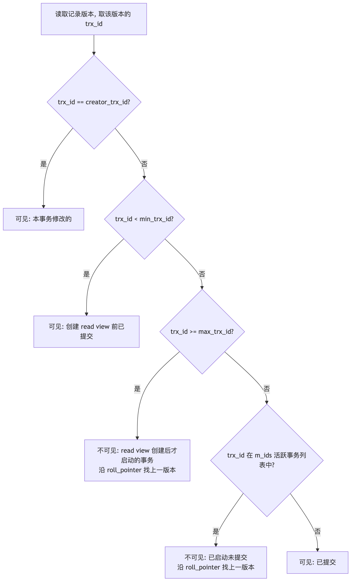
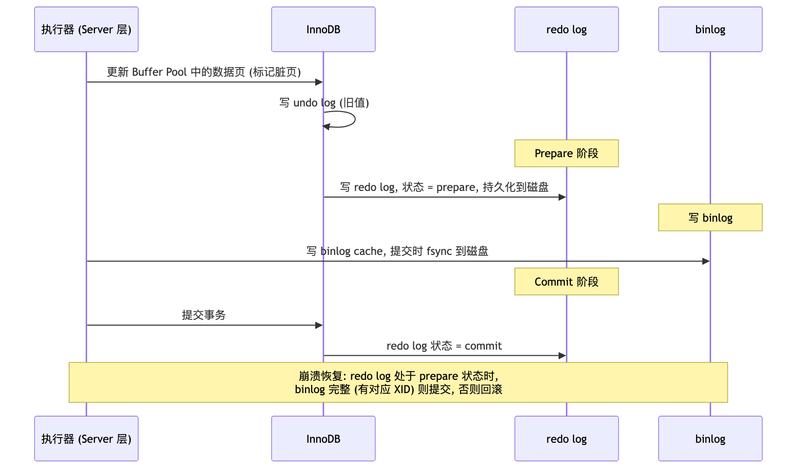
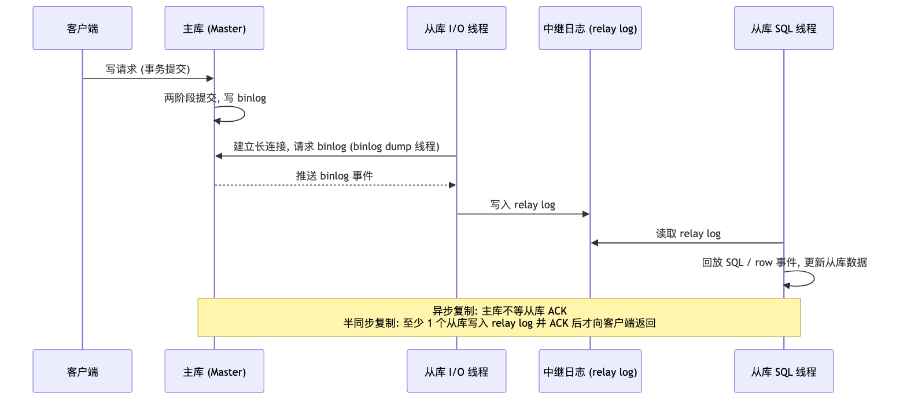

# MySQL 高级后端工程师面试 QA

> 面向高级后端工程师的 MySQL 深度面试题集, 覆盖架构、InnoDB 存储引擎、索引、事务、锁、日志、主从复制、分库分表与性能优化。

## 目录

- [一、架构与 SQL 执行流程](#一架构与-sql-执行流程)
  - [Q1: 执行一条 select 语句, MySQL 内部发生了什么?](#q1-执行一条-select-语句-mysql-内部发生了什么)
  - [Q2: 执行一条 update 语句, MySQL 内部发生了什么?](#q2-执行一条-update-语句-mysql-内部发生了什么)
  - [Q3: MySQL 的长连接和短连接如何取舍? 长连接内存暴涨怎么办?](#q3-mysql-的长连接和短连接如何取舍-长连接内存暴涨怎么办)
  - [Q4: 为什么 MySQL 8.0 移除了查询缓存?](#q4-为什么-mysql-80-移除了查询缓存)
  - [Q5: InnoDB 和 MyISAM 的核心区别?](#q5-innodb-和-myisam-的核心区别)
- [二、InnoDB 存储结构](#二innodb-存储结构)
  - [Q6: 表空间、段、区、页、行分别是什么? 为什么要按区分配空间?](#q6-表空间段区页行分别是什么-为什么要按区分配空间)
  - [Q7: 详述 compact 行格式, null 值和变长字段是如何存储的?](#q7-详述-compact-行格式-null-值和变长字段是如何存储的)
  - [Q8: varchar(n) 中 n 的最大值是多少? 行溢出如何处理?](#q8-varcharn-中-n-的最大值是多少-行溢出如何处理)
  - [Q9: 数据页的内部结构是怎样的? 页目录如何加速页内查找?](#q9-数据页的内部结构是怎样的-页目录如何加速页内查找)
  - [Q10: 为什么 InnoDB 选择 B+ 树? 对比 B 树、哈希、跳表、红黑树](#q10-为什么-innodb-选择-b-树-对比-b-树哈希跳表红黑树)
  - [Q11: 一棵 3 层 B+ 树能存多少行数据?](#q11-一棵-3-层-b-树能存多少行数据)
- [三、索引](#三索引)
  - [Q12: MySQL 索引有哪些分类?](#q12-mysql-索引有哪些分类)
  - [Q13: 聚簇索引和二级索引的区别? 什么是回表和覆盖索引?](#q13-聚簇索引和二级索引的区别-什么是回表和覆盖索引)
  - [Q14: 详述联合索引的最左匹配原则, 范围查询为什么会停止匹配?](#q14-详述联合索引的最左匹配原则-范围查询为什么会停止匹配)
  - [Q15: 什么是索引下推 (ICP)?](#q15-什么是索引下推-icp)
  - [Q16: 哪些情况会导致索引失效?](#q16-哪些情况会导致索引失效)
  - [Q17: 如何解读 explain 执行计划?](#q17-如何解读-explain-执行计划)
  - [Q18: count(\*)、count(1)、count(主键)、count(字段) 的区别与优化](#q18-countcount1count主键count字段-的区别与优化)
  - [Q19: limit 深分页为什么慢? 如何优化?](#q19-limit-深分页为什么慢-如何优化)
  - [Q20: 什么是前缀索引和索引区分度?](#q20-什么是前缀索引和索引区分度)
  - [Q21: 为什么推荐自增主键而不是 UUID?](#q21-为什么推荐自增主键而不是-uuid)
  - [Q22: 什么时候需要索引, 什么时候不需要? 索引的代价是什么?](#q22-什么时候需要索引-什么时候不需要-索引的代价是什么)
  - [Q23: 什么是 Change Buffer? 它和唯一索引的关系?](#q23-什么是-change-buffer-它和唯一索引的关系)
- [四、事务与 MVCC](#四事务与-mvcc)
  - [Q24: ACID 分别是什么? InnoDB 如何实现?](#q24-acid-分别是什么-innodb-如何实现)
  - [Q25: 并发事务会引发哪些问题?](#q25-并发事务会引发哪些问题)
  - [Q26: 四种隔离级别及其实现原理?](#q26-四种隔离级别及其实现原理)
  - [Q27: 详述 MVCC 与 Read View 的可见性判断规则](#q27-详述-mvcc-与-read-view-的可见性判断规则)
  - [Q28: 可重复读级别下, 幻读被完全解决了吗?](#q28-可重复读级别下-幻读被完全解决了吗)
  - [Q29: begin 和 start transaction with consistent snapshot 的区别?](#q29-begin-和-start-transaction-with-consistent-snapshot-的区别)
  - [Q30: 长事务有哪些危害? 如何排查和治理?](#q30-长事务有哪些危害-如何排查和治理)
- [五、锁](#五锁)
  - [Q31: MySQL 的锁如何分类?](#q31-mysql-的锁如何分类)
  - [Q32: 全局锁的使用场景? 备份为什么可以不加全局锁?](#q32-全局锁的使用场景-备份为什么可以不加全局锁)
  - [Q33: 什么是 MDL 元数据锁? 为什么改表结构会阻塞全部查询?](#q33-什么是-mdl-元数据锁-为什么改表结构会阻塞全部查询)
  - [Q34: 为什么需要意向锁?](#q34-为什么需要意向锁)
  - [Q35: AUTO-INC 锁的原理与 innodb_autoinc_lock_mode](#q35-auto-inc-锁的原理与-innodb_autoinc_lock_mode)
  - [Q36: 记录锁、间隙锁、临键锁、插入意向锁分别是什么?](#q36-记录锁间隙锁临键锁插入意向锁分别是什么)
  - [Q37: 详述行级锁的加锁规则 (唯一索引/非唯一索引, 等值/范围)](#q37-详述行级锁的加锁规则-唯一索引非唯一索引-等值范围)
  - [Q38: update 语句没有命中索引, 会锁全表吗?](#q38-update-语句没有命中索引-会锁全表吗)
  - [Q39: 举一个 MySQL 死锁的真实案例, 如何避免死锁?](#q39-举一个-mysql-死锁的真实案例-如何避免死锁)
  - [Q40: 乐观锁和悲观锁在 MySQL 中如何落地?](#q40-乐观锁和悲观锁在-mysql-中如何落地)
- [六、日志与 Buffer Pool](#六日志与-buffer-pool)
  - [Q41: undo log、redo log、binlog 三种日志的对比](#q41-undo-logredo-logbinlog-三种日志的对比)
  - [Q42: 为什么需要 Buffer Pool? 其内部结构与 LRU 改进?](#q42-为什么需要-buffer-pool-其内部结构与-lru-改进)
  - [Q43: 为什么需要 redo log? WAL 的本质是什么?](#q43-为什么需要-redo-log-wal-的本质是什么)
  - [Q44: redo log 的刷盘时机与 innodb_flush_log_at_trx_commit](#q44-redo-log-的刷盘时机与-innodb_flush_log_at_trx_commit)
  - [Q45: binlog 的三种格式? statement 格式有什么坑?](#q45-binlog-的三种格式-statement-格式有什么坑)
  - [Q46: 为什么需要两阶段提交? 崩溃恢复时如何决策?](#q46-为什么需要两阶段提交-崩溃恢复时如何决策)
  - [Q47: 什么是组提交 (Group Commit)?](#q47-什么是组提交-group-commit)
  - [Q48: 什么是双写缓冲 (Doublewrite Buffer)? redo log 为什么救不了半个页?](#q48-什么是双写缓冲-doublewrite-buffer-redo-log-为什么救不了半个页)
  - [Q49: 误删数据后如何恢复? redo log 为什么不能用于恢复被删的库?](#q49-误删数据后如何恢复-redo-log-为什么不能用于恢复被删的库)
- [七、主从复制与高可用](#七主从复制与高可用)
  - [Q50: 详述 MySQL 主从复制的原理](#q50-详述-mysql-主从复制的原理)
  - [Q51: 异步复制、半同步复制、组复制的区别?](#q51-异步复制半同步复制组复制的区别)
  - [Q52: 主从延迟的原因有哪些? 如何解决?](#q52-主从延迟的原因有哪些-如何解决)
  - [Q53: 读写分离下如何保证读到最新数据?](#q53-读写分离下如何保证读到最新数据)
  - [Q54: 什么是 GTID? 相比 binlog 位点复制的优势?](#q54-什么是-gtid-相比-binlog-位点复制的优势)
- [八、分库分表](#八分库分表)
  - [Q55: 什么时候需要分库分表? 垂直拆分与水平拆分的区别?](#q55-什么时候需要分库分表-垂直拆分与水平拆分的区别)
  - [Q56: 分片键如何选择? 常见的分片算法有哪些?](#q56-分片键如何选择-常见的分片算法有哪些)
  - [Q57: 分库分表后的分布式 ID 如何生成?](#q57-分库分表后的分布式-id-如何生成)
  - [Q58: 分库分表带来了哪些问题? 如何解决跨分片查询和分布式事务?](#q58-分库分表带来了哪些问题-如何解决跨分片查询和分布式事务)
  - [Q59: 如何平滑地做分库分表数据迁移与扩容?](#q59-如何平滑地做分库分表数据迁移与扩容)
  - [Q60: 亿级大表如何做 Online DDL?](#q60-亿级大表如何做-online-ddl)
- [九、性能优化与实战](#九性能优化与实战)
  - [Q61: 一条 SQL 突然变慢, 你的完整排查思路?](#q61-一条-sql-突然变慢-你的完整排查思路)
  - [Q62: 如何防止 SQL 注入?](#q62-如何防止-sql-注入)
  - [Q63: 单表数据量多大需要优化? 2000 万行是硬性上限吗?](#q63-单表数据量多大需要优化-2000-万行是硬性上限吗)
  - [Q64: MySQL 有哪些性能分析工具?](#q64-mysql-有哪些性能分析工具)

---

## 一、架构与 SQL 执行流程

### Q1: 执行一条 select 语句, MySQL 内部发生了什么?

MySQL 架构分为两层: **Server 层**和**存储引擎层**。

- Server 层负责建立连接、解析和执行 SQL: 包括连接器、(8.0 前的) 查询缓存、解析器、预处理器、优化器、执行器, 以及所有内置函数和跨引擎功能 (存储过程、触发器、视图等)
- 存储引擎层负责数据的存储和检索: 支持 InnoDB、MyISAM、Memory 等插件式存储引擎, MySQL 5.5 起默认 InnoDB

一条 select 的完整执行路径:

1. **连接器**: 客户端与 MySQL 完成 TCP 三次握手, 连接器校验用户名密码, 读取该用户权限缓存 (此后修改权限不影响已存在连接)。空闲连接超过 `wait_timeout` (默认 8 小时) 会被自动断开
2. **查询缓存** (MySQL 8.0 已移除): 以 SQL 语句为 key 查询缓存, 命中直接返回
3. **解析器**: 词法分析 (tokenization) 把 SQL 切分为 token, 语法分析 (parsing) 检查是否满足语法规则, 构建 AST 抽象语法树。语法错误在这一步抛出
4. **预处理器 (prepare)**: 检查表和字段是否存在; 将 `select *` 展开为表的所有列
5. **优化器 (optimize)**: 基于成本 (cost-based) 制定执行计划——选择走哪个索引、多表连接顺序、是否使用索引下推/覆盖索引等。`explain` 看到的就是优化器的产物
6. **执行器 (execute)**: 按执行计划循环调用存储引擎提供的接口读取记录, 每读一行判断是否满足 where 条件, 满足则发送到结果集。典型执行方式:
   - 主键索引查询: `type = const`, 存储引擎按 B+ 树定位, 最多返回一行
   - 全表扫描: `type = ALL`, 逐行读取判断
   - 索引下推: 联合索引中未参与索引定位的列, 下推到存储引擎层过滤, 减少回表

**追问: 权限校验发生在哪一步?** 连接时校验库表级权限缓存, 精确的表/列权限校验发生在执行器执行之前 (precheck) 以及执行过程中。

### Q2: 执行一条 update 语句, MySQL 内部发生了什么?

update 会经过与 select 相同的连接器、解析器、优化器、执行器流程, 差异在于执行阶段涉及**三种日志**:

1. 执行器调用 InnoDB 接口, 读取目标行: 若数据页在 Buffer Pool 中直接返回, 否则从磁盘读入 Buffer Pool
2. InnoDB 先写 **undo log** 记录旧值 (更新非主键列时记录反向 update 操作), undo log 页的修改本身也受 redo log 保护
3. 更新 Buffer Pool 中的记录, 将该页标记为**脏页**; 此时并不立刻写磁盘, 而是由后台线程异步刷盘 (WAL)
4. 写 **redo log** (物理日志, 记录"某页某偏移量做了什么修改"), 进入 **prepare** 状态
5. 执行器写 **binlog** (逻辑日志, Server 层)
6. 提交事务, redo log 打上 **commit** 标记——即两阶段提交, 保证 redo log 与 binlog 一致

**追问: 更新一行也会加载整页吗?** 会。InnoDB 以页 (默认 16KB) 为读写单位, 即使只更新 1 行也会将整页读入 Buffer Pool。

### Q3: MySQL 的长连接和短连接如何取舍? 长连接内存暴涨怎么办?

- 建立连接需要 TCP 三次握手 + 权限校验, 成本较高, 因此生产环境几乎都使用**长连接 + 连接池**
- 长连接的问题: MySQL 执行过程中临时使用的内存挂在连接对象上, 只有断连才释放, 长连接长期不断开可能导致内存持续增长, 甚至 OOM 被系统 kill

解决方案:

1. 定期断开长连接: 使用一段时间或执行过大内存查询后主动断连, 由连接池重建
2. MySQL 5.7+ 可执行 `mysql_reset_connection` 重置连接资源, 不需要重连和重新鉴权
3. 合理设置连接池大小与 `max_connections` (超过最大连接数后 MySQL 拒绝新连接)

```sql
show processlist;                        -- 查看连接列表, Sleep 状态为空闲连接
kill connection +<id>;                   -- 手动断开连接
show variables like 'wait_timeout';      -- 空闲连接最大存活时间, 默认 28800s
show variables like 'max_connections';   -- 最大连接数
```

### Q4: 为什么 MySQL 8.0 移除了查询缓存?

- 查询缓存以 SQL 文本为 key, 大小写、空格不同都无法命中, 命中率天然低
- **失效粒度太粗**: 只要表上有任何更新, 该表所有查询缓存全部清空。对写多读少或读写混合的业务, 缓存刚建立就被清掉, 反而增加维护开销
- 查询缓存有全局锁竞争, 高并发下成为瓶颈

因此 MySQL 8.0 直接移除了 Server 层查询缓存。注意这与 InnoDB 的 Buffer Pool 无关——Buffer Pool 缓存的是数据页, 不是查询结果, 依然存在且至关重要。需要结果级缓存时应使用 Redis 等外部缓存。

### Q5: InnoDB 和 MyISAM 的核心区别?

| 维度      | InnoDB                                 | MyISAM                                             |
| --------- | -------------------------------------- | -------------------------------------------------- |
| 事务      | 支持 (ACID)                            | 不支持                                             |
| 锁粒度    | 行级锁 (记录锁/间隙锁/临键锁) + 表级锁 | 仅表级锁                                           |
| 外键      | 支持                                   | 不支持                                             |
| 索引组织  | 聚簇索引, 叶子节点存整行数据           | 非聚簇, 索引叶子节点存数据文件地址, 索引与数据分离 |
| 崩溃恢复  | redo log 保证 crash-safe               | 不支持, 崩溃可能丢数据                             |
| MVCC      | 支持                                   | 不支持                                             |
| count(\*) | 需要扫描 (可走最小二级索引)            | 维护了精确行数, O(1) 返回                          |

选型结论: 需要事务、高并发写、崩溃恢复的场景 (几乎所有 OLTP 业务) 用 InnoDB; MySQL 5.5 之后 InnoDB 是默认引擎, MyISAM 基本仅存在于历史系统。

---

## 二、InnoDB 存储结构

### Q6: 表空间、段、区、页、行分别是什么? 为什么要按区分配空间?

InnoDB 是**行式存储**。开启 `innodb_file_per_table` 后每张表对应一个 `.ibd` 表空间文件 (可通过 `show variables like 'datadir'` 查看数据目录)。

层级关系: 表空间 (tablespace) > 段 (segment) > 区 (extent) > 页 (page) > 行 (row)。

- **段 (segment)**: 按用途划分的区的集合
  - 索引段: 存储 B+ 树非叶节点的区的集合
  - 数据段: 存储 B+ 树叶子节点的区的集合
  - 回滚段: 存储 undo log 的区的集合 (支撑事务回滚与 MVCC)
- **区 (extent)**: InnoDB **分配存储空间的基本单位**, 默认 1MB, 对于 16KB 的页, 1 个区包含 64 个连续页
- **页 (page)**: InnoDB **读写磁盘的基本单位**, 默认 16KB。页分为数据页、undo 日志页、溢出页等
- **行 (row)**: 记录按行格式存储在数据页中

**为什么按区而不是按页分配?** B+ 树同层节点之间通过双向链表相连。如果按页为单位分配, 逻辑相邻的两个页物理上可能相距很远, 范围扫描叶子节点时产生大量**随机 I/O**; 按区 (1MB 连续空间) 分配, 逻辑相邻的页物理上也相邻, 范围查询是**顺序 I/O**, 性能显著提升。

**为什么按页而不是按行读写?** 若按行读写, 一次 I/O 只能处理一行; 按 16KB 的页读写, 一次 I/O 至少处理 16KB 数据, 且利用了局部性原理 (访问某行后, 邻近行大概率也会被访问)。

### Q7: 详述 compact 行格式, null 值和变长字段是如何存储的?

InnoDB 行格式分为不紧凑的 redundant (古老) 和紧凑的 compact、dynamic (5.7+ 默认)、compressed。dynamic/compressed 基于 compact 改进。

compact 格式下, 一条记录 = **记录的额外信息** + **记录的真实数据**。

记录的额外信息 (三部分, 均逆序存放):

1. **变长字段长度列表**: 只有表中存在 varchar 等变长字段时才有; 按列顺序**逆序**存储各变长字段的真实长度。逆序的原因: 记录头指针指向额外信息与真实数据的交界处, 逆序使得位置靠前的字段和它的长度信息在内存上更接近, 更可能落在同一个 CPU cache line, 提升缓存命中率
2. **null 值列表**: 只有存在 nullable 字段时才有 (全部字段 not null 则省掉这块空间); 每个 nullable 列对应 1 个 bit, 1 表示该列为 null。**null 值不占用真实数据区的任何空间**, 只在位图中标记。同样逆序存储
3. **记录头信息** (5 字节), 关键字段:
   - `delete_mask`: 标记是否删除。delete 语句不会立刻物理删除, 只是置 1, 后续由 purge 线程回收
   - `next_record`: 指向下一条记录的"额外信息与真实数据之间"的位置 (页内记录按主键组成单向链表)
   - `record_type`: 0 普通记录, 1 B+ 树非叶节点, 2 最小记录, 3 最大记录

记录的真实数据, 除用户列外还有隐藏列:

- `row_id` (6 字节, 非必需): 没有主键且没有非空唯一键时, InnoDB 自动生成
- `trx_id` (6 字节, 必需): 最近一次创建/修改该记录的事务 ID, MVCC 的关键
- `roll_pointer` (7 字节, 必需): 指向该记录上一个版本 (undo log 中) 的指针, 构成版本链

### Q8: varchar(n) 中 n 的最大值是多少? 行溢出如何处理?

MySQL 规定**一行记录除 TEXT/BLOB 外的所有列总字节数不能超过 65535**。因此单个 varchar 列的上限:

```txt
真实数据最大字节数 = 65535 - 变长字段长度列表占用字节数 - null 值列表占用字节数
```

以单列 `varchar(n) allow null` 的 ascii 字符集表为例: 65535 - 2 (长度列表, 数据超 255 字节需 2 字节) - 1 (null 位图) = 65532。若字符集是 utf8mb4 (每字符最多 4 字节), n 最大约 65532 / 4。

**行溢出**: 一个 16KB 页放不下一条记录时 (例如大 varchar/TEXT/BLOB), 发生行溢出:

- compact: 真实数据区保留该列**前 768 字节** + 20 字节指向**溢出页**的指针, 其余数据放溢出页
- dynamic / compressed (默认): 真实数据区**只存 20 字节溢出页指针**, 完整数据全部放溢出页——这样一个数据页能容纳更多行, B+ 树扇出更大

### Q9: 数据页的内部结构是怎样的? 页目录如何加速页内查找?

16KB 数据页由 7 部分组成: 文件头 (File Header, 含前后页指针, 构成双向链表)、页头 (Page Header)、最大最小记录 (Infimum + Supremum, 虚拟伪记录)、用户记录 (User Records)、空闲空间 (Free Space)、页目录 (Page Directory)、文件尾 (File Trailer, 校验页完整性)。

- 页内用户记录按**主键升序**组成**单向链表**——但链表查找是 O(n), 因此引入**页目录**
- 页目录由多个**槽 (slot)** 组成, 相当于记录的稀疏索引:
  - 记录被划分为若干组, 每个槽指向该组**最后一条 (最大) 记录**; 该记录的头信息中记录组内记录数
  - 分组规则: 最小记录独占一组; 最大记录所在组 1~~8 条; 其余组 4~~8 条
  - 划分时包含 Infimum/Supremum, 不包含 delete_mask = 1 的已删除记录
- 页内查找: 先对槽做**二分查找**定位到组, 再在组内沿单向链表遍历 (最多 8 条), 整体接近 O(log n)

页间查找则依赖 B+ 树: 非叶节点存 (主键, 页号) 索引项, 逐层定位到目标数据页; 同层页之间双向链表支持范围扫描。

### Q10: 为什么 InnoDB 选择 B+ 树? 对比 B 树、哈希、跳表、红黑树

数据库索引的核心约束: 数据在磁盘上, **磁盘 I/O 次数决定查询性能**, 因此要让树尽可能"矮胖"。

**B+ 树 vs B 树**:

- B+ 树只有叶子节点存数据, 非叶节点只存索引 (主键 + 页号); B 树所有节点都存数据。相同数据量下, B+ 树非叶节点能容纳的索引项远多于 B 树, 树更矮, 磁盘 I/O 次数更少
- B+ 树叶子节点用双向链表串联, 范围查询只需定位起点后顺序扫描; B 树范围查询需要中序遍历回溯, 效率低
- B+ 树非叶节点是冗余索引, 插入删除时树结构调整更简单; B 树删除非叶节点数据会引发复杂变形

**B+ 树 vs 哈希**: 哈希 O(1) 等值查询快, 但完全不支持范围查询和排序; InnoDB 不支持显式哈希索引 (但有自适应哈希索引 AHI 作为内部优化)。

**B+ 树 vs 红黑树**: 红黑树是二叉树, 千万级数据高度约 20+ 层, 意味着 20+ 次磁盘 I/O, 不可接受。

**B+ 树 vs 跳表**: 跳表 (Redis zset 使用) 是链表 + 多级索引, 层高不可控且节点分散, 不利于按页组织磁盘数据; B+ 树节点天然对应磁盘页, 扇出大、高度稳定。跳表适合内存场景。

### Q11: 一棵 3 层 B+ 树能存多少行数据?

经典估算 (面试高频):

- 非叶节点存储索引项 = 主键 (bigint 8 字节) + 页号 (6 字节) ≈ 14 字节, 一个 16KB 页约可存 16 \* 1024 / 14 ≈ **1170 个索引项**
- 假设一行记录 1KB, 一个叶子节点 (16KB) 约存 **16 行**
- 2 层: 1170 \* 16 ≈ 1.87 万行
- 3 层: 1170 \* 1170 \* 16 ≈ **2000 万行**

结论: 千万级的表只需 3 层 B+ 树, 查询一行最多 3 次磁盘 I/O (根节点常驻内存则更少)。这也是"单表 2000 万行"经验值的由来——超过后树可能变为 4 层, 每次查询多一次 I/O。注意这只是估算, 实际取决于行大小和主键大小 (主键越小, 扇出越大, 这也是主键不宜过长的原因)。

---

## 三、索引

### Q12: MySQL 索引有哪些分类?

- **按数据结构**: B+ 树索引、哈希索引、全文索引。InnoDB 支持 B+ 树与全文索引, 不支持显式哈希索引
- **按存储形式**: 聚簇索引 (叶子节点存整行数据)、二级索引 (叶子节点存主键值)
- **按字段特性**: 主键索引 (not null, 一张表最多一个)、唯一索引 (值唯一可为 null, 可多个)、普通索引、前缀索引 (对字符列前 n 个字符建索引)
- **按字段数量**: 单列索引、联合索引

聚簇索引键的选择规则 (建表时自动确定):

1. 有主键, 用主键
2. 无主键, 选第一个 not null 的唯一列
3. 都没有, InnoDB 生成隐藏自增 row_id

```sql
create table t (
  id bigint unsigned auto_increment,
  name varchar(64) not null,
  primary key (id) using btree,          -- 主键索引
  unique key uk_name (name),             -- 唯一索引
  index idx_name_prefix (name(10))       -- 前缀索引
);
create index idx_a_b on t (a, b);        -- 联合索引
```

### Q13: 聚簇索引和二级索引的区别? 什么是回表和覆盖索引?

- **聚簇索引**: B+ 树叶子节点存储完整行数据, "索引即数据"。一张表只能有一个
- **二级索引**: B+ 树叶子节点存储 (索引列值, 主键值)。可以有多个

**回表**: 通过二级索引查询时, 先在二级索引 B+ 树找到主键值, 再拿主键值到聚簇索引 B+ 树查完整行——两棵树各查一次。

**覆盖索引**: 查询所需的全部列都能在二级索引叶子节点中获得 (索引列 + 主键), 无需回表, explain 的 Extra 显示 `Using index`。

```sql
create index idx_name_age on users (name, age);

select id, name, age from users where name = 'Alice'; -- 覆盖索引, 1 棵树搞定
select * from users where name = 'Alice';             -- 需要回表查其余列
```

实战优化: 高频查询可将 select 的列纳入联合索引形成覆盖索引, 减少回表 I/O。

### Q14: 详述联合索引的最左匹配原则, 范围查询为什么会停止匹配?

联合索引 (a, b, c) 的 B+ 树排序规则: 先按 a 排序, a 相同按 b 排序, b 相同按 c 排序。因此 **a 全局有序; b 仅在 a 相同的分组内局部有序; c 仅在 (a, b) 相同的分组内局部有序**。索引能被使用的前提是索引键有序, 所以查询必须从最左列开始、且不能跳列:

- 生效: `where a = 1`、`where a = 1 and b = 2`、`where a = 1 and b = 2 and c = 3` (where 中列的书写顺序无关, 优化器会调整)
- 全部失效: `where b = 2`、`where c = 3`、`where b = 2 and c = 3` (缺最左列 a, b/c 全局无序)
- 部分失效: `where a = 1 and c = 3` —— a 用于索引定位, c 不能 (跳过了 b), 但 MySQL 5.6+ 可通过索引下推用 c 过滤

**范围查询停止匹配**:

- 遇到 `>`、`<` 严格范围查询时停止匹配: `where a > 1 and b = 2` 中只有 a 走索引定位, 因为满足 a > 1 的记录内部 b 是无序的
- `>=`、`<=`、`between`、`like 'xx%'` 前缀匹配**不会**停止匹配: 以 `where a >= 1 and b = 2` 为例, 存在 a = 1 的等值边界, 在 a = 1 的分组内 b 是有序的, 可以继续用 b 缩小扫描起点

**追问: order by 也遵循最左匹配吗?** 是。`where a = 1 order by b, c` 可利用索引免排序; `order by b` 单独出现则需要 filesort。

### Q15: 什么是索引下推 (ICP)?

索引下推 (Index Condition Pushdown, MySQL 5.6 引入): 将本应在 Server 层做的 where 过滤, 下推到存储引擎层, 在**遍历二级索引时直接用索引中包含的列过滤**, 减少回表次数。explain 的 Extra 显示 `Using index condition`。

例: 联合索引 (a, b), 执行 `select * from t where a > 1 and b = 2`:

- 5.6 之前: 存储引擎按 a > 1 找到每个主键值就回表, 回表后由 Server 层判断 b = 2, 大量无效回表
- 5.6 之后: 存储引擎遍历二级索引时, 索引里就有 b 的值, 先判断 b = 2, 不满足直接跳过, 只对满足的记录回表

### Q16: 哪些情况会导致索引失效?

1. **违反最左匹配**: 联合索引缺最左列或跳列 (见 Q14)
2. **左模糊/左右模糊匹配**: `like '%xxx'`、`like '%xxx%'` 失效, 因为索引按前缀有序; `like 'xxx%'` 有效
3. **对索引列使用函数**: `where length(name) = 5` 失效。解决: MySQL 5.7+ 可建函数索引 (基于虚拟列): `alter table t add key idx_len ((length(name)))`
4. **对索引列做表达式计算**: `where id + 1 = 7` 失效, `where id = 7 - 1` 有效——优化器不会主动做代数变换
5. **隐式类型转换**: MySQL 比较字符串和数字时**把字符串转为数字**。
   - `where phone = 13800000000` (phone 是 varchar): 等价于对索引列套 cast 函数, **失效**
   - `where id = '1'` (id 是 int): 转换发生在输入参数上, **有效**
6. **where 中的 or**: or 前是索引列、or 后是非索引列时整体失效 (必须全表扫描兜底)。解决: 给 or 后的列也建索引, 优化器可用 index merge
7. 优化器基于成本判断走索引不如全表扫描 (如返回行数占比过大、统计信息过期), 也会放弃索引——可用 `analyze table` 更新统计信息, 或 `force index` 干预

```sql
select * from users where name like 'htc%';        -- 有效
select * from users where name like '%tc%';        -- 失效
select * from users where id + 1 = 7;              -- 失效
select * from users where phone = 15395377789;     -- 失效 (varchar 列隐式转换)
select * from users where id = 1 or age = 7;       -- age 无索引则失效
```

### Q17: 如何解读 explain 执行计划?

核心字段:

- **id**: 查询序号, 相同则自上而下执行, 不同则越大越先执行
- **select_type**: simple 简单查询 / primary 主查询 / subquery 子查询 / union
- **type** (访问类型, 性能从高到低): `null > system > const > eq_ref > ref > range > index > ALL`
  - `const`: 主键或唯一索引等值查询, 至多一行
  - `eq_ref`: 联表时被驱动表走主键/唯一索引
  - `ref`: 非唯一索引等值查询
  - `range`: 索引范围扫描
  - `index`: 扫整棵二级索引树 (常见于覆盖索引但无法定位)
  - `ALL`: 全表扫描, 优化红线, 生产 SQL 至少应达到 range
- **possible_keys / key**: 候选索引 / 实际使用的索引 (null 表示未用索引)
- **key_len**: 实际使用的索引字节数, 用于判断联合索引用了几列
- **rows**: 预估扫描行数; **filtered**: 过滤后剩余行数百分比, 越大越好
- **Extra**:
  - `Using index`: 覆盖索引, 无需回表, 好
  - `Using index condition`: 索引下推
  - `Using where`: Server 层过滤
  - `Using filesort`: 无法利用索引排序, 需额外排序, 差
  - `Using temporary`: 使用临时表 (常见于 group by/distinct 无索引), 差

### Q18: count(\*)、count(1)、count(主键)、count(字段) 的区别与优化

语义: `count(expr)` 统计 expr **不为 null** 的行数。`count(*)` 被优化器直接优化为 `count(0)`, 与 count(1) 等价。

性能排序: `count(*) = count(1) > count(主键) > count(非索引字段)`

- count(\*) / count(1): 存储引擎只需返回"有这一行", Server 层不需要读取具体列值; InnoDB 会自动选择 **key_len 最小的二级索引**来扫描 (二级索引比聚簇索引小得多)
- count(主键): 需要读出主键值返回给 Server 层判断非空, 略慢
- count(非主键字段): 若该字段无索引则全表扫描, 且每行都要取值判空, 最慢

为什么 InnoDB 不像 MyISAM 一样直接存行数? 因为 MVCC 下"表里有多少行"对不同事务是不同的答案, 无法维护一个全局精确值。

优化方案:

1. 近似值: `explain select count(*) from t` 的 rows 估算, 或 `show table status`
2. 精确值: 用额外的计数表 (与业务操作放在同一事务中维护), 或 Redis 计数 (需容忍不一致)

### Q19: limit 深分页为什么慢? 如何优化?

`select * from t order by id limit 1000000, 10` 慢的原因: MySQL 必须**扫描并丢弃前 100 万行** (若走二级索引还要回表 100 万次), 只返回最后 10 行。

优化方案:

1. **游标/续传式分页** (最优, 要求 id 连续可比较): 记录上一页最大 id, `where id > #{lastId} order by id limit 10`, 直接索引定位, O(log n)
2. **子查询延迟关联**: 先用覆盖索引拿到主键, 再回表 10 行

```sql
select t.* from t
inner join (select id from t order by id limit 1000000, 10) tmp
on t.id = tmp.id;
```

3. 业务上限制最大页码 (如只允许翻 100 页), 深度检索改用搜索引擎 (ES)

### Q20: 什么是前缀索引和索引区分度?

**区分度 (selectivity)** = `distinct(column) / count(*)`, 越接近 1 越好。gender 这类区分度极低的列不适合建索引 (扫描一半索引还要大量回表, 优化器可能直接放弃); 建联合索引时**区分度高的列放前面**, 能被更多查询命中且过滤更快。

**前缀索引**: 对字符列前 n 个字符建索引, 减小索引体积、增大单页索引数量:

```sql
-- 选择 n: 计算不同前缀长度的区分度, 越接近完整列区分度越好
select count(distinct substring(name, 1, 5)) / count(*) from users;
create index idx_name_5 on users (name(5));
```

前缀索引的局限: **无法用于 order by 排序消除, 也无法作为覆盖索引** (索引里只有前缀, 必须回表拿完整值)。

### Q21: 为什么推荐自增主键而不是 UUID?

1. **插入性能**: 自增主键插入是**追加写**, 页写满就开新页; UUID 无序, 插入位置随机, 频繁触发**页分裂** (把一页数据挪一半到新页), 产生内存碎片、页空洞, 索引不紧凑, 插入性能和空间利用率都差
2. **主键长度**: 二级索引叶子节点存的是主键值, 主键越短 (bigint 8 字节 vs UUID 字符串 36 字节), 所有二级索引越小, 扇出越大
3. 自增主键的缺点: 分库分表下全局不唯一 (需雪花算法等分布式 ID, 见 Q57); 高并发插入时自增锁与聚簇索引右侧热点; 会泄露业务量

### Q22: 什么时候需要索引, 什么时候不需要? 索引的代价是什么?

需要建索引:

- 有唯一性约束的字段
- 高频出现在 where 条件的字段
- 高频用于 group by / order by 的字段 (利用索引有序性免排序)
- 联表查询的关联字段

不需要建索引:

- 表数据量很小 (全表扫描更快)
- 区分度极低的字段 (gender)
- 频繁更新的字段 (每次更新都要维护 B+ 树有序性, 可能页分裂)
- 从不出现在 where / group by / order by 的字段

索引的代价:

- 占用磁盘空间 (每个二级索引一棵 B+ 树)
- 降低写入性能: 每次增删改都要同步维护所有索引树
- 优化器选择索引也有成本, 冗余索引还可能误导优化器

### Q23: 什么是 Change Buffer? 它和唯一索引的关系?

Change Buffer 是 Buffer Pool 中的一块区域: 当更新的**二级索引页不在内存中**时, InnoDB 不立刻从磁盘读入该页, 而是把变更缓存在 Change Buffer 中; 之后该页被读取时再合并 (merge) 变更, 后台线程也会定期 merge。它把"随机读磁盘 + 修改"变成了"先记账后合并", 显著减少随机 I/O。

关键限制: **唯一索引无法使用 Change Buffer**——插入前必须把页读到内存判断是否违反唯一性, 既然页已经在内存, 直接改即可。因此:

- 写多读少 (如日志、账单类) 且用普通索引的表, Change Buffer 收益最大
- 业务能保证唯一性时, 从性能角度**普通索引优于唯一索引**
- 读多写少的表收益小 (刚记账就要 merge, 反增维护成本)

---

## 四、事务与 MVCC

### Q24: ACID 分别是什么? InnoDB 如何实现?

- **原子性 (Atomicity)**: 事务中的操作要么全部完成, 要么全部不完成; 出错则回滚到事务开始前的状态。实现: **undo log**——每次修改前记录旧值/反向操作, 回滚时逆向执行
- **持久性 (Durability)**: 事务一旦提交, 修改是永久的, 即使宕机也不丢。实现: **redo log** (WAL)——提交时保证 redo log 落盘, 崩溃后重放
- **隔离性 (Isolation)**: 并发事务互不干扰。实现: **MVCC** (快照读) + **锁机制** (当前读)
- **一致性 (Consistency)**: 事务前后数据处于合法状态。它是**目的而非手段**, 由原子性 + 隔离性 + 持久性共同保证, 外加应用层约束

### Q25: 并发事务会引发哪些问题?

严重程度: 脏读 > 不可重复读 > 幻读。

- **脏读 (dirty read)**: 事务 A 读到了事务 B **未提交**的修改; 若 B 随后回滚, A 读到的就是从未存在过的数据
- **不可重复读 (non-repeatable read)**: 事务 A 内两次读**同一条记录**, 结果不同 (期间 B 提交了 update)
- **幻读 (phantom read)**: 事务 A 内两次执行**同一条件查询**, 返回的**记录数量**不同 (期间 B 提交了 insert/delete)

区别记忆: 不可重复读针对同一行的值变化, 幻读针对结果集的行数变化。

### Q26: 四种隔离级别及其实现原理?

| 隔离级别                         | 脏读   | 不可重复读 | 幻读       | 实现原理                                         |
| -------------------------------- | ------ | ---------- | ---------- | ------------------------------------------------ |
| 读未提交 (read uncommitted)      | 可能   | 可能       | 可能       | 直接读最新数据, 无视版本                         |
| 读已提交 (read committed)        | 不可能 | 可能       | 可能       | **每条 select 语句执行前**生成新 Read View       |
| 可重复读 (repeatable read, 默认) | 不可能 | 不可能     | 基本不可能 | **事务第一条 select 时**生成 Read View, 全程复用 |
| 串行化 (serializable)            | 不可能 | 不可能     | 不可能     | 读写都加锁, 串行执行                             |

- 隔离级别越高性能越差; InnoDB 默认**可重复读 (RR)**
- RC 与 RR 的唯一本质区别就是 **Read View 的生成时机**: RC 每次读都生成 (所以能看到其他事务已提交的最新值), RR 只在事务开始后首次读生成 (全程看到同一份快照)

```sql
select @@transaction_isolation;  -- 查询隔离级别
set session transaction isolation level repeatable read;
```

追问: 为什么互联网公司有些会把隔离级别改成 RC? RC 下不加间隙锁 (只有记录锁), 锁冲突和死锁概率更低, 并发写入吞吐更高; 代价是必须用 row 格式 binlog 保证主从一致。

### Q27: 详述 MVCC 与 Read View 的可见性判断规则

MVCC (Multi-Version Concurrency Control): 通过 **undo log 版本链 + Read View** 让读写不互相阻塞——快照读不加锁, 读的是历史版本。

两块基础数据:

1. 每条记录的隐藏列: `trx_id` (最后修改该记录的事务 ID) 和 `roll_pointer` (指向 undo log 中上一版本, 串成版本链)
2. Read View 的四个字段:
   - `m_ids`: 创建 Read View 时**活跃 (已启动未提交)** 事务的 ID 列表
   - `min_trx_id`: 活跃事务中最小的 ID
   - `max_trx_id`: 下一个将分配的事务 ID (全局最大事务 ID + 1)
   - `creator_trx_id`: 创建该 Read View 的事务自身 ID

可见性判断 (对版本链上每个版本依次判断, 直到找到可见版本):



```js
if (trx_id === creator_trx_id) return VISIBLE; // 自己改的
if (trx_id < min_trx_id) return VISIBLE; // 创建 Read View 前已提交
if (trx_id >= max_trx_id) return INVISIBLE; // Read View 创建后才启动的事务
// min_trx_id <= trx_id < max_trx_id:
return m_ids.includes(trx_id)
  ? INVISIBLE // 活跃(未提交), 不可见
  : VISIBLE; // 已提交, 可见
```

不可见时沿 `roll_pointer` 找上一个版本重复判断, 直到可见或版本链尽头。

### Q28: 可重复读级别下, 幻读被完全解决了吗?

InnoDB 在 RR 下**很大程度上**避免了幻读, 但没有完全避免。

两种读的防幻读手段:

- **快照读** (普通 select): 靠 MVCC。整个事务用同一个 Read View, 其他事务插入的新记录 trx_id 必然不可见, 结果集行数稳定
- **当前读** (`select ... for update` / `select ... lock in share mode` / insert / update / delete): 靠**临键锁 (next-key lock = 记录锁 + 间隙锁)**, 锁住扫描范围及其间隙, 阻塞其他事务的插入

两个仍会出现幻读的例外场景:

1. **快照读之后做当前读**: 事务 A 先普通 select (看不到 B 插入的行), B 插入并提交, A 再 `select ... for update`——当前读读最新版本, 突然多出一行, 幻读发生
2. **快照读之后 update 到了"看不见"的行**: A 普通 select 看不到 B 新插入的行, 但 A 执行 update 恰好更新了该行 (update 是当前读), 该行 trx_id 变为 A 自己, 之后 A 的 select 就能看到它了

规避方法: 事务一开始就对目标范围执行 `select ... for update` 加临键锁, 从头阻止其他事务插入。

### Q29: begin 和 start transaction with consistent snapshot 的区别?

- `begin` / `start transaction`: 只是"开启"事务, **并不立刻启动**; 事务真正启动 (分配事务 ID、RR 下创建 Read View) 发生在其后**第一条操作 InnoDB 表的语句**执行时
- `start transaction with consistent snapshot`: 执行后**立刻启动事务并创建 Read View**

面试陷阱: "RR 下事务启动时创建 Read View" 严格说是"执行第一条快照读语句时", 用 begin 开启事务后到第一条 select 之间, 其他事务提交的修改是能被看到的。

### Q30: 长事务有哪些危害? 如何排查和治理?

危害:

1. **undo log 无法清理**: 只要长事务的 Read View 存在, 它可能访问的所有旧版本 undo log 都必须保留, 回滚段持续膨胀, 磁盘暴涨
2. **MDL 锁阻塞 DDL**: 长事务持有 MDL 读锁, DDL 申请 MDL 写锁被阻塞, 且 MDL 队列写优先, 会连带阻塞后续所有查询 (见 Q33)
3. 长时间占用连接与行锁, 放大锁等待和死锁概率
4. 主从复制场景下造成从库大事务回放延迟

排查与治理:

```sql
-- 查询执行超过 60s 的事务
select * from information_schema.innodb_trx
where TIME_TO_SEC(timediff(now(), trx_started)) > 60;
```

- 应用侧: 事务尽量短, 不要在事务中做 RPC/IO; 避免 `set autocommit = 0` 导致的隐式长事务
- DB 侧: 监控 innodb_trx, 超时告警甚至 kill; 设置 `max_execution_time` 限制单语句时长

---

## 五、锁

### Q31: MySQL 的锁如何分类?

按范围从大到小:

- **全局锁**: `flush tables with read lock`, 整库只读, 用于逻辑备份
- **表级锁**:
  - 表锁 (table S / table X)
  - 元数据锁 (MDL)
  - 意向锁 (table IS / table IX)
  - AUTO-INC 锁
- **行级锁** (InnoDB 特有, 加在**索引**上):
  - 记录锁 (record lock, S / X)
  - 间隙锁 (gap lock)
  - 临键锁 (next-key lock = 记录锁 + 间隙锁, 左开右闭区间)
  - 插入意向锁 (特殊的间隙锁)

共享锁 S 与排他锁 X 的兼容矩阵: 读读共享, 读写互斥, 写写互斥。

### Q32: 全局锁的使用场景? 备份为什么可以不加全局锁?

```sql
flush tables with read lock;  -- 全库只读
unlock tables;                -- 释放 (会话断开也自动释放)
```

场景: 全库逻辑备份——保证备份出的所有表处于同一逻辑时间点。全局锁期间增删改、DDL 全部阻塞, 业务基本停摆。

**InnoDB 可以不加全局锁**: 利用 MVCC, 备份时开启一个 RR 事务, 拿到一致性快照, 备份过程不阻塞业务写:

```shell
mysqldump -u root -p --single-transaction db0 > backup.sql
```

前提是所有表都是支持事务的 InnoDB; MyISAM 表没有 MVCC, 仍必须全局锁。

### Q33: 什么是 MDL 元数据锁? 为什么改表结构会阻塞全部查询?

MDL (Metadata Lock) 保护表结构, 无需显式申请, **事务提交时才释放**:

- 对表 CRUD 时自动加 **MDL 读锁** (读锁之间不互斥)
- 修改表结构 (DDL) 时加 **MDL 写锁** (与读锁、写锁都互斥)

经典事故链:

1. 线程 A 开启长事务执行 select, 持有 MDL 读锁不放
2. 线程 C 执行 alter table, 申请 MDL 写锁, 被 A 阻塞
3. **MDL 申请队列是 FIFO 且写锁优先级高于读锁**: C 排队后, 后续所有新的 select/insert (申请读锁) 都排在 C 后面被阻塞——一条 DDL 导致全表所有请求挂起, 连接池打满, 整库雪崩

防范:

- DDL 前检查并 kill 长事务 (查 `information_schema.innodb_trx`)
- alter table 加超时: `alter table t wait 100 add column ...` (MariaDB) 或 MySQL 设置 `lock_wait_timeout`
- 使用 gh-ost / pt-online-schema-change 做在线变更 (见 Q60)

### Q34: 为什么需要意向锁?

意向锁 (Intention Lock) 是**表级锁**, 用于快速声明"本事务将在表内某些行上加行锁":

- 加行级共享锁前, 先给表加**意向共享锁 (IS)**
- 加行级排他锁前, 先给表加**意向排他锁 (IX)**

存在的意义: 当另一个事务要加**表级 S/X 锁**时, 只需检查表上有没有 IX/IS, 即可知道表内是否存在行锁; 如果没有意向锁, 就得**遍历全表每一行**检查是否有行锁, 代价不可接受。

注意: 意向锁之间**互不冲突** (IS/IX 可共存), 它们只和表级 S/X 锁冲突; 普通 select 不加任何行锁 (快照读), 因此也不加意向锁。

```sql
select ... lock in share mode;  -- 表 IS + 行 S
select ... for update;          -- 表 IX + 行 X
```

### Q35: AUTO-INC 锁的原理与 innodb_autoinc_lock_mode

自增主键的值由 AUTO-INC 锁保证: 插入时对表加该锁, **语句执行完立即释放** (不等事务提交)。大批量插入 (insert...select) 时锁持有时间长, 并发插入吞吐差。

MySQL 5.1.22 起提供轻量级互斥量, 由 `innodb_autoinc_lock_mode` 控制:

- `0`: 传统模式, 全部用 AUTO-INC 锁
- `1`: 简单 insert (可预知行数) 用轻量锁申请完 id 立即释放; 批量 insert 仍用 AUTO-INC 锁
- `2` (8.0 默认): 全部用轻量锁, 并发最好; 但批量插入的自增值可能**不连续**, 且 statement 格式 binlog 下主从可能不一致, 必须搭配 **row 格式 binlog**

### Q36: 记录锁、间隙锁、临键锁、插入意向锁分别是什么?

行级锁加在**索引记录**上 (设表中已有 id = 1, 5, 10 三条记录):

- **记录锁 (Record Lock)**: 锁单条索引记录, 如锁住 id = 5。分 S / X
- **间隙锁 (Gap Lock)**: 锁一个开区间, 如 (5, 10), **只阻止别人往间隙里插入**, 不锁记录本身。间隙锁之间即使区间重叠也**互相兼容** (两个事务可同时持有同一间隙的间隙锁——这也是死锁常见来源)。间隙锁只在 RR 级别存在, 目的就是防幻读
- **临键锁 (Next-Key Lock)**: 记录锁 + 其前面间隙的间隙锁, **左开右闭**区间, 如 (5, 10]。InnoDB RR 下加锁的基本单位就是临键锁, 特定条件下退化为记录锁或间隙锁
- **插入意向锁 (Insert Intention Lock)**: 特殊的间隙锁。事务插入时发现目标位置被其他事务的间隙锁/临键锁覆盖, 则生成一个 **waiting 状态**的插入意向锁并阻塞, 直到对方释放。两个事务往同一间隙的**不同位置**插入互不冲突

各语句的加锁行为:

| SQL                                     | 行锁                               |
| --------------------------------------- | ---------------------------------- |
| 普通 select                             | 不加锁 (快照读)                    |
| select ... lock in share mode           | S 型临键锁                         |
| select ... for update / update / delete | X 型临键锁                         |
| insert                                  | 插入的记录加 X 记录锁 (隐式锁机制) |

### Q37: 详述行级锁的加锁规则 (唯一索引/非唯一索引, 等值/范围)

原则: RR 下加锁基本单位是**临键锁 (左开右闭)**, 加在扫描过程中访问到的索引上; 满足特定条件时退化。设表记录 id = 1, 5, 10, 15。

**一、唯一索引等值查询**:

- 记录**存在** (`where id = 5`): 临键锁退化为**记录锁**——唯一索引保证等值只有一条, 锁间隙无意义
- 记录**不存在** (`where id = 7`): 定位到第一条大于 7 的记录 (id = 10), 其临键锁退化为**间隙锁 (5, 10)**——只需防止别人插入 7

**二、唯一索引范围查询**: 对扫描到的索引加临键锁, 边界处优化:

- `id >= 10`: 对 id = 10 的等值部分退化为记录锁, 之后 (10, 15]、(15, +∞] 临键锁
- `id < 10` (10 存在): 扫描终止于 id = 10, 其临键锁退化为**间隙锁 (5, 10)**; 之前 (−∞, 1]、(1, 5] 临键锁
- `id <= 10` (10 存在): id = 10 处**不退化**, 保持临键锁 (5, 10]——因为 10 本身也要被锁

**三、非唯一索引 (二级索引) 等值查询** (`where age = 22`, age 有普通索引):

- 记录存在: 非唯一索引可能有多条相同值, 需一直扫描到**第一个不满足条件的记录**才停
  - 满足条件的二级索引记录: 加**临键锁**
  - 第一个不满足条件的二级索引记录: 退化为**间隙锁**
  - 满足条件记录对应的**聚簇索引**: 加**记录锁** (防止别人通过主键改这行)
- 记录不存在: 只对第一个不满足条件的二级索引加**间隙锁**, 不锁聚簇索引

**四、非唯一索引范围查询**: 扫描到的二级索引**全部加临键锁, 不退化**, 对应聚簇索引加记录锁。

**五、无索引**: 全表扫描, **每条聚簇索引记录都加临键锁**, 等价于锁全表 (见 Q38)。

验证工具:

```sql
select object_name, index_name, lock_type, lock_mode, lock_data
from performance_schema.data_locks;
-- lock_mode: X (临键锁) / X,REC_NOT_GAP (记录锁) / X,GAP (间隙锁) / X,INSERT_INTENTION
```

### Q38: update 语句没有命中索引, 会锁全表吗?

会——效果上等价于锁全表, 但机制上**不是表锁**: where 条件没有索引 (或索引失效) 时, 只能全表扫描, InnoDB 对**扫描到的每条聚簇索引记录都加 X 型临键锁** (记录 + 间隙全锁), 其他事务的任何插入、更新都被阻塞, 事故等级极高。

防范:

- update / delete 的 where 必须走索引, 上线前 explain 确认
- 开启 `sql_safe_updates = 1`: 拒绝执行不带索引条件的 update/delete
- 大范围 update 分批执行, 缩短锁持有时间

### Q39: 举一个 MySQL 死锁的真实案例, 如何避免死锁?

**经典案例 (间隙锁 + 插入意向锁)**: 表 t 有 id = 1, 5, 10, RR 级别, 两个事务并发执行"不存在则插入":

```sql
-- 事务 A                                  -- 事务 B
begin;
select * from t where id = 7 for update;   begin;
-- A 获得间隙锁 (5, 10)                     select * from t where id = 8 for update;
                                            -- B 也获得间隙锁 (5, 10) —— 间隙锁互相兼容!
insert into t values (7);
-- A 的插入意向锁被 B 的间隙锁阻塞
                                            insert into t values (8);
                                            -- B 的插入意向锁被 A 的间隙锁阻塞
-- 互相等待, 死锁!
```

死锁四条件在此齐备: 互斥、持有并等待、不可剥夺、循环等待。InnoDB 的应对:

1. **死锁检测** (`innodb_deadlock_detect = on`, 默认): 检测到等待环后, 回滚代价最小 (undo 量最小) 的事务, 另一方继续。代价: 每个新等待都要扫描等待图, 热点行高并发下检测本身 O(n^2) 消耗 CPU
2. **锁等待超时** (`innodb_lock_wait_timeout`, 默认 50s): 等不到就报错回滚

业务层避免死锁:

- **统一加锁顺序**: 多行/多表操作按固定顺序 (如按主键升序) 访问
- 事务尽量小、尽快提交, 减少持锁时间
- "不存在则插入"改用 `insert ... on duplicate key update` 或唯一索引 + 捕获冲突, 避免先 select for update
- 隔离级别降为 RC (去掉间隙锁), 或为查询条件建合适索引缩小锁范围
- 排查: `show engine innodb status` 查看 LATEST DETECTED DEADLOCK

### Q40: 乐观锁和悲观锁在 MySQL 中如何落地?

- **悲观锁**: 假设冲突必然发生, 先加锁再操作。落地: `select ... for update` (X 锁) / `lock in share mode` (S 锁)。适合写冲突激烈场景; 代价是锁等待、死锁风险
- **乐观锁**: 假设冲突少, 不加锁, 提交时校验。落地: 版本号 / CAS

```sql
-- 版本号方案
update account
set balance = balance - 100, version = version + 1
where id = 1 and version = #{oldVersion};
-- 受影响行数 = 0 说明被并发修改, 业务层重试
```

适合读多写少; 高冲突下重试风暴反而更差。扣库存等场景也可直接用条件更新原子性: `update stock set num = num - 1 where id = 1 and num >= 1`。

---

## 六、日志与 Buffer Pool

### Q41: undo log、redo log、binlog 三种日志的对比

| 维度     | undo log                        | redo log                         | binlog                            |
| -------- | ------------------------------- | -------------------------------- | --------------------------------- |
| 产生层   | InnoDB 存储引擎层               | InnoDB 存储引擎层                | Server 层 (所有引擎通用)          |
| 内容     | 逻辑日志: 旧值/反向操作         | 物理日志: 某页某偏移做了什么修改 | 逻辑日志: statement / row / mixed |
| 作用     | 事务回滚 (原子性) + MVCC 版本链 | 崩溃恢复 crash-safe (持久性)     | 数据备份恢复、主从复制            |
| 写入方式 | 随事务修改产生                  | 循环写, 固定大小, 边写边擦除     | 追加写, 全量保留                  |

undo log 细节:

- insert 回滚记录主键 (回滚即删除); delete 回滚记录整行 (回滚即重插, 且 delete 只是打 delete_mask, purge 线程最终删除); update 非主键列记录旧值, update 主键列拆为 delete + insert
- 每条 undo log 带 trx_id 与 roll_pointer, 串成**版本链**支撑 MVCC
- undo 页本身的修改也写 redo log, 因此 undo log 同样是持久的

### Q42: 为什么需要 Buffer Pool? 其内部结构与 LRU 改进?

磁盘 I/O 慢, InnoDB 启动时申请一块连续内存作为 Buffer Pool (默认 128MB, 生产通常设为物理内存 60%~80%), 按 16KB 划分缓存页:

- **读**: 命中缓存直接返回; 未命中从磁盘读整页进 Buffer Pool
- **写**: 直接改缓存页并标记**脏页**, 同时写 redo log; 由后台线程异步刷脏 (WAL), 把随机写变成顺序写 redo + 延迟批量刷盘

内部结构: 缓存页 + 控制块 (页元数据), 三条链表管理:

- **Free List**: 空闲页
- **Flush List**: 脏页 (按修改时间有序, 供刷盘)
- **LRU List**: 管理冷热淘汰

**朴素 LRU 的两个问题与 InnoDB 的改进**:

1. **预读失效**: 相邻页被预读进来却从未被访问, 污染 LRU 头部。改进: LRU 链表分**young (热数据, 默认 5/8)** 和 **old (冷数据, 3/8)** 两区, 新读入的页先插入 **old 区头部**, 真正被访问后才晋升 young 区
2. **全表扫描导致缓存污染**: 大扫描一次性把热点页全部挤出。改进: **晋升门槛** `innodb_old_blocks_time` (默认 1000ms)——页在 old 区停留超过该时间后再次被访问, 才进入 young 区; 全表扫描的页通常在 1s 内被快速访问一次即弃, 无法晋升

### Q43: 为什么需要 redo log? WAL 的本质是什么?

问题: 脏页在内存中, 若刷盘前宕机, 已提交事务的修改就丢了, 违反持久性。

**WAL (Write-Ahead Logging)**: 修改数据前, 先把"这次修改"以日志形式**顺序写**入磁盘 (redo log), 数据页本身延后刷盘。崩溃后重放 redo log 即可恢复未刷盘的脏页。

redo log 与直接刷数据页相比的优势:

- redo log 是**顺序追加写**, 数据页刷盘是**随机写** (需寻址), 顺序 I/O 快一个量级
- redo log 记录粒度小 (页内 delta), 数据页刷盘至少 16KB
- 事务提交只需保证 redo log 落盘, 把"每事务一次随机写"聚合成"批量顺序写"

**redo log 写满了怎么办?** redo log 是固定大小的环形结构 (write pos 追 checkpoint), 写满时**所有更新阻塞**, 强制把脏页刷盘、推进 checkpoint 腾出空间——这是线上"写入周期性抖动"的常见原因, 需调大 redo log 或优化刷脏速度。

### Q44: redo log 的刷盘时机与 innodb_flush_log_at_trx_commit

redo log 先写 **redo log buffer** (内存), 再落盘。刷盘时机:

1. 事务提交时 (受下方参数控制)
2. redo log buffer 使用超过容量一半
3. 后台线程每隔 1 秒刷一次
4. MySQL 正常关闭时

`innodb_flush_log_at_trx_commit`:

- `0`: 提交时只留在 buffer, 每秒后台刷。MySQL 进程崩溃即丢 1s 数据, 最快
- `1` (默认): 提交时必须 **fsync 到磁盘**。双 1 配置下真正 crash-safe, 最安全
- `2`: 提交时写入 OS page cache, 不 fsync。MySQL 崩溃不丢 (OS 还在), 主机断电丢 1s 内数据

金融等强一致场景用 1; 日志类可容忍丢失的高吞吐场景用 2 或 0。

### Q45: binlog 的三种格式? statement 格式有什么坑?

binlog 记录所有表结构变更与数据修改 (不记录 select), 追加写、全量保留, 用于备份恢复与主从复制。

三种格式 (`binlog_format`):

- **statement**: 记录原始 SQL。日志量小; 但 `now()`、`uuid()`、`rand()`、limit 不带 order by 等**非确定性语句**在主从上执行结果可能不同, 导致主从不一致
- **row** (默认, 推荐): 记录每行数据变更前后的镜像。绝对确定, 主从一致; 缺点是批量更新时日志量巨大
- **mixed**: 默认 statement, 检测到非确定性语句自动切 row

binlog 刷盘: 事务执行中先写线程私有的 **binlog cache** (保证一个事务的 binlog 原子写入), 提交时 write 到文件系统 page cache, 再由 `sync_binlog` 控制 fsync:

- `0`: 只 write 不 fsync, 由 OS 决定; 断电可能丢多个事务的 binlog
- `1` (默认): 每次提交都 fsync, 最安全
- `N`: 攒 N 个事务 fsync 一次, 折中

"双 1" (`innodb_flush_log_at_trx_commit = 1` + `sync_binlog = 1`) 是不丢数据的标准配置。

### Q46: 为什么需要两阶段提交? 崩溃恢复时如何决策?

问题根源: redo log (引擎层) 与 binlog (Server 层) 是**两个独立的写入动作**, 若中间宕机, 两份日志可能不一致:

- 先写 redo log 后写 binlog, 写完 redo 崩溃: 本机通过 redo 恢复了该事务, 但 binlog 没有——从库/备份缺这条更新, **主从不一致**
- 先写 binlog 后写 redo log, 写完 binlog 崩溃: 本机该事务未生效, 但 binlog 有——从库多了这条更新, 同样不一致

解决: 把 redo log 的写入拆成 **prepare** 与 **commit** 两个阶段, binlog 夹在中间, 以 **binlog 是否完整**作为事务是否提交的统一判据 (内部使用 XA 事务, 两份日志通过 XID 关联):



崩溃恢复时扫描 redo log:

1. redo log 已 commit: 直接提交
2. redo log 处于 prepare: 拿 XID 去 binlog 查
   - binlog 完整 (找得到对应 XID 的完整事件): **提交**事务——因为 binlog 可能已被从库消费, 必须保留
   - binlog 不完整: **回滚**事务

这样无论在哪个点崩溃, redo log 与 binlog 最终对该事务的"生效与否"结论一致。

### Q47: 什么是组提交 (Group Commit)?

双 1 配置下每个事务提交都要两次 fsync (redo + binlog), 高并发下 fsync 成为瓶颈。**组提交**: 多个并发提交的事务合并成一组, 由组内 leader 执行一次 fsync, 其余 follower 等待搭车, 将 N 次 fsync 摊薄为 1 次。

MySQL 5.7+ 将 commit 细分为三个阶段, 每阶段一个队列, 各阶段可流水线并行:

1. **flush 阶段**: 组内各事务的 binlog cache write 到文件 (同时完成 redo log 的组内 prepare 刷盘)
2. **sync 阶段**: 一次 fsync 刷组内所有 binlog。`binlog_group_commit_sync_delay` (等待微秒数) 与 `binlog_group_commit_sync_no_delay_count` (攒够事务数) 控制"多攒一点再刷"以提高组员数量
3. **commit 阶段**: 按顺序完成引擎层 commit

### Q48: 什么是双写缓冲 (Doublewrite Buffer)? redo log 为什么救不了半个页?

**部分页写问题 (partial page write)**: InnoDB 页 16KB, 而磁盘原子写单位通常是 4KB, 刷脏刷到一半宕机, 页就"半新半旧"损坏了。redo log 记录的是**基于完好页的增量修改**, 页本身损坏时 redo 无从重放。

**Doublewrite Buffer**: 刷脏页时先把页**顺序写**到共享表空间的 doublewrite 区域 (2MB), fsync 后再写到真正的表空间位置。崩溃恢复时若发现某页校验失败 (File Trailer 校验), 就用 doublewrite 中的完整副本还原该页, 再重放 redo log。代价是每页写两次, 但第一次是顺序写, 开销约 5%~10%。

### Q49: 误删数据后如何恢复? redo log 为什么不能用于恢复被删的库?

redo log 是**固定大小循环写**, 边写边擦除, 只保证"未刷盘的脏页不丢", 已刷盘的数据对应的 redo 会被覆盖——它不是历史归档, 无法回放出被删的数据。

binlog 是**追加写的全量逻辑日志**, 恢复方案:

1. 找到最近一次**全量备份** (mysqldump / xtrabackup), 恢复到临时实例
2. 从备份时间点开始**重放 binlog** 到误删语句之前 (`mysqlbinlog --start-position --stop-position`), 跳过误删语句后继续重放
3. row 格式 binlog 下, 单条误删也可以直接解析 binlog 反向生成回滚 SQL (工具: MyFlash / binlog2sql)

预防: 定时全量备份 + binlog 归档; `sql_safe_updates = 1`; 高危操作走审批平台; 延迟从库 (如延迟 1 小时) 兜底。

---

## 七、主从复制与高可用

### Q50: 详述 MySQL 主从复制的原理

主从复制基于 **binlog**, 涉及三个线程:



1. 主库执行事务, 两阶段提交时写入 binlog
2. 从库执行 `change master to ... ; start slave;` 后, **I/O 线程**与主库建立长连接; 主库为其创建 **binlog dump 线程**, 持续推送 binlog 事件
3. 从库 I/O 线程把收到的 binlog 写入本地**中继日志 (relay log)**
4. 从库 **SQL 线程**读取 relay log, 回放事件更新从库数据, 并写自己的 binlog (若开启 `log_slave_updates`, 支撑级联复制)

作用: 读写分离扩展读能力、数据热备、高可用故障切换、大查询/统计分流到从库。

### Q51: 异步复制、半同步复制、组复制的区别?

- **异步复制 (默认)**: 主库提交后**立即返回客户端**, 不等从库。性能最好; 主库宕机时未同步的 binlog 丢失, 切换后丢数据
- **半同步复制 (semi-sync)**: 主库提交后, 至少等 **1 个从库把事件写入 relay log 并 ACK** 才返回客户端 (`rpl_semi_sync_master_wait_for_slave_count`)。折中方案; 注意从库只是收到、还没回放; 超时 (`rpl_semi_sync_master_timeout`, 默认 10s) 会退化为异步。5.7 的 AFTER_SYNC (无损半同步) 在写 binlog 后、引擎 commit 前等 ACK, 避免了 AFTER_COMMIT 下"主库已提交但 ACK 未达即宕机"的幻读窗口
- **组复制 (MGR, Group Replication)**: 基于 Paxos 变体的多数派协议, 事务提交需组内多数节点认证通过, 提供强一致与自动故障切换 (单主/多主模式), 是 InnoDB Cluster 的基础。性能低于异步, 网络要求高

### Q52: 主从延迟的原因有哪些? 如何解决?

延迟 = 从库回放完成时间 - 主库提交时间 (`show slave status` 的 `Seconds_Behind_Master`)。

原因:

1. **从库单线程回放 vs 主库多线程并发写** (5.6 之前最主要原因)
2. 从库机器规格差、从库承担大量读查询挤占资源
3. **大事务**: 主库执行 10 分钟, 从库至少回放 10 分钟 (如一次 delete 百万行、大表 DDL)
4. 主库写入洪峰 (批量导数)、网络延迟

解决:

1. **并行复制**: 5.7 基于组提交并行 (同组提交的事务无冲突可并行回放, `slave_parallel_type = LOGICAL_CLOCK`); 8.0 基于 WRITESET, 按行冲突检测并行度更高
2. 拆大事务: 大删除改为分批 limit 循环; DDL 用 gh-ost
3. 从库升配、控制单主挂载的从库数量、读流量分散
4. 业务侧容忍或规避 (见 Q53)

### Q53: 读写分离下如何保证读到最新数据?

"写后立即读"打到延迟的从库会读到旧数据。方案按成本从低到高:

1. **强制走主库**: 对一致性敏感的读 (下单后查订单) 路由到主库, 其余走从库——最常用, 简单可靠, 代价是主库读压力
2. **会话内写后读主**: 同一用户会话在写操作后 N 秒内读主库
3. **半同步复制**: 降低 (不能消除) 读到旧数据的概率
4. **等 GTID / 位点**: 写请求返回主库 GTID, 读请求在从库执行 `wait_for_executed_gtid_set(gtid, timeout)`, 等从库回放到该事务再读, 超时则退回主库——精确但实现复杂
5. 缓存兜底: 写完同步写 Redis, 读先查缓存

### Q54: 什么是 GTID? 相比 binlog 位点复制的优势?

GTID (Global Transaction Identifier) = `server_uuid:transaction_id`, 全局唯一标识一个事务, 随事务写入 binlog。

传统位点复制的痛点: 主从切换时, 从库需要人工找到新主库上准确的 binlog 文件名 + 偏移量, 找错会丢数据或重复执行。

GTID 复制 (`gtid_mode = on`, `master_auto_position = 1`):

- 从库自动声明"我已执行过的 GTID 集合", 新主库自动发送缺失的事务, **切换无需人工找位点**
- 天然幂等: 已执行过的 GTID 会被跳过, 避免重复回放
- 便于校验主从数据一致性、级联复制拓扑变更

---

## 八、分库分表

### Q55: 什么时候需要分库分表? 垂直拆分与水平拆分的区别?

触发信号 (经验值, 非绝对):

- 单表行数上亿或 B+ 树层高变为 4 层导致查询变慢 (参考 Q11 / Q63)
- 单库 QPS/TPS 达到实例瓶颈 (连接数、CPU、磁盘 IOPS)
- 单库容量过大导致备份恢复、DDL 时间不可接受

先穷尽低成本手段: 索引与 SQL 优化 > 读写分离 > 缓存 > 归档历史数据 > 分区表, 最后才是分库分表 (复杂度陡增)。

**垂直拆分** (按业务/列拆):

- 垂直分库: 按业务域把表拆到不同库 (订单库、用户库、商品库)——微服务拆分的标配, 缓解连接数与容量
- 垂直分表: 一张宽表按访问频率拆成主表 + 详情表 (大字段独立), 减小单行大小, 提高单页行数与 Buffer Pool 命中率

**水平拆分** (按行拆):

- 水平分表: 同库内按规则拆成多张结构相同的表 (解决单表过大, 不解决单库瓶颈)
- 水平分库分表: 数据按分片键分布到多个库的多张表 (同时解决存储与并发瓶颈), 是通常语境下的"分库分表"

### Q56: 分片键如何选择? 常见的分片算法有哪些?

分片键选择原则:

1. **查询维度覆盖**: 绝大多数查询都携带该键 (如订单表用 user_id, 保证"查某用户的订单"单分片命中); 带不了分片键的查询会广播全分片
2. **分布均匀**: 避免数据倾斜与热点 (如以商家 id 分片, 大商家会把单分片打爆)
3. 不可变: 分片键更新意味着跨分片迁移数据

多维度查询冲突的解法: **基因法** (订单 id 末几位嵌入 user_id 的哈希基因, 两个维度都能路由)、异构索引表 (再按 order_id 维度冗余一份映射)、数据同步到 ES 支撑运营侧复杂查询。

分片算法:

- **哈希取模** `hash(key) % N`: 分布均匀; 扩容需大规模数据迁移 (N 变化全部重排), 可用一致性哈希或成倍扩容缓解
- **范围分片** (按 id 区间 / 时间): 天然支持范围查询、扩容只加新分片; 但写热点集中在最新分片
- **查表法 (映射路由)**: 分片关系存配置表, 灵活可调, 多一次查询 (可缓存)
- 组合: 先按时间范围分库, 库内按哈希分表

中间件形态: 客户端 SDK (ShardingSphere-JDBC, 无代理开销) vs 代理层 (MyCat / ShardingSphere-Proxy, 对应用透明、跨语言)。

### Q57: 分库分表后的分布式 ID 如何生成?

自增主键在分片间不再全局唯一, 常见方案:

1. **雪花算法 (Snowflake)**: 64 bit = 1 符号位 + 41 位毫秒时间戳 + 10 位机器 id + 12 位序列号。本地生成无网络开销、趋势递增 (对 B+ 树插入友好)。缺点: **时钟回拨**会产生重复 id (应对: 记录上次时间戳, 回拨则等待或报错; 或美团 Leaf-snowflake 用 ZK 管理机器 id 并校验时钟)
2. **号段模式** (美团 Leaf-segment / 滴滴 TinyID): 中央 DB 每次批量发放一段 id (如 1000 个), 应用内存中消费, 双 buffer 预取避免取段时抖动。严格趋势递增, DB 压力极小
3. UUID: 全局唯一但**无序**, 作为聚簇索引主键会频繁页分裂 (见 Q21), 不推荐
4. Redis incr: 依赖 Redis 可用性与持久化

### Q58: 分库分表带来了哪些问题? 如何解决跨分片查询和分布式事务?

1. **跨分片查询**: 不带分片键的查询需广播所有分片再**归并** (排序、聚合、分页在中间件内存中合并)。跨分片深分页尤其恐怖 (`limit 1000000, 10` 要求每个分片都返回 1000010 行)。解法: 强制业务带分片键、异构索引、ES 承接复杂查询、游标分页
2. **跨分片 join**: 尽量避免。解法: 字段冗余 (订单表冗余用户昵称)、广播表 (小字典表每个分片全量一份)、绑定表 (订单与订单明细用同一分片键, join 不跨片)、应用层两次查询内存组装
3. **分布式事务**: 本地事务失效。方案权衡:
   - 强一致: XA/2PC (性能差, 阻塞长)
   - 最终一致 (主流): **本地消息表** (业务与消息同库同事务, 定时任务补偿投递)、事务消息 (RocketMQ 半消息)、TCC (Try-Confirm-Cancel, 侵入大)、Saga (长流程正向 + 逆向补偿)、Seata AT (自动反向 SQL 补偿)
4. **全局唯一 ID**: 见 Q57
5. 运维复杂度: 扩容迁移 (Q59)、多分片 DDL、监控备份成本翻倍

### Q59: 如何平滑地做分库分表数据迁移与扩容?

标准的**双写迁移方案** (不停机):

1. **存量同步**: 迁移工具 (Canal 订阅 binlog / DataX) 将旧库存量数据同步到新分片集群
2. **增量双写**: 应用升级为同时写旧库与新库 (以旧库为准, 新库写失败记录补偿); 或继续用 binlog 订阅追增量
3. **数据校验**: 全量比对 + 抽样校验 (checksum), 修复不一致
4. **灰度切读**: 读流量按比例从旧库切到新库, 观察
5. **切写**: 读全量切新库且稳定后, 写切到新库, 旧库保留只读观察一段时间后下线
6. 全程带**回滚预案**: 反向同步链路 (新库 binlog 回写旧库) 保证可随时切回

扩容技巧: 分片数按 2 的幂设计, **成倍扩容**时每个旧分片的数据只会迁移到一个固定新分片 (`hash % 2N` 的结果要么不变要么 +N), 迁移量减半且可并行; 范围分片则直接追加新分片零迁移。

### Q60: 亿级大表如何做 Online DDL?

直接 `alter table` 的风险: MDL 写锁排队引发雪崩 (Q33)、拷贝表期间磁盘翻倍、主从延迟巨大。

方案:

1. **MySQL 原生 Online DDL** (5.6+, `algorithm=inplace, lock=none`): 多数操作 (加索引、加列) 不锁 DML; 但仍在主库本机执行, 大表耗时长、无法暂停、从库回放该 DDL 时单线程导致延迟。8.0 的 `algorithm=instant` 对加列等操作秒级完成 (只改元数据), 优先使用
2. **pt-online-schema-change**: 建影子表 → 加触发器同步增量 → 分批拷贝存量 → rename 切换。缺点: 触发器有性能开销, 与业务写在同一事务
3. **gh-ost** (推荐): 建影子表 → **订阅 binlog** 获取增量 (无触发器) → 分批拷贝 → 原子 rename。支持限流、暂停、动态调速, 对业务影响最小

通用纪律: 低峰期执行、提前 kill 长事务、设置 `lock_wait_timeout` 防止 MDL 排队雪崩、磁盘余量 > 表大小。

---

## 九、性能优化与实战

### Q61: 一条 SQL 突然变慢, 你的完整排查思路?

**第一步: 确认现场**

```sql
show processlist;         -- 是否大量线程堆积? State 是什么?
-- Waiting for table metadata lock: MDL 阻塞, 找长事务 kill
-- Waiting for lock / Lock wait timeout: 行锁冲突, 查 innodb_trx 与 data_lock_waits
select * from information_schema.innodb_trx;   -- 长事务
show engine innodb status;                     -- 死锁、IO、Buffer Pool 状态
```

**第二步: 定位慢 SQL**

- 慢查询日志: `slow_query_log = 1`, `long_query_time = 1`, 用 pt-query-digest 聚合分析
- `performance_schema.events_statements_summary_by_digest` 按指纹看平均耗时/扫描行数

**第三步: 分析单条 SQL**

- `explain` 看执行计划: type 是否退化为 ALL/index、key 是否为 null、rows 是否暴涨、Extra 是否 filesort/temporary
- 索引失效八股对照 (Q16): 隐式转换、函数、左模糊、or、最左匹配
- 统计信息过期导致优化器选错索引: `analyze table t` 或 `force index`
- `explain analyze` (8.0) 看真实执行耗时分布

**第四步: 分层归因**

- 数据层面: 表是否突然变大、数据倾斜、深分页
- 实例层面: Buffer Pool 命中率下降、redo log 写满触发强制刷脏 (周期性抖动)、脏页比例过高
- 系统层面: 磁盘 IO util 打满、CPU 饱和、内存换页、备份任务/大查询挤占
- 复制层面: 是否读了延迟从库

**第五步: 修复**: 加/改索引、改写 SQL (覆盖索引、延迟关联、拆大事务)、参数调优、缓存/分表等架构手段。

### Q62: 如何防止 SQL 注入?

注入原理: 拼接字符串使输入改变 SQL 语义:

```js
const sql = `SELECT username, email FROM member WHERE id = '${id}'`;
// id 传入: ' OR 1=1 --     => 绕过条件返回全表
// id 传入: ' union select database(), user() --  => 拖出库名/用户
// DELETE FROM message WHERE id = '' or 1=1 --    => 全表删除
```

防御 (按优先级):

1. **预编译 / 参数化查询** (根本手段): `prepare` + 占位符, SQL 结构先编译固定, 参数只作为数据传入, 无法改变语义。ORM 与主流驱动的 `?` 占位符即是
2. 最小权限原则: 应用账号只授予必要的库表 DML 权限, 禁止 drop/file 权限
3. 输入校验与白名单 (尤其 order by 列名、表名这类**无法参数化**的位置, 必须白名单枚举)
4. WAF、SQL 审计、错误信息不回显数据库细节

### Q63: 单表数据量多大需要优化? 2000 万行是硬性上限吗?

"2000 万行"不是硬性上限, 它来自 B+ 树层高估算 (Q11): 行大小 1KB、bigint 主键时, 3 层 B+ 树约容纳 2000 万行; 超过则层高变 4, 每次查询多一次磁盘 I/O。

实际阈值取决于:

- **行大小**: 行越小 (窄表), 单页行数越多, 3 层能容纳的行数远超 2000 万; 反之大字段宽表几百万行就慢
- 主键大小 (决定非叶节点扇出)、内存大小 (Buffer Pool 能否装下热数据, 装得下则层高影响被抹平)
- 访问模式: 只按主键点查的表, 上亿行依然很快; 大量范围扫描 + 回表的表更早遇到瓶颈

治理顺序: SQL 与索引优化 → 冷热分离/历史归档 → 读写分离 → 分区表 → 分库分表。

### Q64: MySQL 有哪些性能分析工具?

```sql
-- 1. CRUD 频率画像 (判断读多写多)
show global status like 'Com_______';   -- Com_select / Com_insert / ...

-- 2. 慢查询日志 (配置 /etc/my.cnf)
-- slow_query_log=1, long_query_time=2, 日志: localhost-slow.log

-- 3. profiling: 单条 SQL 各阶段耗时
select @@have_profiling;
set session profiling = 1;
show profiles;                        -- 各 SQL 的 queryID 与总耗时
show profile for query <queryID>;     -- 各阶段耗时
show profile cpu for query <queryID>; -- 各阶段 CPU

-- 4. 执行计划
explain select ...;
explain analyze select ...;           -- 8.0, 真实执行并输出耗时

-- 5. 锁与事务观测
select * from performance_schema.data_locks;        -- 当前持有的锁
select * from performance_schema.data_lock_waits;   -- 锁等待关系
select * from information_schema.innodb_trx;        -- 活跃事务
show engine innodb status;                          -- 死锁日志/IO/BP

-- 6. sql 提示
select * from t use index(idx_a) where ...;     -- 建议
select * from t force index(idx_a) where ...;   -- 强制
select * from t ignore index(idx_a) where ...;  -- 忽略
```

外部工具: pt-query-digest (慢日志聚合)、pt-online-schema-change / gh-ost (在线 DDL)、sysbench (压测)、Prometheus + mysqld_exporter (监控 QPS、连接数、Buffer Pool 命中率、主从延迟)。
