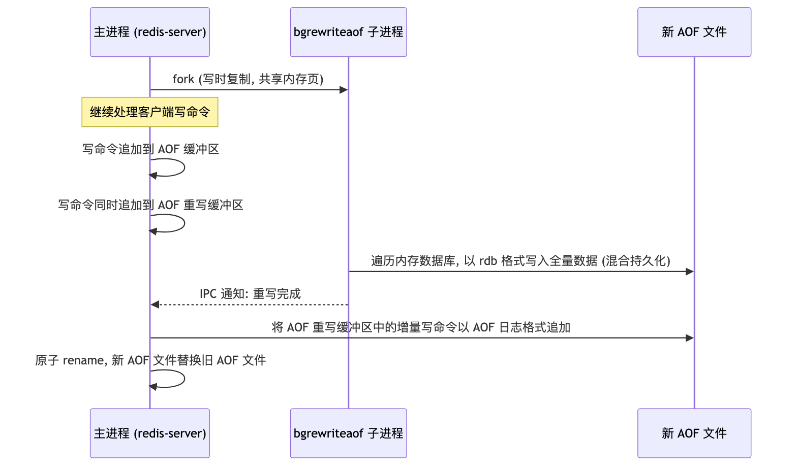
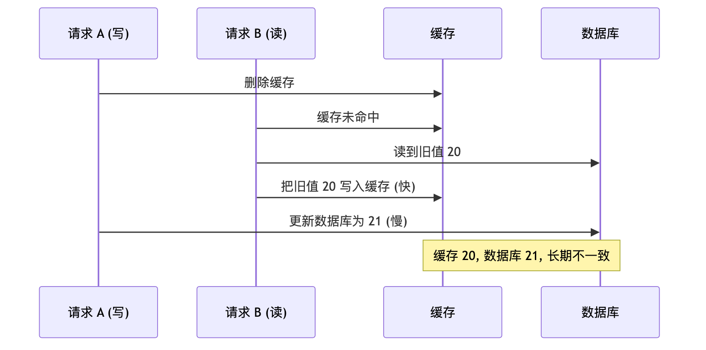
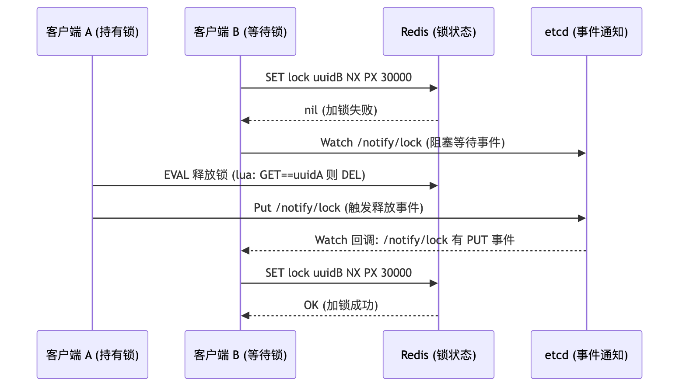

# Redis 高级后端工程师面试 QA

本文面向高级后端工程师面试, 覆盖 Redis 数据结构与底层编码、线程模型、持久化、过期删除与内存淘汰、高可用架构、缓存一致性、分布式锁 (Redis 主动轮询、Redis + etcd 监听回调两种实现) 等核心考点。

## 目录

- [一、数据结构与底层编码](#一-数据结构与底层编码)
  - [Q1: redisObject 是什么? 为什么 Redis 的所有值都要包一层 redisObject?](#q1-redisobject-是什么-为什么-redis-的所有值都要包一层-redisobject)
  - [Q2: string 的三种编码 int / embstr / raw 有什么区别? 44 字节的分界线怎么来的?](#q2-string-的三种编码-int-embstr-raw-有什么区别-44-字节的分界线怎么来的)
  - [Q3: SDS 相比 C 字符串有哪些优势?](#q3-sds-相比-c-字符串有哪些优势)
  - [Q4: list 的底层结构 quicklist 是怎么设计的? 为什么要用 listpack 替换 ziplist?](#q4-list-的底层结构-quicklist-是怎么设计的-为什么要用-listpack-替换-ziplist)
  - [Q5: hash / set / zset 的编码转换阈值分别是什么?](#q5-hash-set-zset-的编码转换阈值分别是什么)
  - [Q6: 跳表 (skiplist) 的原理是什么? zset 为什么用跳表而不用红黑树或 B+ 树?](#q6-跳表-skiplist-的原理是什么-zset-为什么用跳表而不用红黑树或-b-树)
  - [Q7: Redis 的 hashtable 是如何渐进式 rehash 的?](#q7-redis-的-hashtable-是如何渐进式-rehash-的)
  - [Q8: 五种数据类型的典型应用场景](#q8-五种数据类型的典型应用场景)
- [二、线程模型与高性能原理](#二-线程模型与高性能原理)
  - [Q9: Redis 是单线程还是多线程?](#q9-redis-是单线程还是多线程)
  - [Q10: 描述 Redis 主线程的事件循环 (epoll)](#q10-描述-redis-主线程的事件循环-epoll)
  - [Q11: Redis 为什么快? 既然单线程这么好, 为什么 6.0 又引入了多线程?](#q11-redis-为什么快-既然单线程这么好-为什么-6-0-又引入了多线程)
- [三、持久化](#三-持久化)
  - [Q12: AOF 日志的写入流程和三种写回策略](#q12-aof-日志的写入流程和三种写回策略)
  - [Q13: AOF 重写机制的完整流程, 为什么用子进程而不是线程?](#q13-aof-重写机制的完整流程-为什么用子进程而不是线程)
  - [Q14: RDB 快照的原理, save 和 bgsave 的区别, 写时复制的细节](#q14-rdb-快照的原理-save-和-bgsave-的区别-写时复制的细节)
  - [Q15: 混合持久化 (RDB + AOF) 是怎么工作的?](#q15-混合持久化-rdb-aof-是怎么工作的)
  - [Q16: Redis 持久化和主从复制对过期键分别是怎么处理的?](#q16-redis-持久化和主从复制对过期键分别是怎么处理的)
- [四、过期删除与内存淘汰](#四-过期删除与内存淘汰)
  - [Q17: Redis 的过期删除策略是什么?](#q17-redis-的过期删除策略是什么)
  - [Q18: 八种内存淘汰策略, LRU 和 LFU 的区别, Redis 的近似 LRU 实现](#q18-八种内存淘汰策略-lru-和-lfu-的区别-redis-的近似-lru-实现)
- [五、高可用架构](#五-高可用架构)
  - [Q19: 主从模式的复制原理 (全量复制、增量复制)](#q19-主从模式的复制原理-全量复制-增量复制)
  - [Q20: 哨兵模式如何实现自动故障转移? 主观下线和客观下线的区别](#q20-哨兵模式如何实现自动故障转移-主观下线和客观下线的区别)
  - [Q21: 集群模式为什么用 16384 个哈希槽而不是一致性哈希?](#q21-集群模式为什么用-16384-个哈希槽而不是一致性哈希)
  - [Q22: 什么是集群脑裂? 如何解决?](#q22-什么是集群脑裂-如何解决)
- [六、缓存设计](#六-缓存设计)
  - [Q23: 缓存雪崩、缓存击穿、缓存穿透的区别与解决方案](#q23-缓存雪崩-缓存击穿-缓存穿透的区别与解决方案)
  - [Q24: Cache Aside 为什么是先更新数据库、再删除缓存?](#q24-cache-aside-为什么是先更新数据库-再删除缓存)
  - [Q25: Read/Write Through 与 Write Back 策略](#q25-read-write-through-与-write-back-策略)
- [七、分布式锁 (重点)](#七-分布式锁-重点)
  - [Q26: 用 Redis 实现分布式锁要解决哪些问题?](#q26-用-redis-实现分布式锁要解决哪些问题)
  - [Q27: 实现一: Redis 主动轮询 (自旋重试) 分布式锁](#q27-实现一-redis-主动轮询-自旋重试-分布式锁)
  - [Q28: 实现二: Redis + etcd 监听回调分布式锁](#q28-实现二-redis-etcd-监听回调分布式锁)
  - [Q29: 两种实现的对比与选型](#q29-两种实现的对比与选型)
  - [Q30: 看门狗 (watchdog) 自动续期是怎么实现的?](#q30-看门狗-watchdog-自动续期是怎么实现的)
  - [Q31: 红锁 (RedLock) 是什么? 为什么有争议?](#q31-红锁-redlock-是什么-为什么有争议)
- [八、实战问题](#八-实战问题)
  - [Q32: 什么是大 key? 有什么危害? 如何排查和删除?](#q32-什么是大-key-有什么危害-如何排查和删除)
  - [Q33: Redis 管道 (pipeline) 和事务 (multi/exec) 的区别](#q33-redis-管道-pipeline-和事务-multi-exec-的区别)
  - [Q34: Redis 和进程内 LRU 缓存 (如 lru-cache) 的对比](#q34-redis-和进程内-lru-缓存-如-lru-cache-的对比)

---

## 一、数据结构与底层编码

### Q1: redisObject 是什么? 为什么 Redis 的所有值都要包一层 redisObject?

Redis 中每个键和值都是一个 `redisObject` 结构体, 核心字段:

```c
typedef struct redisObject {
    unsigned type:4;      // 数据类型: string / list / hash / set / zset
    unsigned encoding:4;  // 底层编码: int / embstr / raw / listpack / quicklist / hashtable / intset / skiplist
    unsigned lru:24;      // LRU 时间戳 或 LFU (高 16 位: 访问时间, 低 8 位: 对数访问频率)
    int refcount;         // 引用计数, 用于共享整数对象 (0~9999)
    void *ptr;            // 指向底层数据结构的指针
} robj;
```

包一层 redisObject 的原因:

1. 类型与编码解耦: 同一个 `type` 可以有多种 `encoding`, Redis 可以根据数据规模在编码间自动转换 (如 hash 从 listpack 转 hashtable), 对上层命令透明
2. 统一的内存管理: `refcount` 支持对象共享 (0~9999 的小整数全局共享, 节省内存) 和引用计数回收
3. 淘汰策略支撑: `lru` 字段为近似 LRU / LFU 内存淘汰提供元数据

### Q2: string 的三种编码 int / embstr / raw 有什么区别? 44 字节的分界线怎么来的?

- int: 值是可以用 `long` 表示的整数, `ptr` 直接存整数值 (指针复用为值), 零额外内存
- embstr: 值是字符串且长度 <= 44 字节, 一次内存分配同时保存 redisObject 和 SDS, 两者内存地址连续
  - 优点: 分配/释放各只需 1 次, CPU cache 局部性好
  - 缺点: redisObject 和 SDS 是一整块内存, 无法单独扩容, 所以 embstr 是只读的; 对 embstr 字符串执行 `append` 等修改命令时, 会先转成 raw 编码再修改
- raw: 值是字符串且长度 > 44 字节, 两次内存分配分别保存 redisObject 和 SDS

44 字节的由来: jemalloc 以 64 字节为一个分配粒度, embstr 要求 redisObject + SDS 头 + 字符串 + `\0` 装进 64 字节:

```text
64 - 16 (redisObject) - 3 (sdshdr8: len + alloc + flags) - 1 ('\0') = 44 字节
```

### Q3: SDS 相比 C 字符串有哪些优势?

SDS (Simple Dynamic String, 简单动态字符串) 结构:

```c
struct sdshdr8 {
    uint8_t len;    // 已使用长度
    uint8_t alloc;  // 已分配容量 (不含头和 '\0')
    unsigned char flags; // 头类型 (sdshdr5/8/16/32/64, 按需选择以省内存)
    char buf[];     // 字节数组
};
```

对比 C 字符串:

1. O(1) 获取长度: 直接读 `len` 字段; C 字符串 `strlen` 是 O(n)
2. 二进制安全: 以 `len` 判断结尾而非 `\0`, 可以存图片、序列化对象等任意二进制数据
3. 杜绝缓冲区溢出: 拼接前检查 `alloc - len`, 空间不足自动扩容 (< 1MB 时翻倍预分配, >= 1MB 时每次多分配 1MB)
4. 减少内存重分配: 空间预分配 + 惰性空间释放 (缩短时不立即回收, 留待复用)
5. 头类型按需选择: 短字符串用 sdshdr8, 节省头部开销

### Q4: list 的底层结构 quicklist 是怎么设计的? 为什么要用 listpack 替换 ziplist?

quicklist = 双向链表 + 每个节点是一个 listpack, 是链表和紧凑数组的折中:

- 纯双向链表: 每个节点都有 prev/next 指针, 内存碎片多、指针开销大
- 纯紧凑数组 (listpack): 插入/删除需要整体挪动内存, 数据量大时性能差
- quicklist: 链表层面 O(1) 头尾插入, 每个节点内部是连续内存的 listpack, 兼顾内存效率和操作效率; 中间节点还可以用 LZF 压缩

listpack 替换 ziplist 的原因 (级联更新问题):

- ziplist 的每个 entry 都记录前一个 entry 的长度 (prevlen), 用于从后往前遍历; 当某个 entry 变大导致 prevlen 从 1 字节膨胀到 5 字节时, 会引起后续 entry 连锁扩容, 即级联更新, 最坏 O(n^2)
- listpack 的每个 entry 只记录自身长度, 从后往前遍历时通过从当前位置反向解析元素自身的长度字段实现, 彻底消除级联更新

### Q5: hash / set / zset 的编码转换阈值分别是什么?

| 类型 | 紧凑编码                     | 转换条件 (任一不满足即转换)                                                                 | 通用编码             |
| ---- | ---------------------------- | ------------------------------------------------------------------------------------------- | -------------------- |
| hash | listpack                     | 字段数量 <= 128 (`hash-max-listpack-entries`) 且每个字段/值 <= 64 字节                      | hashtable            |
| set  | intset (全整数时) / listpack | 全整数且成员数 <= 512 (`set-max-intset-entries`); 非全整数时成员数 <= 128 且成员 <= 64 字节 | hashtable            |
| zset | listpack                     | 成员数量 <= 128 (`zset-max-listpack-entries`) 且每个成员 <= 64 字节                         | skiplist + hashtable |

注意两点:

1. 编码转换是单向的, 转成通用编码后即使数据变少也不会转回紧凑编码
2. zset 的通用编码是双结构: skiplist 按分数排序支撑范围查询 (`zrange`), hashtable 保存 member 到 score 的映射支撑 O(1) 的 `zscore`

### Q6: 跳表 (skiplist) 的原理是什么? zset 为什么用跳表而不用红黑树或 B+ 树?

跳表是多层有序链表: 底层 (L0) 链表包含所有节点; 每个新节点通过随机化决定层高 (Redis 中每层晋升概率 p = 0.25, 最大 64 层), 高层链表是低层的"快速通道"。查找时从最高层开始, 向右走到不能再走就下沉一层, 平均时间复杂度 O(log n)。

```c
typedef struct zskiplistNode {
    sds ele;                          // 成员
    double score;                     // 分数
    struct zskiplistNode *backward;   // 底层的后退指针
    struct zskiplistLevel {
        struct zskiplistNode *forward; // 该层的前进指针
        unsigned long span;            // 跨度, 用于 O(log n) 计算排名 (zrank)
    } level[];
} zskiplistNode;
```

选跳表而非红黑树 / B+ 树的原因:

1. 范围查询更自然: `zrange` 找到起点后沿 L0 链表顺序遍历即可; 红黑树范围查询需要中序遍历回溯, 实现复杂
2. 实现简单: 跳表插入/删除只需修改相邻节点指针, 无需旋转、变色等复杂的再平衡操作
3. span 字段支持排名: `zrank`/`zrevrank` 可以在 O(log n) 内完成, 红黑树需要额外维护子树大小
4. 不需要 B+ 树: B+ 树为磁盘页设计 (减少磁盘 I/O), Redis 是纯内存操作, 不存在页对齐收益

### Q7: Redis 的 hashtable 是如何渐进式 rehash 的?

Redis 的 dict 内部有两个哈希表 `ht[0]` 和 `ht[1]`:

1. 触发扩容: 负载因子 (used/size) >= 1 且当前没有 bgsave/bgrewriteaof 子进程时扩容; >= 5 时强制扩容 (即使有子进程, 因为写时复制期间扩容会导致大量内存页复制, 所以提高阈值); 负载因子 < 0.1 时缩容
2. 渐进式迁移: 为 `ht[1]` 分配 2 倍空间后, 不是一次性迁移 (百万级键会阻塞主线程), 而是将 rehashidx 置 0, 之后每次对该字典执行增删改查时, 顺带把 `ht[0]` 中 rehashidx 位置的一个桶迁移到 `ht[1]`; 同时定时任务也会批量迁移
3. rehash 期间的读写规则: 查找/删除先查 `ht[0]` 再查 `ht[1]`; 新增只写 `ht[1]`, 保证 `ht[0]` 只减不增
4. 迁移完成后释放 `ht[0]`, `ht[1]` 变为 `ht[0]`

### Q8: 五种数据类型的典型应用场景

- string: 缓存对象 (JSON 序列化)、计数器 (`incr` 原子自增)、分布式锁 (`set key value nx px`)、共享 session
- list: 消息队列 (`lpush + brpop` 保序阻塞消费; 用 `blmove` 把消息移入备份 list 保证可靠性; 缺点是不支持消费组, 需要消费组用 stream)
- hash: 购物车 (用户 ID 为 key, 商品 ID 为 field, 数量为 value)、对象的部分字段更新
- set: 点赞/收藏去重、共同关注 (`sinter` 交集)、抽奖 (`srandmember` 不放回用 `spop`)
- zset: 排行榜 (`zincrby` 更新分数 + `zrange rev` 取 TopN)、延迟队列 (score 存执行时间戳)、滑动窗口限流

---

## 二、线程模型与高性能原理

### Q9: Redis 是单线程还是多线程?

分层回答:

- 执行命令是单线程 (主线程), 这是"Redis 单线程"的准确含义, 所以单条命令天然原子
- 网络 I/O: Redis 6.0 之前读写 socket 也在主线程; 6.0 之后引入 I/O 多线程 (默认 io_thd_1 ~ io_thd_3) 并行处理读请求解析和写回包, 但命令执行仍在主线程串行
- 后台线程 (一直存在): 主线程作为生产者将耗时任务放入队列, 后台线程作为消费者轮询处理
  - `bio_close_file`: 关闭文件描述符 (close 大文件耗时)
  - `bio_aof_fsync`: AOF 刷盘 (fsync 耗时)
  - `bio_lazy_free`: 异步释放内存, `unlink <key>`、`flushdb async`、`flushall async` 走此线程

### Q10: 描述 Redis 主线程的事件循环 (epoll)

初始化阶段:

1. `epoll_create()` 创建 epoll 对象
2. `socket()` 创建监听 socket, `bind()` 绑定端口, `listen()` 监听
3. `epoll_ctl()` 将监听 socket 加入 epoll 关注集合, 注册「连接事件」回调

事件循环:

1. 每轮先检查发送队列, 有未发完的数据就调用 `write()` 发送; 没发完则注册「写事件」回调
2. `epoll_wait()` 等待就绪事件:
   - 连接事件: `accept()` 获取客户端 socket, `epoll_ctl()` 加入关注集合, 注册「读事件」回调
   - 读事件: `read()` 读取请求 -> 解析命令 -> 执行命令 -> 结果写入发送缓冲区
   - 写事件: `write()` 发送缓冲区数据, 未发完则继续注册「写事件」回调

### Q11: Redis 为什么快? 既然单线程这么好, 为什么 6.0 又引入了多线程?

快的原因:

1. 纯内存操作 + 高效数据结构 (SDS、跳表、listpack、渐进式 rehash 的 dict)
2. I/O 多路复用 (epoll): 单线程监听大量 fd 的可读/可写事件, 高并发下不需要为每个连接创建线程
3. 单线程执行命令: 无线程切换开销、无锁竞争、无并发读写数据不一致问题

单线程的前提是: Redis 的瓶颈不在 CPU, 而在内存大小和网络 I/O。

6.0 引入 I/O 多线程的原因: 随着网卡带宽提升 (10G/25G), 网络 I/O (read/write socket + 协议解析) 成为新瓶颈, 这部分是可以安全并行的 (不涉及共享数据结构修改), 所以只把 I/O 并行化, 命令执行保持单线程, 保住了无锁的简单性。

---

## 三、持久化

### Q12: AOF 日志的写入流程和三种写回策略

AOF (Append Only File): 每执行一条写命令, 将该命令追加到 AOF 缓冲区; 重启时重放 AOF 日志恢复数据。

注意 Redis 是先执行命令、后写日志 (与 MySQL 的 WAL 相反), 好处:

- 不需要语法检查, 能追加进 AOF 的都是执行成功的命令
- 不阻塞当前写命令的执行

风险: 命令执行成功后、写 AOF 前宕机, 该命令丢失; 且写 AOF 在主线程, 磁盘压力大时会阻塞后续命令。

三种写回策略 (`appendfsync`), 本质是控制 `fsync()` 时机:

| 策略            | 行为                                          | 可靠性          | 性能 |
| --------------- | --------------------------------------------- | --------------- | ---- |
| Always          | 每条写命令都同步 fsync 到磁盘                 | 最多丢 1 条命令 | 最差 |
| Everysec (默认) | 每秒由后台线程 (`bio_aof_fsync`) fsync 一次   | 最多丢 1 秒数据 | 折中 |
| No              | 只 write 到内核页缓存, 由操作系统决定刷盘时机 | 丢失量不可控    | 最好 |

### Q13: AOF 重写机制的完整流程, 为什么用子进程而不是线程?

AOF 日志随写命令持续膨胀 (对同一 key 的 100 次 incr 会记录 100 条命令), 超过阈值 (`auto-aof-rewrite-min-size` + 增长百分比) 时触发重写: 不是修改旧文件, 而是根据当前内存数据生成等价的最小命令集写入新文件。



流程:

1. 主进程 fork `bgrewriteaof` 子进程 (fork 瞬间会复制页表, 数据量大时页表复制本身也可能造成短暂阻塞)
2. 子进程遍历内存数据库, 将每个键值对转换为写命令写入新 AOF 文件
3. 重写期间主进程的写命令同时追加到「AOF 缓冲区」和「AOF 重写缓冲区」 (解决重写期间的增量数据不一致)
4. 子进程完成后通过 IPC 通知主进程
5. 主进程将「AOF 重写缓冲区」的增量命令追加到新 AOF 文件, 然后原子 rename 替换旧文件 (这一步在主线程, 是短暂阻塞点)

用子进程而非线程的原因: 写时复制 (Copy-on-Write)

- 线程共享内存, 子任务读数据时主线程还在写, 必须加锁, 引入锁竞争
- fork 子进程时父子进程共享物理内存页 (只复制页表), 天然无锁; 只有当父进程或子进程写某个内存页时, 内核才复制该页 (4KB 粒度), 子进程看到的是 fork 瞬间的一致性快照

### Q14: RDB 快照的原理, save 和 bgsave 的区别, 写时复制的细节

RDB (Redis Database): 周期性地把某一时刻的全量内存数据以二进制格式写入磁盘。

- AOF 是文本命令, 恢复时要逐条重放, 恢复慢; RDB 是二进制数据, 直接载入内存, 恢复快
- RDB 是全量快照, 频率过高影响性能, 频率过低则两次快照之间的数据在宕机时全部丢失

两个命令:

- `save`: 在主线程生成 RDB, 阻塞所有命令, 生产禁用
- `bgsave`: fork 子进程生成 RDB, 主线程继续服务; 期间主进程修改数据触发写时复制, 主进程在副本页上修改, 子进程持续读取 fork 瞬间的原始页, 保证快照一致性
  - 极端情况: bgsave 期间所有数据都被修改, 内存占用最坏翻倍, 所以要预留内存余量

自动触发配置 (满足任意一条即 bgsave):

```shell
save 3600 1     # 3600s 内至少 1 次修改
save 300 10     # 300s 内至少 10 次修改
save 60 100000  # 60s 内至少 100000 次修改
```

### Q15: 混合持久化 (RDB + AOF) 是怎么工作的?

| 方式     | 优点                   | 缺点                   |
| -------- | ---------------------- | ---------------------- |
| RDB 快照 | 恢复快                 | 快照间隔期间数据丢失多 |
| AOF 日志 | 数据丢失少 (最多 1 秒) | 恢复慢                 |

混合持久化 (`aof-use-rdb-preamble yes`, Redis 4.0+) 在 AOF 重写时触发:

1. fork 子进程, 将 fork 瞬间的全量数据以 RDB 二进制格式写入新 AOF 文件的开头
2. 重写期间主进程的增量写命令进入「AOF 重写缓冲区」
3. 重写完成后, 增量命令以 AOF 文本格式追加到 RDB 数据之后

最终 AOF 文件 = RDB 格式的全量数据 (恢复快) + AOF 格式的增量命令 (丢失少), 兼得两者优点。缺点是 AOF 文件前半段不再可读, 且不兼容 4.0 以前的版本。

### Q16: Redis 持久化和主从复制对过期键分别是怎么处理的?

RDB:

- 生成阶段: 过期键不写入 RDB 文件
- 加载阶段: 主节点加载时检查并跳过过期键; 从节点全部加载 (因为从节点的数据以主从同步为准, 主节点会发 del 命令来删除)

AOF:

- 写入阶段: 过期键若未被删除, 命令仍在 AOF 中; 键被 (惰性/定期) 删除时追加一条 del 命令
- 重写阶段: 重写时检查每个键, 过期键不写入新 AOF 文件

主从复制: 从库不主动删除过期键 (保证主从一致), 由主库在键过期时向 AOF 和从库同步 del 命令; 从库读到过期键时 (Redis 3.2+) 会返回 nil 但不删除, 等主库的 del。

---

## 四、过期删除与内存淘汰

### Q17: Redis 的过期删除策略是什么?

Redis 用过期字典 (expires dict) 保存 key 到过期时间 (毫秒时间戳) 的映射。查询 key 时先查过期字典: 不在其中则永不过期; 在其中则比较过期时间与当前时间。

采用 惰性删除 + 定期删除 组合:

- 惰性删除: 不主动删, 每次访问 key 时检查是否过期, 过期则删除并返回 nil
  - 优点: CPU 友好 (只在访问时检查); 缺点: 过期但不再被访问的 key 一直占内存
- 定期删除: 默认每 100ms (hz=10) 执行一轮:
  1. 从过期字典中随机抽取 20 个 key
  2. 删除其中已过期的 key
  3. 本轮耗时超过 25ms 则 break, 等下一轮 (防止阻塞主线程)
  4. 如果本批过期比例 > 25% (5/20), 说明过期键还很多, 回到步骤 1 继续; 否则结束本轮
  - 在 CPU 开销和内存占用之间取得平衡

两者互补: 定期删除兜底清理冷数据, 惰性删除保证访问正确性; 最终还有内存淘汰兜底。

### Q18: 八种内存淘汰策略, LRU 和 LFU 的区别, Redis 的近似 LRU 实现

内存达到 `maxmemory` 阈值时触发内存淘汰:

- 不淘汰: `noeviction` (默认) — 拒绝写命令直接报错, 读命令正常
- 只在设置了过期时间的键中淘汰:
  - `volatile-random`: 随机淘汰
  - `volatile-ttl`: 淘汰过期时间最早的
  - `volatile-lru`: 淘汰最近最少使用的
  - `volatile-lfu`: 淘汰使用频率最低的
- 在所有键中淘汰:
  - `allkeys-random` / `allkeys-lru` / `allkeys-lfu`

LRU vs LFU:

- LRU (Least Recently Used): 按最近访问时间淘汰。缺陷是缓存污染: 一次性批量扫描大量只读一次的数据, 会把真正的热数据挤出去
- LFU (Least Frequently Used): 按一段时间内的访问频率淘汰, 能抵抗扫描型缓存污染

Redis 的近似实现 (都不维护全局链表/堆, 避免大量指针内存和操作开销):

- 近似 LRU: 利用 redisObject 的 24 位 `lru` 字段记录最后访问时间; 淘汰时随机采样 `maxmemory-samples` (默认 5) 个键, 淘汰其中最久未访问的, 并维护一个候选池提高精度
- LFU: 复用同一个 24 位字段, 高 16 位存分钟级访问时间, 低 8 位存对数计数器 (counter 越大, 再增长的概率越小, 255 封顶); 通过 `lfu-decay-time` 让计数随时间衰减, 避免历史热点永远不被淘汰

---

## 五、高可用架构

### Q19: 主从模式的复制原理 (全量复制、增量复制)

架构: 1 个主节点 (可读写) + 多个只读从节点, 实现读写分离和数据冗余。

首次全量复制:

1. 从库发送 `psync ? -1`, 主库回复 `+FULLRESYNC <replid> <offset>`
2. 主库执行 bgsave 生成 RDB 发给从库, 期间的新写命令写入 replication buffer
3. 从库清空旧数据、载入 RDB, 主库再把 buffer 中的增量命令发给从库

断线重连后的增量复制:

- 主库维护环形缓冲区 repl_backlog_buffer, 从库重连时携带自己的 offset
- 若 offset 还在环形缓冲区中, 只补发缺失部分; 若已被覆盖 (断线太久或 buffer 太小), 退化为全量复制
- 所以 `repl-backlog-size` 要根据 写入速率 x 平均断线时长 调大

长连接命令传播: 稳定阶段主库把每条写命令异步发给从库 (异步复制, 主从存在数据延迟窗口)。

问题: 主节点故障时不能自动故障转移, 需要人工提升从库, 所以有哨兵模式。

### Q20: 哨兵模式如何实现自动故障转移? 主观下线和客观下线的区别

架构: 1 主 + 多从 + 多个哨兵节点 (哨兵本身也是集群, 通常 >= 3 个奇数)。哨兵负责: 监控、自动故障转移、通知客户端新主地址。

- 主观下线 (SDOWN): 单个哨兵 ping 主节点超时未响应, 该哨兵主观认为它下线 — 可能只是这个哨兵与主节点之间网络抖动
- 客观下线 (ODOWN): 该哨兵向其他哨兵求证, 当认为主节点下线的哨兵数达到法定数量 (quorum) 时, 判定客观下线, 触发故障转移

故障转移流程:

1. 哨兵之间通过 Raft 类似的投票选出一个 leader 哨兵执行故障转移
2. leader 从从库中挑选新主: 过滤掉网络状态差的, 依次比较 优先级 (`replica-priority`) > 复制偏移量 (数据最全) > runid 最小
3. 向新主发送 `replicaof no one`, 向其余从库发送 `replicaof <新主>`
4. 通过发布订阅通知客户端新主地址; 旧主恢复后被降级为从库

### Q21: 集群模式为什么用 16384 个哈希槽而不是一致性哈希?

集群模式 (cluster): 无哨兵节点, 多个主节点分片 (shard) 存储数据, 每个主节点带若干副本; 节点间用 Gossip 协议交换状态, quorum 数量的主节点判定某主节点下线后, 从其副本中选举新主。

哈希槽机制: 在 key 和分片之间加一层固定映射:

```text
key -> CRC16(key) % 16384 (0x4000) -> 槽 -> 某个主节点
```

- key 到槽的映射永远固定, 与节点数量无关; 节点变化时只需迁移部分槽及其数据
- 例: 2 个分片时 M1 负责槽 0~~0x1fff, M2 负责 0x2000~~0x3fff; 扩到 3 个分片只需把 M1、M2 的部分槽迁给 M3, 迁移期间集群持续可用 (访问迁移中的槽会收到 ASK 重定向, 访问已迁走的槽收到 MOVED 重定向)
- 若用传统 `hash % 节点数`, 节点数变化时几乎所有 key 都要重新分布

为什么是 16384 而不是 65536:

1. Gossip 心跳包携带节点负责的槽位图 (bitmap), 16384 位 = 2KB, 65536 位 = 8KB, 心跳包过大浪费带宽
2. Redis 官方建议集群主节点不超过 1000 个, 16384 个槽足够分配

补充: 多 key 命令要求所有 key 在同一个槽, 可用 hash tag (`{user:1}:profile` 和 `{user:1}:orders` 只对 `{}` 内的部分算 CRC16) 强制同槽。

### Q22: 什么是集群脑裂? 如何解决?

脑裂过程:

1. 主节点 M1 与集群其他节点网络分区, 但与部分客户端仍连通; 客户端继续向 M1 写数据, 而 M1 无法同步给从库
2. 集群通过 Gossip 判定 M1 客观下线, 选举其从库 R1 为新主 — 此时集群中同时存在两个"主节点" (脑裂)
3. 网络恢复后 M1 重新加入集群, 被降级为 R1 的从库, 第一次同步会清空 M1 本地数据做全量同步, 分区期间写入 M1 的数据全部丢失

解决方案 (本质是让"少数派"主节点拒绝写入):

```shell
min-replicas-to-write 1   # 主节点至少有 1 个从库连接正常, 否则拒绝写
min-replicas-max-lag 10   # 从库复制延迟不超过 10s, 否则视为异常
```

主节点发现健康从库数量低于阈值时直接对写命令返回错误, 把损失从"静默丢数据"变成"显式写失败", 客户端可以重试到新主。

---

## 六、缓存设计

### Q23: 缓存雪崩、缓存击穿、缓存穿透的区别与解决方案

| 问题     | 定义                                                                    | 解决方案                                                                                                                |
| -------- | ----------------------------------------------------------------------- | ----------------------------------------------------------------------------------------------------------------------- |
| 缓存雪崩 | 大量 key 同一时刻过期 (或 Redis 宕机), 请求集体打到数据库               | 过期时间加随机值打散; 热点数据不过期 + 后台异步更新; 服务熔断/限流兜底; Redis 高可用集群                                |
| 缓存击穿 | 单个热点 key 过期瞬间, 高并发请求打到数据库                             | 互斥锁 (只放一个请求回源重建缓存, 其余等待或返回默认值, 即 singleflight); 热点 key 逻辑过期不物理过期, 后台线程异步续期 |
| 缓存穿透 | 请求的数据缓存和数据库都没有, 每次都穿透到数据库 (常见于恶意攻击或误删) | 缓存空值/默认值 (短 TTL); 接口层参数校验拦截非法请求; 布隆过滤器在缓存前快速判断"一定不存在"                            |

三者的递进关系: 雪崩是面 (大量 key), 击穿是点 (单个热 key), 穿透是防线外 (数据根本不存在)。

### Q24: Cache Aside 为什么是先更新数据库、再删除缓存?

Cache Aside (旁路缓存) 是最常用的策略, 适合读多写少:

- 读策略: 命中直接返回; 未命中则读数据库 -> 写缓存 -> 返回
- 写策略: 先更新数据库, 再删除缓存 (而不是更新缓存, 因为缓存值可能是多表计算结果, 且写后可能根本没人读, 更新缓存是浪费)

为什么不能先删缓存、后更新数据库 — 并发下必然不一致:



先更新数据库、后删除缓存理论上也有不一致窗口 (读请求未命中 -> 读到旧值 -> 此时写请求完成更新和删缓存 -> 读请求把旧值写回缓存), 但概率极低: 需要"读缓存未命中"与"写请求"精确交错, 且要求写缓存比写数据库慢, 而实际写内存远快于写磁盘。

兜底手段:

- 删除缓存失败的重试: 消息队列异步重试; 或订阅 MySQL binlog (Canal) 驱动删除
- 给缓存设置兜底过期时间, 保证最终一致
- 强一致要求高的场景可加分布式锁或延迟双删

### Q25: Read/Write Through 与 Write Back 策略

Read/Write Through (读穿/写穿): 客户端只与缓存层交互, 由缓存层负责与数据库同步

- Read Through: 未命中时由缓存层自己回源加载再返回
- Write Through: 缓存中存在则先更新缓存再由缓存层同步更新数据库; 不存在则直接更新数据库
- 实际中 Redis 不提供这种能力, 常见于本地缓存框架或在 Redis 之上封装一层缓存服务

Write Back (写回): 写时只更新缓存并标记为脏, 立即返回; 后台线程定期把脏数据批量刷回数据库

- 优点: 写性能极高, 合并多次写为一次刷盘, 适合写多场景
- 缺点: 缓存宕机时脏数据丢失; 数据库与缓存长期不一致
- 典型实例: MySQL buffer pool 的脏页机制、Redis AOF 的 Everysec 写回策略、CPU cache 的 write-back 模式

---

## 七、分布式锁 (重点)

### Q26: 用 Redis 实现分布式锁要解决哪些问题?

一把生产可用的分布式锁必须解决以下问题:

1. 互斥: 同一时刻只有一个客户端持锁 — 用 `SET key value NX` 的原子性保证 (禁止 `setnx + expire` 两条命令, 非原子, 中间宕机会产生永不过期的死锁)
2. 防死锁: 持锁客户端崩溃后锁必须能自动释放 — 用 `PX <ttl>` 设置过期时间
3. 防误删: 客户端 A 的锁过期后被 B 获取, A 恢复后不能删掉 B 的锁 — value 存唯一标识 (uuid), 释放时用 Lua 脚本原子地"先比对再删除"
4. 锁续期: 业务执行时间超过 TTL 会导致锁提前失效、互斥被破坏 — 用看门狗 (watchdog) 后台协程定期续期
5. 可重入 (可选): 同一客户端可重复加锁 — 用 hash 结构记录持有者和重入次数
6. 等锁效率: 加锁失败后如何等待 — 这正是主动轮询与监听回调两种实现的分野 (见 Q27/Q28)
7. 主从切换下的安全性: 异步复制导致主库宕机时锁可能丢失 — RedLock 或接受最终一致 (见 Q31)

标准加锁命令与释放脚本:

```shell
SET lock_key <uuid> NX PX 30000
```

```lua
-- 释放锁: 必须用 lua 保证 GET 与 DEL 的原子性
if redis.call("GET", KEYS[1]) == ARGV[1] then
  return redis.call("DEL", KEYS[1])
else
  return 0
end
```

### Q27: 实现一: Redis 主动轮询 (自旋重试) 分布式锁

思路: 加锁失败后, 客户端自旋 + 间隔休眠, 主动向 Redis 重复发起 `SET NX` 尝试, 直到成功或超时。这是最经典的实现 (Redisson、redsync 的默认模式本质相同)。

Go 实现 (基于 go-redis):

```go
type RedisLock struct {
    client        *redis.Client
    key           string
    token         string        // uuid, 防误删
    ttl           time.Duration // 锁过期时间
    retryInterval time.Duration // 轮询间隔
    stopWatchdog  chan struct{}
}

var releaseScript = redis.NewScript(`
if redis.call("GET", KEYS[1]) == ARGV[1] then
  return redis.call("DEL", KEYS[1])
else
  return 0
end`)

// TryLock 非阻塞加锁, 只尝试一次
func (l *RedisLock) TryLock(ctx context.Context) (bool, error) {
    ok, err := l.client.SetNX(ctx, l.key, l.token, l.ttl).Result()
    if err != nil {
        return false, err
    }
    if ok {
        go l.watchdog() // 加锁成功, 启动看门狗续期
    }
    return ok, nil
}

// Lock 阻塞加锁: 主动轮询, 直到成功或 ctx 超时/取消
func (l *RedisLock) Lock(ctx context.Context) error {
    ticker := time.NewTicker(l.retryInterval) // 如 50ms ~ 100ms
    defer ticker.Stop()
    for {
        ok, err := l.TryLock(ctx)
        if err != nil {
            return err
        }
        if ok {
            return nil
        }
        select {
        case <-ctx.Done(): // 等锁超时, 快速失败
            return ctx.Err()
        case <-ticker.C: // 休眠一个间隔后重试
        }
    }
}

func (l *RedisLock) Unlock(ctx context.Context) error {
    close(l.stopWatchdog)
    n, err := releaseScript.Run(ctx, l.client, []string{l.key}, l.token).Int()
    if err != nil {
        return err
    }
    if n == 0 {
        return errors.New("lock not held by this client") // 锁已过期或被他人持有
    }
    return nil
}
```

关键设计点:

1. 轮询间隔的权衡: 间隔越短, 获锁延迟越低, 但对 Redis 的无效 QPS 越高; 间隔越长则反之。可用指数退避 + 抖动 (如 50ms 起步, 每次 x1.5, 上限 1s, 加随机抖动防止惊群) 优化
2. 必须支持等锁超时 (通过 `ctx`), 否则故障时调用方会无限阻塞, 拖垮上游
3. 高竞争下大量客户端同时轮询, 存在羊群效应: N 个等待者每个间隔都打一次 Redis, 无效请求 = N x (1/interval) QPS — 这是该方案的核心缺点, 也是引出"监听回调"方案的动机

### Q28: 实现二: Redis + etcd 监听回调分布式锁

思路: 锁的状态仍存 Redis (`SET NX PX`, 保留 Redis 加锁的高性能和过期兜底能力), 但等锁不再轮询: 持锁者释放锁时向 etcd 写一个通知 key, 等锁者通过 etcd 的 Watch 机制阻塞监听该 key, 收到释放事件的回调后才发起下一次抢锁。将 "忙轮询 (poll)" 变为 "事件驱动 (push)"。



Go 实现 (go-redis + etcd clientv3):

```go
type HybridLock struct {
    rdb       *redis.Client
    etcd      *clientv3.Client
    key       string // redis 锁 key, 如 "lock:order:1001"
    notifyKey string // etcd 通知 key, 如 "/notify/lock:order:1001"
    token     string
    ttl       time.Duration
}

// Lock 阻塞加锁: 抢锁失败则 Watch etcd, 等释放事件回调后再抢
func (l *HybridLock) Lock(ctx context.Context) error {
    for {
        // 1. 先尝试抢锁 (必须先抢再 watch, 否则可能错过在 watch 建立前发生的释放事件)
        ok, err := l.rdb.SetNX(ctx, l.key, l.token, l.ttl).Result()
        if err != nil {
            return err
        }
        if ok {
            return nil
        }

        // 2. 抢锁失败: 建立 etcd watch, 阻塞等待释放事件
        watchCtx, cancel := context.WithCancel(ctx)
        watchCh := l.etcd.Watch(watchCtx, l.notifyKey)

        // 3. double check: watch 建立期间锁可能已被释放, 再抢一次防止永久等待
        ok, err = l.rdb.SetNX(ctx, l.key, l.token, l.ttl).Result()
        if err != nil {
            cancel()
            return err
        }
        if ok {
            cancel()
            return nil
        }

        // 4. 阻塞等待回调; 兜底超时 = 锁 TTL (防止持锁者崩溃后没人发通知)
        select {
        case resp := <-watchCh:
            _ = resp // 收到 PUT 事件: 锁被释放, 回到循环头部重新抢锁
        case <-time.After(l.ttl):
            // 持锁者可能崩溃, redis 锁已因 TTL 过期, 主动重试兜底
        case <-ctx.Done():
            cancel()
            return ctx.Err()
        }
        cancel()
    }
}

// Unlock 释放 redis 锁, 并向 etcd 发布释放事件, 唤醒所有等锁者
func (l *HybridLock) Unlock(ctx context.Context) error {
    n, err := releaseScript.Run(ctx, l.rdb, []string{l.key}, l.token).Int()
    if err != nil {
        return err
    }
    if n == 0 {
        return errors.New("lock not held by this client")
    }
    // put 触发 etcd watch 事件, 所有等锁者收到回调
    _, err = l.etcd.Put(ctx, l.notifyKey, "released")
    return err
}
```

关键设计点:

1. 先抢锁、再 watch、再 double check: 若先 watch 后抢锁, watch 建立前的释放事件不会丢 (etcd watch 可指定 revision), 但若只抢一次锁再 watch, 在"抢锁失败"与"watch 生效"之间锁被释放, 等锁者会错过事件 — double check 消除该竞态
2. 兜底超时不可省略: 持锁客户端崩溃时不会调用 `Unlock`, 不会有 etcd 通知; 但 Redis 锁会因 TTL 自动过期, 等锁者必须以 TTL 为周期兜底重试
3. 惊群仍然存在但被大幅削弱: 释放事件会唤醒所有 watcher, 它们同时抢锁, 但只有 1 次事件触发 N 次抢锁; 对比轮询方案的 N x (1/interval) 持续 QPS, 无效请求从"持续"变为"脉冲"。进一步优化可以用 etcd 的公平队列 (每个等锁者创建带 lease 的有序 key, 只 watch 前一个 key 的 DELETE 事件), 实现严格 FIFO、每次只唤醒一个等待者
4. 为什么不直接全用 etcd 锁 (concurrency.Mutex): etcd 基于 Raft, 每次写都要多数派落盘, 加锁吞吐远低于 Redis; 该混合方案让高频的抢锁/释放走 Redis 内存操作, 低频的等待通知走 etcd, 兼顾吞吐和事件驱动

### Q29: 两种实现的对比与选型

| 维度       | Redis 主动轮询                                          | Redis + etcd 监听回调                                   |
| ---------- | ------------------------------------------------------- | ------------------------------------------------------- |
| 等锁机制   | 客户端自旋 + 间隔重试 (pull)                            | etcd Watch 事件驱动 (push)                              |
| 获锁延迟   | 平均 interval/2, 最坏 1 个 interval                     | 释放后近实时 (watch 推送毫秒级)                         |
| Redis 压力 | 等待者越多、间隔越短压力越大, N x (1/interval) 持续 QPS | 仅在释放事件时有一波脉冲抢锁                            |
| 依赖组件   | 仅 Redis                                                | Redis + etcd, 多一个组件的运维和故障面                  |
| 实现复杂度 | 简单                                                    | 中等 (竞态处理: double check、兜底超时)                 |
| 公平性     | 不公平, 随机抢占                                        | 默认不公平; 用 etcd 有序 key 可实现 FIFO 公平锁         |
| 适用场景   | 竞争少、锁持有时间短、架构追求简单                      | 竞争激烈、等锁者多、对获锁延迟敏感、基础设施中已有 etcd |

选型结论: 大多数业务锁竞争不激烈, 主动轮询 + 指数退避足够; 当出现明显的锁热点 (秒杀、全局任务调度) 且已有 etcd 时, 升级为监听回调; 若一致性要求压倒性能 (如主节点选举), 直接用 etcd/ZooKeeper 原生锁而非 Redis。

### Q30: 看门狗 (watchdog) 自动续期是怎么实现的?

问题: TTL 设短了, 业务没执行完锁就过期, 互斥被破坏; TTL 设长了, 持锁者崩溃后其他客户端要等很久。看门狗解耦这对矛盾: TTL 设为较短值 (如 30s), 后台协程在持锁期间周期性续期。

```go
var renewScript = redis.NewScript(`
if redis.call("GET", KEYS[1]) == ARGV[1] then
  return redis.call("PEXPIRE", KEYS[1], ARGV[2])
else
  return 0
end`)

func (l *RedisLock) watchdog() {
    ticker := time.NewTicker(l.ttl / 3) // 每 TTL/3 续期一次, 如 10s
    defer ticker.Stop()
    for {
        select {
        case <-l.stopWatchdog: // Unlock 时关闭
            return
        case <-ticker.C:
            ctx, cancel := context.WithTimeout(context.Background(), time.Second)
            n, err := renewScript.Run(ctx, l.client, []string{l.key}, l.token, l.ttl.Milliseconds()).Int()
            cancel()
            if err != nil || n == 0 {
                return // 锁已不属于自己 (过期被抢), 停止续期
            }
        }
    }
}
```

要点:

1. 续期同样要校验 token (Lua 原子执行), 防止给别人的锁续期
2. 续期周期通常取 TTL/3, 容忍 1~2 次续期失败 (网络抖动)
3. 持锁进程崩溃时看门狗随进程消失, 锁在一个 TTL 后自动释放 — 这正是"短 TTL + 续期"优于"长 TTL"的地方
4. 续期失败 (返回 0) 说明锁已丢失, 业务侧应感知并中止临界区操作 (可通过 channel/context 通知业务协程)

### Q31: 红锁 (RedLock) 是什么? 为什么有争议?

问题背景: 单主 Redis 锁在主从切换时不安全 — 客户端 A 在主库加锁成功, 锁还未异步复制到从库时主库宕机, 从库提升为新主, 客户端 B 在新主上再次加锁成功, 互斥被破坏。

RedLock 算法 (Antirez 提出): 部署 N (通常 5) 个完全独立 (不做主从复制) 的 Redis 实例:

1. 记录起始时间, 依次向 N 个实例用相同 key/token 加锁, 每个实例设置很短的请求超时 (如 50ms), 避免被故障节点拖住
2. 当多数派 (N/2+1, 即 3) 实例加锁成功, 且总耗时 < 锁 TTL 时, 加锁成功; 锁的真实有效时间 = TTL - 加锁总耗时
3. 加锁失败 (不够多数派或超时) 则向所有实例发起释放

争议 (Martin Kleppmann 的批评):

1. 依赖时钟: 某实例发生时钟跳变 (NTP 校时、管理员改时间) 会导致锁提前过期, 多数派被破坏
2. 进程暂停 (GC pause) 问题: 客户端拿到锁后发生长时间 GC/缺页, 恢复时锁已过期但客户端不自知, 继续操作共享资源 — 这个问题任何带 TTL 的锁都无法解决, 只能靠存储层的 fencing token (单调递增的令牌, 存储层拒绝旧令牌的写入) 兜底, 而 RedLock 无法生成单调 token
3. 结论: RedLock 是"效率锁"和"正确性锁"之间的尴尬产物 — 追求效率用单实例 Redis 锁足矣 (偶尔失效可接受), 追求严格正确性应使用带共识协议的 etcd/ZooKeeper + fencing token

面试加分点: 明确区分锁的两种用途 — 效率 (避免重复计算, 锁偶尔失效只是浪费) 与正确性 (锁失效会导致数据损坏), 用途决定选型。

---

## 八、实战问题

### Q32: 什么是大 key? 有什么危害? 如何排查和删除?

定义 (经验阈值):

- string 类型值 > 10KB
- hash / list / set / zset 元素数量 > 5000 或总大小 > 10MB

危害:

1. 阻塞主线程: 命令执行是单线程, 对大 key 的操作 (如 `hgetall`、`del`) 耗时长, 阻塞后续所有命令; `del` 大 key 时主线程同步释放海量内存尤其危险
2. 网络拥塞: 一次读取大 key 占用大量带宽 (1MB 的 key, 1000 QPS 就是 1GB/s)
3. 数据倾斜: 集群模式下大 key 所在分片内存和 QPS 远高于其他分片, 且哈希槽迁移会被大 key 卡住
4. 主从同步与持久化变慢: fork 时页表更大, RDB 传输更久

排查:

```shell
redis-cli --bigkeys -i 0.1        # 基于 scan 抽样, 每 100 次 scan 休眠 0.1s, 只能找到每种类型的最大 key
redis-cli memory usage <key>       # 精确查单个 key 内存
# 更精确: 用 rdb-tools / redis-rdb-cli 离线分析 RDB 文件, 不影响线上
```

删除: 用 `unlink <key>` 代替 `del` (lazyfree 后台线程异步释放内存); 或对集合类型用 `hscan`/`sscan` + 分批 `hdel`/`srem` 渐进删除。

预防: 设计阶段拆分 (hash 按 field 哈希分桶成多个 key)、value 压缩、避免无界增长的集合。

### Q33: Redis 管道 (pipeline) 和事务 (multi/exec) 的区别

管道是纯客户端的批量机制: 一次性打包发送多条命令, Redis 按序执行后打包返回, 把 N 次 RTT 降为 1 次 RTT。注意:

- 管道不保证原子性: 命令之间可能穿插其他客户端的命令
- 单批不宜过大 (通常几百条), 否则占用服务端输出缓冲区

事务 (`multi` / `exec` / `discard` / `watch`):

```shell
multi           # 开启事务, 后续命令入队
decr count      # QUEUED
exec            # 按序、连续地执行队列中所有命令 (中间不会插入其他客户端命令)
discard         # 或者: 放弃事务
```

关键特性与局限:

- 不支持回滚: 命令在入队时只做语法检查; 运行时错误 (如对字符串执行 `expire` 参数错误、对错误类型操作) 不会回滚已执行的命令, 错误命令返回错误, 其余命令照常生效
- `watch key` 提供乐观锁 (CAS): `exec` 前被 watch 的 key 若被其他客户端修改, 事务整体放弃 (返回 nil)
- 需要"带逻辑的原子操作"时用 Lua 脚本 (整个脚本原子执行, 可以读值做判断), 分布式锁的释放/续期就是典型场景

### Q34: Redis 和进程内 LRU 缓存 (如 lru-cache) 的对比

相同点: 都是内存缓存, 都支持 LRU 淘汰和过期策略。

不同点:

| 维度     | Redis                                         | 进程内 lru-cache                   |
| -------- | --------------------------------------------- | ---------------------------------- |
| 部署形态 | 独立进程/集群, 多实例共享, 有网络 RTT         | 进程内存, 纳秒级访问, 进程间不共享 |
| 数据类型 | string / hash / list / set / zset / stream 等 | 仅 KV                              |
| 持久化   | RDB / AOF / 混合持久化, 重启可恢复            | 进程退出即丢失                     |
| 高级能力 | 发布订阅、Lua 脚本、事务、分布式锁、集群分片  | 无                                 |
| 一致性   | 所有实例看到同一份数据                        | 各进程副本可能不一致               |

实践中两者常组合为多级缓存: 进程内 cache 挡住最热数据 (省网络 RTT), Redis 作为共享的二级缓存, 数据库兜底; 需配合失效广播 (如 Redis pub/sub) 解决进程内副本的一致性问题。
