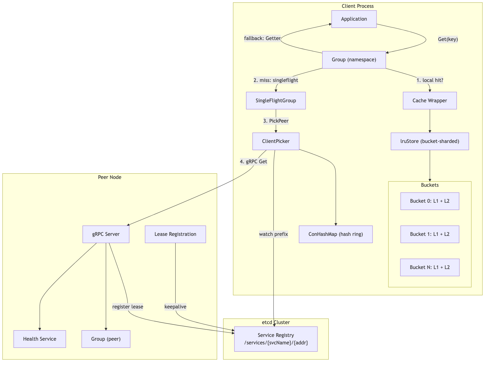
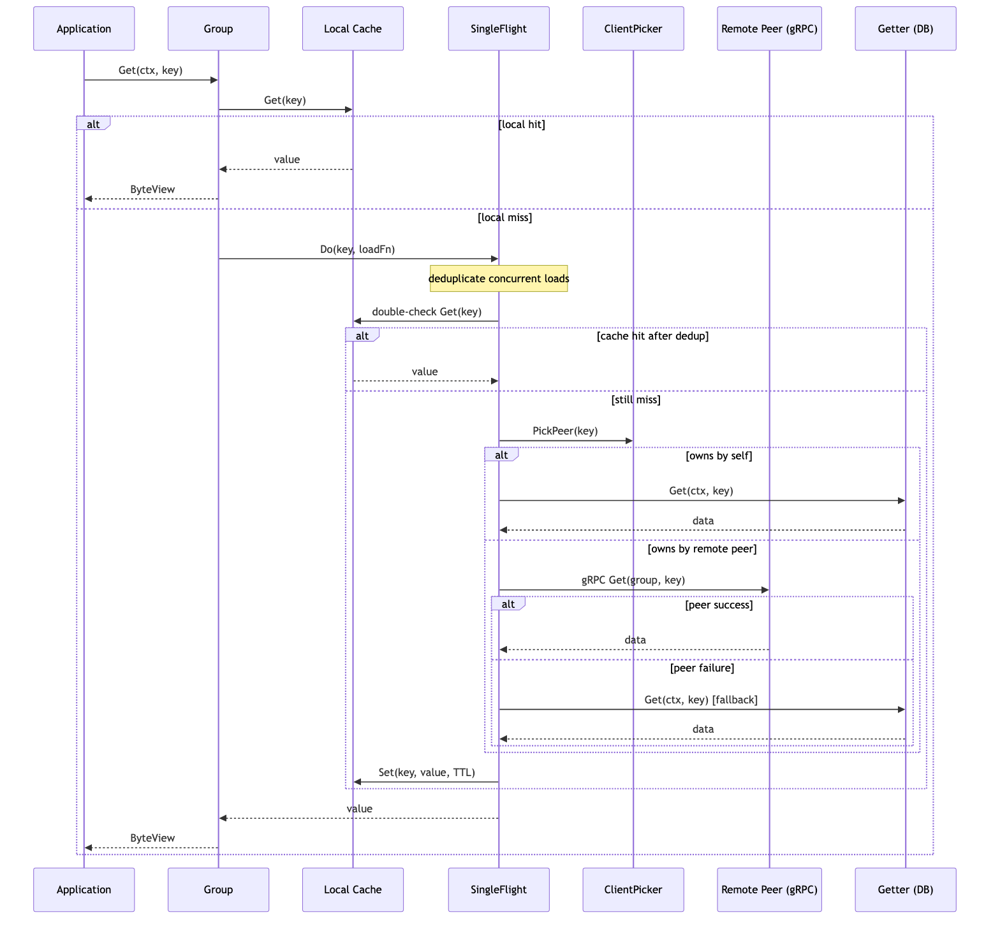

# swifty_cache 分布式缓存 -- 高级后端工程师面试 QA

> 基于项目 `github.com/hangtiancheng/swifty.go/swifty_cache` 源码整理，覆盖架构设计、存储引擎、一致性哈希、服务发现、并发控制、容错机制等核心主题。

## 目录

- [1. 项目整体架构](#_1-项目整体架构)
- [2. 读路径 (Read-Through) 设计](#_2-读路径-read-through-设计)
- [3. 写路径与写传播](#_3-写路径与写传播)
- [4. 存储引擎: 分桶双层 LRU](#_4-存储引擎-分桶双层-lru)
- [5. 粗粒度时钟](#_5-粗粒度时钟)
- [6. SingleFlight 并发去重](#_6-singleflight-并发去重)
- [7. 一致性哈希](#_7-一致性哈希)
- [8. etcd 服务发现与注册](#_8-etcd-服务发现与注册)
- [9. gRPC 传输层](#_9-grpc-传输层)
- [10. 防转发环路机制](#_10-防转发环路机制)
- [11. 并发控制与锁设计](#_11-并发控制与锁设计)
- [12. ByteView 不可变语义](#_12-byteview-不可变语义)
- [13. Group 注册表与生命周期](#_13-group-注册表与生命周期)
- [14. 实时 Dashboard](#_14-实时-dashboard)
- [15. 容错与降级策略](#_15-容错与降级策略)
- [16. 性能优化要点](#_16-性能优化要点)
- [17. 与 groupcache 的对比](#_17-与-groupcache-的对比)
- [18. 可能的改进方向](#_18-可能的改进方向)

---

## 1. 项目整体架构

Q: 请介绍 swifty_cache 的整体架构设计。

swifty_cache 是一个仿 Google groupcache 的分布式缓存框架，核心设计目标是在无中心节点的前提下，通过一致性哈希将 key 映射到固定节点，实现缓存的分片存储与对等访问。

整体架构分为四层:

| 层次   | 组件                          | 职责                                  |
| ------ | ----------------------------- | ------------------------------------- |
| 接口层 | `Group`                       | 命名空间隔离，对外暴露 Get/Set/Delete |
| 缓存层 | `Cache` -> `lruStore`         | 分桶双层 LRU，字节预算淘汰            |
| 路由层 | `ClientPicker` + `ConHashMap` | 一致性哈希选节点，etcd 动态发现       |
| 传输层 | `Server` / `Client` (gRPC)    | 节点间 RPC 通信                       |



关键设计决策:

- 无中心节点: 每个节点既是 Server 也是 Client，通过对等协议互访问
- Read-Through 语义: 调用方只需提供 Getter (数据源回源函数)，缓存层自动处理命中/未命中/远程获取
- 最终一致性: 写操作先写本地，异步传播到拥有该 key 的节点

---

## 2. 读路径 (Read-Through) 设计

Q: 详细描述一次 Get 请求的完整链路。



完整链路 (对应 `group.go` 中 `Group.Get` -> `load` -> `loadData`):

1. 参数校验: 检查 Group 是否已关闭、key 是否为空
2. 本地缓存查询: `mainCache.Get(ctx, key)`，命中则直接返回
3. SingleFlight 去重: 未命中时进入 `SingleFlightGroup.Do(key, fn)`，相同 key 的并发请求只执行一次加载
4. 双重检查: 在 singleflight 回调内部再次查询本地缓存 (避免在等待期间被其他 goroutine 填充)
5. 路由决策: `peers.PickPeer(key)` 通过一致性哈希确定 key 的归属节点
   - 归属自己: 直接调用 `getter.Get(ctx, key)` 回源
   - 归属远端: 通过 gRPC 调用 `peer.Get(group, key)`
6. 降级回源: 远端调用失败时，fallback 到本地 Getter
7. 写入缓存: 将结果以 TTL 写入本地 `mainCache`
8. 返回: 包装为 `ByteView` 返回给调用方

Q: 为什么在 singleflight 内部要做双重检查 (double-check)?

考虑以下时序: goroutine A 和 B 同时 Get 同一个 key，A 先完成加载并写入缓存。当 B 获得 singleflight 的执行权时 (A 的 Do 已返回，key 已从 sync.Map 中删除)，如果不做 double-check，B 会重复回源。双重检查避免了这种 "singleflight 窗口期" 导致的冗余加载。

---

## 3. 写路径与写传播

Q: Set 和 Delete 操作如何保证多节点间的数据一致性?

写路径 (对应 `group.go` 中 `Group.Set` / `Group.Delete`):

1. 本地写入: 先写入本地 `mainCache`
2. 判断来源: 通过 `isPeerRequest(ctx)` 判断请求是否来自其他节点的转发
3. 异步传播: 如果不是来自 peer 的请求，启动 goroutine 调用 `syncToPeers`:
   - 通过 `PickPeer(key)` 找到 key 的归属节点
   - 如果归属远端，调用 `peer.Set(ctx, group, key, value)` 或 `peer.Delete`
   - 使用 3 秒超时的 context
   - 标记 `withPeerRequest(ctx)` 防止接收方再次转发

Q: 这种写传播方案的一致性保证是什么级别? 有什么局限?

这是最终一致性模型，存在以下局限:

- 异步 goroutine 传播，不保证写入成功 (网络故障时丢失)
- 没有版本号/向量时钟，并发写可能产生冲突 (last-write-wins)
- 3 秒超时后直接放弃，没有重试队列
- 适用于读多写少、对一致性要求不严格的缓存场景

---

## 4. 存储引擎: 分桶双层 LRU

Q: lruStore 的分桶双层设计解决了什么问题?

对应 `lru.go` 中的 `lruStore` 结构:

```go
type lruStore struct {
    locks          []sync.Mutex   // 每个桶一把锁
    caches         [][2]*cache    // [bucket][level], L1=热数据, L2=温数据
    maxBucketBytes int64          // MaxBytes / bucketCount
    mask           int32          // 桶选择的位掩码
}
```

分桶 (Bucket Sharding) 解决锁竞争问题:

- 将 key 空间通过 BKDR Hash + 位掩码分散到 N 个桶 (默认 16 个)
- 每个桶独立的 `sync.Mutex`，并发写入不同桶时完全无竞争
- 桶数取 2 的幂次，用位运算 `hash & mask` 替代取模

双层 (L1/L2) 解决扫描污染问题:

- L1 (热层): 新写入的数据进入 L1，容量较大 (默认 512)
- L2 (温层): 从 L1 被淘汰的数据降级到 L2 (默认 256)
- Get 命中 L1 时，数据提升到 L2 (类似 2Q/LIRS 思想)
- 一次性扫描 (scan) 的数据只污染 L1，不会挤占 L2 中的热数据

Q: 底层 cache 结构为什么用数组而非链表节点?

```go
type cache struct {
    doubleLink [][2]uint16       // 侵入式双向链表 (数组下标)
    m          []node            // 固定容量节点池
    hashMap    map[string]uint16 // key -> 1-based index
}
```

设计考量:

- 内存连续: 数组预分配，避免频繁 `new(listNode)` 导致的 GC 压力和内存碎片
- 零分配: 节点在 `Create(cap)` 时一次性分配，后续 put/evict 只修改索引
- 缓存友好: 连续内存布局对 CPU cache line 友好
- uint16 索引: 容量上限 65535，节省内存 (相比指针 8 字节，uint16 仅 2 字节)

Q: 字节预算 (byte budget) 淘汰是如何工作的?

每个桶有独立的字节预算 `maxBucketBytes = MaxBytes / bucketCount`:

1. `Set` 写入新数据后，检查桶的总字节数
2. 如果超出预算，循环调用 `evictFromBucket(idx)`:
   - 优先从 L1 淘汰最久未访问的条目
   - L1 为空时从 L2 淘汰
3. 直到总字节数回到预算以内

这保证了整个缓存的内存使用量不会超过配置的 `MaxBytes` (默认 8MiB)。

---

## 5. 粗粒度时钟

Q: 为什么 TTL 判断不使用 time.Now()? 粗粒度时钟如何实现?

对应 `lru.go` 中的全局时钟:

```go
var clock, p, n = time.Now().UnixNano(), uint16(0), uint16(1)
```

动机: `time.Now()` 在 Linux 上虽然是 vDSO 调用 (非系统调用)，但在极高 QPS 下仍有开销 (约 20-40ns/次)。对于 TTL 判断，秒级精度足够。

实现:

- `init()` 启动后台 goroutine，每秒与 `time.Now()` 同步一次
- 两次同步之间，以 100ms 为步长线性插值
- `Now()` 函数直接读取原子变量，开销约 1ns

精度: 最大误差约 1 秒，对缓存 TTL (通常分钟级) 完全可接受。

---

## 6. SingleFlight 并发去重

Q: SingleFlightGroup 的实现原理是什么? 与标准库 golang.org/x/sync/singleflight 有何异同?

对应 `single_flight.go`:

```go
type SingleFlightGroup struct {
    m sync.Map
}

func (g *SingleFlightGroup) Do(key string, fn func() (interface{}, error)) (interface{}, error)
```

实现原理:

1. 构造 `call` 结构 (含 WaitGroup)
2. `sync.Map.LoadOrStore(key, call)`: 第一个到达的 goroutine 存储成功，获得执行权
3. 后续 goroutine Load 到已有 call，`wg.Wait()` 阻塞等待
4. 执行者完成 fn 后，`wg.Done()` 唤醒所有等待者
5. `defer g.m.Delete(key)`: 执行完毕后删除，后续请求重新执行

与 x/sync/singleflight 的差异:

| 维度        | swifty_cache         | x/sync/singleflight  |
| ----------- | -------------------- | -------------------- |
| 底层结构    | `sync.Map` (无锁)    | `sync.Mutex` + `map` |
| panic 处理  | recover 后返回 error | propagate panic      |
| Forget 方法 | 无 (自动 delete)     | 有                   |
| 适用场景    | 高并发读缓存         | 通用                 |

Q: 如果 fn 内部 panic 会怎样?

swifty_cache 的实现会 recover panic 并将其包装为 error 返回给所有等待者，不会导致进程崩溃。这比 x/sync/singleflight 的 "panic 传播给所有等待者" 更安全，适合缓存场景 (一次回源失败不应影响所有并发请求)。

---

## 7. 一致性哈希

Q: ConHashMap 的实现细节? 虚拟节点的作用是什么?

对应 `con_hash.go`:

```go
type ConHashMap struct {
    keys      []int            // 排序的虚拟节点哈希值
    hashMap   map[int]string   // 哈希值 -> 物理节点
    nodeHashes map[string][]int // 物理节点 -> 其所有虚拟哈希
}
```

虚拟节点 (默认 50 个/物理节点):

- 解决数据倾斜: 3 个物理节点只有 3 个哈希点，key 分布极不均匀
- 50 个虚拟节点使分布趋近均匀 (标准差随虚拟节点数增加而减小)
- 哈希函数: CRC32 (IEEE)，对字符串 `"{node}#{i}"` 计算

查找过程:

1. 对 key 计算 CRC32 哈希
2. 在排序的 `keys` 切片上二分查找 (`sort.Search`)，找到第一个 >= hash 的虚拟节点
3. 环形语义: 如果超出末尾则回绕到第一个节点
4. 通过 `hashMap[virtualHash]` 得到物理节点

Q: 节点增删时如何最小化数据迁移?

- 增加节点: 只影响新节点在环上 "接管" 的区间，其他节点的 key 映射不变
- 删除节点: 该节点的虚拟点被移除，其 key 顺时针漂移到下一个节点
- 理论上每次增删只迁移 `1/N` 的数据 (N 为节点数)

---

## 8. etcd 服务发现与注册

Q: 服务注册和发现的完整流程是什么?

注册 (Server 侧, `register.go`):

1. 解析本机 IP，将 `:port` 规范化为 `IP:port`
2. 向 etcd 申请 10 秒 Lease
3. 以 Lease 为 TTL，Put key `/services/{svcName}/{addr}`
4. 启动 KeepAlive 续租 (etcd 自动每 ~3.3s 续一次)
5. 后台 goroutine 监控:
   - `stopCh` 关闭: 主动 Revoke Lease (优雅下线)
   - KeepAlive channel 关闭 (网络分区): 指数退避重注册 (1s -> 30s 上限)

发现 (Client 侧, `peers.go` 中 `ClientPicker`):

1. 初始化: `fetchAllServices()` 全量拉取 `/services/{svcName}/` 前缀下所有 key
2. 持续监听: `watchServiceChanges()` 从返回的 revision 开始 Watch
3. 事件处理:
   - PUT 事件: 创建 gRPC Client，加入一致性哈希环
   - DELETE 事件: 关闭 Client，从哈希环移除
   - 跳过自身地址
4. 断线重连: Watch channel 断开后，1s 退避，重新 fetch + watch

Q: 为什么用 Watch + 全量 Reconcile 而不是纯 Watch?

- etcd Watch 有 revision 限制: 如果 compaction 发生在断线期间，Watch 会返回 `ErrCompacted`
- 全量 Reconcile 保证最终一致: 即使丢失事件，重新 fetch 后对比本地状态，增补缺失、移除多余
- 这是 etcd 服务发现的标准模式 (类似 Kubernetes Informer 的 List+Watch)

---

## 9. gRPC 传输层

Q: gRPC 通信层是如何设计的?

Proto 定义 (`pb/swifty.proto`):

```protobuf
service SwiftyCache {
  rpc Get(Request) returns (ResponseForGet);
  rpc Set(Request) returns (ResponseForGet);
  rpc Delete(Request) returns (ResponseForDelete);
}
```

Server 侧 (`server.go`):

- 注册 `SwiftyCacheServer` + gRPC Health Service
- `MaxRecvMsgSize` 默认 4MiB，防止大 value 导致 OOM
- 所有 handler 注入 `withPeerRequest(ctx)` 标记

Client 侧 (`client.go`):

- `grpc.WithInsecure()` (内网通信，无 TLS)
- `grpc.WithBlock()` + `WaitForReady(true)`: 连接未就绪时排队而非立即失败
- Get/Delete 使用 3 秒超时 context
- Set 使用调用方传入的 context (支持上层超时传播)

Q: 为什么选择 gRPC 而非 HTTP/REST?

- 二进制序列化 (protobuf) 比 JSON 更紧凑，减少网络带宽
- HTTP/2 多路复用，单连接支持并发请求
- 强类型接口定义，编译期发现错误
- 内建 Health Check 协议，配合 etcd 实现健康感知

---

## 10. 防转发环路机制

Q: 如何防止节点间的请求无限转发?

问题场景: A 收到用户请求，PickPeer 指向 B，转发给 B。B 收到后如果再次 PickPeer 指向 C (或 A)，就会形成转发链甚至环路。

解决方案 (`group.go`):

```go
type peerRequestContextKey struct{}

func withPeerRequest(ctx context.Context) context.Context {
    return context.WithValue(ctx, peerRequestContextKey{}, true)
}

func isPeerRequest(ctx context.Context) bool {
    return ctx.Value(peerRequestContextKey{}) != nil
}
```

规则:

- Server 收到远端请求时，注入 `peerRequest` 标记
- `loadData` 中检查: 如果 `isPeerRequest(ctx) == true`，不再转发，直接调用本地 Getter
- 写传播同理: `isPeerRequest` 为 true 时不再 `syncToPeers`

这保证了请求最多被转发一次 (一跳语义)，从根本上杜绝环路。

---

## 11. 并发控制与锁设计

Q: 项目中使用了哪些并发控制手段? 如何避免死锁?

| 组件                       | 锁类型            | 粒度                       |
| -------------------------- | ----------------- | -------------------------- |
| `lruStore`                 | `[]sync.Mutex`    | 每桶一把，写入只锁一个桶   |
| `Cache`                    | `sync.RWMutex`    | 保护 store 指针 (懒初始化) |
| `Group.peersMu`            | `sync.RWMutex`    | 保护 PeerPicker 引用       |
| `ConHashMap`               | `sync.RWMutex`    | 保护哈希环读写             |
| `ClientPicker`             | `sync.RWMutex`    | 保护 clients map           |
| `SingleFlightGroup`        | `sync.Map`        | 无锁 CAS 语义              |
| `groups` 注册表            | `sync.RWMutex`    | 进程级 Group 注册/销毁     |
| `Cache.initialized/closed` | `atomic.Int32`    | 无锁状态标记               |
| `groupStats`               | `atomic.AddInt64` | 无锁计数器                 |

死锁预防:

- `DestroyGroup` / `DestroyAllGroups` 先释放 `groupsMu` 锁，再调用 `group.Close()`，避免 Close 内部获取其他锁时与注册表锁形成环路
- lruStore 的桶锁之间无嵌套 (一次操作只锁一个桶)
- 写传播使用独立 goroutine + 超时 context，不持有调用方的任何锁

---

## 12. ByteView 不可变语义

Q: ByteView 的设计意图是什么?

```go
type ByteView struct {
    b []byte
}

func (b ByteView) ByteSlice() []byte { return cloneBytes(b.b) }
func (b ByteView) String() string    { return string(b.b) }
```

设计意图:

- 缓存的 value 被多个 goroutine 并发读取，如果直接暴露 `[]byte`，调用方可能意外修改
- `ByteView` 是值类型 (struct 包含 slice header)，拷贝的是 header 而非底层数组
- `ByteSlice()` 返回防御性拷贝，保证缓存内部数据不被外部篡改
- `String()` 通过 `string(b.b)` 转换 (Go 中 string 是不可变的)

Q: 为什么不在 Get 时就拷贝，而是延迟到调用方需要时?

性能考量: 很多场景调用方只需要读取 (如序列化到网络)，不需要修改。延迟拷贝避免了不必要的内存分配。只有真正需要 `[]byte` 修改时才调用 `ByteSlice()`。

---

## 13. Group 注册表与生命周期

Q: Group 的全局注册表如何工作? 为什么 NewGroup 重复注册会 panic?

```go
var groupsMu sync.RWMutex
var groups = make(map[string]*Group)
```

- `NewGroup`: 注册到全局 map，重复名称 panic (防止配置错误导致两个 Group 共享缓存空间)
- `GetGroup`: 按名称查找，未找到返回 nil
- `DestroyGroup`: 从 map 移除并 Close (先解锁再 Close，避免死锁)
- `DestroyAllGroups`: 遍历所有 Group 执行销毁

Q: Group.Close() 做了什么?

1. `atomic.CompareAndSwapInt32(&g.closed, 0, 1)` 保证幂等
2. 关闭 `mainCache` (停止 TTL 清理 goroutine)
3. 关闭 `peers` (关闭所有 gRPC 连接、etcd 连接、取消 Watch)

---

## 14. 实时 Dashboard

Q: Dashboard 的实现方案是什么?

对应 `dashboard.go`:

- 基于 `swifty_http` 框架启动 HTTP 服务
- WebSocket 端点 `/dashboard/ws`
- 每 2 秒推送一次 JSON 快照 (所有启用 Dashboard 的 Group 的统计信息和条目列表)
- 30 秒心跳保活
- 支持命令交互 (如 delete 指定 key)
- `sync.Once` 保证全局只启动一次

数据结构:

```go
type dashboardSnapshot struct {
    Type   string          `json:"type"`
    Groups []groupSnapshot `json:"groups"`
}
```

---

## 15. 容错与降级策略

Q: 系统在各种故障场景下的行为是什么?

| 故障场景              | 处理方式                                                 |
| --------------------- | -------------------------------------------------------- |
| 远端 peer 不可达      | gRPC 3s 超时后 fallback 到本地 Getter 回源               |
| etcd 不可用 (注册)    | 指数退避重注册 (1s -> 30s)，服务本身不中断               |
| etcd 不可用 (发现)    | Watch 断开后 1s 重连，期间使用最后一次已知的 peer 列表   |
| Getter 回源失败       | 错误透传给调用方，不缓存错误结果                         |
| SingleFlight 内 panic | recover 后返回 error，不影响其他 key                     |
| 节点优雅下线          | 主动 Revoke Lease，peer 收到 DELETE 事件移除该节点       |
| 节点崩溃              | Lease 10s 过期，etcd 自动删除 key，peer 收到 DELETE 事件 |
| 写传播失败            | 静默丢弃 (3s 超时)，不影响本地写入的成功返回             |

Q: 如果 etcd 完全宕机，缓存还能工作吗?

可以。已建立的 gRPC 连接不依赖 etcd 持续可用。影响仅限于:

- 无法发现新加入的节点
- 无法感知下线节点 (对已下线节点的请求会超时后 fallback)
- 新节点无法注册 (但不影响其本地缓存功能)

---

## 16. 性能优化要点

Q: 项目中有哪些值得学习的性能优化?

1. 分桶降低锁粒度: 16 桶 x 独立 Mutex，写并发提升 ~16x
2. 数组式 LRU: 预分配节点池 + uint16 索引，零 GC 压力
3. 粗粒度时钟: 避免每次 TTL 判断调用 `time.Now()`
4. BKDR Hash + 位掩码: 比 `hash % N` 更快 (位运算 vs 除法指令)
5. sync.Map 实现 SingleFlight: 读多写少场景下比 Mutex+map 更优
6. ByteView 延迟拷贝: 只读场景零分配
7. atomic 计数器: stats 统计无锁累加
8. gRPC WaitForReady: 避免连接建立期间的请求失败
9. 双重检查: singleflight 内部再查缓存，减少冗余回源

---

## 17. 与 groupcache 的对比

Q: swifty_cache 相比 Google groupcache 有哪些扩展?

| 维度         | groupcache               | swifty_cache                 |
| ------------ | ------------------------ | ---------------------------- |
| 存储引擎     | 单层 LRU + sync.Mutex    | 分桶双层 LRU，字节预算       |
| 服务发现     | 静态 peer 列表           | etcd 动态发现 + Watch        |
| 写操作       | 不支持 (纯 read-through) | 支持 Set/Delete + 异步写传播 |
| 传输层       | HTTP (可选 gRPC)         | 纯 gRPC                      |
| TTL          | 无内建 TTL               | 内建 TTL + 后台清理          |
| 监控         | 无                       | WebSocket 实时 Dashboard     |
| 时钟         | time.Now()               | 粗粒度时钟                   |
| SingleFlight | Mutex + map              | sync.Map                     |
| 健康检查     | 无                       | gRPC Health Service          |

---

## 18. 可能的改进方向

Q: 如果让你继续演进这个项目，会考虑哪些方向?

1. 一致性保证: 引入 Raft 或基于 etcd 的分布式锁实现强一致写
2. 写传播可靠性: 引入 WAL (Write-Ahead Log) + 重试队列，避免异步写丢失
3. 热点探测: 对高频访问 key 自动复制到多个节点，缓解热点问题
4. TLS/mTLS: 当前 gRPC 使用 insecure 连接，生产环境需要加密
5. 多副本: 一致性哈希支持 N 副本，提高可用性
6. 指标暴露: 集成 Prometheus metrics (命中率、延迟分位数、淘汰速率)
7. LRU 改进: 考虑 TinyLFU (Caffeine 风格) 替代纯 LRU，提高命中率
8. 序列化优化: 对大 value 支持 Snappy/LZ4 压缩存储
