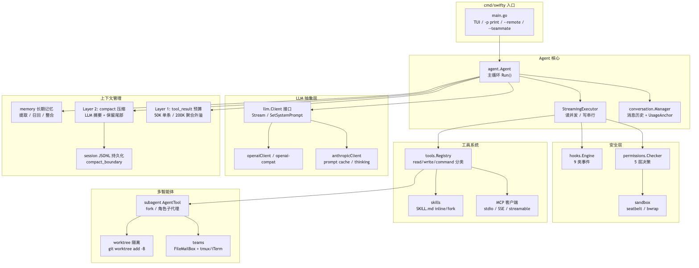
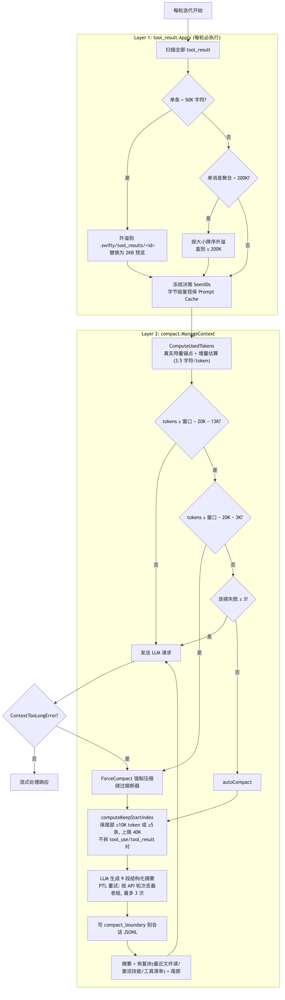

# Swifty CLI Coding Agent 高级后端工程师面试 QA

> 基于 `github.com/hangtiancheng/swifty.go/swifty_cli` 项目源码（Go 1.26，约 2.7 万行非测试代码）整理。该项目是一个终端 CLI Coding Agent，具备多模型接入、流式工具执行、双层上下文管理、五层权限体系、OS 级沙箱、长期记忆、多智能体协作（子代理 / 团队 / git worktree 隔离）、技能系统与 MCP 集成等能力。

## 目录

- [一、架构总览](#一架构总览)
  - [Q1 整体架构与模块划分](#q1-请概述-swifty-cli-的整体架构与模块划分)
  - [Q2 入口有哪几种运行模式](#q2-程序入口有哪几种运行模式各自如何工作)
- [二、Agent 主循环](#二agent-主循环)
  - [Q3 主循环如何驱动一次用户回合](#q3-agent-主循环如何驱动一次用户回合)
  - [Q4 工具调用的并发执行策略](#q4-一轮返回多个工具调用时如何决定并发还是串行)
  - [Q5 max_tokens 截断的恢复机制](#q5-模型输出被-max_tokens-截断时如何恢复)
  - [Q6 流错误处理与重试](#q6-流式请求出错时如何分类处理)
- [三、LLM 抽象层](#三llm-抽象层)
  - [Q7 如何统一三种协议的 Provider](#q7-如何用一个接口统一-anthropicopenaiopenai-compat-三种协议)
  - [Q8 Prompt Cache 的三个断点设计](#q8-prompt-cache-断点如何设计为什么工具结果替换必须字节级稳定)
  - [Q9 SSE 静默断连问题如何解决](#q9-sse-流静默断连问题如何解决)
  - [Q10 上下文窗口的三层解析](#q10-模型上下文窗口大小是如何确定的)
- [四、上下文管理](#四上下文管理)
  - [Q11 两层上下文管理机制](#q11-描述两层上下文管理机制的分工)
  - [Q12 Layer 1 工具结果预算算法](#q12-layer-1-工具结果预算的两趟算法是什么)
  - [Q13 Layer 2 压缩的触发阈值与保留策略](#q13-layer-2-压缩何时触发保留什么)
  - [Q14 token 用量如何估算](#q14-没有-tokenizer如何估算当前上下文-token-用量)
  - [Q15 压缩自身超限怎么办](#q15-压缩请求本身超出上下文怎么办)
  - [Q16 压缩后的恢复与断点持久化](#q16-压缩后如何恢复工作状态如何支持会话恢复)
- [五、工具系统](#五工具系统)
  - [Q17 Tool 接口与延迟加载](#q17-tool-接口如何设计为什么需要延迟加载工具)
  - [Q18 Bash 工具的退出码语义](#q18-bash-工具为什么不把非零退出码一律当错误)
  - [Q19 read-before-edit 如何强制](#q19-如何防止模型盲改文件)
- [六、权限与沙箱](#六权限与沙箱)
  - [Q20 五层权限决策链](#q20-permission-checker-的五层决策链是怎样的)
  - [Q21 OS 级沙箱的跨平台实现](#q21-os-级沙箱在-macos-与-linux-上分别怎么实现)
  - [Q22 Hooks 系统设计](#q22-hooks-系统支持哪些事件与动作)
- [七、记忆与会话](#七记忆与会话)
  - [Q23 长期记忆体系](#q23-长期记忆如何组织提取与召回)
  - [Q24 无锁服务下的文件锁设计](#q24-后台整合进程如何用文件锁防止并发)
  - [Q25 会话持久化与恢复](#q25-会话如何持久化崩溃后如何恢复)
- [八、多智能体与扩展](#八多智能体与扩展)
  - [Q26 子代理与 Fork 机制](#q26-子代理有哪几种形态fork-模式解决什么问题)
  - [Q27 团队协作与文件邮箱](#q27-teams-如何实现跨进程多-agent-协作)
  - [Q28 Git worktree 隔离](#q28-为什么用-git-worktree-做并行隔离如何实现)
  - [Q29 技能系统与渐进式披露](#q29-技能系统如何做渐进式披露)
  - [Q30 MCP 集成](#q30-mcp-如何集成为什么-mcp-工具默认延迟加载)
- [九、工程与可靠性](#九工程与可靠性)
  - [Q31 项目中的典型 Go 并发模式](#q31-项目中用到了哪些典型-go-并发模式)
  - [Q32 可靠性兜底设计盘点](#q32-盘点项目中的可靠性兜底设计)

---

## 一、架构总览

### Q1 请概述 Swifty CLI 的整体架构与模块划分

**答**：项目是单二进制 Go 程序（`cmd/swifty`），核心按职责分为七块：

1. **Agent 核心**（`internal/agent`）：`Agent.Run` 主循环 + `StreamingExecutor` 工具批处理器 + `conversation.Manager` 消息历史。
2. **LLM 抽象层**（`internal/llm`）：`Client` 接口统一 anthropic / openai / openai-compat 三种协议，统一为一套 `StreamEvent` 流式事件模型。
3. **上下文管理**：Layer 1 工具结果预算（`internal/tool_result`）+ Layer 2 LLM 摘要压缩（`internal/compact`），配合 `internal/session` 的 JSONL 持久化。
4. **安全层**：五层权限决策（`internal/permissions`）、OS 级沙箱（`internal/sandbox`，seatbelt/bwrap）、事件钩子（`internal/hooks`）。
5. **工具系统**（`internal/tools`）：ReadFile/WriteFile/EditFile/Bash/Glob/Grep 内置工具 + MCP 外部工具（`internal/mcp`）+ 技能（`internal/skills`）。
6. **多智能体**：子代理（`internal/subagent`）、团队（`internal/teams`）、git worktree 隔离（`internal/worktree`）。
7. **交互层**：bubbletea TUI（`internal/tui`）、`-p` 非交互模式、基于自研 `swifty_http` 的 `--remote` WebSocket 服务（`internal/remote`）。

依赖上，仅引入 anthropic-sdk-go、openai-go、MCP go-sdk、charmbracelet 系（TUI）等少量库，Agent 循环、权限、压缩、记忆等核心逻辑全部自研。

### Q2 程序入口有哪几种运行模式？各自如何工作？

**答**：`cmd/swifty/main.go:35` 按 flag 分发四种模式：

1. **Teammate 工作进程**（`--teammate`）：被团队 Lead 通过 tmux/iTerm 拉起的无头工作进程，任务从文件邮箱读取，事件流打到 stderr 供终端面板展示（`cmd/swifty/teammate.go`）。
2. **Print 模式**（`-p/--print`）：非交互一次性执行，prompt 可来自参数或 stdin，支持指定输出格式，适合脚本/CI。
3. **Remote 模式**（`--remote [addr]`）：默认 `:18888`，用同仓库的 `swifty_http` 框架起 HTTP 服务，`GET /` 提供 Web UI、`GET /ws` 升级 WebSocket 双向转发 Agent 事件（`internal/remote/server.go:154`）。
4. **默认 TUI 模式**：`tea.NewProgram` 启动 bubbletea 终端界面。

四种模式共享同一套 `config.LoadConfig` 配置（providers、permission_mode、mcp_servers、hooks、sandbox、enable_coordinator_mode），hooks 配置启动时统一 `hooks.Validate` 校验，非法则降级为无钩子启动而不是崩溃。

## 二、Agent 主循环

### Q3 Agent 主循环如何驱动一次用户回合？

**答**：`Agent.Run`（`internal/agent/agent.go:182`）返回一个带 32 缓冲的 `<-chan AgentEvent`，在独立 goroutine 中跑 for 循环，每轮迭代依次：

1. 检查 `MaxIterations`（0 表示不限）与 `ctx.Err()` 取消；
2. 计算本轮工具 schema（尊重 `ToolNameFilter`，供 Coordinator 模式动态裁剪）；
3. 注入各类 system-reminder：Plan 模式工作流提醒、通知、延迟工具清单；
4. **Layer 1**：`tool_result.Apply` 原地裁剪超预算工具结果；**Layer 2**：`compact.ManageContext` 按阈值压缩（agent.go:243-257）；
5. `Client.Stream` 发起流式请求，边收边转发 `ThinkingDelta/TextDelta/ToolCall*` 事件，`ToolCallComplete` 时把调用 Submit 进 `StreamingExecutor`；
6. 流结束后 `RecordUsageAnchor` 锚定真实 token 用量，再 `executor.ExecuteAll` 分批执行工具；
7. 结果超过 `tools.MaxOutputChars`（10000 字符）的先外溢到磁盘；连续 3 次未知工具名则终止（agent.go:428）；
8. 无工具调用即 `LoopComplete`，并 fire-and-forget 触发 `OnLoopComplete`（后台记忆提取）；`ExitPlanMode` 被调用也会结束循环。

值得强调的两个细节：长期记忆通过 `MemoryRecallCh` 与首次 LLM 调用**并行预取**，在工具执行完成后非阻塞注入且只消费一次（agent.go:444-454）；权限 Ask 决策通过 `PermissionRequestEvent{ResponseCh}` 把一个应答 channel 递给 UI，实现 HITL 阻塞等待（agent.go:585-591）。

### Q4 一轮返回多个工具调用时，如何决定并发还是串行？

**答**：`StreamingExecutor.ExecuteAll`（`internal/agent/streaming_executor.go:78`）按**安全类别分批**：`partitionToolCalls` 把相邻的只读工具（`Category() == CategoryRead`）合并成一个并发批次，用 WaitGroup 并行执行；写/命令类工具各自独占串行批次。结果数组按原始下标回填，保证返回顺序与模型请求顺序一致，避免 tool_result 与 tool_use 错位。这是一个典型的"读并发、写串行"策略：读操作天然幂等可并行提速，写和命令有副作用必须保序，且实现上只用一个 mutex + index 回填，避免了复杂的依赖图分析。

### Q5 模型输出被 max_tokens 截断时如何恢复？

**答**：分两级（agent.go:337-365）：

- **第一次命中**：静默把 `MaxOutputTokens` 升到 `maxTokensCeiling`（64000，通过 `llm.MaxTokensSetter` 接口），把已生成文本入会话，追加一条用户消息"从中断处直接续写，不要道歉不要重复"，重试。
- **仍然命中**：进入多轮恢复，最多 `maxOutputTokensRecoveries = 3` 次，提示模型"把剩余工作拆小"。耗尽后按正常完成处理。成功一轮后计数器归零。

这套设计避免了"半截输出直接丢弃重来"的浪费——已生成内容保留在历史中，模型接着写。

### Q6 流式请求出错时如何分类处理？

**答**：`handleStreamError`（agent.go:500）用 `errors.As` 分类：

- `ContextTooLongError`：说明估算低估了真实 token，立即 `ForceCompact` 强制压缩后重试本轮，并通知调用方清除已失效的 usage 锚点；
- `RateLimitError`：解析 `Retry-After` 头（缺省 5s）后 `select { time.After / ctx.Done }` 等待重试；
- 其他错误：作为 `ErrorEvent` 上抛终止。

另有压缩自身的熔断器：自动压缩连续失败 `MaxConsecutiveAutoCompactFailures = 3` 次后停止重试，防止上下文已不可恢复时每轮都打一发注定失败的 API（`internal/compact/compact.go:106`）。

## 三、LLM 抽象层

### Q7 如何用一个接口统一 anthropic/openai/openai-compat 三种协议？

**答**：接口极小化（`internal/llm/client.go:31`）：

- `Client` 只有两个方法：`Stream(ctx, conv, tools) (<-chan StreamEvent, <-chan error)` 和 `SetSystemPrompt(string)`；工厂 `NewClient` 按 `cfg.Protocol` 分发到三个实现。
- 差异被压到两个边界上：**输入侧**，`Registry.GetAllSchemas(protocol)` 把 Anthropic 风格的 `input_schema` 转成 OpenAI 的 `{type:function, parameters}`（`internal/tools/tool.go:124`）；**输出侧**，各实现把私有 SSE 事件归一成 7 种 `StreamEvent`（TextDelta、ThinkingDelta、ThinkingComplete、ToolCallStart/Delta/Complete、StreamEnd）。
- 可选能力用小接口探测而不是塞进主接口：`MaxTokensSetter`（动态调 max_tokens）、`contextWindowFetcher`（仅 Anthropic 实现，拉取模型窗口）。

这体现了 Go 的"隐式小接口 + 类型断言探测可选能力"惯用法，新增 Provider 只需实现 Stream，Agent 循环零改动。

### Q8 Prompt Cache 断点如何设计？为什么工具结果替换必须字节级稳定？

**答**：Anthropic 客户端打了**三个 ephemeral cache_control 断点**（`internal/llm/anthropic.go:160-190`）：

1. system prompt（最长期稳定的前缀）；
2. 工具列表最后一个 schema（工具 schema 跨轮稳定）；
3. 最后一条 user 消息的末尾内容块（`markLastUserTailForCache`，anthropic.go:342）。

Anthropic 缓存到断点为止的前缀，且下次请求会做**字节级一致性**校验。因此 Layer 1 的 `ContentReplacementState` 把每个 tool_result 的替换决策**永久冻结**：首次见到某 tool_use_id 时决定"外溢成预览"或"保持原文"，此后每轮**逐字节复放**同一字符串（`internal/tool_result/budget.go:94-116`），绝不因为后续预算变化改写历史，否则缓存前缀失效，整个上下文重新计费。这也是 fork 子代理要 `Clone()` 父状态的原因——共享历史的父子必须复用同一批冻结决策，缓存前缀才能命中。

### Q9 SSE 流静默断连问题如何解决？

**答**：SDK 的 `stream.Next()` 在底层连接无 FIN/RST 死掉时会永久阻塞。解法是把读取放到独立 goroutine，主循环 `select` 三路（anthropic.go:200-234）：

- `nextCh`：正常收到事件，重置 idle 计时器；
- `idle.C`：超过 `anthropicStreamIdleTimeout` 无任何 SSE 事件，判定静默断连，返回 `NetworkError`；
- `ctx.Done()`：用户取消。

计时器重置用了标准的 `if !t.Stop() { drain }` 防泄漏写法。另一个兼容性细节：某些 OpenAI 兼容网关（如 MiniMax）把 InputTokens/缓存字段放在 message_delta 里，而 SDK 的 `Accumulate` 只拷贝 OutputTokens，所以手动补丁回填（anthropic.go:243-255）。

### Q10 模型上下文窗口大小是如何确定的？

**答**：三层解析，优先级从高到低：

1. **显式配置**：`ProviderConfig.ContextWindow`（YAML `context_window`）直接生效；
2. **API 拉取**：`ResolveContextWindow`（client.go:70）仅对 anthropic 协议，启动时调 `/v1/models/{model}` 取 `max_input_tokens`，一次拉取缓存在 cfg 上。全程 best-effort：禁用 SDK 重试、带超时、`recover()` 兜底 panic，任何失败都静默落到下一层（anthropic.go:104-123）；
3. **内置映射表/默认值**：按模型名子串匹配（`1m`/`gpt-4.1` 族 1M，`gpt-4o`/`gpt-4-turbo` 128K，`o1/o3/o4` 与 `claude` 200K，config.go:78-86），都未命中时保守兜底：claude 系 200000、其余 128000（config.go:118-132）。

设计要点是"启动路径上的网络调用永远不能阻塞或搞挂进程"。

## 四、上下文管理

### Q11 描述两层上下文管理机制的分工

**答**：

- **Layer 1（`tool_result.Apply`）**：每轮必执行，细粒度、无 LLM 参与。把超预算的工具结果外溢到 `.swifty/tool_results/` 并替换为带 2KB 预览的存根，决策冻结保证缓存稳定。解决"单个工具结果撑爆上下文"。
- **Layer 2（`compact.ManageContext`）**：按 token 阈值触发，调用 LLM 把**旧前缀**总结为结构化摘要，**最近尾部原样保留**，压缩后附加恢复块。解决"长会话累计增长"。

两层解耦的原因写在注释里（compact.go:27）：Layer 1 需要跨轮的 `ContentReplacementState`，自然挂在 Agent 上；Layer 2 是对话级的整体重写。此外还有兜底路径：真实请求返回 `ContextTooLongError` 时直接 `ForceCompact`。

### Q12 Layer 1 工具结果预算的两趟算法是什么？

**答**（`internal/tool_result/budget.go`）：

- **Pass 1（单条限制）**：单个 tool_result 超过 `SingleResultLimit = 50000` 字符即外溢到 `.swifty/tool_results/<tool_use_id>`，替换为 `<persisted-output>` 存根（含大小、路径、前 2000 字符预览）。阈值必须显著大于 `MaxOutputChars(10000)`，避免被截断的结果再次触发外溢造成循环。
- **Pass 2（消息聚合限制）**：同一条消息内所有 tool_result 总量超过 `MessageAggregateLimit = 200000` 时，按内容长度**降序**依次外溢，直到总量达标。

三个防御细节：(1) **回读环路防护** `isSpillReadback`——模型 ReadFile 读回外溢文件时不再外溢，否则会产生"存根的存根"链；(2) 外溢失败时把该 id 冻结为原文，不中断整轮；(3) 写文件用 `O_CREATE|O_EXCL`，已存在直接复用，天然幂等（budget.go:301）。

### Q13 Layer 2 压缩何时触发？保留什么？

**答**：阈值公式（compact.go:90）：`effectiveWindow = contextWindow − min(maxOutput, 20000)`；软触发线 `effectiveWindow − 13000`（自动压缩，受熔断器保护），硬阻断线 `effectiveWindow − 3000`（强制压缩，绕过熔断器）。

保留策略 `computeKeepStartIndex`（compact.go:392）：从尾部向前累计 token，满足"≥ 10000 token 或 ≥ 5 条消息"其一即停，但上限 40000 token；边界若落在带 tool_results 的消息上，向前吸附跨过配对的 assistant tool_use 消息，**绝不拆散 tool_use/tool_result 对**（否则 API 直接拒绝孤儿 tool_result）。前缀交给 LLM 生成九段式结构化摘要（用户意图、技术概念、文件与代码、错误与修复、全部用户消息、待办、当前工作、下一步等），采用 `<analysis>` 草稿 + `
` 两段输出，仅保留 summary 段。

### Q14 没有 tokenizer，如何估算当前上下文 token 用量？

**答**：**真实用量锚点 + 增量估算**（compact.go:217-248）：

- 每轮 API 返回后 `RecordUsageAnchor` 记录 `baseline = input + cache_read + cache_creation + output`（Anthropic 的 cache 命中不计入 input_tokens，必须四项相加才是真实 prompt 大小）和当时的消息数 `anchorCount`；
- 之后估算 = `baseline + EstimateTokens(锚点之后新增的消息)`，其中 `EstimateTokens` 用 3.5 字符/token 近似；
- 冷启动（第一轮）无锚点时退化为全量字符估算；压缩后锚点失效必须 `ClearUsageAnchor`，且带防御性 clamp（anchorCount 越界则回退全量估算）。

这个方案的好处是：越接近阈值（决策越关键）时，估算里真实值的占比越大，误差只来自最近一小段增量。

### Q15 压缩请求本身超出上下文怎么办？

**答**：PTL（prompt-too-long）重试（compact.go:601-642）：捕获 `ContextTooLongError` 后，`groupMessagesByAPIRound` 按 API 轮次边界分组（每个组内 tool_use/tool_result 完整配对），从最老的组开始丢弃，目标丢掉约 1/5 的估算 token，最多重试 `maxPTLRetries = 3` 次。丢弃后如首条不是 user 角色，插入 `[earlier conversation truncated...]` 标记消息保证请求以 user 开头。按轮次分组丢弃而不是按消息丢弃，同样是为了不产生孤儿 tool_result。

### Q16 压缩后如何恢复工作状态？如何支持会话恢复？

**答**：两个机制：

1. **内存内恢复块**：`RecoveryState` 并发安全地记录最近的文件读取快照（每次 ReadFile 成功后重读磁盘存一份，agent.go:645-651）和已激活技能 SOP；压缩后 `BuildRecoveryAttachment` 把这些快照 + 当前工具清单拼在摘要消息后面，模型不用重新 Read 一遍刚看过的文件。
2. **磁盘断点**：`session.SaveCompactBoundary` 向会话 JSONL 追加一条 `type=compact_boundary` 记录，Content 是 `{summary, keep[]}` JSON（`internal/session/session.go:80`）。恢复时 `FindLastCompactBoundary` 找最后一个断点，重建为"摘要消息 + 保留尾部 + 断点后的普通消息"，避免重放全量历史；断点损坏时回退全量重放，旧会话无断点也天然兼容（session.go:98-120）。

摘要消息里还附上完整会话日志路径，模型需要压缩前细节时可以自己 ReadFile 翻旧账。

## 五、工具系统

### Q17 Tool 接口如何设计？为什么需要延迟加载工具？

**答**：核心接口 5 个方法：`Name/Description/Category/Schema/Execute`（`internal/tools/tool.go:48`），`Category` 返回 read/write/command 三类，同时服务于并发批处理（Q4）和权限矩阵（Q20）。两个可选小接口：

- `DeferrableTool.ShouldDefer()`：**延迟工具**不进默认 schema 列表，只在 system-reminder 里列名字，模型需要时用 `ToolSearch` 按 `select:<name>` 加载 schema（agent.go:233）。MCP 工具全部默认延迟（`MCPToolWrapper.ShouldDefer() = true`）。动机：几十个 MCP 工具的 schema 会占掉大量 system 侧 token 且破坏缓存稳定性，延迟加载把成本摊到按需。
- `SystemTool.IsSystemTool()`：如 LoadSkill 这类操作 Agent 自身状态的工具，绕过技能的 allowed_tools 白名单过滤，保证技能间可以互相委派。

### Q18 Bash 工具为什么不把非零退出码一律当错误？

**答**：`interpretExitCode`（`internal/tools/bash.go:50`）内置常见命令的退出码语义表：grep/rg 的 1 表示"无匹配"、diff 的 1 表示"文件有差异"、find 的 1 表示"部分目录不可访问"、test 的 1 表示"条件为假"——这些都不是错误，阈值 ≥2 才算真错。管道命令取最后一段的 base 命令判断（bash 默认行为）。最终 `IsError` 只在超时/中断时为 true，普通非零退出码把 `Exit code N (语义提示)` 拼进输出让模型自己判断。这避免了模型把 "grep 没搜到" 误读为工具故障而反复重试。其余要点：默认 120s、上限 600s 超时（context.WithTimeout）；stdout/stderr 合并为单流；沙箱可用时命令先经 `Sandbox.Wrap` 包装。

### Q19 如何防止模型盲改文件？

**答**：`FileStateCache`（`internal/tools/file_state_cache.go`）以绝对路径为 key 记录每次成功 Read 的 mtime（UnixMilli），Edit/Write 前 `Check`：

- 从未读过 → 拒绝："先读再改"；
- 磁盘 mtime 比缓存新（被外部修改）→ 拒绝："文件已变化，请重新读取"。

ReadFile/WriteFile/EditFile 共享同一个 cache 实例（`CreateDefaultToolsWithWorkDir`，tool.go:229），写成功后 `Update` 刷新 mtime。互斥锁保护 map，因为只读批次里多个 Read 可能并发。这是对 LLM "凭记忆改文件" 幻觉的工程级防御。

## 六、权限与沙箱

### Q20 Permission Checker 的五层决策链是怎样的？

**答**：`Checker.Check`（`internal/permissions/permissions.go:430`）自上而下短路：

1. **Layer 0** Plan 模式例外：写计划文件本身放行；
2. **Layer 1** 安全只读命令白名单（ls/cat/git status 等前缀，且不含重定向、管道、`$()`、反引号等逃逸符）直接放行；
3. **Layer 2** 危险命令黑名单（`rm -rf /`、fork 炸弹、`curl|sh`、`git push --force`、`git reset --hard` 等正则）**无条件先查**、命中即 Deny——注释明确"黑名单是硬防线，沙箱开着也要查"；
4. **Layer 2b** 沙箱自动放行：OS 沙箱启用时命令免确认，但先按 `&& || ; |` 拆分复合命令逐段过规则引擎，任一段 deny 则整体 deny（防 `安全命令 && 危险命令` 绕过，permissions.go:38）；
5. **Layer 3** 路径沙箱：文件工具的路径必须在 allowedRoots（项目根 + os.TempDir）内，且 `.swifty/config.yaml`、`permissions.local.yaml`、`.swifty/skills` 是 denyWrite 保护路径——**防止 Agent 改写自己的权限配置实现提权**；
6. **Layer 4** 规则引擎：user/project/local 三个 YAML 依序求值，后写的规则优先（倒序遍历），`ToolName(pattern)` 语法，自研 glob 里 `*` 匹配含 `/` 的任意字符（标准 filepath.Match 的 `*` 不跨 `/`，会让带路径的命令 allow-always 失效）；
7. **Layer 4b** 会话级 allow-always（内存）+ 模式矩阵（default 读放行写/命令询问；acceptEdits 写也放行；bypass 全放行；plan 未在矩阵中默认 Ask）；
8. **Layer 5** 兜底 Ask → HITL 弹窗。用户选"总是允许"时同时写入会话集与 local 规则文件（agent.go:603-616）。

### Q21 OS 级沙箱在 macOS 与 Linux 上分别怎么实现？

**答**（`internal/sandbox/sandbox_darwin.go` / `sandbox_linux.go`）：

- **macOS**：seatbelt。动态生成 profile：`(deny default)` → 放行 exec/fork/sysctl-read → 全盘可读 → 按 AllowWrite 逐路径放行写 → 按 DenyWrite 逐路径拒写（seatbelt 后写规则优先，文件用 literal、目录用 subpath）→ 网络开关。用**硬编码** `/usr/bin/sandbox-exec` 防 PATH 注入。
- **Linux**：bubblewrap。`bwrap --unshare-user --unshare-pid` 用户/PID 命名空间隔离，`--ro-bind / /` 根只读，AllowWrite 路径 `--bind` 可写，DenyWrite `--ro-bind` 覆盖回只读，`--unshare-net` 断网，挂 `/proc`。
- 其他平台返回不可用实现，`Available()` 为 false 时命令原样执行、退回权限询问路径。

沙箱与权限层是互补关系：沙箱管"进程能碰什么"，权限层管"要不要问人"，黑名单则独立于两者始终生效。

### Q22 Hooks 系统支持哪些事件与动作？

**答**（`internal/hooks/hooks.go`）：9 个事件（session_start/end、turn_start/end、pre_send、post_receive、pre_tool_use、post_tool_use、shutdown），4 种动作（command 外部命令、prompt 注入消息、http 调用、agent 子代理执行）。Hook 属性含 `if` 条件（支持 `file_path =* "**/*.go"` 之类 glob 匹配）、`reject`（pre_tool_use 可阻断工具执行）、`once`、`async`、`on_error`（fail/ignore/reject）三种失败策略，默认超时 10 分钟。配置在启动时集中 `Validate`，用 `errors.Join` 聚合全部问题一次性报出。钩子失败不阻塞主循环，结果进通知队列在下一轮作为 system-reminder 排出（agent.go:469）。

## 七、记忆与会话

### Q23 长期记忆如何组织、提取与召回？

**答**（`internal/memory`）：

- **组织**：双目录——用户级 `~/.swifty/memory/`（user/feedback 类型）与项目级 `<root>/.swifty/memory/`（project/reference 类型），入口文件 `MEMORY.md`，每条记忆是带 frontmatter（描述、类型）的 markdown 文件。四种类型见 `memory_types.go:31`。
- **提取**：主循环 `LoopComplete` 后 `OnLoopComplete` 回调在后台 goroutine 里触发 extractor，用 LLM 从对话中提炼值得保存的记忆，失败静默、不阻塞主流程（agent.go:79-83）。
- **召回**：两条路。启动时 `InjectLongTermMemory` 把指令（SWIFTY.md）+ 记忆内容以 system-reminder 形式一次性前插到对话头部（conversation.go:127）；会话中 `FindRelevantMemories` 用 LLM 按 query 从记忆清单里挑相关项，通过 `MemoryRecallCh` 与首次主 LLM 调用并行预取、工具执行后注入（见 Q3）。
- **保鲜**：`MemoryAge/MemoryFreshnessNote` 给记忆标注年龄，prompt 内置 drift 警示——"记忆可能过期，回答前先核对当前文件状态，冲突时相信现场并更新记忆"。

### Q24 后台整合进程如何用文件锁防止并发？

**答**：记忆整合（consolidation）可能被多个 Swifty 进程同时触发，用 PID 文件锁互斥（`internal/memory/consolidation/lock.go:62`）：

1. stat 锁文件拿 mtime，读内容拿持有者 PID；
2. 锁存在、mtime 在 1 小时内（`holderStaleMs`）、且 PID 进程仍存活（unix 用 `kill(pid, 0)` 探测，Windows 有独立实现）→ 放弃；
3. 否则写入自己的 PID，**读回校验**——若读回不是自己的 PID 说明竞态输了，放弃；
4. 成功时返回原 mtime 供失败回滚（`RollbackLock`），锁文件 mtime 兼作"上次整合完成时间"，一次 stat 就能查（`ReadLastConsolidatedAt`）。

1 小时过期 + 存活探测的组合同时防了两个问题：进程崩溃锁泄漏（过期回收）与 PID 复用误判（即使 PID 活着，超 1 小时也视为过期）。这是无守护进程场景下典型的"穷人版分布式锁"。teams 的文件邮箱用的是另一套：`O_CREATE|O_EXCL` 原子创建 + 10 次重试 + 5-100ms 随机退避 + 10 秒过期（见 Q27）。

### Q25 会话如何持久化？崩溃后如何恢复？

**答**：追加式 JSONL（`internal/session/session.go`）：每条消息一行 `{role, type, tool_use_id, content, ts}`，存于 `.swifty/sessions/<id>.jsonl`；ID 格式为 `时间戳-4位随机hex`，crypto/rand 失败时退化到纳秒时间戳低 16 位。恢复流程：读全部记录 → `FindLastCompactBoundary` 定位最后压缩断点 → 有断点则按"摘要 + keep 尾部 + 断点后消息"重建（避免重放巨量旧历史），无断点或断点 JSON 损坏则全量重放。追加式设计意味着崩溃最多丢最后一条未写完的行，且历史永不被改写——压缩也只是追加断点记录，旧消息仍留在文件里可供模型 ReadFile 查阅。

## 八、多智能体与扩展

### Q26 子代理有哪几种形态？Fork 模式解决什么问题？

**答**：`AgentTool`（`internal/subagent/agent_tool.go`）是单个工具多角色：

- **角色子代理**（`subagent_type=general-purpose/plan/explore/...`，角色由 `AgentLoader` 从定义文件加载）：全新空白上下文 + 按角色过滤的工具集，适合"研究后只带结论回来"，保护主上下文。
- **Fork 子代理**（省略 subagent_type）：**复制父对话上下文**继续跑。关键工程点是 `ParentReplacementState.Clone()`——子代理继承父的工具结果冻结决策但不回写（agent.go:87-91 注释），使父子共享的历史前缀字节一致，Prompt Cache 前缀在两边都命中；嵌套 fork 用 `QuerySource = "agent:builtin:fork"` 标记检测，该信号存在于 Agent 结构而非对话文本里，压缩也冲不掉。
- 参数还支持：`model` 覆盖（sonnet/opus/haiku，经 ModelResolver）、`run_in_background`、`isolation: worktree`（见 Q28）、`team_name`（转为长驻队友）、`mode` 权限模式覆盖——子代理复用父 Checker 的 Sandbox 与 RuleEngine，只覆盖 Mode，保证权限边界不因派生而放松。

### Q27 Teams 如何实现跨进程多 Agent 协作？

**答**（`internal/teams`）：

- **拓扑**：Lead + 多个 teammate。三种后端：in-process（goroutine 内跑 `agent.Run`）、tmux、iTerm——后两者用 `swifty --teammate` 拉起独立进程各占一个终端面板，进程崩溃互不影响且用户可直接观察每个队友。
- **通信**：`FileMailBox`（file_mailbox.go）——每个成员一个 `.swifty/teams/<team>/inboxes/<name>.json` 收件箱，消息 `{from, text, timestamp, read, summary}`。写入走 `withLock`：`O_CREATE|O_EXCL` 原子创建 `.lock` 文件，失败则检查锁是否超 10 秒过期（过期强删），随机退避 5-100ms 重试最多 10 次，拿锁后**重读-修改-写回**。文件邮箱的好处：跨进程天然可用、可观测（就是 JSON 文件）、无需守护进程或消息队列。
- **协调模式**：`EnableCoordinatorMode` 时通过 `Agent.SetToolFilter` 把 Lead 的工具裁剪成仅协调类（Spawn/SendMessage/共享任务列表等），逼迫 Lead 委派而不是自己动手；过滤器每轮迭代重新求值，团队建立/解散无需重启 Agent（agent.go:69-71）。
- **共享任务列表**：`shared_task.go` 提供文件级共享的任务看板，配套 task_tools 供成员认领/更新。

### Q28 为什么用 git worktree 做并行隔离？如何实现？

**答**：多个 Agent 并行改同一仓库会互相踩文件，worktree 让每个 Agent 有独立工作目录但共享对象库，磁盘开销小、合并回主干走标准 git 流程。实现要点（`internal/worktree`）：

- 创建：`git worktree add -B worktree-<slug> <path> <base>`，**大写 -B** 而非 -b——目录被删后残留的孤儿分支直接复位，省掉每次创建前的 `git branch -D` 探测（create.go:64）；
- 基分支解析优先**直接读 `.git` 文件**（HEAD、refs、packed-refs、origin/HEAD symref）而不起 git 子进程，`IsSafeRefName` 白名单校验 ref 名防路径拼接注入（filesystem.go:42-49）；
- slug 校验（≤64 字符、字符白名单）与 `FlattenSlug` 防目录穿越；
- 支持把 `.env` 等被 gitignore 的配置文件按规则拷贝进 worktree（`CopyWorktreeIncludeFiles`）；
- 生命周期：会话级 worktree 状态持久化（EnterWorktree/ExitWorktree 工具），退出时 `HasWorktreeChanges` 检测有无实际变更，无变更自动清理，有变更要求显式 keep/remove；后台 `StartCleanupLoop` 按 cutoff 时长回收陈旧 agent worktree。

### Q29 技能系统如何做渐进式披露？

**答**（`internal/skills`）：技能是带 YAML frontmatter 的 SKILL.md（name/description/when_to_use/mode/model/fork_context）。两级懒加载：Phase-1 只读 frontmatter 建目录（catalog），正文 `BodyLoaded=false`，`GetFull` 时才读盘——上百个技能的完整正文不会常驻上下文。执行分两种模式：

- **inline**：正文经 `$ARGUMENTS` 替换后注入当前对话，且只注入一次（`activeSkills` 记录名字与正文，仅用于 /skills 列表和压缩恢复，不逐轮重复注入，agent.go:99-101）；
- **fork**：`Render` 返回一个 fork 指令，让主 Agent 把技能正文原样递给子代理执行、只带最终总结回来——正文始终不进主上下文，这就是注释里说的"渐进式披露"（skills.go:89-102）。`fork_context` 还可配置携带父上下文的程度：full（LLM 摘要）/recent（最近 5 条）/none。

### Q30 MCP 如何集成？为什么 MCP 工具默认延迟加载？

**答**（`internal/mcp/mcp.go`）：基于官方 go-sdk，支持三种传输：stdio（`CommandTransport`，子进程 stderr 与父 tty 分离防污染终端）、legacy SSE、streamable HTTP（2025-03-26 规范），HTTP 类可经 `headerRoundTripper` 注入认证头。`Manager.ConnectAll` 并发连接全部服务器，工具经 `MCPToolWrapper` 适配成内置 `Tool` 接口注册进 Registry：Category 一律记为 command（外部副作用未知，从严），`ShouldDefer() = true` 默认延迟——MCP 服务器动辄暴露几十个工具，全量 schema 会挤占上下文并破坏缓存前缀稳定性，延迟到 ToolSearch 按需装载（机制见 Q17）。工具名过 `SanitizeName` 规范化避免命名冲突/非法字符。

## 九、工程与可靠性

### Q31 项目中用到了哪些典型 Go 并发模式？

**答**：

1. **事件通道解耦**：`Agent.Run` 返回只读事件 chan，UI/print/remote 三种前端消费同一事件流；权限询问反向传 `ResponseCh` 实现请求-应答。
2. **生产者独立读取 + select 多路守护**：SSE 读取放子 goroutine，主循环 select 数据/空闲计时器/取消三路（Q9）。
3. **WaitGroup 扇出 + 索引回填**：只读工具批并发执行，结果按原序回填（Q4）。
4. **并行预取**：记忆召回与主 LLM 调用并行，channel 非阻塞 select 消费一次后置 nil（agent.go:444-454，nil channel 永远阻塞，天然表达"已消费"）。
5. **fire-and-forget 后台任务**：记忆提取 `go a.OnLoopComplete(conv)`，失败静默。
6. **文件级互斥**：两套锁——PID+过期+读回校验（consolidation），O_EXCL+随机退避+过期强删（mailbox），按场景选型（Q24/Q27）。
7. **互斥锁保护共享 map**：FileStateCache、Team.Members、RecoveryState 等均为细粒度 mutex，无全局锁。

### Q32 盘点项目中的可靠性兜底设计

**答**：这是该项目工程质量的核心亮点，可归纳为：

- **熔断**：自动压缩连续失败 3 次停止重试（compact.go:106）；连续 3 个未知工具名终止循环。
- **降级**：hooks 配置非法→无钩子启动；上下文窗口拉取失败→映射表→默认值；压缩摘要缺 `
` 标签→退回原文；会话断点损坏→全量重放；外溢写盘失败→冻结原文继续。
- **重试**：限流按 Retry-After 等待；PTL 按轮次组丢头重试 ≤3 次；max_tokens 两级恢复（升限 + 3 次续写）。
- **防环路**：截断结果不再外溢（50K > 10K + 后缀）；外溢文件回读不再外溢；缓存决策冻结防止历史抖动。
- **防注入/提权**：sandbox-exec 硬编码路径；复合命令拆分逐段鉴权；`.swifty` 权限配置列入 denyWrite；git ref 名白名单校验。
- **幂等与原子性**：外溢文件 O_EXCL 已存在即复用；会话 JSONL 追加式永不改写；worktree `-B` 自愈孤儿分支。
- **panic 隔离**：启动路径的模型信息拉取带 `recover()`，SDK 异常不影响进程。

面试延伸：这些设计的共同哲学是"Agent 是不可信执行者、LLM 是不可靠组件、网络是会静默失败的"——所有关键路径都假设失败会发生，并给出确定性的降级序列，而不是让错误向上传播炸掉整个会话。
