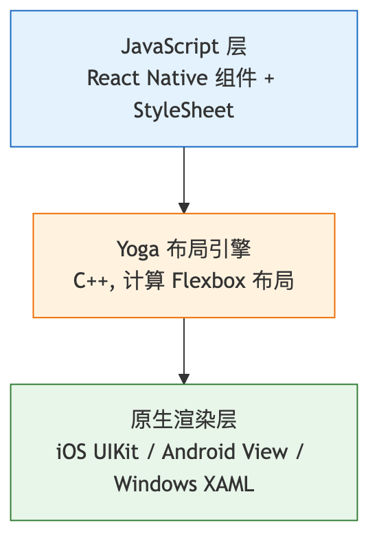
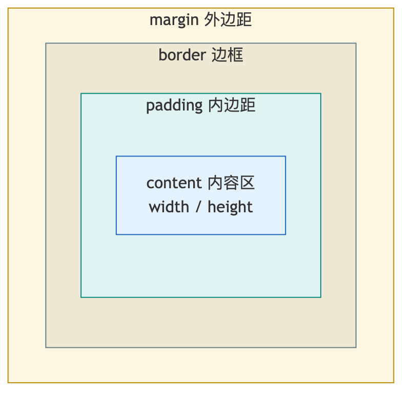

# CSS 面试 Q/A

## 目录

- [CSS 选择器的优先级?](#css-选择器的优先级)
- [CSS 如何绘制一个三角形?](#css-如何绘制一个三角形)
- [Web Component 如何实现样式隔离?](#web-component-如何实现样式隔离)
- [介绍 CSS 原子化、css-in-js 的核心原理、CSS 模块化, 按性能排序, 解释 css-in-js 为什么性能差?](#介绍-css-原子化css-in-js-的核心原理css-模块化-按性能排序解释-css-in-js-为什么性能差)
- [scss 是什么? 有什么用? scss 的 mixin 等常用语法有哪些?](#scss-是什么有什么用-scss-的-mixin-等常用语法有哪些)
- [PostCSS 是什么? 有什么用?](#postcss-是什么有什么用)
- [React Native 中的 CSS 和 Web 中的 CSS 有什么不同? Yoga 引擎是什么?](#react-native-中的-css-和-web-中的-css-有什么不同-yoga-引擎是什么)
- [如何使用 CSS 实现中间宽度固定、两边宽度自适应的布局?](#如何使用-css-实现中间宽度固定两边宽度自适应的布局)
- [介绍 flex 布局和 grid 布局](#介绍-flex-布局和-grid-布局)
- [什么是盒模型? 标准盒模型和怪异盒模型有什么区别?](#什么是盒模型标准盒模型和怪异盒模型有什么区别)
- [什么是 BFC? 如何触发 BFC? BFC 有什么应用场景?](#什么是-bfc如何触发-bfcbfc-有什么应用场景)
- [CSS 中的定位方式有哪些? 分别相对于什么定位?](#css-中的定位方式有哪些分别相对于什么定位)
- [CSS 如何实现水平垂直居中?](#css-如何实现水平垂直居中)
- [什么是响应式设计? 如何实现响应式布局?](#什么是响应式设计如何实现响应式布局)
- [CSS 中的伪类和伪元素有什么区别?](#css-中的伪类和伪元素有什么区别)
- [CSS 动画有哪些实现方式? 它们的区别是什么?](#css-动画有哪些实现方式它们的区别是什么)
- [什么是 CSS 硬件加速? 如何触发?](#什么是-css-硬件加速如何触发)
- [CSS 中的回流和重绘是什么? 如何优化?](#css-中的回流和重绘是什么如何优化)
- [什么是 CSS 变量? 如何使用?](#什么是-css-变量如何使用)
- [CSS 中的 calc()、min()、max()、clamp() 函数如何使用?](#css-中的-calcminmaxclamp-函数如何使用)
- [什么是 CSS 层叠上下文? 如何创建?](#什么是-css-层叠上下文如何创建)
- [CSS 中的浮动有什么特点? 如何清除浮动?](#css-中的浮动有什么特点如何清除浮动)
- [什么是 CSS Modules? 它的原理是什么?](#什么是-css-modules它的原理是什么)
- [CSS 中的 will-change 属性有什么作用?](#css-中的-will-change-属性有什么作用)
- [如何实现 CSS 的按需加载和懒加载?](#如何实现-css-的按需加载和懒加载)
- [CSS 中的 :root 和 html 选择器有什么区别?](#css-中的-root-和-html-选择器有什么区别)
- [什么是 CSS 的继承? 哪些属性可以继承?](#什么是-css-的继承哪些属性可以继承)
- [CSS 中的 em、rem、vw、vh、% 有什么区别?](#css-中的-emremvwvh-有什么区别)
- [什么是 CSS 的 @media 查询? 如何使用?](#什么是-css-的-media-查询如何使用)
- [CSS 中的 transform 和 position 有什么区别?](#css-中的-transform-和-position-有什么区别)
- [什么是 CSS 的 @supports 规则?](#什么是-css-的-supports-规则)
- [CSS 中的 grid 和 flex 应该如何选择?](#css-中的-grid-和-flex-应该如何选择)
- [什么是 CSS 的 contain 属性?](#什么是-css-的-contain-属性)
- [CSS 中的 content-visibility 属性有什么作用?](#css-中的-content-visibility-属性有什么作用)
- [什么是 CSS 的 @layer 规则?](#什么是-css-的-layer-规则)
- [CSS 中的 :is() 和 :where() 伪类有什么区别?](#css-中的-is-和-where-伪类有什么区别)
- [什么是 CSS 的 aspect-ratio 属性?](#什么是-css-的-aspect-ratio-属性)
- [CSS 中的 gap 属性在 flex 和 grid 中有什么区别?](#css-中的-gap-属性在-flex-和-grid-中有什么区别)
- [什么是 CSS 的 scroll-snap?](#什么是-css-的-scroll-snap)
- [CSS 中的 @container 查询是什么? 和 @media 有什么区别?](#css-中的-container-查询是什么和-media-有什么区别)

---

### CSS 选择器的优先级?

A: CSS 选择器优先级是浏览器决定当多个规则作用于同一元素时, 哪个规则的样式生效的机制. 优先级由选择器的特异性 (Specificity) 决定, 特异性可以用一个四元组 (a, b, c, d) 表示, 从左到右逐位比较, 高位不同则直接决出胜负, 不存在进位 (低位数量再多也不会超过高位).

特异性计算规则如下:

- a 位: 内联样式 (style 属性), 命中计为 1, 否则为 0
- b 位: ID 选择器的数量, 如 #header
- c 位: 类选择器、属性选择器、伪类的数量, 如 .class、[type="text"]、:hover
- d 位: 元素选择器、伪元素的数量, 如 div、::before
- 通配符 \*、组合器 (后代空格、子选择器 >、相邻兄弟 +、通用兄弟 ~) 不影响特异性

示例:

- #nav .item > a:hover 的特异性为 (0, 1, 2, 1) — 1 个 ID, 1 个类 + 1 个伪类, 1 个元素
- .nav .item a 的特异性为 (0, 0, 2, 1) — 2 个类, 1 个元素
- 内联样式 style="..." 的特异性为 (1, 0, 0, 0), 高于任何选择器组合, 只能被 !important 覆盖

特殊规则:

- !important 声明会覆盖所有非 important 声明, 但多个 important 之间仍按特异性比较
- 继承的样式优先级最低, 任何直接作用于元素的选择器都会覆盖继承样式
- :not() 伪类本身不增加特异性, 但其内部的选择器会参与计算
- :is() 和 :where() 的区别在于, :is() 取内部最高特异性, :where() 特异性始终为 0
- 重复声明同一属性时, 后声明的覆盖先声明的 (同等特异性下)

实际开发建议:

- 避免使用 ID 选择器写样式, 因为 ID 特异性过高, 难以覆盖
- 避免使用 !important, 它会破坏正常的层叠规则, 导致维护困难
- 保持选择器扁平, 减少嵌套层级, 降低特异性
- 使用 BEM 命名规范, 用单一类选择器控制样式, 特异性统一为 (0, 1, 0, 0)

---

### CSS 如何绘制一个三角形?

A: CSS 绘制三角形的核心原理是利用 border 的渲染机制. 当元素的宽高为 0 时, 四条 border 会以对角线形式交汇, 形成四个三角形. 通过将不需要的边设为 transparent, 只保留一条有颜色的边, 即可得到单个三角形.

基础实现:

```css
/* 向上的三角形 */
.triangle-up {
  width: 0;
  height: 0;
  border-left: 50px solid transparent;
  border-right: 50px solid transparent;
  border-bottom: 100px solid #333;
}

/* 向下的三角形 */
.triangle-down {
  width: 0;
  height: 0;
  border-left: 50px solid transparent;
  border-right: 50px solid transparent;
  border-top: 100px solid #333;
}

/* 向左的三角形 */
.triangle-left {
  width: 0;
  height: 0;
  border-top: 50px solid transparent;
  border-bottom: 50px solid transparent;
  border-right: 100px solid #333;
}

/* 向右的三角形 */
.triangle-right {
  width: 0;
  height: 0;
  border-top: 50px solid transparent;
  border-bottom: 50px solid transparent;
  border-left: 100px solid #333;
}
```

原理详解: 当 width 和 height 为 0 时, 元素的内容区域消失, 四条 border 各自形成一个梯形 (有宽高时) 或三角形 (无宽高时). 以 border-bottom 为例, 它占据元素下方区域, 左右两侧与 border-left 和 border-right 以 45 度角交汇. 当左右 border 为 transparent 时, 视觉上只看到 bottom border 形成的三角形.

进阶技巧:

- 直角三角形: 只保留两条相邻边. 例如 border-left 和 border-bottom 有颜色, 其余 transparent, 得到左下角的直角三角形
- 等腰三角形: 底边 border 宽度是侧边 border 宽度的两倍时, 得到等腰三角形
- 等边三角形: 底边宽度 = 侧边宽度 _ sqrt(3), 约等于侧边宽度 _ 1.732
- 箭头三角形: 通过两个三角形叠加 (一个背景色, 一个前景色, 偏移 1-2px) 实现空心箭头效果

现代替代方案:

```css
/* 使用 clip-path */
.triangle {
  width: 100px;
  height: 100px;
  background: #333;
  clip-path: polygon(50% 0%, 0% 100%, 100% 100%);
}

/* 使用 conic-gradient */
.triangle {
  width: 100px;
  height: 100px;
  background: conic-gradient(from 150deg at 50% 0, #333 60deg, transparent 0);
}
```

clip-path 方案的优势在于可以绘制任意多边形, 且支持动画过渡. border 方案的优势在于兼容性好, 所有浏览器都支持, 且不需要额外元素.

---

### Web Component 如何实现样式隔离?

A: Web Component 通过 Shadow DOM 实现样式隔离. Shadow DOM 是浏览器原生的样式封装机制, 它创建了一个独立的 DOM 子树, 内部的 CSS 规则不会泄漏到外部, 外部的 CSS 规则也不会影响内部 (少数例外).

核心实现:

```javascript
class MyComponent extends HTMLElement {
  constructor() {
    super();
    const shadow = this.attachShadow({ mode: "open" });
    shadow.innerHTML = `
      <style>
        .container {
          padding: 16px;
          color: #333;
        }
        p {
          font-size: 14px;
        }
      </style>
      <div class="container">
        <p>Shadow DOM 内容</p>
        <slot></slot>
      </div>
    `;
  }
}
customElements.define("my-component", MyComponent);
```

样式隔离的原理:

- Shadow DOM 创建了一个独立的样式作用域, 内部的 style 标签和 CSS 规则只匹配 Shadow Tree 内的元素
- 外部文档的 CSS 选择器无法穿透 Shadow Boundary 匹配内部元素
- 内部样式也不会泄漏到 Light DOM (即普通文档 DOM)
- 继承属性 (如 color、font-family) 仍然可以从外部继承到 Shadow DOM 内部, 因为 CSS 继承不受 Shadow Boundary 限制

外部样式影响内部的几种方式:

- CSS 自定义属性 (CSS Variables): 外部定义的 --custom-prop 可以在 Shadow DOM 内部通过 var(--custom-prop) 使用, 这是官方推荐的样式穿透方案
- ::part() 伪元素: 内部元素添加 part 属性后, 外部可通过 ::part(name) 选择器修改样式
- ::slotted() 伪元素: 用于选中通过 slot 投射到 Shadow DOM 中的 Light DOM 元素
- 内联 style 属性: 直接写在元素上的内联样式不受 Shadow DOM 限制

```css
/* 外部 CSS */
my-component {
  --text-color: red;
}

my-component::part(title) {
  font-weight: bold;
}

my-component::slotted(p) {
  color: blue;
}
```

Shadow DOM 的局限性:

- 全局重置样式 (如 normalize.css) 不会影响 Shadow DOM 内部, 需要手动引入
- 某些浏览器内置样式 (如表单控件的默认样式) 在 Shadow DOM 中表现可能不同
- 第三方库如果依赖全局 CSS 选择器, 在 Shadow DOM 中可能失效
- 事件冒泡到 Shadow Boundary 时, event.target 会被重定向为宿主元素 (事件重定向)

与其他样式隔离方案的对比:

- Shadow DOM: 浏览器原生实现, 隔离最彻底, 但存在继承属性穿透和事件重定向
- CSS Modules: 编译时生成唯一类名, 本质是命名空间隔离, 不是真正的样式作用域
- CSS-in-JS: 运行时生成唯一类名或内联样式, 隔离程度取决于实现
- iframe: 完全隔离, 但通信成本高, 性能开销大

---

### 介绍 CSS 原子化、css-in-js 的核心原理、CSS 模块化, 按性能排序, 解释 css-in-js 为什么性能差?

A: 这三种方案代表了现代前端样式管理的不同思路, 核心差异在于样式的生成时机、组织方式和运行时开销.

CSS 原子化 (以 Tailwind CSS 为代表):

核心原理: 预定义大量单一职责的原子类 (如 .flex、.p-4、.text-center), 每个类只包含一条或少数几条 CSS 声明. 开发者在 HTML/JSX 中组合这些类来构建样式, 而非编写自定义 CSS.

构建流程:

- 扫描源文件, 提取所有使用的类名
- 根据配置生成对应的 CSS 规则
- 通过 PurgeCSS 机制移除未使用的类, 最终产物通常只有几 KB
- 支持 JIT (Just-In-Time) 模式, 按需生成, 支持任意值如 .w-[327px]

```html
<div class="flex items-center gap-4 rounded-lg bg-white p-6 shadow-md">
  
  <div class="text-sm text-gray-600">内容</div>
</div>
```

CSS-in-JS (以 styled-components、Emotion 为代表):

核心原理: 在 JavaScript 中编写 CSS, 运行时将样式字符串转换为实际的 CSS 规则并注入到 document.head 的 style 标签中.

运行时流程 (以 styled-components 为例):

- 组件渲染时, 解析模板字符串中的 CSS 声明
- 处理插值表达式 (props 驱动的动态样式)
- 生成唯一的类名 (如 .sc-bdVaJa)
- 将 CSS 规则通过 CSSOM (CSSStyleSheet.insertRule) 或 style 标签注入
- 将生成的类名应用到 DOM 元素

```javascript
const Button = styled.button`
  padding: ${(props) => (props.size === "large" ? "16px 32px" : "8px 16px")};
  background: ${(props) => (props.primary ? "#1890ff" : "#fff")};
  border-radius: 4px;
  &:hover {
    opacity: 0.8;
  }
`;
```

CSS 模块化 (.module.css):

核心原理: 构建工具 (Webpack、Vite) 在编译时将 .module.css 文件中的类名转换为唯一的哈希标识符, 实现局部作用域.

编译流程:

- 构建工具识别 .module.css 后缀
- 将 .title 转换为 .title_abc123 或 .Component_title_abc123 格式
- 生成 JSON 映射文件, 导出原始类名到哈希类名的映射
- JavaScript 中通过 import styles from './Component.module.css' 获取映射对象
- 运行时通过 styles.title 引用哈希后的类名

```css
/* Component.module.css */
.title {
  font-size: 24px;
  color: #333;
}
```

```javascript
import styles from "./Component.module.css";
// styles.title === 'title_abc123'
<div className={styles.title}>标题</div>;
```

性能排序 (从快到慢):

1. CSS 原子化 (Tailwind CSS) — 性能最优
2. CSS 模块化 (.module.css) — 性能次优
3. CSS-in-JS (styled-components / Emotion) — 性能最差

CSS-in-JS 性能差的原因:

运行时开销:

- 每次组件渲染都需要解析 CSS 字符串、处理插值、生成类名、注入样式
- 动态样式 (依赖 props) 会导致每次 props 变化时重新计算和注入
- 样式注入涉及 DOM 操作 (创建 style 标签或调用 insertRule), 触发浏览器样式重计算

内存开销:

- 每个组件实例可能生成独立的样式规则, 导致 style 标签数量膨胀
- 动态样式会生成大量不同的类名和对应的 CSS 规则, 无法被浏览器有效缓存
- 样式字符串和解析后的 AST 在内存中持续存在

阻塞渲染:

- 样式注入发生在 JavaScript 执行阶段, 如果组件在首屏渲染, 样式注入会阻塞首次绘制
- 与静态 CSS 文件不同, CSS-in-JS 无法被浏览器并行下载和解析
- SSR 场景下, 需要在服务端收集所有样式并内联到 HTML 中, 增加首屏 HTML 体积

对比优势:

- Tailwind CSS 在构建时生成静态 CSS 文件, 浏览器可以并行下载、解析、缓存, 运行时零开销
- CSS Modules 同样在构建时完成类名转换, 生成静态 CSS, 运行时仅多一次对象属性查找
- CSS-in-JS 的运行时解析和注入是额外的性能成本, 在大型应用中尤为明显

优化方向:

- 使用零运行时 CSS-in-JS 方案, 如 vanilla-extract、Linaria, 在构建时提取静态 CSS
- Emotion 支持 babel 插件将静态样式在构建时提取, 减少运行时开销
- 使用 CSS 自定义属性替代 props 驱动的动态样式, 避免重新生成类名

---

### scss 是什么? 有什么用? scss 的 mixin 等常用语法有哪些?

A: SCSS (Sassy CSS) 是 Sass 的新一代语法, 是 CSS 的超集, 意味着所有合法的 CSS 都是合法的 SCSS. 它在 CSS 基础上增加了变量、嵌套、混入、函数、继承等编程能力, 最终编译为标准 CSS.

核心用途:

- 消除 CSS 中的重复代码, 通过变量和混入实现复用
- 提供嵌套语法, 使样式结构更清晰, 与 DOM 结构对应
- 支持条件判断和循环, 实现复杂的样式生成逻辑
- 模块化组织样式文件, 通过 @import 或 @use 拆分和组合
- 提供数学运算和颜色函数, 简化计算

常用语法:

变量:

```scss
$primary-color: #1890ff;
$spacing-unit: 8px;
$border-radius: 4px;

.button {
  background: $primary-color;
  padding: $spacing-unit * 2;
  border-radius: $border-radius;
}
```

嵌套:

```scss
.nav {
  background: #fff;

  &__item {
    padding: 12px 16px;

    &:hover {
      background: #f5f5f5;
    }

    &--active {
      color: $primary-color;
    }
  }
}
```

Mixin (混入):

```scss
@mixin flex-center($direction: row, $gap: 0) {
  display: flex;
  flex-direction: $direction;
  align-items: center;
  justify-content: center;
  @if $gap != 0 {
    gap: $gap;
  }
}

@mixin responsive-font(
  $min-size,
  $max-size,
  $min-width: 320px,
  $max-width: 1200px
) {
  font-size: clamp(
    #{$min-size},
    calc(
      #{$min-size} + (#{$max-size} - #{$min-size}) *
        ((100vw - #{$min-width}) / (#{$max-width} - #{$min-width}))
    ),
    #{$max-size}
  );
}

.container {
  @include flex-center(column, 16px);
}

.hero-title {
  @include responsive-font(24px, 48px);
}
```

继承 (@extend):

```scss
%message-base {
  padding: 8px 16px;
  border-radius: 4px;
  cursor: pointer;
  transition: all 0.3s;
}

.btn-primary {
  @extend %message-base;
  background: #1890ff;
  color: #fff;
}

.btn-danger {
  @extend %message-base;
  background: #ff4d4f;
  color: #fff;
}
```

函数 (@function):

```scss
@function rem($px) {
  @return calc($px / 16) * 1rem;
}

@function spacing($multiplier) {
  @return $spacing-unit * $multiplier;
}

.element {
  margin: spacing(2);
  font-size: rem(14);
}
```

条件和循环:

```scss
@mixin theme-color($theme) {
  @if $theme == dark {
    background: #1a1a1a;
    color: #fff;
  } @else if $theme == light {
    background: #fff;
    color: #333;
  } @else {
    background: #f5f5f5;
    color: #666;
  }
}

@for $i from 1 through 12 {
  .col-#{$i} {
    width: calc(100% / 12 * #{$i});
  }
}

@each $color in primary, success, warning, danger {
  .text-#{$color} {
    color: map-get($theme-colors, $color);
  }
}
```

模块化 (@use 和 @forward):

```scss
// _variables.scss
$primary: #1890ff;

// _mixins.scss
@mixin card {
  border-radius: 8px;
  box-shadow: 0 2px 8px rgba(0, 0, 0, 0.1);
}

// main.scss
@use "variables" as vars;
@use "mixins";

.card {
  @include mixins.card;
  color: vars.$primary;
}
```

Map 数据结构:

```scss
$breakpoints: (
  sm: 576px,
  md: 768px,
  lg: 992px,
  xl: 1200px,
);

@mixin respond-to($breakpoint) {
  @media (min-width: map-get($breakpoints, $breakpoint)) {
    @content;
  }
}

.sidebar {
  width: 100%;
  @include respond-to(md) {
    width: 250px;
  }
}
```

SCSS 与 Sass 的区别: SCSS 使用大括号和分号, 语法接近 CSS; 旧版 Sass 使用缩进语法, 不需要大括号和分号. 目前 SCSS 是主流选择.

---

### PostCSS 是什么? 有什么用?

A: PostCSS 是一个用 JavaScript 插件转换 CSS 的工具平台. 它本身不做任何转换, 而是提供一个 CSS 解析和生成的基础设施, 具体的转换逻辑由插件完成. 可以将其理解为 CSS 领域的 Babel.

工作原理:

- 将 CSS 字符串解析为 AST (抽象语法树)
- 插件遍历和修改 AST 节点
- 将修改后的 AST 重新生成为 CSS 字符串
- 支持 Source Map 生成, 便于调试

核心用途:

Autoprefixer (自动添加浏览器前缀):

```css
/* 输入 */
.flex-container {
  display: flex;
  user-select: none;
}

/* 输出 (根据 browserslist 配置) */
.flex-container {
  display: -webkit-box;
  display: -ms-flexbox;
  display: flex;
  -webkit-user-select: none;
  -moz-user-select: none;
  -ms-user-select: none;
  user-select: none;
}
```

postcss-preset-env (使用未来 CSS 特性):

```css
/* 输入: 使用 CSS 嵌套、自定义媒体查询等未来语法 */
@custom-media --viewport-medium (width >= 768px);

.card {
  & .title {
    font-size: 24px;
  }

  @media (--viewport-medium) {
    flex-direction: row;
  }
}
```

cssnano (CSS 压缩优化):

```css
/* 输入 */
.button {
  margin: 0 auto;
  color: #ffffff;
  background: rgb(255, 0, 0);
}

/* 输出 */
.button {
  margin: 0 auto;
  color: #fff;
  background: red;
}
```

postcss-px-to-viewport (移动端适配):

```css
/* 输入 */
.element {
  width: 375px;
  font-size: 14px;
}

/* 输出 (以 375px 设计稿为基准) */
.element {
  width: 100vw;
  font-size: 3.73333vw;
}
```

postcss-import (合并 @import 文件):

```css
/* 输入 */
@import "./variables.css";
@import "./base.css";

/* 输出: 将所有文件内容内联合并 */
```

postcss-modules (CSS 模块化):

```css
/* 输入 */
.title {
  color: red;
}

/* 输出 */
.title_abc123 {
  color: red;
}
/* 同时生成 JSON 映射: { "title": "title_abc123" } */
```

Tailwind CSS 也是 PostCSS 插件:

```javascript
// postcss.config.js
module.exports = {
  plugins: {
    tailwindcss: {},
    autoprefixer: {},
    cssnano: process.env.NODE_ENV === "production" ? {} : false,
  },
};
```

自定义 PostCSS 插件:

```javascript
module.exports = () => {
  return {
    postcssPlugin: "postcss-dark-mode",
    Declaration(decl) {
      if (decl.prop === "color" || decl.prop === "background") {
        // 在 :root[data-theme="dark"] 下生成对应规则
      }
    },
  };
};
module.exports.postcss = true;
```

PostCSS 与 SCSS 的关系:

- SCSS 是预处理器, 在 CSS 之前执行, 提供变量、嵌套、混入等编程能力
- PostCSS 是后处理器 (也可以做预处理), 在 CSS 层面进行转换
- 两者可以配合使用: SCSS 编译为 CSS 后, 再由 PostCSS 进行前缀添加、压缩等处理
- PostCSS 的某些插件 (如 postcss-nesting) 可以替代 SCSS 的部分功能

---

### React Native 中的 CSS 和 Web 中的 CSS 有什么不同? Yoga 引擎是什么?

A: React Native 不直接使用 Web 的 CSS, 而是通过 JavaScript 对象描述样式, 由底层的 Yoga 布局引擎计算布局. 两者在语法、能力、渲染机制上有本质区别.

主要区别:

语法层面:

```javascript
// React Native: JavaScript 对象, 驼峰命名
const styles = StyleSheet.create({
  container: {
    backgroundColor: "#fff",
    paddingTop: 20,
    flexDirection: "row",
  },
});
```

布局模型差异:

- React Native 默认 flexDirection 为 column, Web CSS 默认为 row
- React Native 不支持 display: inline、inline-block、table 等, 只有 flex 布局
- React Native 不支持 float、clear
- React Native 不支持 CSS 选择器 (类选择器、ID 选择器、后代选择器等)
- React Native 不支持 CSS 继承, 每个组件必须显式声明样式
- React Native 不支持 ::before、::after 伪元素
- React Native 不支持 CSS 动画 (@keyframes), 需要使用 Animated API 或 Reanimated
- React Native 不支持 transition, 需要使用 Animated 或 LayoutAnimation
- React Native 不支持 z-index 的层叠上下文完整语义, 仅控制同层级的渲染顺序
- React Native 不支持 overflow: visible 与 border-radius 的组合裁剪 (Android)
- React Native 不支持 CSS 变量 (CSS Custom Properties)
- React Native 不支持媒体查询, 需要使用 Dimensions API 或 useWindowDimensions

样式能力差异:

- React Native 不支持 box-shadow, 使用 elevation (Android) 或 shadowColor/shadowOffset/shadowOpacity/shadowRadius (iOS)
- React Native 不支持简写属性 (如 margin: '10px 20px'), 必须拆分为 marginTop、marginRight 等
- React Native 不支持 calc()、min()、max()、clamp()
- React Native 不支持 em、rem、vw、vh 单位, 只支持无单位数值 (逻辑像素)
- React Native 的 position 只有 relative 和 absolute, 没有 fixed、sticky
- React Native 不支持 CSS Grid

Yoga 引擎:

Yoga 是 Facebook 开源的跨平台布局引擎, 用 C++ 编写, 实现了 Flexbox 布局算法的子集. 它是 React Native 布局系统的核心.

工作原理:

- 接收 JavaScript 层传递的样式属性 (flexDirection、justifyContent、alignItems、padding、margin 等)
- 构建布局树 (Layout Tree), 每个节点对应一个 React Native 组件
- 执行 Flexbox 布局算法, 计算每个节点的位置 (x, y) 和尺寸 (width, height)
- 将计算结果传递给原生平台 (iOS 的 UIKit、Android 的 View 系统) 进行实际渲染

架构位置:



Yoga 的局限性:

- 只实现了 Flexbox 的子集, 不支持 CSS Grid、float、inline 布局
- 不支持 CSS 选择器和层叠, 样式解析在 JavaScript 层完成
- 不支持百分比单位的完整语义 (部分属性支持, 部分不支持)
- 布局计算是同步的, 复杂布局树可能影响帧率

React Native 新架构 (Fabric):

- 新架构中, Yoga 布局计算可以在 C++ 层直接完成, 减少 JavaScript 和原生层的桥接通信
- 支持并发渲染, 布局计算可以被中断和恢复
- Shadow Tree 在 C++ 层管理, 减少序列化/反序列化开销

---

### 如何使用 CSS 实现中间宽度固定、两边宽度自适应的布局?

A: 这是经典的三栏布局问题, 有多种实现方案, 各有适用场景.

方案一: Flex 布局 (推荐):

```html
<div class="container">
  <aside class="left">左侧自适应</aside>
  <main class="center">中间固定 600px</main>
  <aside class="right">右侧自适应</aside>
</div>
```

```css
.container {
  display: flex;
}

.left,
.right {
  flex: 1;
}

.center {
  width: 600px;
  flex-shrink: 0;
}
```

原理: flex: 1 让左右两侧等分中间固定宽度之外的剩余空间. flex-shrink: 0 确保中间列不会被压缩.

方案二: Grid 布局:

```css
.container {
  display: grid;
  grid-template-columns: 1fr 600px 1fr;
}
```

原理: grid-template-columns 直接定义三列的宽度分配, 1fr 代表一份剩余空间, 600px 为固定宽度.

方案三: 浮动 + BFC:

```html
<div class="container">
  <main class="center">中间固定 600px</main>
  <aside class="left">左侧自适应</aside>
  <aside class="right">右侧自适应</aside>
</div>
```

```css
.center {
  float: left;
  width: 600px;
}

.left {
  float: left;
  width: calc((100% - 600px) / 2);
}

.right {
  float: left;
  width: calc((100% - 600px) / 2);
}
```

或者利用 BFC 不与浮动重叠的特性 (适合 "一侧固定、另一侧自适应" 的两栏场景; 三栏 "中间固定、两边自适应" 无法直接用该技巧, 因为普通流中的 BFC 只能占满剩余整行, 不能把剩余空间一分为二):

```css
.left {
  float: left;
  width: 200px;
}

.right {
  overflow: hidden; /* 触发 BFC, 不与左侧浮动重叠, 自动占满剩余宽度 */
}
```

注意: 浮动方案需要调整 DOM 顺序, 将中间列放在前面, 保证内容优先加载.

方案四: 绝对定位:

```css
.container {
  position: relative;
}

.left {
  position: absolute;
  left: 0;
  right: calc(50% + 300px);
}

.center {
  position: absolute;
  left: 50%;
  transform: translateX(-50%);
  width: 600px;
}

.right {
  position: absolute;
  right: 0;
  left: calc(50% + 300px);
}
```

方案五: 圣杯布局 (经典方案):

```html
<div class="container">
  <main class="center">中间</main>
  <aside class="left">左侧</aside>
  <aside class="right">右侧</aside>
</div>
```

```css
.container {
  padding: 0 200px;
}

.center {
  float: left;
  width: 100%;
}

.left {
  float: left;
  width: 200px;
  margin-left: -100%;
  position: relative;
  left: -200px;
}

.right {
  float: left;
  width: 200px;
  margin-left: -200px;
  position: relative;
  right: -200px;
}
```

方案对比:

- Flex 方案: 代码最简洁, 兼容性好 (IE10+), 推荐首选
- Grid 方案: 代码最直观, 兼容性稍差 (IE 不支持), 现代项目推荐
- 浮动方案: 兼容性最好 (IE6+), 但需要处理清除浮动和 DOM 顺序
- 绝对定位方案: 脱离文档流, 不适合内容高度不确定的场景
- 圣杯布局: 历史方案, 理解浮动原理有价值, 实际开发不推荐

---

### 介绍 flex 布局和 grid 布局

A: Flex 和 Grid 是 CSS 中两大现代布局系统, 设计目标不同, 适用场景互补.

Flex 布局 (Flexible Box Layout):

设计目标: 一维布局系统, 擅长处理一行或一列中元素的排列、对齐和空间分配.

核心概念:

- Flex Container: 设置 display: flex 或 display: inline-flex 的元素
- Flex Item: Container 的直接子元素
- Main Axis: 主轴, 由 flex-direction 决定 (row 为水平, column 为垂直)
- Cross Axis: 交叉轴, 垂直于主轴

Container 属性:

```css
.container {
  display: flex;
  flex-direction: row | row-reverse | column | column-reverse;
  flex-wrap: nowrap | wrap | wrap-reverse;
  justify-content: flex-start | flex-end | center | space-between | space-around
    | space-evenly;
  align-items: stretch | flex-start | flex-end | center | baseline;
  align-content: stretch | flex-start | flex-end | center | space-between |
    space-around;
  gap: 16px;
  row-gap: 16px;
  column-gap: 16px;
}
```

Item 属性:

```css
.item {
  flex-grow: 1;
  flex-shrink: 0;
  flex-basis: 200px;
  flex: 1; /* 等价于 1 1 0% */
  flex: auto; /* 等价于 1 1 auto */
  flex: none; /* 等价于 0 0 auto */
  align-self: auto | flex-start | flex-end | center | baseline | stretch;
  order: -1;
}
```

Flex 布局算法核心:

- 先根据 flex-basis 计算每个 item 的初始尺寸
- 如果容器有剩余空间, 按 flex-grow 比例分配
- 如果空间不足, 按 flex-shrink \* flex-basis 的加权比例收缩
- 最终尺寸 = flex-basis + 分配/收缩量

Grid 布局 (Grid Layout):

设计目标: 二维布局系统, 同时处理行和列, 擅长构建复杂的页面整体结构.

核心概念:

- Grid Container: 设置 display: grid 或 display: inline-grid 的元素
- Grid Item: Container 的直接子元素
- Grid Line: 网格线, 定义行列的分界线
- Grid Track: 网格轨道, 两条相邻网格线之间的行或列
- Grid Cell: 网格单元格, 最小的网格单位
- Grid Area: 网格区域, 由一个或多个单元格组成的矩形区域

Container 属性:

```css
.container {
  display: grid;
  grid-template-columns: 200px 1fr 1fr;
  grid-template-columns: repeat(3, 1fr);
  grid-template-columns: repeat(auto-fill, minmax(250px, 1fr));
  grid-template-rows: 60px 1fr 40px;
  grid-template-areas:
    "header header header"
    "sidebar main aside"
    "footer footer footer";
  gap: 16px;
  justify-items: start | end | center | stretch;
  align-items: start | end | center | stretch;
  justify-content: start | end | center | space-between | space-around |
    space-evenly;
  align-content: start | end | center | space-between | space-around |
    space-evenly;
  grid-auto-flow: row | column | dense;
  grid-auto-rows: 100px;
  grid-auto-columns: 100px;
}
```

Item 属性:

```css
.item {
  grid-column: 1 / 3;
  grid-row: 1 / 2;
  grid-column: span 2;
  grid-area: header;
  grid-area: 1 / 1 / 3 / 3;
  justify-self: start | end | center | stretch;
  align-self: start | end | center | stretch;
}
```

Grid 特有函数:

```css
grid-template-columns: minmax(200px, 1fr);
grid-template-columns: repeat(12, 1fr);
grid-template-columns: repeat(auto-fit, minmax(250px, 1fr));
grid-template-columns: fit-content(400px);
```

Flex vs Grid 选择指南:

使用 Flex 的场景:

- 一维排列: 导航栏、按钮组、标签页
- 内容驱动的布局: 元素尺寸由内容决定, 需要弹性分配空间
- 对齐需求: 垂直居中、两端对齐、等分布局
- 组件内部布局: 卡片内容、表单项、列表项

使用 Grid 的场景:

- 二维布局: 页面整体框架 (header + sidebar + main + footer)
- 精确控制: 需要元素占据特定行列位置
- 复杂网格: 图片画廊、仪表盘、表格替代
- 重叠布局: 元素需要在网格中重叠显示
- 响应式网格: 使用 auto-fill/auto-fit 实现自适应列数

两者配合:

- Grid 负责页面级宏观布局, 定义整体结构
- Flex 负责组件级微观布局, 处理内部元素排列
- Grid 的某个区域内部可以使用 Flex, Flex 的某个 item 内部可以使用 Grid

---

### 什么是盒模型? 标准盒模型和怪异盒模型有什么区别?

A: 盒模型 (Box Model) 是 CSS 布局的基础, 每个 HTML 元素都被视为一个矩形盒子, 由内容区 (content)、内边距 (padding)、边框 (border)、外边距 (margin) 四层组成.

盒模型结构 (从外到内依次为 margin、border、padding、content):



标准盒模型 (content-box):

- box-sizing: content-box (默认值)
- width 和 height 只包含内容区的尺寸
- 元素实际占据宽度 = width + padding-left + padding-right + border-left + border-right
- 元素实际占据高度 = height + padding-top + padding-bottom + border-top + border-bottom

```css
.standard {
  box-sizing: content-box;
  width: 200px;
  padding: 20px;
  border: 2px solid #333;
  /* 实际宽度 = 200 + 20*2 + 2*2 = 244px */
}
```

怪异盒模型 (border-box):

- box-sizing: border-box
- width 和 height 包含内容区 + padding + border
- 设置 width: 200px 后, 无论 padding 和 border 如何变化, 元素总宽度始终为 200px
- 内容区宽度 = width - padding-left - padding-right - border-left - border-right

```css
.quirks {
  box-sizing: border-box;
  width: 200px;
  padding: 20px;
  border: 2px solid #333;
  /* 实际宽度 = 200px, 内容区宽度 = 200 - 20*2 - 2*2 = 156px */
}
```

历史背景: IE6 及更早版本默认使用 border-box 模型, 而 W3C 标准规定使用 content-box. 这导致同一份 CSS 在不同浏览器中渲染尺寸不同, 称为 "怪异模式". 现代开发中, 通常全局设置 border-box 以简化尺寸计算.

最佳实践:

```css
*,
*::before,
*::after {
  box-sizing: border-box;
}
```

margin 的特殊性:

- margin 不计入盒模型尺寸, 它控制元素与其他元素的间距
- 垂直方向相邻 margin 会发生合并 (Margin Collapsing), 取较大值而非相加
- 水平方向 margin 不会合并
- margin 可以为负值, 用于元素重叠或抵消间距

---

### 什么是 BFC? 如何触发 BFC? BFC 有什么应用场景?

A: BFC (Block Formatting Context, 块级格式化上下文) 是 CSS 中一个独立的渲染区域, 内部的元素布局不会影响外部元素. 它是 CSS 视觉格式化模型的一部分, 决定了块级元素如何排列、如何与浮动元素交互.

触发 BFC 的条件:

- 根元素 (html)
- float 值不为 none
- position 值为 absolute 或 fixed
- display 值为 inline-block、flex、inline-flex、grid、inline-grid、table-cell、table-caption
- overflow 值不为 visible (如 hidden、auto、scroll)
- contain 值为 layout、content 或 paint

BFC 的布局规则:

- BFC 内部的 Box 在垂直方向依次排列, 外边距由 margin 决定
- BFC 内部相邻 Box 的垂直 margin 会发生合并
- BFC 的区域不会与 float 元素重叠
- BFC 是一个独立容器, 内外元素互不影响
- 计算 BFC 高度时, 浮动子元素也参与计算 (清除浮动)

应用场景:

清除浮动 (解决父元素高度塌陷):

```css
.parent {
  overflow: hidden;
}

.child {
  float: left;
}
```

阻止 margin 合并:

```css
.wrapper {
  overflow: hidden;
}

.box1 {
  margin-bottom: 20px;
}

.box2 {
  margin-top: 30px;
}
```

自适应两栏布局:

```css
.left {
  float: left;
  width: 200px;
}

.right {
  overflow: hidden;
}
```

防止文字环绕浮动元素:

```css
.image {
  float: left;
}

.text {
  overflow: hidden;
}
```

BFC 与 IFC、FFC、GFC:

- IFC (Inline Formatting Context): 行内格式化上下文, 处理行内元素的水平排列
- FFC (Flex Formatting Context): Flex 格式化上下文, display: flex 触发
- GFC (Grid Formatting Context): Grid 格式化上下文, display: grid 触发

---

### CSS 中的定位方式有哪些? 分别相对于什么定位?

A: CSS 的 position 属性定义了元素的定位模型, 不同值决定了元素的定位参照物和是否脱离文档流.

position 取值:

static (默认值):

- 元素处于正常文档流中
- top、right、bottom、left、z-index 属性无效
- 所有元素默认都是 static

relative (相对定位):

- 相对于元素自身在正常文档流中的位置进行偏移
- 不脱离文档流, 原位置仍被占据
- 偏移不影响其他元素的布局
- 常用作绝对定位子元素的参照容器

```css
.relative {
  position: relative;
  top: 10px;
  left: 20px;
}
```

absolute (绝对定位):

- 相对于最近的非 static 定位祖先元素定位
- 如果所有祖先都是 static, 则相对于初始包含块 (通常是 viewport) 定位
- 脱离文档流, 不占据原位置
- 会创建新的层叠上下文

```css
.parent {
  position: relative;
}

.child {
  position: absolute;
  top: 0;
  right: 0;
}
```

fixed (固定定位):

- 相对于视口 (viewport) 定位
- 脱离文档流
- 页面滚动时位置不变
- 会创建新的层叠上下文
- 注意: 如果祖先元素设置了 transform、perspective、filter 或 will-change, fixed 会退化为相对于该祖先定位

```css
.navbar {
  position: fixed;
  top: 0;
  left: 0;
  width: 100%;
}
```

sticky (粘性定位):

- 相对定位和固定定位的混合
- 在跨越指定阈值前表现为 relative, 跨越后表现为 fixed
- 不脱离文档流
- 必须指定 top、right、bottom、left 中至少一个阈值
- 参照物是最近的滚动祖先

```css
.section-title {
  position: sticky;
  top: 0;
}
```

定位参照物总结:

| position 值 | 参照物             | 脱离文档流 | 创建层叠上下文              |
| ----------- | ------------------ | ---------- | --------------------------- |
| static      | 无                 | 否         | 否                          |
| relative    | 自身原位置         | 否         | 否 (z-index 非 auto 时创建) |
| absolute    | 最近非 static 祖先 | 是         | 是                          |
| fixed       | 视口               | 是         | 是                          |
| sticky      | 最近滚动祖先       | 否         | 否                          |

包含块 (Containing Block) 的确定:

- static/relative: 由最近的块级祖先元素的内容区决定
- absolute: 由最近的 position 非 static 的祖先元素的 padding 区决定
- fixed: 由视口决定
- sticky: 由最近的滚动容器的内容区决定

---

### CSS 如何实现水平垂直居中?

A: 水平垂直居中是 CSS 布局的经典问题, 根据已知条件 (子元素尺寸是否已知、是否需要兼容旧浏览器) 有多种方案.

方案一: Flex 布局 (最推荐):

```css
.parent {
  display: flex;
  justify-content: center;
  align-items: center;
}
```

优势: 代码最简洁, 不需要知道子元素尺寸, 兼容性好 (IE10+).

方案二: Grid 布局:

```css
.parent {
  display: grid;
  place-items: center;
}
```

或者更简洁:

```css
.parent {
  display: grid;
}

.child {
  place-self: center;
}
```

方案三: 绝对定位 + transform:

```css
.parent {
  position: relative;
}

.child {
  position: absolute;
  top: 50%;
  left: 50%;
  transform: translate(-50%, -50%);
}
```

原理: top: 50% 和 left: 50% 将子元素的左上角定位到父元素中心, transform: translate(-50%, -50%) 将子元素自身向左上偏移自身宽高的一半.

优势: 不需要知道子元素尺寸. 注意: transform 的百分比是相对于元素自身尺寸的.

方案四: 绝对定位 + margin: auto:

```css
.parent {
  position: relative;
}

.child {
  position: absolute;
  top: 0;
  right: 0;
  bottom: 0;
  left: 0;
  margin: auto;
  width: 200px;
  height: 100px;
}
```

原理: 四个方向设为 0 后, margin: auto 会在水平和垂直方向等分剩余空间, 实现居中. 必须指定子元素的宽高.

方案五: 绝对定位 + 负 margin:

```css
.parent {
  position: relative;
}

.child {
  position: absolute;
  top: 50%;
  left: 50%;
  width: 200px;
  height: 100px;
  margin-top: -50px;
  margin-left: -100px;
}
```

限制: 必须知道子元素的精确尺寸.

方案六: 行内元素居中:

```css
.parent {
  text-align: center;
  line-height: 200px;
}

/* 多行文本 */
.parent {
  display: table-cell;
  vertical-align: middle;
  text-align: center;
}
```

方案七: Grid + margin: auto:

```css
.parent {
  display: grid;
}

.child {
  margin: auto;
}
```

原理: Grid 容器中, margin: auto 会在两个方向等分剩余空间.

方案对比:

| 方案                   | 需要知道子元素尺寸 | 兼容性    | 适用场景           |
| ---------------------- | ------------------ | --------- | ------------------ |
| Flex                   | 否                 | IE10+     | 通用首选           |
| Grid                   | 否                 | IE 不支持 | 现代项目           |
| absolute + transform   | 否                 | IE9+      | 弹窗、浮层         |
| absolute + margin auto | 是                 | IE8+      | 固定尺寸弹窗       |
| absolute + 负 margin   | 是                 | 所有      | 已知尺寸, 极致兼容 |
| line-height            | 否                 | 所有      | 单行文本           |

---

### 什么是响应式设计? 如何实现响应式布局?

A: 响应式设计 (Responsive Web Design) 是一种使网页在不同设备和屏幕尺寸上都能良好展示的设计方法. 核心思想是一套代码适配多种设备, 而非为每种设备开发独立版本.

三大核心技术:

流式布局 (Fluid Layout):

- 使用相对单位 (%, em, rem, vw, vh) 替代固定像素
- 容器宽度随视口变化自动调整
- 图片使用 max-width: 100% 防止溢出

```css
.container {
  width: 90%;
  max-width: 1200px;
  margin: 0 auto;
}

img {
  max-width: 100%;
  height: auto;
}
```

媒体查询 (Media Queries):

```css
/* 移动优先: 基础样式为移动端, 逐步增强 */
.card {
  width: 100%;
  padding: 16px;
}

@media (min-width: 768px) {
  .card {
    width: 50%;
    padding: 24px;
  }
}

@media (min-width: 1024px) {
  .card {
    width: 33.333%;
    padding: 32px;
  }
}

@media (prefers-color-scheme: dark) {
  body {
    background: #1a1a1a;
    color: #fff;
  }
}

@media (prefers-reduced-motion: reduce) {
  * {
    animation: none !important;
    transition: none !important;
  }
}

@media (hover: hover) {
  .button:hover {
    opacity: 0.8;
  }
}
```

弹性图片和媒体:

```css
img,
video,
canvas {
  max-width: 100%;
}
```

```html

```

现代响应式方案:

Container Queries (容器查询):

```css
.card-container {
  container-type: inline-size;
  container-name: card;
}

@container card (min-width: 400px) {
  .card {
    flex-direction: row;
  }
}
```

优势: 组件根据自身容器尺寸响应, 而非视口尺寸, 更适合组件化开发.

CSS Grid 自适应:

```css
.gallery {
  display: grid;
  grid-template-columns: repeat(auto-fit, minmax(250px, 1fr));
  gap: 16px;
}
```

Flex 换行:

```css
.card-list {
  display: flex;
  flex-wrap: wrap;
  gap: 16px;
}

.card {
  flex: 1 1 300px;
}
```

clamp() 流体排版:

```css
h1 {
  font-size: clamp(24px, 5vw, 48px);
}

.container {
  width: clamp(320px, 90%, 1200px);
}
```

viewport 单位:

```css
.hero {
  height: 100vh;
  width: 100vw;
  padding: 5vmin;
  margin: 3vmax;
}

/* 移动端地址栏问题: 100vh 包含地址栏高度 */
.hero {
  height: 100dvh;
}
```

响应式设计最佳实践:

- 移动优先 (Mobile First): 基础样式面向移动端, 通过 min-width 媒体查询逐步增强
- 断点选择: 根据内容而非设备设定断点, 当布局开始不协调时添加断点
- 触摸友好: 移动端可点击区域至少 44x44px
- 性能优化: 移动端加载较小尺寸图片和较少资源
- 测试: 使用浏览器 DevTools 模拟多种设备, 真机测试关键设备

---

### CSS 中的伪类和伪元素有什么区别?

A: 伪类和伪元素都以冒号开头, 但语义和用途完全不同.

伪类 (Pseudo-class):

- 语法: 单冒号 :
- 作用: 描述元素的特殊状态或位置, 不创建新的 DOM 节点
- 本质: 选择器的一部分, 用于匹配特定条件下的元素

常见伪类:

```css
/* 状态伪类 */
a:hover {
  color: red;
}
input:focus {
  border-color: blue;
}
button:active {
  transform: scale(0.98);
}
input:disabled {
  opacity: 0.5;
}
input:checked + label {
  color: green;
}

/* 结构伪类 */
li:first-child {
  font-weight: bold;
}
li:last-child {
  border-bottom: none;
}
li:nth-child(2n) {
  background: #f5f5f5;
}
li:nth-of-type(3) {
  color: red;
}
p:not(.special) {
  color: #666;
}

/* 其他 */
:root {
  --primary: #1890ff;
}
:empty {
  display: none;
}
:fullscreen {
  background: #000;
}
```

伪元素 (Pseudo-element):

- 语法: 双冒号 :: (CSS3 规范, 单冒号为 CSS2 兼容写法)
- 作用: 创建虚拟的 DOM 节点, 在元素内容前后插入内容或选中元素的特定部分
- 本质: 在文档树中创建不存在的元素

常见伪元素:

```css
/* 内容插入 */
.required::before {
  content: "*";
  color: red;
}

.tooltip::after {
  content: attr(data-tooltip);
  position: absolute;
  background: #333;
  color: #fff;
  padding: 4px 8px;
}

/* 选中特定部分 */
p::first-line {
  font-weight: bold;
}

p::first-letter {
  font-size: 2em;
  float: left;
}

::selection {
  background: #1890ff;
  color: #fff;
}

/* 占位符 */
input::placeholder {
  color: #999;
}

/* 文件上传按钮 */
input[type="file"]::file-selector-button {
  padding: 8px 16px;
  border-radius: 4px;
}
```

核心区别:

| 维度     | 伪类                     | 伪元素                                     |
| -------- | ------------------------ | ------------------------------------------ |
| 语法     | 单冒号 :                 | 双冒号 ::                                  |
| 作用     | 描述状态/位置            | 创建虚拟元素/选中部分                      |
| DOM      | 不创建新节点             | 创建虚拟节点 (::before/::after)            |
| content  | 不需要                   | ::before/::after 必须有 content            |
| 数量     | 一个选择器可链式多个伪类 | 一个元素只能有一个 ::before 和一个 ::after |
| 盒子模型 | 不生成盒子               | ::before/::after 生成真实的盒子            |

::before 和 ::after 的特性:

- 必须设置 content 属性 (可以为空字符串 content: '')
- 默认是行内元素 (display: inline)
- 作为子元素插入到目标元素内部的最前/最后位置
- 可以设置任何 CSS 属性, 包括定位、尺寸、背景等
- 无法通过 JavaScript 的 DOM API 直接访问

---

### CSS 动画有哪些实现方式? 它们的区别是什么?

A: CSS 提供了多种动画实现方式, 各有不同的性能特征和适用场景.

transition (过渡):

```css
.button {
  background: #1890ff;
  transform: scale(1);
  transition:
    background 0.3s ease,
    transform 0.2s ease-out;
}

.button:hover {
  background: #40a9ff;
  transform: scale(1.05);
}
```

特点:

- 只能定义起始和结束两个状态, 无法定义中间关键帧
- 需要事件触发 (hover、class 切换等), 不能自动播放
- 适合简单的状态切换动画, 如按钮悬停、展开收起
- 性能较好, 可动画属性中 transform 和 opacity 走合成层

animation (关键帧动画):

```css
@keyframes slideIn {
  0% {
    opacity: 0;
    transform: translateX(-100%);
  }
  60% {
    opacity: 1;
    transform: translateX(10%);
  }
  100% {
    transform: translateX(0);
  }
}

.element {
  animation: slideIn 0.5s ease-out 0.2s 1 normal both;
}

.element {
  animation-name: slideIn;
  animation-duration: 0.5s;
  animation-timing-function: ease-out;
  animation-delay: 0.2s;
  animation-iteration-count: infinite;
  animation-direction: alternate;
  animation-fill-mode: both;
  animation-play-state: paused;
}
```

特点:

- 可以定义多个关键帧, 实现复杂动画序列
- 可以自动播放、循环、反向播放
- 适合加载动画、轮播、复杂序列动画
- 支持暂停和恢复

transform (变换):

```css
.element {
  transform: translate(100px, 50px);
  transform: scale(1.5);
  transform: rotate(45deg);
  transform: skew(10deg, 5deg);
  transform: matrix(1, 0, 0, 1, 0, 0);
  transform: translate3d(x, y, z);
  transform: rotateX(45deg);
  transform: rotateY(45deg);
  transform: perspective(500px) rotateY(45deg);
  transform: translateX(100px) rotate(45deg) scale(1.2);
}
```

特点:

- 不是独立的动画方式, 通常配合 transition 或 animation 使用
- 不触发布局回流, 性能最优
- 可以开启 GPU 加速 (合成层)

各方式对比:

| 维度     | transition   | animation  | transform      |
| -------- | ------------ | ---------- | -------------- |
| 关键帧   | 仅起始和结束 | 任意多个   | 不适用         |
| 触发方式 | 需要事件触发 | 可自动播放 | 不适用         |
| 循环     | 不支持       | 支持       | 不适用         |
| 性能     | 较好         | 较好       | 最优           |
| 适用场景 | 状态切换     | 复杂序列   | 位移/旋转/缩放 |

可动画属性与性能:

高性能属性 (走合成层, 不触发回流重绘):

- transform
- opacity
- filter

中等性能属性 (触发重绘, 不触发回流):

- color
- background
- box-shadow
- outline

低性能属性 (触发回流):

- width / height
- top / left / right / bottom
- margin / padding
- font-size

最佳实践:

- 优先使用 transform 和 opacity 做动画
- 避免对 width、height、top、left 做动画, 用 transform: translate/scale 替代
- 使用 will-change 提前告知浏览器创建合成层
- 动画时长控制在 200-500ms, 过长会显得迟钝
- 使用 cubic-bezier 自定义缓动函数, 避免线性动画

---

### 什么是 CSS 硬件加速? 如何触发?

A: CSS 硬件加速 (Hardware Acceleration) 是指浏览器将某些 CSS 属性的渲染工作交给 GPU 处理, 而非 CPU. GPU 擅长并行处理图形变换, 可以显著提升动画性能, 实现 60fps 的流畅体验.

渲染管线:

浏览器渲染一帧的完整流程:

1. JavaScript: 执行脚本, 可能修改 DOM 或样式
2. Style: 计算每个元素的最终样式
3. Layout (回流): 计算元素的几何信息 (位置、尺寸)
4. Paint (重绘): 生成绘制指令, 创建图层
5. Composite (合成): 将多个图层合成为最终画面

硬件加速的核心: 将元素提升为独立的合成层 (Compositing Layer), 后续对该元素的 transform 和 opacity 动画直接在合成阶段由 GPU 处理, 跳过 Layout 和 Paint 阶段.

触发硬件加速的方式:

```css
/* 1. transform: translateZ(0) 或 translate3d */
.element {
  transform: translateZ(0);
  transform: translate3d(0, 0, 0);
}

/* 2. will-change */
.element {
  will-change: transform;
  will-change: opacity;
}

/* 3. 3D 或透视变换 */
.element {
  transform: perspective(500px) rotateY(45deg);
}

/* 4. position: fixed (某些浏览器) */
.element {
  position: fixed;
}

/* 5. video、canvas、iframe 等替换元素 */

/* 6. CSS filter */
.element {
  filter: blur(5px);
}

/* 7. opacity 动画 (某些浏览器自动提升) */

/* 8. mask、clip-path */
.element {
  clip-path: circle(50%);
}
```

合成层的工作原理:

- 浏览器将页面分为多个图层 (Layer), 每个图层独立绘制
- 合成层是特殊的图层, 拥有独立的 GPU 纹理
- 对合成层做 transform 或 opacity 动画时, 只需在 GPU 中变换纹理, 无需重新绘制
- 最终由 GPU 将所有图层合成为屏幕画面

查看合成层:

- Chrome DevTools > Rendering > Layer borders: 显示图层边界
- Chrome DevTools > Layers 面板: 查看图层树和合成原因

注意事项:

- 不要滥用 will-change, 每个合成层都占用 GPU 内存
- will-change 应在动画开始前添加, 动画结束后移除
- 过多的合成层会导致内存占用激增, 反而降低性能
- 合成层提升不会让非 transform/opacity 属性变快, 只是跳过回流重绘
- 某些情况下浏览器会自动提升合成层, 如 3D transform、video 元素

---

### CSS 中的回流和重绘是什么? 如何优化?

A: 回流 (Reflow) 和重绘 (Repaint) 是浏览器渲染过程中的两个阶段, 频繁触发会导致性能下降和页面卡顿.

回流 (Reflow / Layout):

- 定义: 元素的几何属性 (尺寸、位置) 发生变化时, 浏览器需要重新计算布局树中所有受影响元素的几何信息
- 触发条件: 添加/删除 DOM 元素、元素尺寸变化 (width、height、padding、margin、border)、内容变化 (textContent、字体大小)、窗口 resize、读取布局属性 (offsetWidth、getBoundingClientRect)
- 代价: 高. 需要重新计算布局, 可能影响整个文档流

重绘 (Repaint):

- 定义: 元素的外观发生变化但几何属性不变时, 浏览器重新绘制该元素的像素
- 触发条件: color、background、visibility、outline、box-shadow 等视觉属性变化
- 代价: 中. 不需要重新计算布局, 但需要重新绘制像素

关系: 回流必然导致重绘, 重绘不一定导致回流.

强制同步布局 (Forced Synchronous Layout):

```javascript
// 错误示范: 读写交替, 导致多次回流
for (let i = 0; i < items.length; i++) {
  const width = container.offsetWidth;
  items[i].style.width = width + "px";
}

// 正确: 批量读, 再批量写
const width = container.offsetWidth;
for (let i = 0; i < items.length; i++) {
  items[i].style.width = width + "px";
}
```

优化策略:

批量修改 DOM:

```javascript
// 使用 DocumentFragment
const fragment = document.createDocumentFragment();
for (let i = 0; i < 1000; i++) {
  const li = document.createElement("li");
  li.textContent = `Item ${i}`;
  fragment.appendChild(li);
}
list.appendChild(fragment);

// 使用 display: none 隐藏后修改
element.style.display = "none";
// 进行大量 DOM 操作...
element.style.display = "";

// 使用 class 替代多次 style 修改
element.classList.add("active");
```

避免强制同步布局:

```javascript
// 使用 requestAnimationFrame 分离读写
function update() {
  const width = container.offsetWidth;
  requestAnimationFrame(() => {
    element.style.width = width + "px";
  });
}
```

使用 transform 替代布局属性:

```css
/* 差: 触发回流 */
.element {
  left: 100px;
  top: 50px;
}

/* 好: 不触发回流, 走合成层 */
.element {
  transform: translate(100px, 50px);
}
```

使用 will-change 提前创建合成层:

```css
.animated-element {
  will-change: transform;
}
```

虚拟列表:

- 对于长列表, 只渲染可视区域内的元素
- 滚动时动态替换 DOM 节点, 避免大量 DOM 导致的回流

CSS 层面优化:

- 减少 CSS 表达式和复杂选择器
- 使用 contain 属性限制布局影响范围
- 避免使用 table 布局 (一个单元格变化可能导致整个表格回流)
- 动画元素使用 position: absolute/fixed 脱离文档流, 减少影响范围

---

### 什么是 CSS 变量? 如何使用?

A: CSS 变量 (CSS Custom Properties) 是 CSS 原生支持的变量机制, 以 -- 前缀定义, 通过 var() 函数引用. 与预处理器变量不同, CSS 变量是运行时生效的, 可以被 JavaScript 动态修改, 支持继承和层叠.

定义和使用:

```css
:root {
  --primary-color: #1890ff;
  --spacing-unit: 8px;
  --border-radius: 4px;
  --font-size-base: 16px;
  --shadow-sm: 0 1px 2px rgba(0, 0, 0, 0.1);
}

.button {
  background: var(--primary-color);
  padding: calc(var(--spacing-unit) * 2);
  border-radius: var(--border-radius);
  font-size: var(--font-size-base);
  box-shadow: var(--shadow-sm);
}

.card {
  color: var(--text-color, #333);
  background: var(--card-bg, var(--primary-color));
}
```

作用域和继承:

```css
:root {
  --color: blue;
}

.dark-theme {
  --color: white;
}

.component {
  --color: red;
  color: var(--color);
}

.component .child {
  color: var(--color);
}
```

JavaScript 交互:

```javascript
// 读取
const styles = getComputedStyle(document.documentElement);
const primary = styles.getPropertyValue("--primary-color").trim();

// 设置
document.documentElement.style.setProperty("--primary-color", "#ff4d4f");

// 删除
document.documentElement.style.removeProperty("--primary-color");

// 元素级别设置
element.style.setProperty("--local-var", "20px");
```

动态主题切换:

```css
:root {
  --bg-color: #ffffff;
  --text-color: #333333;
  --border-color: #e8e8e8;
}

[data-theme="dark"] {
  --bg-color: #1a1a1a;
  --text-color: #ffffff;
  --border-color: #333333;
}

body {
  background: var(--bg-color);
  color: var(--text-color);
}

.card {
  border: 1px solid var(--border-color);
}
```

```javascript
document.documentElement.setAttribute("data-theme", "dark");
```

与预处理器变量的区别:

| 维度           | CSS 变量             | SCSS 变量              |
| -------------- | -------------------- | ---------------------- |
| 生效时机       | 运行时               | 编译时                 |
| 动态修改       | 支持 (JS/CSS)        | 不支持                 |
| 继承           | 支持                 | 不支持                 |
| 作用域         | CSS 选择器作用域     | 文件/块作用域          |
| 媒体查询中定义 | 支持                 | 不支持                 |
| 性能           | 运行时解析, 略有开销 | 编译后为静态值, 无开销 |

高级用法:

```css
:root {
  --container-width: 100%;
}

@media (min-width: 1200px) {
  :root {
    --container-width: 1140px;
  }
}

@keyframes pulse {
  0% {
    transform: scale(1);
  }
  50% {
    transform: scale(var(--scale-factor, 1.1));
  }
  100% {
    transform: scale(1);
  }
}

.grid {
  --columns: 12;
  --gap: 16px;
  display: grid;
  grid-template-columns: repeat(var(--columns), 1fr);
  gap: var(--gap);
}
```

---

### CSS 中的 calc()、min()、max()、clamp() 函数如何使用?

A: 这四个数学函数提供了在 CSS 中进行动态计算的能力, 减少了对 JavaScript 和媒体查询的依赖.

calc() (计算):

```css
.element {
  width: calc(100% - 40px);
  height: calc(100vh - 60px);
  font-size: calc(16px + 1vw);
  margin: calc(var(--spacing) * 2);
  padding: calc(10px + 2em);
}

/* + 和 - 前后必须有空格 */
width: calc(100% - 40px); /* 正确 */
width: calc(100%-40px); /* 错误 */

/* 可以嵌套 */
width: calc(calc(100% - 20px) / 2);

/* 可以与变量配合 */
width: calc(var(--base-width) + var(--extra-width));
```

min() (取最小值):

```css
.element {
  width: min(90%, 500px);
  font-size: min(4vw, 24px);
  width: min(80%, 600px, 50vw);
}
```

max() (取最大值):

```css
.element {
  width: max(300px, 30vw);
  font-size: max(16px, 1.2vw);
  padding: max(12px, 1vh);
}
```

clamp() (范围约束):

```css
/* clamp(min, preferred, max) */
h1 {
  font-size: clamp(16px, 2.5vw, 24px);
}

.container {
  width: clamp(320px, 90%, 1200px);
}

.section {
  padding: clamp(16px, 5vw, 64px);
}

/* clamp 等价于 max(min, min(preferred, max)) */
font-size: clamp(16px, 2.5vw, 24px);
/* 等价于 */
font-size: max(16px, min(2.5vw, 24px));
```

实际应用场景:

```css
:root {
  --space-sm: clamp(8px, 1vw, 12px);
  --space-md: clamp(16px, 2vw, 24px);
  --space-lg: clamp(24px, 4vw, 48px);
  --space-xl: clamp(32px, 6vw, 80px);
}

.grid {
  display: grid;
  grid-template-columns: repeat(auto-fit, minmax(min(100%, 300px), 1fr));
  gap: var(--space-md);
}

.content {
  width: min(90%, 1200px - var(--space-lg) * 2);
  margin-inline: auto;
}

.hero {
  min-height: calc(100vh - var(--header-height, 60px));
}
```

浏览器兼容性:

- calc(): IE9+, 所有现代浏览器
- min() / max(): IE 不支持, 现代浏览器均支持
- clamp(): IE 不支持, Chrome 79+, Firefox 75+, Safari 13.1+

---

### 什么是 CSS 层叠上下文? 如何创建?

A: 层叠上下文 (Stacking Context) 是 CSS 中控制元素在 Z 轴上排列顺序的机制. 它创建了一个独立的层级空间, 内部的子元素在该空间内按层叠顺序排列, 不会与外部的同级元素交错.

层叠顺序 (从低到高):

1. 形成层叠上下文的元素的背景和边框
2. z-index 为负值的子元素
3. 块级非定位后代元素
4. 浮动元素
5. 行内非定位后代元素
6. z-index 为 0 或 auto 的定位后代元素
7. z-index 为正值的定位后代元素

创建层叠上下文的条件:

```css
/* 1. 根元素 html */

/* 2. position 非 static 且 z-index 非 auto */
.element {
  position: relative;
  z-index: 0;
}

/* 3. position: fixed 或 sticky */
.element {
  position: fixed;
}

/* 4. flex/grid 容器的子元素, z-index 非 auto */
.parent {
  display: flex;
}
.child {
  z-index: 1;
}

/* 5. opacity 小于 1 */
.element {
  opacity: 0.99;
}

/* 6. transform 非 none */
.element {
  transform: translateZ(0);
}
.element {
  transform: scale(1);
}

/* 7. filter 非 none */
.element {
  filter: blur(0);
}

/* 8. perspective 非 none */
.element {
  perspective: 1000px;
}

/* 9. isolation: isolate */
.element {
  isolation: isolate;
}

/* 10. mix-blend-mode 非 normal */
.element {
  mix-blend-mode: multiply;
}

/* 11. will-change 指定了上述任一属性 */
.element {
  will-change: transform;
}

/* 12. contain: layout / paint / strict / content */
.element {
  contain: layout;
}
```

层叠上下文的关键规则:

- 层叠上下文内部是一个独立空间, 子元素的 z-index 只在父级层叠上下文内有效
- 两个层叠上下文比较时, 只看它们自身的 z-index, 不看内部子元素的 z-index
- 层叠上下文可以嵌套, 但子层叠上下文永远在父层叠上下文的层级内

经典问题:

```html
<div class="parent-a" style="position: relative; z-index: 1;">
  <div class="child-a" style="position: relative; z-index: 999;">
    A 的子元素
  </div>
</div>

<div class="parent-b" style="position: relative; z-index: 2;">
  <div class="child-b" style="position: relative; z-index: 1;">B 的子元素</div>
</div>
```

结果: child-b 显示在 child-a 上方, 因为 parent-b (z-index: 2) 的层级高于 parent-a (z-index: 1). child-a 的 z-index: 999 只在 parent-a 的层叠上下文内有效, 无法突破父级与外部元素比较.

isolation: isolate 的应用:

```css
.component {
  isolation: isolate;
}

.overlay {
  mix-blend-mode: multiply;
  isolation: isolate;
}
```

---

### CSS 中的浮动有什么特点? 如何清除浮动?

A: 浮动 (float) 最初设计用于实现文字环绕图片的效果, 后来被广泛用于页面布局. 理解浮动的特性对掌握 CSS 布局至关重要.

浮动的特点:

- 浮动元素脱离正常文档流, 向左或向右移动, 直到碰到包含块边界或另一个浮动元素
- 浮动元素不占据原文档流中的位置, 后续块级元素会忽略浮动元素的位置 (但行内内容会环绕)
- 浮动元素会创建 BFC (块级格式化上下文)
- 浮动元素的 display 计算值会被强制转为 block (如 float 的 span 表现为块级)
- 浮动元素的高度不会撑开父元素 (高度塌陷问题)

```css
.float-left {
  float: left;
}
.float-right {
  float: right;
}
```

高度塌陷问题:

```html
<div class="parent">
  <div class="child" style="float: left; height: 100px;">浮动子元素</div>
</div>
<!-- parent 高度为 0, 因为子元素脱离了文档流 -->
```

清除浮动的方案:

方案一: 额外标签 + clear:

```html
<div class="parent">
  <div class="child" style="float: left;">浮动</div>
  <div style="clear: both;"></div>
</div>
```

缺点: 增加无意义的 DOM 节点.

方案二: 父元素触发 BFC:

```css
.parent {
  overflow: hidden;
}
```

原理: BFC 计算高度时会包含浮动子元素.

方案三: ::after 伪元素 (推荐):

```css
.clearfix::after {
  content: "";
  display: block;
  clear: both;
}

.clearfix::before,
.clearfix::after {
  content: "";
  display: table;
}
.clearfix::after {
  clear: both;
}
```

方案四: 使用现代布局替代:

```css
.container {
  display: flex;
}

.container {
  display: grid;
  grid-template-columns: repeat(auto-fill, minmax(200px, 1fr));
}
```

clear 属性的值:

- left: 元素左侧不允许有浮动元素
- right: 元素右侧不允许有浮动元素
- both: 两侧都不允许有浮动元素

浮动布局的历史地位: 在 Flex 和 Grid 出现之前, 浮动是主要的布局手段. 现代开发中, 浮动应仅用于其原始目的 — 文字环绕效果, 布局应使用 Flex 或 Grid.

---

### 什么是 CSS Modules? 它的原理是什么?

A: CSS Modules 是一种 CSS 类名局部作用域方案, 通过构建工具在编译时将类名转换为唯一标识符, 避免全局样式冲突.

核心原理:

编译时转换:

- 构建工具 (Webpack 的 css-loader、Vite 内置支持) 识别 .module.css 后缀
- 将 CSS 文件中的每个类名转换为唯一的哈希字符串
- 转换规则通常为: [文件名]_[类名]_[哈希], 如 Button_primary_abc123
- 生成一个 JSON 映射对象, 导出原始类名到哈希类名的对应关系
- JavaScript 通过 import 获取映射对象, 使用映射后的类名

```css
/* Button.module.css */
.primary {
  background: #1890ff;
  color: white;
}

.large {
  padding: 16px 32px;
  font-size: 18px;
}
```

```javascript
import styles from "./Button.module.css";

function Button({ size }) {
  return (
    <button
      className={`${styles.primary} ${size === "large" ? styles.large : ""}`}
    >
      按钮
    </button>
  );
}
```

编译后的 HTML:

```html
<button class="Button_primary_abc123 Button_large_def456">按钮</button>
```

特性:

局部作用域:

- 类名只在当前模块内有效, 不会污染全局
- 不同文件可以使用相同的类名, 编译后哈希不同, 互不冲突

全局样式:

```css
:global(.global-class) {
  color: red;
}

:global {
  .another-global {
    color: blue;
  }
}
```

组合 (composes):

```css
.base {
  padding: 8px 16px;
  border-radius: 4px;
}

.primary {
  composes: base;
  background: #1890ff;
}
```

与其他方案的对比:

| 维度       | CSS Modules  | CSS-in-JS    | 原子化 CSS   |
| ---------- | ------------ | ------------ | ------------ |
| 作用域     | 编译时哈希   | 运行时生成   | 预定义类名   |
| 运行时开销 | 无           | 有           | 无           |
| 动态样式   | 不支持       | 支持         | 有限支持     |
| 学习成本   | 低           | 中           | 中           |
| 工具链依赖 | 需要构建工具 | 需要运行时库 | 需要构建工具 |
| 类型安全   | 可配置       | 部分支持     | 不适用       |

局限性:

- 类名是静态的, 无法根据 props 动态生成
- 需要构建工具支持, 无法在纯 HTML 中使用
- 调试时类名是哈希值, 不够直观 (可通过配置保留原始类名)
- 无法处理 JavaScript 驱动的动态样式 (如根据状态改变颜色)

---

### CSS 中的 will-change 属性有什么作用?

A: will-change 是 CSS 中用于提前告知浏览器元素将发生何种变化的属性, 让浏览器提前做好优化准备, 如创建合成层、分配 GPU 资源.

语法:

```css
.element {
  will-change: transform;
  will-change: opacity;
  will-change: transform, opacity;
  will-change: scroll-position;
  will-change: contents;
  will-change: auto;
}
```

工作原理:

- 浏览器在元素实际变化之前, 根据 will-change 的声明提前分配资源
- will-change: transform 会让浏览器将元素提升为独立的合成层
- 合成层的 transform 和 opacity 动画由 GPU 直接处理, 跳过 Layout 和 Paint
- 相当于给浏览器一个 "预告", 让它有时间准备, 而非动画开始时才匆忙创建图层

正确使用:

```javascript
const element = document.querySelector(".animated");

element.addEventListener("mouseenter", () => {
  element.style.willChange = "transform";
});

element.addEventListener("animationend", () => {
  element.style.willChange = "auto";
});
```

```css
.modal-overlay {
  will-change: opacity;
}

.drawer {
  will-change: transform;
}
```

注意事项:

- 不要滥用: 每个 will-change 都会创建合成层, 占用 GPU 内存. 页面合成层过多会导致内存暴涨, 反而降低性能
- 不要提前太久: 在动画即将开始时添加, 而非页面加载时就设置
- 及时清理: 动画结束后移除, 释放资源
- 不要用于大量元素: 列表中的每个 item 都设置 will-change 是反模式
- 不要作为性能银弹: will-change 只优化 transform 和 opacity 动画, 对 width、height 等触发布局的属性无效

与 transform: translateZ(0) 的对比:

- 两者都能触发合成层提升
- will-change 是标准推荐方式, 语义更明确
- translateZ(0) 是 hack 手段, 会实际改变元素的 3D 变换
- will-change 可以声明更多变化类型 (scroll-position、contents 等)

---

### 如何实现 CSS 的按需加载和懒加载?

A: CSS 按需加载和懒加载是性能优化的重要手段, 目标是减少首屏加载的 CSS 体积, 只在需要时加载对应样式.

代码分割 (Code Splitting):

```javascript
// Webpack: 动态 import 触发 CSS 分割
const openModal = async () => {
  const { Modal } = await import("./Modal");
};

// React.lazy + Suspense
const HeavyComponent = React.lazy(() => import("./HeavyComponent"));
```

路由级 CSS 分割:

```javascript
const Home = () => import("./pages/Home");
const Dashboard = () => import("./pages/Dashboard");
```

CSS 懒加载:

```javascript
function loadCSS(href) {
  return new Promise((resolve, reject) => {
    const link = document.createElement("link");
    link.rel = "stylesheet";
    link.href = href;
    link.onload = resolve;
    link.onerror = reject;
    document.head.appendChild(link);
  });
}

button.addEventListener("click", async () => {
  await loadCSS("/css/editor.css");
  openEditor();
});
```

媒体查询分割:

```html
<link rel="stylesheet" href="print.css" media="print" />
<link rel="stylesheet" href="mobile.css" media="(max-width: 768px)" />
```

注意: media 属性不会阻止 CSS 下载, 浏览器仍会下载所有 CSS, 只是不匹配时不阻塞渲染. 真正的按需加载需要 JavaScript 动态插入.

Critical CSS (关键 CSS):

```html
<style>
  .header {
    height: 60px;
    background: #fff;
  }
  .hero {
    min-height: 80vh;
  }
</style>

<link
  rel="preload"
  href="full.css"
  as="style"
  onload="this.onload=null;this.rel='stylesheet'"
/>
<noscript><link rel="stylesheet" href="full.css" /></noscript>
```

工具支持:

- critical: 自动提取首屏关键 CSS
- critters: Webpack 插件, 内联关键 CSS
- purgecss: 移除未使用的 CSS
- uncss: 分析 HTML, 移除未使用的 CSS

CSS-in-JS 的按需加载:

```javascript
const HeavyChart = React.lazy(() => import("./HeavyChart"));
const styles = await import("./heavy-styles");
```

Tailwind CSS 的按需生成:

```javascript
// tailwind.config.js
module.exports = {
  content: ["./src/.{js,jsx,ts,tsx}"],
};
```

最佳实践:

- 首屏 CSS 控制在 14KB 以内 (一个 TCP 包)
- 关键 CSS 内联到 HTML, 非关键 CSS 异步加载
- 路由级代码分割, 每个页面独立 CSS chunk
- 使用 PurgeCSS 移除未使用的样式
- 组件库使用按需引入 (如 babel-plugin-import)
- 避免 @import, 它会串行加载 CSS

---

### CSS 中的 :root 和 html 选择器有什么区别?

A: :root 和 html 在大多数情况下指向同一个元素, 但在语义、特异性和使用场景上有区别.

基本区别:

```css
:root {
  --primary: #1890ff;
  font-size: 16px;
}

html {
  --primary: #1890ff;
  font-size: 16px;
}
```

特异性差异:

- :root 是伪类, 特异性为 (0, 1, 0, 0)
- html 是元素选择器, 特异性为 (0, 0, 0, 1)
- :root 的优先级高于 html

```css
html {
  color: red;
}
:root {
  color: blue;
}
/* 最终颜色为 blue, 因为 :root 特异性更高 */
```

使用场景:

:root 的适用场景:

- 定义全局 CSS 变量 (约定俗成)
- 在独立的 SVG 文档中, :root 匹配根 <svg> 元素而非 <html> (内联在 HTML 中的 SVG 不适用, :root 仍匹配 html)
- XML 文档中, :root 匹配文档的根元素 (不一定是 html)

```css
:root {
  --color-primary: #1890ff;
  --spacing-unit: 8px;
  --font-family: -apple-system, sans-serif;
}
```

html 的适用场景:

- 设置基础字体大小 (用于 rem 计算)
- 设置全局背景色
- 需要被更低特异性选择器覆盖时

```css
html {
  font-size: 16px;
  background: #f5f5f5;
  scroll-behavior: smooth;
}
```

在独立 SVG 文档 (.svg 文件) 中的区别: 文档根元素是 <svg>, 因此 :root 能匹配到根 <svg> 元素, 而 html 选择器匹配不到任何元素 — 这是两者在非 HTML 文档中语义分野的典型例子.

---

### 什么是 CSS 的继承? 哪些属性可以继承?

A: CSS 继承是指子元素自动获得父元素某些样式属性的机制. 并非所有属性都会继承, 继承与否由 CSS 规范定义.

可继承的属性:

文本相关:

- color
- font-family、font-size、font-style、font-weight、font-variant
- line-height
- letter-spacing、word-spacing
- text-align、text-indent、text-transform
- white-space、word-break、overflow-wrap
- direction、unicode-bidi

列表相关:

- list-style、list-style-type、list-style-position、list-style-image

表格相关:

- border-collapse、border-spacing
- caption-side、empty-cells

其他:

- visibility
- cursor
- quotes
- orphans、widows
- CSS 自定义属性 (--\*)

不可继承的属性:

盒模型:

- width、height、margin、padding、border

定位:

- position、top、right、bottom、left、z-index

背景:

- background、background-color、background-image

显示:

- display、overflow、float、clear

其他:

- opacity
- box-shadow
- transform
- transition、animation

强制继承:

```css
.child {
  border: inherit;
  background: inherit;
}

.child {
  color: initial;
}

.child {
  color: unset;
  border: unset;
}

.child {
  color: revert;
}
```

all 属性:

```css
.component {
  all: initial;
  all: inherit;
  all: unset;
  all: revert;
}
```

---

### CSS 中的 em、rem、vw、vh、% 有什么区别?

A: 这些是 CSS 中的相对长度单位, 参照物各不相同.

em:

- 参照物: 当前元素的 font-size
- 如果当前元素未设置 font-size, 则继承父元素的 font-size
- 常用于字体大小、内边距、外边距等需要随字体缩放的场景

```css
.parent {
  font-size: 16px;
}

.child {
  font-size: 1.5em; /* 24px (16 * 1.5) */
  padding: 1em; /* 24px (基于自身的 24px font-size) */
  margin: 0.5em; /* 12px */
}

/* 嵌套时 em 会累积 */
.grandchild {
  font-size: 1.5em; /* 36px (24 * 1.5), 而非 24px */
}
```

rem (root em):

- 参照物: 根元素 (html) 的 font-size
- 不受父元素 font-size 影响, 全局统一
- 常用于需要全局一致缩放的场景

```css
html {
  font-size: 16px;
}

.element {
  font-size: 1.5rem; /* 24px (16 * 1.5) */
  padding: 1rem; /* 16px */
  margin: 0.5rem; /* 8px */
}

/* 嵌套时 rem 不累积, 始终参照 html */
.deep-nested {
  font-size: 1.5rem; /* 仍然是 24px */
}
```

vw / vh (viewport width / height):

- 1vw = 视口宽度的 1%
- 1vh = 视口高度的 1%
- 常用于全屏布局、流体排版

```css
.hero {
  width: 100vw;
  height: 100vh;
}

.title {
  font-size: 5vw;
}

/* 新单位 (解决移动端地址栏问题) */
.element {
  height: 100dvh;
  height: 100svh;
  height: 100lvh;
}
```

vmin / vmax:

- vmin: vw 和 vh 中较小的值
- vmax: vw 和 vh 中较大的值

```css
.element {
  font-size: 5vmin;
}
```

% (百分比):

- 参照物: 取决于属性
  - width 的 %: 相对于父元素的 width
  - height 的 %: 相对于父元素的 height
  - padding/margin 的 %: 相对于父元素的 width (注意: 垂直方向也是 width)
  - font-size 的 %: 相对于父元素的 font-size
  - line-height 的 %: 相对于当前元素的 font-size
  - transform: translate 的 %: 相对于元素自身尺寸

```css
.parent {
  width: 400px;
  font-size: 20px;
}

.child {
  width: 50%; /* 200px (父元素 width 的 50%) */
  font-size: 80%; /* 16px (父元素 font-size 的 80%) */
  padding: 10%; /* 40px (父元素 width 的 10%, 不是 height) */
}
```

使用建议:

- 字体大小: 使用 rem, 保证全局一致性
- 间距: 使用 rem 或 em, 随字体缩放
- 布局宽度: 使用 % 或 vw
- 全屏高度: 使用 vh 或 dvh
- 组件内部: 使用 em, 随组件字体大小自适应
- 避免在 font-size 上使用 em 嵌套, 防止累积效应

---

### 什么是 CSS 的 @media 查询? 如何使用?

A: @media 是 CSS 中根据设备特征 (如视口宽度、分辨率、颜色模式) 应用不同样式的规则, 是响应式设计的核心.

基本语法:

```css
@media [not|only] media-type and (media-feature) {
  /* CSS 规则 */
}

@media screen and (min-width: 768px) {
  .container {
    width: 750px;
  }
}
```

媒体类型:

- all: 所有设备
- screen: 屏幕设备
- print: 打印设备
- speech: 屏幕阅读器

常用媒体特性:

```css
@media (min-width: 768px) {
}
@media (max-width: 1024px) {
}
@media (width >= 768px) and (width <= 1024px) {
}

@media (min-height: 600px) {
}

@media (min-resolution: 2dppx) {
}
@media (-webkit-min-device-pixel-ratio: 2) {
}

@media (prefers-color-scheme: dark) {
  body {
    background: #1a1a1a;
    color: #fff;
  }
}

@media (prefers-color-scheme: light) {
  body {
    background: #fff;
    color: #333;
  }
}

@media (prefers-reduced-motion: reduce) {
  * {
    animation: none !important;
    transition: none !important;
  }
}

@media (hover: hover) {
  .button:hover {
    opacity: 0.8;
  }
}

@media (hover: none) {
  /* 触摸设备, 不显示 hover 效果 */
}

@media (pointer: coarse) {
  .button {
    min-height: 44px;
  }
}

@media (orientation: landscape) {
}
@media (orientation: portrait) {
}

@media (prefers-contrast: more) {
}
```

逻辑运算符:

```css
@media screen and (min-width: 768px) and (max-width: 1024px) {
}

@media not screen and (color) {
}

@media (min-width: 768px), (orientation: landscape) {
}

@media (width >= 768px) or (orientation: landscape) {
}
```

移动优先策略:

```css
.card {
  width: 100%;
}

@media (min-width: 768px) {
  .card {
    width: 50%;
  }
}

@media (min-width: 1024px) {
  .card {
    width: 33.333%;
  }
}

@media (min-width: 1440px) {
  .card {
    width: 25%;
  }
}
```

在 HTML 中使用:

```html
<link rel="stylesheet" href="base.css" />
<link rel="stylesheet" href="tablet.css" media="(min-width: 768px)" />
<link rel="stylesheet" href="desktop.css" media="(min-width: 1024px)" />
<link rel="stylesheet" href="print.css" media="print" />
```

注意: link 的 media 属性不会阻止 CSS 下载, 只影响是否阻塞渲染.

---

### CSS 中的 transform 和 position 有什么区别?

A: transform 和 position 都可以改变元素的视觉位置, 但工作原理、性能影响和使用场景完全不同.

核心区别:

| 维度       | transform                | position                         |
| ---------- | ------------------------ | -------------------------------- |
| 影响布局   | 不影响, 元素仍占据原位置 | 影响 (absolute/fixed 脱离文档流) |
| 渲染阶段   | 合成阶段 (Composite)     | 布局阶段 (Layout)                |
| 性能       | 高, 可 GPU 加速          | 低, 触发回流                     |
| 百分比参照 | 元素自身尺寸             | 包含块尺寸                       |
| 层叠上下文 | 创建                     | absolute/fixed 创建              |
| 子元素影响 | 不影响                   | 影响                             |

详细对比:

```css
/* transform: translate */
.element {
  transform: translate(100px, 50px);
}

/* position: relative */
.element {
  position: relative;
  top: 50px;
  left: 100px;
}

/* position: absolute */
.element {
  position: absolute;
  top: 50px;
  left: 100px;
}
```

性能差异:

```javascript
// 差: 每帧都触发回流
function animateWithPosition(element, x) {
  element.style.left = x + "px";
}

// 好: 只触发合成
function animateWithTransform(element, x) {
  element.style.transform = `translateX(${x}px)`;
}
```

使用场景:

使用 transform:

- 动画和过渡 (位移、缩放、旋转)
- 不影响其他元素位置的视觉偏移
- 需要 GPU 加速的高频更新
- 居中: transform: translate(-50%, -50%)

使用 position:

- 需要脱离文档流的定位 (弹窗、下拉菜单、固定导航)
- 需要影响其他元素布局的位置调整
- 粘性定位 (sticky)
- 层叠布局 (z-index 配合)

组合使用:

```css
.modal {
  position: fixed;
  top: 50%;
  left: 50%;
  transform: translate(-50%, -50%);
}

.dropdown {
  position: absolute;
  top: 100%;
  transform: translateY(8px);
  transition: transform 0.2s;
}
```

---

### 什么是 CSS 的 @supports 规则?

A: @supports 是 CSS 的特性查询规则, 用于检测浏览器是否支持某个 CSS 属性或值, 根据支持情况应用不同样式. 它是渐进增强的核心工具.

基本语法:

```css
@supports (property: value) {
  /* 浏览器支持时应用的样式 */
}

@supports not (property: value) {
  /* 浏览器不支持时应用的样式 */
}
```

使用示例:

```css
@supports (display: grid) {
  .container {
    display: grid;
    grid-template-columns: repeat(3, 1fr);
  }
}

@supports not (display: grid) {
  .container {
    display: flex;
    flex-wrap: wrap;
  }
  .item {
    width: 33.333%;
  }
}

@supports (backdrop-filter: blur(10px)) {
  .glass {
    backdrop-filter: blur(10px);
    background: rgba(255, 255, 255, 0.7);
  }
}

@supports not (backdrop-filter: blur(10px)) {
  .glass {
    background: rgba(255, 255, 255, 0.95);
  }
}

@supports (--custom: value) {
  .element {
    color: var(--text-color);
  }
}
```

逻辑运算符:

```css
@supports (display: grid) and (gap: 10px) {
  .container {
    display: grid;
    gap: 10px;
  }
}

@supports (backdrop-filter: blur(10px)) or (-webkit-backdrop-filter: blur(10px)) {
  .glass {
    backdrop-filter: blur(10px);
  }
}

@supports not (display: grid) {
  /* 回退样式 */
}

@supports (display: grid) and (not (gap: 10px)) {
  /* 支持 grid 但不支持 gap */
}
```

JavaScript API:

```javascript
if (CSS.supports("display", "grid")) {
  // 支持 grid
}

if (CSS.supports("backdrop-filter: blur(10px)")) {
  // 支持 backdrop-filter
}

if (CSS.supports("(display: grid) and (gap: 10px)")) {
  // 同时支持
}
```

与 Modernizr 的对比:

- @supports 是浏览器原生 API, 无需引入第三方库
- Modernizr 通过 JavaScript 检测, 可以检测更多特性 (包括 HTML5 特性)
- @supports 只能检测 CSS 属性, 无法检测 JavaScript API
- 现代项目中, @supports 已能覆盖大部分 CSS 特性检测需求

---

### CSS 中的 grid 和 flex 应该如何选择?

A: Grid 和 Flex 不是竞争关系, 而是互补的布局系统. 选择取决于布局维度和设计意图.

核心区别:

- Flex 是一维布局: 一次只处理一个方向 (行或列)
- Grid 是二维布局: 同时处理行和列

选择 Flex 的场景:

- 内容驱动的布局: 元素尺寸由内容决定, 需要弹性分配
- 单行/单列排列: 导航栏、按钮组、标签页、工具栏
- 对齐需求: 垂直居中、两端对齐、等分布局
- 组件内部: 卡片内容排列、表单项、列表项
- 不确定元素数量: 动态添加/删除元素时自动适应

```css
.nav {
  display: flex;
  justify-content: space-between;
  align-items: center;
}
.button-group {
  display: flex;
  gap: 8px;
}
.center {
  display: flex;
  justify-content: center;
  align-items: center;
}
```

选择 Grid 的场景:

- 页面级布局: header + sidebar + main + footer 的整体结构
- 精确的二维控制: 元素需要占据特定的行和列
- 复杂网格: 图片画廊、仪表盘、数据表格
- 重叠布局: 元素需要在网格中重叠
- 固定列数/行数: 设计稿明确定义了网格结构
- 间距控制: 需要同时控制行间距和列间距

```css
.page {
  display: grid;
  grid-template-areas:
    "header header"
    "sidebar main"
    "footer footer";
  grid-template-columns: 250px 1fr;
}

.gallery {
  display: grid;
  grid-template-columns: repeat(auto-fill, minmax(200px, 1fr));
  gap: 16px;
}

.hero {
  display: grid;
}
.hero > * {
  grid-area: 1 / 1;
}
```

两者配合:

```css
.page {
  display: grid;
  grid-template-columns: 250px 1fr;
  grid-template-rows: 60px 1fr 40px;
}

.header {
  display: flex;
  align-items: center;
  justify-content: space-between;
}

.card {
  display: flex;
  flex-direction: column;
}

.card-footer {
  display: flex;
  justify-content: flex-end;
  gap: 8px;
}
```

决策流程:

1. 布局是二维的 (需要同时控制行和列)? 选 Grid
2. 布局是一维的 (只关心一个方向的排列)? 选 Flex
3. 元素位置由内容决定? 选 Flex
4. 元素位置由布局决定? 选 Grid
5. 需要重叠? 选 Grid
6. 不确定? 两者都试试, 选代码更简洁的

---

### 什么是 CSS 的 contain 属性?

A: contain 属性允许开发者声明元素的子树与页面其他部分独立, 让浏览器跳过不必要的布局、样式和绘制计算, 提升渲染性能.

语法:

```css
.element {
  contain: none;
  contain: strict;
  contain: content;
  contain: layout;
  contain: paint;
  contain: style;
  contain: size;
  contain: inline-size;
  contain: layout paint;
}
```

各值含义:

layout:

- 元素内部的布局变化不会影响外部元素
- 外部元素的布局变化也不会影响内部
- 相当于创建了独立的 BFC

paint:

- 元素的内容不会在边界外绘制
- 相当于 overflow: hidden 的绘制效果
- 创建了新的层叠上下文

style:

- CSS 计数器、quotes 等不会泄漏到外部
- 影响范围较小, 主要用于 counter-increment 等

size:

- 元素的尺寸不依赖于子元素
- 必须显式设置 width 和 height
- 浏览器可以跳过子元素的尺寸计算

content:

- 等价于 layout paint style
- 不包含 size, 元素尺寸仍由内容决定
- 最常用的值

strict:

- 等价于 size layout paint style
- 最严格的隔离, 性能优化最大
- 需要显式设置尺寸

使用场景:

```css
.list-item {
  contain: content;
}

.card {
  contain: layout paint;
}

.widget {
  width: 300px;
  height: 200px;
  contain: strict;
}

.virtual-list-item {
  contain: layout paint style;
}
```

性能收益:

- 浏览器可以跳过被 contain 隔离的子树的重新计算
- 当页面某部分变化时, 不影响 contain 元素内部的布局
- 当 contain 元素内部变化时, 不影响外部的布局
- 对于大型页面和长列表, 可以显著减少回流范围

---

### CSS 中的 content-visibility 属性有什么作用?

A: content-visibility 是 CSS 中用于控制元素内容渲染时机的属性, 允许浏览器跳过屏幕外元素的渲染工作, 大幅提升长页面的初始加载和滚动性能.

语法:

```css
.element {
  content-visibility: visible;
  content-visibility: hidden;
  content-visibility: auto;
}
```

与 display: none 和 visibility: hidden 的区别:

| 属性                       | 布局空间 | 渲染内容      | 可访问性     |
| -------------------------- | -------- | ------------- | ------------ |
| display: none              | 不占据   | 不渲染        | 不可访问     |
| visibility: hidden         | 占据     | 渲染 (不可见) | 不可访问     |
| content-visibility: hidden | 占据     | 不渲染        | 不可访问     |
| content-visibility: auto   | 占据     | 按需渲染      | 屏幕内可访问 |

配合 contain-intrinsic-size:

```css
.section {
  content-visibility: auto;
  contain-intrinsic-size: 0 500px;
}

.card {
  content-visibility: auto;
  contain-intrinsic-size: auto 300px;
}
```

性能收益:

```html
<article>
  <section style="content-visibility: auto; contain-intrinsic-size: 800px;">
    <!-- 第一章内容 -->
  </section>
  <section style="content-visibility: auto; contain-intrinsic-size: 800px;">
    <!-- 第二章内容 -->
  </section>
</article>
```

- 初始渲染: 只渲染视口内的 section, 跳过屏幕外的
- 滚动: 接近视口时自动渲染, 远离时自动跳过
- 布局计算: 屏幕外元素使用预估尺寸, 减少回流
- Chrome 团队测试: 长页面初始渲染性能提升 7x

注意事项:

- 屏幕外元素的内容不会被渲染, 包括图片、iframe 等
- 锚点跳转到屏幕外元素时, 浏览器会先渲染再跳转
- 打印时, 所有元素都会被渲染
- 搜索 (Ctrl+F) 可能无法搜索到未渲染的内容
- 需要合理设置 contain-intrinsic-size, 避免滚动条大幅跳动

---

### 什么是 CSS 的 @layer 规则?

A: @layer (Cascade Layers) 是 CSS 层叠层规则, 允许开发者显式定义样式的优先级层级, 解决第三方库样式覆盖困难、特异性战争等问题.

问题背景:

```css
/* 第三方库的样式, 特异性很高 */
.ui-lib .btn.btn-primary {
  background: blue;
}

/* 你想覆盖它, 但需要更高的特异性 */
.my-app .container .btn.btn-primary {
  background: red;
}
```

@layer 解决方案:

```css
@layer reset, base, components, utilities;

@layer reset {
  * {
    margin: 0;
    padding: 0;
    box-sizing: border-box;
  }
}

@layer base {
  body {
    font-family: sans-serif;
    line-height: 1.5;
  }
  a {
    color: inherit;
    text-decoration: none;
  }
}

@layer components {
  .btn {
    padding: 8px 16px;
    border-radius: 4px;
  }
  .btn-primary {
    background: #1890ff;
    color: #fff;
  }
}

@layer utilities {
  .mt-4 {
    margin-top: 16px;
  }
  .text-center {
    text-align: center;
  }
}
```

层级规则:

- 后声明的 layer 优先级高于先声明的
- 未归属任何 layer 的样式优先级最高
- 同一 layer 内, 按正常的特异性和源码顺序决定
- layer 的优先级覆盖特异性: utilities 层的 .mt-4 可以覆盖 components 层的 .btn-primary, 即使后者特异性更高

```css
@layer components {
  .card .title {
    color: blue;
  }
}

@layer utilities {
  .text-red {
    color: red;
  }
}
```

嵌套 layer:

```css
@layer framework {
  @layer layout {
    .container {
      width: 100%;
    }
  }
  @layer theme {
    .container {
      background: #fff;
    }
  }
}

@layer framework.theme {
  .container {
    background: #f5f5f5;
  }
}
```

匿名 layer:

```css
@layer {
  .element {
    color: red;
  }
}
```

与第三方库配合:

```css
@layer third-party, app;

@layer third-party {
  @import "normalize.css";
  @import "ui-library.css";
}

@layer app {
  .btn {
    background: red;
  }
}
```

---

### CSS 中的 :is() 和 :where() 伪类有什么区别?

A: :is() 和 :where() 都是 CSS 伪类函数, 用于简化选择器书写, 接受一个选择器列表作为参数. 两者的唯一区别在于特异性计算.

语法:

```css
:is(selector1, selector2, selector3) {
}
:where(selector1, selector2, selector3) {
}
```

特异性区别:

```css
/* :is() 的特异性 = 参数中特异性最高的选择器 */
:is(#id, .class, div) {
  color: red;
}
/* 特异性 = #id 的特异性 = (1, 0, 0, 0) */

/* :where() 的特异性始终为 0 */
:where(#id, .class, div) {
  color: red;
}
/* 特异性 = (0, 0, 0, 0) */
```

实际影响:

```css
:is(.article, .post) p {
  color: blue;
}
/* 特异性 = (0, 1, 0, 1) */

:where(.article, .post) p {
  color: blue;
}
/* 特异性 = (0, 0, 0, 1) */

p {
  color: red;
}
```

简化选择器:

```css
/* 传统写法 */
.article h1,
.article h2,
.article h3,
.post h1,
.post h2,
.post h3 {
  margin-bottom: 16px;
}

/* :is() 简化 */
:is(.article, .post) :is(h1, h2, h3) {
  margin-bottom: 16px;
}

/* :where() 简化 (低优先级) */
:where(.article, .post) :where(h1, h2, h3) {
  margin-bottom: 16px;
}
```

使用场景:

:is() 适用:

- 需要保持正常特异性
- 简化复杂选择器, 不改变优先级
- 替代 :matches() (旧名称)

```css
:is(input, select, textarea):focus {
  outline: 2px solid #1890ff;
}

:is(h1, h2, h3, h4, h5, h6) {
  font-weight: 600;
}
```

:where() 适用:

- 需要低优先级的默认样式, 方便覆盖
- 重置样式、基础样式
- 组件库的默认主题, 允许用户轻松覆盖

```css
:where(ul, ol) {
  list-style: none;
  padding: 0;
}

:where(.btn) {
  padding: 8px 16px;
  border-radius: 4px;
}
```

容错性:

- :is() 和 :where() 都支持容错解析
- 选择器列表中有一个无效, 不会导致整个规则失效
- 传统选择器列表中有一个无效, 整个规则被丢弃

```css
/* 传统: 如果 :unsupported 无效, 整个规则失效 */
.valid,
:unsupported {
  color: red;
}

/* :is(): 忽略无效的, 保留有效的 */
:is(.valid, :unsupported) {
  color: red;
}
```

---

### 什么是 CSS 的 aspect-ratio 属性?

A: aspect-ratio 是 CSS 中用于设置元素宽高比的属性, 替代了传统的 padding-top 百分比 hack 方案.

语法:

```css
.element {
  aspect-ratio: 16 / 9;
  aspect-ratio: 1;
  aspect-ratio: 4 / 3;
  aspect-ratio: auto;
  aspect-ratio: auto 16 / 9;
}
```

传统方案 (padding hack):

```css
.video-wrapper {
  position: relative;
  width: 100%;
  padding-top: 56.25%;
}

.video-wrapper > * {
  position: absolute;
  top: 0;
  left: 0;
  width: 100%;
  height: 100%;
}
```

aspect-ratio 方案:

```css
.video-wrapper {
  width: 100%;
  aspect-ratio: 16 / 9;
}
```

工作原理:

- 当元素只设置了 width 或 height 之一时, aspect-ratio 自动计算另一个维度
- 如果同时设置了 width 和 height, aspect-ratio 被忽略
- 对于替换元素 (img、video), 默认使用固有宽高比

```css
.square {
  width: 200px;
  aspect-ratio: 1;
}

.banner {
  height: 300px;
  aspect-ratio: 21 / 9;
}

.card-image {
  width: 100%;
  aspect-ratio: 4 / 3;
}
```

与 max-width/max-height 配合:

```css
.element {
  width: 100%;
  aspect-ratio: 16 / 9;
  max-height: 500px;
}
```

---

### CSS 中的 gap 属性在 flex 和 grid 中有什么区别?

A: gap 属性 (及其子属性 row-gap 和 column-gap) 用于设置网格或弹性容器中子元素之间的间距. 它在 Grid 和 Flex 中的行为基本一致, 但历史兼容性和使用场景有所不同.

语法:

```css
.container {
  gap: 16px; /* row-gap 和 column-gap 均为 16px */
  gap: 16px 24px; /* row-gap: 16px, column-gap: 24px */
  row-gap: 16px;
  column-gap: 24px;
}
```

在 Grid 中:

```css
.grid-container {
  display: grid;
  grid-template-columns: repeat(3, 1fr);
  gap: 16px;
}
```

- Grid 从一开始就支持 gap (最初叫 grid-gap, 后统一为 gap)
- 控制网格轨道之间的间距
- 不影响容器边缘与第一个/最后一个子元素的距离

在 Flex 中:

```css
.flex-container {
  display: flex;
  gap: 16px;
}
```

- Flex 的 gap 支持较晚 (Chrome 84+, Firefox 63+, Safari 14.1+)
- IE 完全不支持 Flex gap
- 控制 flex item 之间的间距
- 不影响容器边缘与第一个/最后一个子元素的距离
- 换行时, row-gap 控制行间距, column-gap 控制列间距

与 margin 的对比:

```css
/* 传统方案: 用 margin 模拟 gap */
.flex-container > * + * {
  margin-left: 16px;
}

/* 或负 margin 方案 */
.flex-container {
  margin: -8px;
}
.flex-container > * {
  margin: 8px;
}

/* gap 方案: 更简洁, 无边缘多余间距 */
.flex-container {
  gap: 16px;
}
```

gap 的优势:

- 只在元素之间添加间距, 容器边缘没有多余间距
- 不需要处理第一个/最后一个子元素的特殊 margin
- 换行时自动处理行间距和列间距
- 代码更简洁, 意图更明确

兼容性注意:

- Grid gap: 所有现代浏览器均支持; IE 的旧版 -ms-grid 实现不支持 gap, 只能通过额外定义空轨道模拟间距
- Flex gap: IE 不支持, 旧版 Safari (14.1 之前) 不支持
- 需要兼容旧浏览器时, 仍需使用 margin 方案

---

### 什么是 CSS 的 scroll-snap?

A: CSS Scroll Snap 是一种控制滚动容器停止位置的机制, 使滚动在释放后自动吸附到预定义的锚点位置. 常用于轮播图、全屏滚动、图片画廊等场景.

核心概念:

- Scroll Snap Container: 设置 scroll-snap-type 的滚动容器
- Scroll Snap Area: 子元素上设置 scroll-snap-align 定义的吸附区域
- Snap Position: 滚动停止时, 容器的 snap port 与子元素的 snap area 对齐的位置

容器属性:

```css
.carousel {
  scroll-snap-type: x mandatory;
  /* x | y | both: 吸附方向 */
  /* mandatory | proximity: 吸附强度 */
  /* mandatory: 滚动结束必须吸附到最近锚点 */
  /* proximity: 接近锚点时才吸附, 否则自由滚动 */

  overflow-x: scroll;
  display: flex;
}

.fullpage-scroll {
  scroll-snap-type: y mandatory;
  overflow-y: scroll;
  height: 100vh;
}
```

子元素属性:

```css
.slide {
  scroll-snap-align: center;
  /* start | end | center | none */
  /* 定义子元素的哪个位置与容器对齐 */

  scroll-snap-stop: always;
  /* normal | always */
  /* always: 快速滚动时也不能跳过此元素 */

  flex: 0 0 100%;
}
```

完整轮播示例:

```css
.carousel {
  display: flex;
  overflow-x: scroll;
  scroll-snap-type: x mandatory;
  scroll-behavior: smooth;
  -webkit-overflow-scrolling: touch;
}

.carousel > * {
  flex: 0 0 100%;
  scroll-snap-align: center;
  scroll-snap-stop: always;
}

/* 可选: 隐藏滚动条 */
.carousel::-webkit-scrollbar {
  display: none;
}
.carousel {
  scrollbar-width: none;
}
```

全屏滚动示例:

```css
html {
  scroll-snap-type: y proximity;
}

section {
  min-height: 100vh;
  scroll-snap-align: start;
}
```

配合 JavaScript:

```javascript
const container = document.querySelector(".carousel");

// 监听吸附位置变化
container.addEventListener("scrollsnapchange", (e) => {
  console.log("吸附到:", e.snapTargetInline);
});

// 监听吸附开始
container.addEventListener("scrollsnapchanging", (e) => {
  console.log("即将吸附到:", e.snapTargetInline);
});

// 编程式滚动到特定位置
container.scrollTo({ left: 0, behavior: "smooth" });
```

与第三方轮播库的对比:

- scroll-snap 是原生 CSS, 无需 JavaScript, 性能更好
- 支持触摸滑动、惯性滚动、键盘导航
- 但缺乏自动播放、指示器、无限循环等高级功能
- 简单轮播和全屏滚动优先使用 scroll-snap, 复杂需求使用库

---

### CSS 中的 @container 查询是什么? 和 @media 有什么区别?

A: @container 查询 (Container Queries) 是 CSS 中根据父容器的尺寸而非视口尺寸来应用样式的机制. 它解决了组件化开发中, 组件无法根据自身容器大小自适应的问题.

问题背景:

```css
/* @media 基于视口宽度 */
@media (min-width: 768px) {
  .card {
    flex-direction: row;
  }
}

/* 问题: 同一个 .card 组件在侧边栏 (窄) 和主内容区 (宽) 中表现相同 */
/* 因为视口宽度是固定的, 不管容器多宽 */
```

@container 解决方案:

```css
/* 1. 定义容器 */
.card-container {
  container-type: inline-size;
  container-name: card;
}

/* 2. 基于容器尺寸应用样式 */
@container card (min-width: 400px) {
  .card {
    flex-direction: row;
  }
}

@container card (max-width: 399px) {
  .card {
    flex-direction: column;
  }
}
```

语法详解:

```css
/* 定义容器 */
.container {
  container-type: inline-size; /* 或 size (同时查询宽高) */
  container-name: my-container; /* 可选, 命名容器 */
}

/* 简写 */
.container {
  container: my-container / inline-size;
}

/* 查询 */
@container (min-width: 400px) {
  /* 未命名容器, 匹配最近的祖先容器 */
}

@container my-container (min-width: 400px) {
  /* 匹配指定名称的容器 */
}

@container my-container (min-width: 400px) and (max-width: 800px) {
  /* 范围查询 */
}

@container my-container (orientation: landscape) {
  /* 容器方向查询 */
}
```

容器单位:

```css
/* 类似 vw/vh, 但基于容器尺寸 */
.cqw: 容器宽度的 1%
.cqh: 容器高度的 1%
.cqi: 容器 inline 尺寸的 1%
.cqb: 容器 block 尺寸的 1%
.cqmin: cqi 和 cqb 中较小的
.cqmax: cqi 和 cqb 中较大的

.card-title {
  font-size: 5cqi; /* 字体随容器宽度缩放 */
}
```

@media vs @container:

| 维度     | @media                     | @container                            |
| -------- | -------------------------- | ------------------------------------- |
| 参照物   | 视口 (viewport)            | 父容器                                |
| 适用场景 | 页面级响应式               | 组件级响应式                          |
| 组件复用 | 同一组件在不同位置表现相同 | 同一组件在不同容器中表现不同          |
| 兼容性   | 所有浏览器                 | Chrome 105+, Safari 16+, Firefox 110+ |
| 性能     | 视口变化时计算             | 容器变化时计算                        |

实际应用场景:

```css
/* 卡片组件: 在窄容器中垂直排列, 宽容器中水平排列 */
.card-wrapper {
  container-type: inline-size;
}

@container (min-width: 500px) {
  .card {
    display: flex;
    flex-direction: row;
  }
  .card-image {
    width: 40%;
  }
  .card-content {
    width: 60%;
  }
}

/* 导航组件: 在窄容器中折叠为汉堡菜单 */
.nav-wrapper {
  container-type: inline-size;
}

@container (max-width: 600px) {
  .nav-links {
    display: none;
  }
  .hamburger {
    display: block;
  }
}

/* 网格组件: 根据容器宽度调整列数 */
.grid-wrapper {
  container-type: inline-size;
}

@container (min-width: 800px) {
  .grid {
    grid-template-columns: repeat(3, 1fr);
  }
}

@container (min-width: 500px) and (max-width: 799px) {
  .grid {
    grid-template-columns: repeat(2, 1fr);
  }
}

@container (max-width: 499px) {
  .grid {
    grid-template-columns: 1fr;
  }
}
```

最佳实践:

- 组件库开发优先使用 @container, 使组件在任何容器中都能自适应
- 页面级布局仍使用 @media, 如整体导航栏切换、侧边栏显示/隐藏
- 两者配合: @media 控制页面结构, @container 控制组件内部
- 为容器命名, 避免嵌套容器时的歧义
- 使用 container-type: inline-size 而非 size, 避免循环依赖
