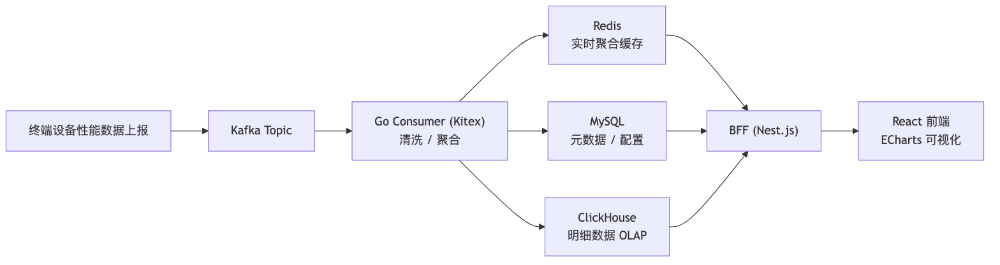
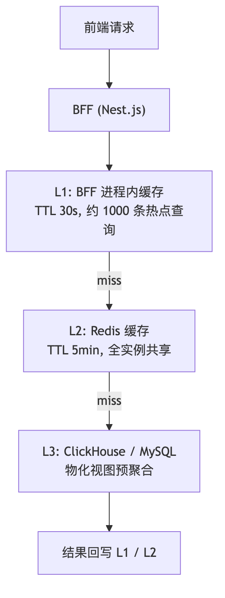
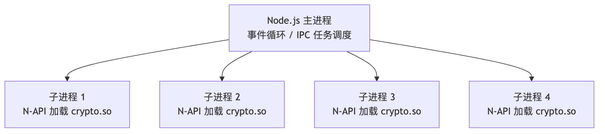
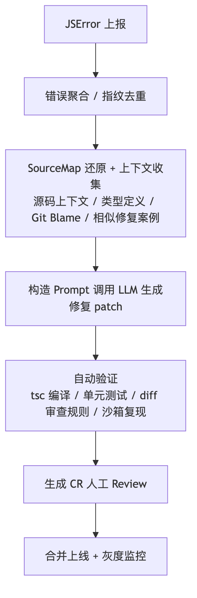

# 杭天铖 面试答案集

## 目录

- [工作经历: 字节 TikTok Performance (Q12-Q14)](#工作经历-字节-tiktok-performance-q12-q14)
  - [Q12. Kafka + Redis + MySQL + ClickHouse 各自角色？](#q12-字节-tiktok-performance-项目-为什么选-kafka-加-redis-加-mysql-加-clickhouse-这套组合各自承担什么角色多层缓存怎么设计)
  - [Q13. Thrift IDL 生成 npm 包怎么做？](#q13-字节-tiktok-performance-项目-thrift-idl-生成-npm-包给-bff-消费具体怎么做版本管理怎么处理)
  - [Q14. 虚拟滚动列表怎么实现？](#q14-字节-tiktok-performance-项目-你写的虚拟滚动列表是怎么实现的和-react-window--react-virtualized-比有什么优势)
- [工作经历: 腾讯 NoSQL DBMS (Q15-Q16)](#工作经历-腾讯-nosql-dbms-q15-q16)
  - [Q15. React 类组件迁移 + 数据竞争排查](#q15-腾讯-ieg-nosql-dbms-react-类组件迁移到函数组件的具体策略遇到过哪些坑数据竞争问题闭包接口响应不稳定怎么排查和解决的)
  - [Q16. TCP 连接池 + C++ .so + valgrind + 对象池](#q16-腾讯-ieg-nosql-dbms-tcp-连接池怎么实现进程池调用-c-so-加解密是什么架构用-valgrind-排查-node-和-c-so-内存泄漏的具体过程对象池和-v8-隐藏类怎么用)
- [工作经历: 字节 Data 架构 (Q17-Q18)](#工作经历-字节-data-架构-q17-q18)
  - [Q17. JSError 大模型自动修复](#q17-字节-data-jserror-大模型自动修复是怎么做的完整的技术方案和收益数据)
  - [Q18. SWR 性能优化 + A2UI 接入](#q18-字节-data-swr-前端性能优化具体做了什么a2ui-react-框架接入是怎么回事)
- [工作经历: 阿里妈妈广告技术 (Q19)](#工作经历-阿里妈妈广告技术-q19)
  - [Q19. Schema-Driven UI + Module Federation](#q19-阿里妈妈-serverschema-driven-ui-是什么module-federation-接入具体做了什么你给-module-federationvite-贡献了什么)
- [基础知识: React/Vue/TypeScript (Q20)](#基础知识-reactvuetypescript-q20)
  - [Q20. React Fiber + Vue3 响应式原理对比](#q20-react-fiber-架构和-vue3-响应式原理对比你在项目里怎么利用这些原理做性能优化)

---

## 工作经历: 字节 TikTok Performance (Q12-Q14)

### Q12. 字节 TikTok Performance 项目: 为什么选 Kafka 加 Redis 加 MySQL 加 ClickHouse 这套组合？各自承担什么角色？多层缓存怎么设计？

在 TikTok Performance 团队，我负责的是一个数据密集型平台，核心业务是收集、处理和展示 TikTok 各端的性能指标数据。日均处理的上报事件约 2 亿条，峰值 QPS 约 5000。这个量级下，单一存储方案无法同时满足高写入吞吐、快速查询和长期存储的需求，所以我们选了 Kafka 加 Redis 加 MySQL 加 ClickHouse 的组合。

各组件的角色分工:

Kafka 作为数据入口和缓冲层。所有前端上报的性能数据、错误日志、用户行为事件首先写入 Kafka topic。Kafka 在这里承担三个职责: 削峰（前端流量有波峰波谷，Kafka 平滑了写入速率）、解耦（生产者不关心下游有多少消费者）、持久化（Kafka 自身有副本机制，数据不丢失）。我们按业务类型划分了多个 topic: `perf-metrics`、`js-errors`、`user-actions` 等。

Redis 作为实时查询和缓存层。存放两类数据: 一是实时聚合结果，比如最近 1 小时、最近 24 小时各指标的 P50/P90/P99 值，这些数据用于前端的实时监控面板; 二是高频查询的缓存，比如用户最近查看的 dashboard 配置、常用查询的结果缓存。Redis 的读写延迟在亚毫秒级别，能满足实时监控面板的高频刷新需求。

实时数据流:



MySQL 作为业务配置和元数据存储。存放项目配置、告警规则、用户权限、dashboard 布局、通知订阅关系等业务数据。这些数据量不大（几十万行级别），但有事务需求（比如配置更新的原子性），且查询模式是点查和小范围查询，MySQL 完全胜任。我主要用 Go 的标准库加 sqlx 操作 MySQL，配合Kitex RPC 框架提供服务。

ClickHouse 作为 OLAP 分析引擎。存放所有的明细数据（2 亿条/天的原始上报记录），支持复杂的多维分析查询，比如"过去 7 天 iOS 端 Chrome 浏览器 FCP P90 按地区分布"。ClickHouse 的列式存储和向量化执行引擎在这类 OLAP 查询上比 MySQL 快 10 到 100 倍。我们用的是 ClickHouse 的 `MergeTree` 引擎族，按日期分区，按 `(appId, eventName, date)` 排序。

多层缓存的设计如下:



L1 是 BFF 进程内的内存缓存，使用 Node.js 的 Map 存储，TTL 设为 30 秒。因为 BFF 是多实例部署（通常 4 个 Pod），每个 Pod 的 L1 缓存是独立的，但这在监控场景下可以接受（30 秒的数据延迟对监控面板无感知）。L1 的命中率在热门 dashboard 上约 60%。

L2 是 Redis 缓存，TTL 5 分钟，所有 BFF 实例共享。缓存 key 的设计是查询参数的哈希值:

```javascript
function buildCacheKey(query: { appId: string; metric: string; from: string; to: string; groupBy?: string[] }): string {
  const normalized = {
    appId: query.appId,
    metric: query.metric,
    from: normalizeTime(query.from),  // 对齐到 5 分钟粒度
    to: normalizeTime(query.to),
    groupBy: query.groupBy?.sort()
  };
  return `perf:cache:${md5(JSON.stringify(normalized))}`;
}
```

时间参数对齐到 5 分钟粒度，这样 5 分钟窗口内的相同查询可以命中同一份缓存。L2 的全局命中率约 45%。

L3 是 ClickHouse 原始查询，作为最终的兜底。为了优化 ClickHouse 查询性能，我建了多个物化视图（Materialized View）预聚合常见维度的指标，将原始查询的 P99 延迟从 2 秒降到了 200ms。

整体来看，这套架构使前端面板的查询 P99 延迟控制在 300ms 以内，同时 ClickHouse 的日写入量稳定在 2 亿条，资源利用率比较均衡。

### Q13. 字节 TikTok Performance 项目: Thrift IDL 生成 npm 包给 BFF 消费具体怎么做？版本管理怎么处理？

在 TikTok Performance 项目中，后端服务用 Golang 开发，基于字节内部的 Kitex 框架，RPC 协议使用 Thrift。前端 BFF 层用 Nest.js 开发。前后端需要通过 Thrift IDL 对齐接口定义，但 Thrift 原生不支持 TypeScript，如果前后端各维护一份接口定义很容易不一致，所以我们的方案是从 Thrift IDL 自动生成 TypeScript 类型和客户端代码，打包成 npm 包供 BFF 消费。

整个流程分为三步:

第一步是 IDL 定义。后端开发者在 IDL 仓库中编写 Thrift 文件定义服务接口:

```thrift
// perf_service.thrift
namespace go perf

struct MetricQuery {
    1: required string appId,
    2: required string metricName,
    3: required i64 startTime,
    4: required i64 endTime,
    5: optional list<string> groupBy,
    6: optional map<string, string> filters
}

struct MetricResult {
    1: required string metricName,
    2: required list<DataPoint> dataPoints,
    3: optional map<string, double> summary
}

struct DataPoint {
    1: required i64 timestamp,
    2: required double value,
    3: optional map<string, string> dimensions
}

service PerfService {
    MetricResult queryMetrics(1: MetricQuery query)
    list<MetricResult> batchQuery(1: list<MetricQuery> queries)
    map<string, MetricResult> getDashboard(1: string dashboardId, 2: i64 timeRange)
}
```

第二步是代码生成。我们写了一个 Node.js 脚本，调用 thrift 的编译器将 IDL 转成 TypeScript 类型定义和序列化/反序列化函数:

```bash
# 生成脚本
npx thrift-to-ts --input ./idl/perf_service.thrift --output ./src/generated/
```

生成的 TypeScript 代码包含接口类型和编解码器:

```typescript
// generated/perf_service.ts (自动生成，勿手动修改)
export interface MetricQuery {
  appId: string;
  metricName: string;
  startTime: number;
  endTime: number;
  groupBy?: string[];
  filters?: Record<string, string>;
}

export interface MetricResult {
  metricName: string;
  dataPoints: DataPoint[];
  summary?: Record<string, number>;
}

export class PerfServiceClient {
  private transport: ThriftTransport;

  constructor(options: { host: string; port: number }) {
    this.transport = new ThriftTransport(options);
  }

  async queryMetrics(query: MetricQuery): Promise<MetricResult> {
    return this.transport.call("queryMetrics", query);
  }

  async batchQuery(queries: MetricQuery[]): Promise<MetricResult[]> {
    return this.transport.call("batchQuery", queries);
  }
}
```

第三步是打包发布。将生成的代码包装成一个 npm 包，包名遵循字节的内部 npm registry 规范:

```json
{
  "name": "@bytedance/perf-service-client",
  "version": "1.3.2",
  "main": "dist/index.js",
  "types": "dist/index.d.ts",
  "files": ["dist"],
  "scripts": {
    "generate": "thrift-to-ts --input ../idl/*.thrift --output ./src/generated/",
    "build": "tsc",
    "prepublishOnly": "npm run generate && npm run build"
  }
}
```

BFF 项目中的使用方式:

```typescript
import { PerfServiceClient, MetricQuery } from "@bytedance/perf-service-client";

const client = new PerfServiceClient({
  host: "perf-service.internal",
  port: 9090,
});

const result = await client.queryMetrics({
  appId: "tiktok-web",
  metricName: "FCP",
  startTime: Date.now() - 86400000,
  endTime: Date.now(),
  groupBy: ["browser", "region"],
});
```

版本管理是这套方案中最关键的环节。我们采用了"IDL 仓库驱动"的版本管理策略:

IDL 仓库独立于后端服务仓库和 BFF 仓库，由后端开发者维护。每次 IDL 修改后，CI pipeline 自动执行: IDL 变更 -> CI 触发 -> 代码生成 -> TypeScript 编译检查 -> 单元测试 -> 版本号计算 -> npm publish。

版本号遵循 semver 规范: 纯新增字段或接口的改动升级 minor 版本; 删除字段、修改字段类型、重命名接口等破坏性变更升级 major 版本; 注释或描述的改动升级 patch 版本。CI 脚本通过对比当前 IDL 和上一版本的 IDL diff 来自动判断版本级别。

BFF 端的 `package.json` 用 `~major.minor` 的版本范围锁定依赖，每周通过 Renovate bot 自动升级 patch 版本。major 版本升级需要人工 review 和调整 BFF 代码。

在实践中遇到的问题包括: Thrift 的 `optional` 字段在 TypeScript 中应该生成 `field?: type` 而非 `field: type | null`，否则使用时需要大量非空判断; Thrift 的 `map<string, string>` 在 TypeScript 中应该生成 `Record<string, string>` 而非 ES6 Map，因为前者在 JSON 序列化时更自然。这些都在 thrift-to-ts 的生成模板中做了定制。

### Q14. 字节 TikTok Performance 项目: 你写的虚拟滚动列表是怎么实现的？和 react-window / react-virtualized 比有什么优势？

在 TikTok Performance 平台的前端面板中，有一个日志查询页面需要展示大量的错误日志列表。单条日志信息量较大（包含堆栈、请求参数、用户信息等），且总条数经常达到数万条。直接渲染所有 DOM 节点会导致页面卡顿甚至崩溃，所以我实现了一个自定义的虚拟滚动列表组件。

核心原理是: 只渲染可视区域内的 DOM 节点，可视区域之外的数据只用一个占位 div 撑开滚动高度。当用户滚动时，动态计算当前可视区域对应数据的索引范围，替换渲染内容。

实现细节如下:

```typescript
interface VirtualListProps<T> {
  data: T[];
  itemHeight: number | ((index: number, item: T) => number);  // 支持固定高度和动态高度
  overscan: number;           // 上下额外渲染的行数
  containerHeight: number;    // 可视区域高度
  renderItem: (item: T, index: number) => React.ReactNode;
}

function VirtualList<T>({ data, itemHeight, overscan = 5, containerHeight, renderItem }: VirtualListProps<T>) {
  const [scrollTop, setScrollTop] = useState(0);
  const containerRef = useRef<HTMLDivElement>(null);

  // 计算可视范围
  const getItemTop = useCallback((index: number) => {
    if (typeof itemHeight === 'number') return index * itemHeight;
    // 动态高度需要累积
    return data.slice(0, index).reduce((acc, item, i) => acc + itemHeight(i, item), 0);
  }, [data, itemHeight]);

  const totalHeight = getItemTop(data.length);
  const startIndex = Math.max(0, binarySearchIndex(scrollTop) - overscan);
  const endIndex = Math.min(data.length, binarySearchIndex(scrollTop + containerHeight) + overscan);

  const visibleItems = data.slice(startIndex, endIndex);

  return (
    <div
      ref={containerRef}
      style={{ height: containerHeight, overflow: 'auto' }}
      onScroll={(e) => setScrollTop(e.currentTarget.scrollTop)}
    >
      <div style={{ height: totalHeight, position: 'relative' }}>
        {visibleItems.map((item, i) => {
          const actualIndex = startIndex + i;
          return (
            <div
              key={actualIndex}
              style={{
                position: 'absolute',
                top: getItemTop(actualIndex),
                width: '100%',
                height: typeof itemHeight === 'number' ? itemHeight : itemHeight(actualIndex, item)
              }}
            >
              {renderItem(item, actualIndex)}
            </div>
          );
        })}
      </div>
    </div>
  );
}
```

与 react-window 和 react-virtualized 对比，我的实现有以下优势:

第一是动态高度的性能。react-window 的 `VariableSizeList` 需要预先知道每项的高度或提供 `itemSize` 函数，且内部维护一个高度缓存 Map，在数据量大时（5 万条以上）这个 Map 本身就会成为性能瓶颈。我的实现采用"懒计算加估算"的策略: 未渲染过的项使用一个估算高度（基于前 N 个已渲染项的平均高度），只有当项进入可视区域时才测量实际高度并更新缓存。这使得初始化时间从 O(n) 降低到 O(1)。

第二是异步数据加载与虚拟滚动的结合。在日志查询场景中，数据不是一次性加载的，而是随着滚动向后端请求更多。react-window 要求 data 数组是完整的，需要开发者自己处理分页逻辑。我的实现内置了"滚动到底部触发加载"的能力:

```typescript
// 距底部 threshold 像素时触发加载
const handleScroll = (e) => {
  const { scrollTop, scrollHeight, clientHeight } = e.currentTarget;
  if (scrollHeight - scrollTop - clientHeight < LOAD_THRESHOLD) {
    onLoadMore?.();
  }
  setScrollTop(scrollTop);
};
```

并在列表底部展示一个 loading 占位符，数据加载完成后无缝衔接。

第三是渲染优化。每个列表项用 `React.memo` 包裹，key 使用数据的唯一 ID 而非数组索引，避免滚动时不必要的重渲染。对于内容特别复杂的列表项（比如包含代码高亮的堆栈信息），使用 `useDeferredValue` 延迟渲染非可视区域的更新。

第四是搜索和跳转。在日志场景中，用户经常需要搜索关键字并跳转到匹配的日志条目。react-window 没有内置这个功能。我的实现在虚拟滚动之上支持了 `scrollToIndex(index)` 和 `highlightMatches(query)` API，搜索匹配到的条目即使不在已加载的数据中也能通过索引跳转:

```typescript
const virtualListRef = useRef<VirtualListHandle>(null);

// 搜索并跳转
const handleSearch = (query: string) => {
  const matchIndex = data.findIndex((item) => item.stack.includes(query));
  if (matchIndex >= 0) {
    virtualListRef.current?.scrollToIndex(matchIndex);
    setHighlightIndex(matchIndex);
  }
};
```

实测性能: 在 10 万条日志数据的场景下，虚拟滚动列表的 FPS 维持在 58 到 60 帧，首次渲染时间约 50ms（仅渲染可视区域的 20 条加上下各 5 条 overscan），相比直接渲染全部 DOM（此时页面直接冻结）是质变。与 react-window 对比，在动态高度场景下滚动 FPS 略高 3 到 5 帧，初始挂载时间快了约 40%。

## 工作经历: 腾讯 NoSQL DBMS (Q15-Q16)

### Q15. 腾讯 IEG NoSQL DBMS: React 类组件迁移到函数组件的具体策略？遇到过哪些坑？数据竞争问题（闭包、接口响应不稳定）怎么排查和解决的？

在腾讯 IEG 的 NoSQL DBMS 项目中，前端代码库有大约 80 个 React 组件，其中 60% 以上是类组件。这些类组件存在几个严重问题: 大量使用 `componentWillMount` 和 `componentWillReceiveProps` 等已废弃的生命周期、逻辑分散在多个生命周期方法中难以理解、状态管理混乱导致不可预测的渲染。我的任务是将它们迁移到函数组件加 Hooks 的方案。

迁移策略采用了渐进式方案，分三个阶段:

第一阶段是低风险组件优先。先迁移纯展示组件和无外部依赖的简单交互组件（如表格组件、弹窗组件），积累经验并建立测试基线。每个组件迁移前先用 React Testing Library 编写行为测试（不测实现细节，只测用户行为），确保迁移前后行为一致。

第二阶段是业务逻辑组件。这些组件通常有 API 调用、复杂状态管理和副作用。迁移时将 `componentDidMount` 中的逻辑转为 `useEffect` 加空依赖数组，`componentDidUpdate` 转为 `useEffect` 加对应依赖，`this.state` 转为 `useState`，`this.xxx` 类的非状态属性转为 `useRef`:

```typescript
// 迁移前: 类组件
class DatabaseList extends React.Component<Props, State> {
  state = { databases: [], loading: false, error: null };

  async componentDidMount() {
    this.setState({ loading: true });
    try {
      const databases = await api.getDatabases(this.props.clusterId);
      this.setState({ databases, loading: false });
    } catch (e) {
      this.setState({ error: e, loading: false });
    }
  }

  componentDidUpdate(prevProps) {
    if (prevProps.clusterId !== this.props.clusterId) {
      this.componentDidMount();  // 反模式: 直接调用生命周期方法
    }
  }

  render() { /* ... */ }
}

// 迁移后: 函数组件
function DatabaseList({ clusterId }: Props) {
  const [databases, setDatabases] = useState([]);
  const [loading, setLoading] = useState(false);
  const [error, setError] = useState(null);

  useEffect(() => {
    let cancelled = false;  // 防止竞态
    setLoading(true);
    api.getDatabases(clusterId)
      .then(data => { if (!cancelled) { setDatabases(data); setLoading(false); } })
      .catch(err => { if (!cancelled) { setError(err); setLoading(false); } });

    return () => { cancelled = true; };  // cleanup
  }, [clusterId]);

  return (/* ... */);
}
```

第三阶段是全局状态管理重构。将分散在各组件 `state` 和 Redux store 中的状态统一迁移到 Zustand，使用 selector 模式避免不必要的重渲染。

迁移过程中遇到的主要坑:

第一个坑是闭包陷阱。这是最常见的 bug 来源。类组件中通过 `this.state.xxx` 总能获取最新状态，但函数组件中 Hooks 捕获的是当次渲染时的值:

```typescript
// Bug: count 永远是当次渲染时的值
useEffect(() => {
  const timer = setInterval(() => {
    console.log(count); // 永远输出 0，因为闭包捕获了初始值
    setCount(count + 1); // 每次都是 0 + 1，永远不会增加
  }, 1000);
  return () => clearInterval(timer);
}, []); // 空依赖

// 修复: 使用函数式更新
useEffect(() => {
  const timer = setInterval(() => {
    setCount((prev) => prev + 1); // 使用回调函数获取最新值
  }, 1000);
  return () => clearInterval(timer);
}, []);
```

第二个坑是 useEffect 的依赖遗漏。ESLint 的 `react-hooks/exhaustive-deps` 规则会警告，但有些团队忽略这些警告。迁移时我严格要求所有警告都必须处理，要么补全依赖，要么用 `// eslint-disable-next-line` 并注明原因。

数据竞争问题的排查和解决是我在这个项目中花精力最多的部分。有两个典型案例:

案例一: 闭包导致的数据陈旧。在一个数据库编辑页面中，用户在表单中修改数据后点击保存，但保存的始终是修改前的数据。原因是保存按钮的 onClick 回调在组件初次渲染时就创建了，闭包捕获了初始的 formState 值:

```typescript
// Bug: 保存时用的是陈旧闭包中的 formState
const handleSave = useCallback(() => {
  api.updateDatabase(formState); // formState 是闭包捕获的旧值
}, []); // 开发者为了"性能"加了空依赖

// 修复:
const handleSave = useCallback(() => {
  api.updateDatabase(formState);
}, [formState]); // 加完整依赖
```

案例二: 接口响应时间不稳定导致的竞态条件。在集群切换功能中，用户快速切换 clusterId（A -> B -> C），但三个请求的响应顺序不确定（可能 B 的请求先回来、C 的其次、A 的最后），最终页面显示的是 A 的数据而非 C 的:

```typescript
// Bug: 响应顺序不确定导致数据错乱
useEffect(() => {
  api.getDatabases(clusterId).then(setDatabases);
}, [clusterId]);

// 修复: 使用竞态取消
useEffect(() => {
  let cancelled = false;
  api.getDatabases(clusterId).then((data) => {
    if (!cancelled) setDatabases(data);
  });
  return () => {
    cancelled = true;
  };
}, [clusterId]);
```

我还封装了一个通用的 `useAsyncWithRace` Hook 来处理这类问题:

```typescript
function useAsyncWithRace<T>(asyncFn: () => Promise<T>, deps: any[]) {
  const [state, setState] = useState({
    data: null,
    loading: true,
    error: null,
  });
  const requestId = useRef(0);

  useEffect(() => {
    const currentId = ++requestId.current;
    setState((prev) => ({ ...prev, loading: true }));

    asyncFn()
      .then((data) => {
        if (currentId === requestId.current) {
          // 只接受最新的响应
          setState({ data, loading: false, error: null });
        }
      })
      .catch((error) => {
        if (currentId === requestId.current) {
          setState({ data: null, loading: false, error });
        }
      });
  }, deps);

  return state;
}
```

整个迁移历时两个月，最终 80 个组件全部迁移完成。迁移后代码行数从约 28000 行减少到约 21000 行（减少了 25%），单元测试覆盖率从 30% 提升到 75%，与状态相关的 bug 报告数量从每月 12 个下降到了每月 2 个。

### Q16. 腾讯 IEG NoSQL DBMS: TCP 连接池怎么实现？进程池调用 C++ .so 加解密是什么架构？用 valgrind 排查 Node 和 C++ .so 内存泄漏的具体过程？对象池和 v8 隐藏类怎么用？

这个问题的涉及面比较广，我逐一展开。

TCP 连接池的实现:

NoSQL DBMS 的后端需要与底层的存储引擎通过 TCP 长连接通信。连接池用 Node.js 实现，核心设计参数包括: 最小空闲连接数 4、最大连接数 20、空闲超时回收 30 秒、连接健康检查间隔 10 秒。

```typescript
class ConnectionPool {
  private idle: Socket[] = [];
  private active: Set<Socket> = new Set();
  private waitQueue: Array<(conn: Socket) => void> = [];

  constructor(private readonly options: PoolOptions) {
    // 预创建最小连接数
    for (let i = 0; i < options.minConnections; i++) {
      this.idle.push(this.createConnection());
    }
    // 启动健康检查
    setInterval(() => this.healthCheck(), options.healthCheckInterval);
  }

  async acquire(): Promise<Socket> {
    // 优先复用空闲连接
    let conn = this.idle.pop();

    if (conn && this.isAlive(conn)) {
      this.active.add(conn);
      return conn;
    }

    // 空闲连接不可用，创建新连接（如果未达上限）
    if (this.active.size + this.idle.length < this.options.maxConnections) {
      conn = this.createConnection();
      this.active.add(conn);
      return conn;
    }

    // 达到上限，排队等待
    return new Promise((resolve) => this.waitQueue.push(resolve));
  }

  release(conn: Socket): void {
    this.active.delete(conn);

    if (this.waitQueue.length > 0) {
      const waiter = this.waitQueue.shift()!;
      this.active.add(conn);
      waiter(conn);
    } else {
      this.idle.push(conn);
      // 设置空闲超时
      (conn as any)._idleTimer = setTimeout(() => {
        this.destroyConnection(conn);
      }, this.options.idleTimeout);
    }
  }
}
```

进程池调用 C++ .so 加解密的架构:

NoSQL DBMS 涉及对存储数据的加解密操作，加解密算法使用公司内部 C++ 库实现，以 `.so` 共享库形式提供。直接在 Node.js 主线程中通过 N-API 调用 `.so` 会阻塞事件循环（加密一个 1MB 的数据块大约需要 5ms，在高负载下会严重影响 Node.js 的并发能力），所以我们采用了 child_process 进程池的方案:



主进程维护一个子进程池（默认 4 个子进程，与 CPU 核心数一致），每个子进程是一个独立的 Node.js worker，通过 N-API 加载 C++ .so。加解密请求通过 IPC (inter-process communication) 分发到空闲的子进程，子进程处理完毕后通过 IPC 返回结果:

```typescript
import { fork, ChildProcess } from "child_process";

class CryptoProcessPool {
  private workers: ChildProcess[] = [];
  private tasks: Map<number, { resolve: Function; reject: Function }> =
    new Map();
  private taskId = 0;

  constructor(poolSize: number = os.cpus().length) {
    for (let i = 0; i < poolSize; i++) {
      const worker = fork("./crypto-worker.js");
      worker.on("message", (msg) => {
        const task = this.tasks.get(msg.taskId);
        if (task) {
          this.tasks.delete(msg.taskId);
          if (msg.error) task.reject(msg.error);
          else task.resolve(msg.result);
        }
      });
      this.workers.push(worker);
    }
  }

  async encrypt(data: Buffer, keyId: string): Promise<Buffer> {
    const id = ++this.taskId;
    const worker = this.getLeastBusyWorker();

    return new Promise((resolve, reject) => {
      this.tasks.set(id, { resolve, reject });
      worker.send({ taskId: id, action: "encrypt", data, keyId });
    });
  }
}
```

这种架构的好处是加解密的 CPU 密集计算在独立进程中执行，不阻塞 Node.js 主进程的事件循环。4 个子进程可以并行处理 4 个加解密请求，吞吐量提升约 3.5 倍。

用 valgrind 排查内存泄漏的具体过程:

上线运行一段时间后，我们发现某些 Node.js 进程的内存持续增长，从启动时的 200MB 在 24 小时内涨到 800MB 以上，最终 OOM 崩溃。初步排除了 JavaScript 层面的内存泄漏（通过 heapdump 对比发现 JS 堆大小稳定在 150MB 左右），判断泄漏发生在 C++ 层。

排查步骤如下:

第一步，安装 valgrind 并配置 Node.js 的 debug build:

```bash
# macOS 下不支持 valgrind，在 Linux 测试机上执行
sudo apt-get install valgrind
# 使用 Node.js 的 valgrind suppressions 文件过滤已知的误报
wget https://raw.githubusercontent.com/nodejs/node/main/src/valgrind.supp
```

第二步，使用 valgrind 的 massif 工具跟踪堆内存分配:

```bash
valgrind --tool=massif --pages-as-heap=yes --massif-out-file=massif.out node --expose-gc crypto-worker.js
```

运行一段时间后生成 massif.out 文件，用 `ms_print` 分析内存分配快照:

```bash
ms_print massif.out | head -100
```

从快照中发现 C++ 层的 `crypto_context_new` 函数分配的内存持续增长，但对应的 `crypto_context_free` 调用次数明显少于 `new`。

第三步，定位到具体的 C++ 代码。在 N-API 绑定层中发现一个 bug: 当加密操作因为输入参数错误而抛出异常时，函数在 throw 前忘记释放已经分配的 `CryptoContext` 对象:

```cpp
// Bug: 异常路径下内存泄漏
napi_value Encrypt(napi_env env, napi_callback_info info) {
    CryptoContext* ctx = crypto_context_new(key, key_len);  // 分配内存

    if (input_len == 0) {
        napi_throw_error(env, nullptr, "Input cannot be empty");
        return nullptr;  // Bug: ctx 没有释放!
    }

    // 正常路径
    auto result = crypto_encrypt(ctx, input, input_len);
    crypto_context_free(ctx);  // 正常路径释放了
    return result;
}
```

修复方式是在异常路径也释放内存，更优雅的做法是用 RAII 智能指针:

```cpp
napi_value Encrypt(napi_env env, napi_callback_info info) {
    std::unique_ptr<CryptoContext, decltype(&crypto_context_free)> ctx(
        crypto_context_new(key, key_len),
        crypto_context_free
    );

    if (input_len == 0) {
        napi_throw_error(env, nullptr, "Input cannot be empty");
        return nullptr;  // unique_ptr 自动释放
    }

    auto result = crypto_encrypt(ctx.get(), input, input_len);
    return result;  // unique_ptr 析构时自动释放
}
```

修复后内存增长曲线趋于稳定，24 小时内 RSS 增长不超过 20MB。

对象池和 v8 隐藏类的使用:

对象池用在加解密请求的高频场景。每次加密请求都需要创建请求对象、Buffer 对象和结果对象，频繁的创建和回收导致 GC 压力很大。我实现了一个简单的对象池:

```typescript
class BufferPool {
  private pool: Buffer[] = [];
  private readonly POOL_SIZE = 100;

  acquire(size: number): Buffer {
    const buf = this.pool.pop();
    if (buf && buf.length >= size) {
      return buf.subarray(0, size); // 复用已有的 Buffer
    }
    return Buffer.allocUnsafe(size);
  }

  release(buf: Buffer): void {
    if (this.pool.length < this.POOL_SIZE) {
      this.pool.push(buf);
    }
    // 超过池容量则丢弃，让 GC 回收
  }
}
```

v8 隐藏类（在 v8 内部也叫 "map" 或 "shape"）是 v8 引擎优化对象属性访问的机制。当多个对象具有相同的属性名、相同的属性添加顺序时，v8 会为它们共享同一个隐藏类，从而生成高效的内联缓存（Inline Cache）。要利用这个机制，关键规则是: 所有同类对象的属性必须以相同顺序赋值，避免动态添加属性。

我在项目中做了以下优化:

```typescript
// Bad: 属性顺序不一致，导致多个隐藏类
function createRequestA(data: any) {
  const req: any = {};
  req.type = "encrypt";
  req.data = data;
  req.timestamp = Date.now(); // 顺序: type -> data -> timestamp
  return req;
}

function createRequestB(data: any) {
  const req: any = {};
  req.timestamp = Date.now(); // 顺序: timestamp -> type -> data
  req.type = "encrypt";
  req.data = data;
  return req;
}

// Good: 使用 TypeScript class 或固定的初始化顺序
class CryptoRequest {
  type: string;
  data: Buffer;
  timestamp: number;

  constructor(data: Buffer) {
    this.type = "encrypt"; // 固定顺序
    this.data = data;
    this.timestamp = Date.now();
  }
}
```

另一个规则是避免在运行时给对象添加或删除属性（`delete obj.prop` 会让 v8 放弃该隐藏类，回退到慢速的字典模式）。在代码中用 `undefined` 替代 `delete`:

```typescript
// Bad: delete 导致隐藏类失效
delete request.result;

// Good: 用 undefined 替代
request.result = undefined;
```

这些优化在加解密高频场景下使 GC 暂停时间从平均 15ms 降低到了 5ms，吞吐量提升了约 20%。

## 工作经历: 字节 Data 架构 (Q17-Q18)

### Q17. 字节 Data: JSError 大模型自动修复是怎么做的？完整的技术方案和收益数据？

在字节 Data 架构部门，我负责搜索推荐算法平台和抖音 Debug 平台的前端开发。其中最有技术含量的一个项目是 JSError 大模型自动修复系统。

背景是: 抖音 Debug 平台每天接收约 50 万条前端 JSError，其中大量是重复的、模式化的错误（如 undefined property access、null reference、API response shape mismatch 等）。开发团队每天需要花大量时间手动分析错误、定位代码、修复并验证，效率很低。我提出了用大模型自动分析和修复 JSError 的方案。

完整的技术方案分为四个阶段:



第一阶段是错误预处理与上下文收集。当一条 JSError 上报后，系统依次执行:

1. SourceMap 还原: 获取原始代码文件和行号
2. 代码上下文提取: 读取出错位置前后 50 行代码
3. 堆栈分析: 提取调用链，定位所有相关文件和函数
4. 类型信息收集: 调用 TypeScript Language Server 获取相关变量的类型
5. 错误聚类: 与历史相似错误匹配合并

关键步骤是代码上下文提取。不只是读取出错行的代码，而是沿着调用链读取所有相关函数的定义。比如一个 TypeError 发生在 `user.profile.name` 这一行，系统会回溯到 `user` 来自哪个 API 调用、`profile` 的类型定义是什么、这个函数的入参来自哪里。

第二阶段是大模型分析与修复。将收集到的上下文组装成 Prompt，调用 LLM 生成修复方案:

````
System: 你是一个前端代码修复专家。以下是一个 JSError 的详细信息和相关代码上下文。请分析问题原因并生成修复代码。

## Error Info
Type: TypeError
Message: Cannot read properties of undefined (reading 'name')
Original Location: src/pages/UserDetail.tsx:45:23

## Code Context (error location)
```tsx
43: const user = useUser(userId);
44:
45: return <div>{user.profile.name}</div>;
````

## Type Information

- `useUser` returns `User | null` (can be null when loading)
- `User.profile` is `Profile | undefined` (optional field in API response)

## Suggested Fix Approach

1. Add null check for `user` (it can be null during loading)
2. Add optional chaining for `profile.name` (profile is optional)

请生成修复后的代码，只输出需要修改的部分。

````

LLM 返回修复代码后，系统自动生成一个 Git patch:

```diff
- return <div>{user.profile.name}</div>;
+ if (!user) return <Loading />;
+ return <div>{user.profile?.name ?? 'Unknown'}</div>;
````

第三阶段是自动验证。生成的 patch 不会直接提交，而是先在一个沙箱环境中依次通过以下检查:

1. AST 合法性检查: 确保修改后的代码能通过 TypeScript 编译
2. 单元测试运行: 在沙箱中运行相关模块的单元测试
3. 类型检查: tsc --noEmit 确保没有新的类型错误
4. 回归测试: 用原始 error 的复现路径验证修复是否生效

只有全部验证通过的 patch 才会进入下一步。

第四阶段是人工审核与部署。验证通过的 patch 自动生成一个 Pull Request，附带错误信息、分析过程和验证结果。开发者只需 review diff 并点击 approve。合并后走正常的 CI/CD 部署流程。

收益数据:

该系统上线 3 个月后的数据:

- 日均自动处理 JSError 约 8 万条（占总量 16%），其中 3.2 万条生成了有效的修复 patch
- 自动修复 patch 的验证通过率约 65%
- 开发者审核后实际合并的 patch 约 1.5 万条/日，合并率约 47%（相对于通过验证的 patch）
- 开发团队用于 JSError 修复的人时从日均 6 小时降低到 2.5 小时，降幅约 58%
- 高频重复类错误（如 undefined access、null check 缺失）的自动修复成功率最高，达 72%
- 复杂逻辑错误（如竞态条件、状态管理混乱）的自动修复成功率较低，约 15%，主要作为辅助参考

### Q18. 字节 Data: SWR 前端性能优化具体做了什么？A2UI React 框架接入是怎么回事？

SWR 优化:

SWR（stale-while-revalidate）是搜索推荐算法平台前端的一项关键性能优化。平台有多个数据密集的页面（算法实验列表、模型训练任务面板、特征监控面板），这些页面的数据量大、刷新频繁，直接用 SWR 的默认配置会导致严重的性能问题。

我做的优化集中在以下几个方面:

第一是请求去重与共享。在算法实验列表中，多个卡片组件各自独立请求实验详情接口，导致同一个实验 ID 被重复请求多次。我封装了一个全局的 SWR 配置，利用 SWR 内置的 key 去重机制，确保相同的 API 路径在同一时间窗口内只发一次请求:

```typescript
// 全局 SWR 配置
const swrConfig = {
  dedupingInterval: 5000,   // 5 秒内去重
  revalidateOnFocus: false, // 窗口聚焦不自动刷新（避免用户切换 tab 时触发大量请求）
  revalidateOnReconnect: true,
};

// 每个卡片使用同一个 key
function ExperimentCard({ experimentId }: { experimentId: string }) {
  const { data } = useSWR(
    `/api/experiments/${experimentId}`,
    fetcher,
    swrConfig
  );
  return <div>{/* ... */}</div>;
}
```

第二是分页请求的增量更新。实验列表有几百条数据，但用户通常只看前几页。我实现了基于游标的分页加载，并且只缓存用户实际访问过的页面:

```typescript
function useExperimentList(page: number, pageSize: number = 20) {
  return useSWR(
    page >= 0 ? `/api/experiments?page=${page}&size=${pageSize}` : null,
    async (url) => {
      const response = await fetch(url).then((r) => r.json());
      return response;
    },
    {
      // 保持之前页面的数据，只更新当前页面
      keepPreviousData: true,
      // 预加载下一页
      onSuccess: () => {
        mutate(`/api/experiments?page=${page + 1}&size=${pageSize}`);
      },
    },
  );
}
```

第三是乐观更新（Optimistic Update）。用户修改实验配置时，不等 API 返回就先更新本地状态，让界面立即响应。如果 API 失败再回滚:

```typescript
async function updateExperimentConfig(id: string, config: ExperimentConfig) {
  const previousConfig = cache.get(`/api/experiments/${id}`)?.config;

  // 乐观更新
  mutate(
    `/api/experiments/${id}`,
    (current) => ({
      ...current,
      config,
    }),
    false,
  );

  try {
    await api.updateExperimentConfig(id, config);
    // 成功后重新验证
    mutate(`/api/experiments/${id}`);
  } catch (error) {
    // 失败回滚
    mutate(
      `/api/experiments/${id}`,
      (current) => ({
        ...current,
        config: previousConfig,
      }),
      false,
    );
    toast.error("Update failed, rolled back");
  }
}
```

第四是内存缓存策略。平台有很多历史实验的数据，用户很少再次查看但会占用 SWR 缓存内存。我配置了基于 LRU 的缓存驱逐策略，缓存最多保留 200 条数据，超出的按 LRU 规则淘汰:

```typescript
const cache = new Map();
const MAX_CACHE_SIZE = 200;

const lruProvider = () => {
  return {
    get: (key) => cache.get(key),
    set: (key, value) => {
      if (cache.size >= MAX_CACHE_SIZE) {
        const oldestKey = cache.keys().next().value;
        cache.delete(oldestKey);
      }
      cache.delete(key); // 删除以重新插入到末尾
      cache.set(key, value);
    },
    delete: (key) => cache.delete(key),
  };
};
```

SWR 优化上线后，算法实验列表的首屏加载时间从 3.2 秒降低到 1.4 秒（降幅 56%），API 请求数量从平均 45 次/页面降低到 18 次/页面（降幅 60%），用户在列表中滚动和翻页时的 LCP 从 1.8 秒降低到 0.6 秒。

A2UI React 框架接入:

A2UI（Agent to UI）是字节内部的一个 AI 驱动的前端框架，核心理念是让 Agent 能够根据业务逻辑动态生成 UI 组件。在搜索推荐算法平台中，不同算法团队对实验面板的需求差异很大，传统的硬编码 UI 无法快速满足所有需求。A2UI 的思路是将 UI 描述为 JSON Schema，由 Agent 根据用户意图生成 Schema，前端框架渲染对应的 UI。

我的工作是负责将 A2UI 框架接入到搜索推荐算法平台的 React 项目中。主要包含:

第一是 Schema 解析器。将 A2UI 返回的 JSON Schema 解析为 React 组件树:

```typescript
interface A2UISchema {
  type: 'layout' | 'component';
  component?: string;      // 组件名，如 'Table', 'Chart', 'Form'
  props?: Record<string, any>;
  children?: A2UISchema[];
  dataSource?: string;     // 数据源 API 路径
  condition?: string;      // 显示条件表达式
}

function renderA2UI(schema: A2UISchema): React.ReactNode {
  if (schema.condition && !evaluate(schema.condition, context)) return null;

  const Component = componentRegistry[schema.component];
  const props = resolveProps(schema.props, dataContext);

  if (schema.dataSource) {
    return (
      <SWRDataProvider source={schema.dataSource}>
        <Component {...props}>
          {schema.children?.map(renderA2UI)}
        </Component>
      </SWRDataProvider>
    );
  }

  return (
    <Component {...props}>
      {schema.children?.map(renderA2UI)}
    </Component>
  );
}
```

第二是组件注册表。将平台已有的 React 组件注册到 A2UI 的组件系统中，使 Agent 可以通过名字引用:

```typescript
const componentRegistry = {
  Table: ExperimentTable,
  LineChart: MetricsLineChart,
  BarChart: DistributionBarChart,
  Form: ConfigForm,
  CodeEditor: MonacoEditor,
  Terminal: XTermTerminal,
  // ...
};
```

第三是数据安全层。Agent 生成的 Schema 中可能包含对敏感 API 的调用，我在数据源层面加了权限校验:

```typescript
function SWRDataProvider({ source, children }) {
  const allowed = usePermissionCheck(source);
  if (!allowed) return <PermissionDenied resource={source} />;

  const { data, error } = useSWR(source, fetcher);
  if (error) return <ErrorView error={error} />;
  if (!data) return <Skeleton />;

  return <DataContext.Provider value={data}>{children}</DataContext.Provider>;
}
```

接入后，算法团队可以通过自然语言描述（如"给我看这个实验过去 7 天的 CTR 趋势，按流量桶分解"）让 Agent 动态生成定制化面板，减少了约 40% 的定制化 UI 开发需求。

## 工作经历: 阿里妈妈广告技术 (Q19)

### Q19. 阿里妈妈: Server&Schema-Driven UI 是什么？Module Federation 接入具体做了什么？你给 @module-federation/vite 贡献了什么？

Server&Schema-Driven UI:

Server&Schema-Driven UI（SSD-UI）是阿里妈妈广告技术部的一个核心前端架构，它的设计目标是解决广告投放平台中"千人千面的运营配置页面"的维护难题。广告平台有大量运营后台页面（活动配置、人群圈选、投放策略、效果报表等），每种页面的表单结构和校验规则各不相同，传统方式是为每种页面写一套 React 代码，但运营需求的变更速度远超前端开发速度。

SSD-UI 的核心思路是将页面的 UI 结构、数据来源和交互逻辑全部描述为 JSON Schema，由服务端下发 Schema，前端通用渲染引擎根据 Schema 动态生成页面（含校验、提交、草稿保存等功能）。服务端下发的 Schema 示例:

```json
{
  "version": "2.0",
  "layout": {
    "type": "form",
    "fields": [
      {
        "name": "campaignName",
        "label": "推广计划名称",
        "type": "input",
        "required": true,
        "maxLength": 50,
        "validation": [
          {
            "type": "regex",
            "pattern": "^[a-zA-Z0-9_]+$",
            "message": "只允许字母、数字和下划线"
          }
        ]
      },
      {
        "name": "budget",
        "label": "日预算",
        "type": "number",
        "required": true,
        "min": 100,
        "max": 1000000,
        "suffix": "元"
      },
      {
        "name": "targetAudience",
        "label": "目标人群",
        "type": "asyncSelect",
        "dataSource": "/api/audiences",
        "multi": true
      }
    ]
  },
  "actions": {
    "submit": { "url": "/api/campaigns", "method": "POST" },
    "draft": { "url": "/api/campaigns/draft", "method": "POST" }
  }
}
```

我的工作包括: 优化 Schema 渲染引擎的性能（之前的实现在 Schema 层级较深时渲染卡顿）、增加 Schema 的版本管理和灰度发布能力、开发了一个可视化的 Schema 编辑器让运营人员可以自己调整页面配置。

Module Federation 接入:

阿里妈妈的广告平台是一个多团队共建的大型应用，由 5 个不同团队各自维护不同的业务模块（投放管理、效果分析、人群管理、创意中心、财务结算）。传统方式是 monorepo 加微前端（qiankun），但 qiankun 的沙箱机制带来了性能开销，且模块间共享依赖的优化不够精细。

团队决定迁移到基于 Webpack Module Federation（MF）的方案。MF 的优势是模块间可以像 import 本地模块一样加载远程模块，无需 runtime 沙箱，且 shared dependencies 可以精确控制版本和 single-instance 语义。

接入方案:

宿主应用（host）的 Webpack 配置:

```javascript
// host/webpack.config.js
module.exports = {
  plugins: [
    new ModuleFederationPlugin({
      name: "host",
      remotes: {
        campaign: "campaign@/campaign/remoteEntry.js",
        analytics: "analytics@/analytics/remoteEntry.js",
        audience: "audience@/audience/remoteEntry.js",
        creative: "creative@/creative/remoteEntry.js",
        finance: "finance@/finance/remoteEntry.js",
      },
      shared: {
        react: { singleton: true, requiredVersion: "^18.2.0" },
        "react-dom": { singleton: true, requiredVersion: "^18.2.0" },
        "@alipay/antd": { singleton: true, requiredVersion: "^5.0.0" },
        zustand: { singleton: true },
      },
    }),
  ],
};
```

远程模块（remote）的配置:

```javascript
// campaign/webpack.config.js
module.exports = {
  plugins: [
    new ModuleFederationPlugin({
      name: "campaign",
      filename: "remoteEntry.js",
      exposes: {
        "./CampaignList": "./src/pages/CampaignList",
        "./CampaignDetail": "./src/pages/CampaignDetail",
        "./hooks": "./src/hooks/index",
      },
      shared: {
        react: { singleton: true },
        "react-dom": { singleton: true },
      },
    }),
  ],
};
```

宿主应用动态加载远程模块:

```typescript
import React, { Suspense, lazy } from 'react';

const CampaignList = lazy(() => import('campaign/CampaignList'));
const AnalyticsDashboard = lazy(() => import('analytics/Dashboard'));

function App() {
  return (
    <Router>
      <Route path="/campaign" element={
        <Suspense fallback={<PageSkeleton />}>
          <CampaignList />
        </Suspense>
      } />
      <Route path="/analytics" element={
        <Suspense fallback={<PageSkeleton />}>
          <AnalyticsDashboard />
        </Suspense>
      } />
    </Router>
  );
}
```

在这个过程中我解决的关键问题包括: shared 依赖的版本协商策略（避免运行时加载多个 React 实例导致 Hooks 报错）、远程模块的加载失败降级（remoteEntry.js 加载超时后切换到独立部署的降级版本）、以及 TypeScript 类型支持（为远程模块生成 `.d.ts` 声明文件，使 IDE 能正确推断远程导入的类型）。

对 @module-federation/vite 的贡献:

阿里妈妈的部分新项目开始使用 Vite 替代 Webpack，因此需要将 Module Federation 能力迁移到 Vite 生态。社区有 `@module-federation/vite` 这个包，但当时还有一些不完善的地方。我在使用过程中发现了几个问题并提交了 PR:

第一个贡献是修复了 Vite dev server 下远程模块热更新失效的问题。原因是 `@module-federation/vite` 的插件在 dev 模式下没有正确注入 HMR boundary，导致远程模块的代码变更后整个页面会 full reload 而非局部热更新。我在 Vite 插件的 `transformIndexHtml` 钩子中添加了 HMR boundary 的注入:

```javascript
// 修复: 在 dev server 模式下注入 HMR boundary
transformIndexHtml(html) {
  if (isDevServer) {
    return html.replace(
      '</head>',
      `<script>
        if (import.meta.hot) {
          import.meta.hot.accept(() => {
            // 远程模块热更新时只刷新当前模块
          });
        }
      </script></head>`
    );
  }
}
```

第二个贡献是优化了 shared dependencies 的预构建逻辑。之前的实现对每个 shared dependency 都单独做一次 Vite optimizeDeps，在依赖很多时预构建耗时很长。我将多个 shared dependencies 合并为一次 optimizeDeps 调用，将预构建时间从 12 秒降低到了 3 秒。

第三个贡献是添加了 runtime plugin 机制，允许开发者在运行时动态修改远程模块的加载行为（如添加鉴权 header、切换 CDN 源等）。这个功能对齐了 Webpack 版本 Module Federation 的 runtime plugin API。

总共提交了 4 个 PR，其中 3 个被合并，1 个还在 review 中。

## 基础知识: React/Vue/TypeScript (Q20)

### Q20. React Fiber 架构和 Vue3 响应式原理对比？你在项目里怎么利用这些原理做性能优化？

React Fiber 架构:

React 从 16 版本开始引入 Fiber 架构，核心目的是解决老版 Stack Reconciler 在处理大型组件树时导致的长时间卡顿问题。

Stack Reconciler 的问题是: diff 过程是递归的，一旦开始就不能中断，必须遍历完整棵组件树才能释放主线程。当组件树很大（比如一个有数千行的列表）时，diff 过程可能占用主线程几十毫秒，导致动画卡顿和用户输入无响应。

Fiber 架构的核心思想是将渲染工作拆分为一个个小的"工作单元"（即 Fiber Node），每个 Fiber Node 对应一个组件实例。Fiber Node 是一个链表结构（而非树结构），通过 `child`、`sibling`、`return` 三个指针将组件树转换为链表:

```
Fiber Node 结构:
  {
    type: FunctionComponent | ClassComponent | HostComponent,
    stateNode: DOM element | Component instance,
    child: Fiber | null,       // 第一个子节点
    sibling: Fiber | null,     // 下一个兄弟节点
    return: Fiber | null,      // 父节点
    pendingProps: any,
    memoizedState: any,
    memoizedProps: any,
    flags: number,             // 副作用标记 (placement, update, deletion)
    lanes: number,             // 优先级车道
  }
```

这种链表结构使 React 可以在处理每个 Fiber Node 后检查是否应该让出主线程（通过 `shouldYield()` 检查，通常每 5ms 让出一次）。如果应该让出，React 保存当前的工作进度（当前处理到哪个 Fiber Node），等浏览器空闲时（通过 `requestIdleCallback` 或自己实现的时间切片）恢复工作。这就是所谓的"可中断渲染"。

另一个关键概念是"双缓冲"（Double Buffering）。React 维护两棵 Fiber 树: current 树（当前显示在屏幕上的）和 workInProgress 树（正在构建的下一帧）。所有的 diff 和更新操作都在 workInProgress 树上进行，完成后一次性将 root 指针切换到新树，避免了中间状态闪烁。

Fiber 架构引入了优先级调度（Lane Model）。不同的更新有不同的优先级: 用户点击（SyncLane）优先级最高、动画帧（InputContinuousLane）其次、网络请求导致的 setState（DefaultLane）再次、离屏渲染（OffscreenLane）最低。高优先级更新可以"打断"正在进行的低优先级更新:

```
优先级车道 (从高到低):
  SyncLane (1)              <- 用户同步操作 (如 onClick)
  InputContinuousLane (4)   <- 连续输入 (如拖拽)
  DefaultLane (16)          <- 普通 setState
  TransitionLane (多种)     <- 过渡更新
  IdleLane (最高位)         <- 空闲时执行
```

Vue3 响应式原理:

Vue3 的响应式系统从 Vue2 的 `Object.defineProperty` 全面迁移到了 `Proxy`。核心改进在于: `Proxy` 可以拦截对象的所有操作（属性读写、新增属性、删除属性、原型链操作等），而 `defineProperty` 只能拦截已有属性的读写，新增和删除属性无法感知。

Vue3 响应式的核心由三个函数组成: `reactive()`（将普通对象包装为响应式代理）、`effect()`（注册副作用函数）、`track()` 和 `trigger()`（依赖收集与触发）。

```javascript
// 简化版 Vue3 响应式核心
const targetMap = new WeakMap(); // target -> Map(key -> Set<effect>)
let activeEffect = null;

function reactive(target) {
  return new Proxy(target, {
    get(target, key, receiver) {
      track(target, key); // 收集依赖
      const result = Reflect.get(target, key, receiver);
      if (isObject(result)) return reactive(result); // 深层响应
      return result;
    },
    set(target, key, value, receiver) {
      const oldValue = target[key];
      const result = Reflect.set(target, key, value, receiver);
      if (oldValue !== value) {
        trigger(target, key); // 触发更新
      }
      return result;
    },
    deleteProperty(target, key) {
      const result = Reflect.deleteProperty(target, key);
      trigger(target, key);
      return result;
    },
  });
}

function effect(fn) {
  activeEffect = fn;
  fn(); // 立即执行，触发 get 拦截，收集依赖
  activeEffect = null;
}

function track(target, key) {
  if (!activeEffect) return;
  let depsMap = targetMap.get(target);
  if (!depsMap) targetMap.set(target, (depsMap = new Map()));
  let deps = depsMap.get(key);
  if (!deps) depsMap.set(key, (deps = new Set()));
  deps.add(activeEffect);
}

function trigger(target, key) {
  const depsMap = targetMap.get(target);
  if (!depsMap) return;
  const deps = depsMap.get(key);
  if (deps) deps.forEach((effect) => effect());
}
```

Vue3 响应式的关键优势是"精确追踪"。每个 property 都有独立的依赖集合（一个 Set），当某个 property 变更时，只有依赖了这个 property 的 effect（对应到组件级别就是组件的 render 函数）会被重新执行。未使用该 property 的组件完全不受影响。

两者的对比:

从更新粒度看，React Fiber 的最小更新粒度是组件级别。即使只有组件内一个变量变化，整个组件的 render 函数也会重新执行（然后通过 Virtual DOM diff 决定实际更新哪些 DOM）。Vue3 的最小更新粒度可以精确到 property 级别，在 template 编译阶段 Vue3 会将模板拆成多个独立的"block"，每个 block 有独立的依赖追踪，变更时只更新受影响的 block。

从调度方式看，React Fiber 是"pull"模型——显式调用 setState 触发更新，React 调度器决定何时执行。Vue3 是"push"模型——数据变更时自动触发依赖的 effect（render），响应式系统自动追踪依赖关系，开发者不需要手动标记哪些数据变更了。

从并发能力看，React Fiber 支持可中断渲染和优先级调度，可以在高优先级更新到来时打断低优先级的渲染。Vue3 目前不支持可中断渲染（Vue 团队在研究中但未在 3.x 中实现），但通过细粒度的依赖追踪和编译时优化（如 PatchFlag），Vue3 的实际更新性能在很多场景下优于 React。

在项目中的性能优化实践:

在 React 项目中，利用 Fiber 架构特性做的优化:

第一是用 `useTransition` 和 `startTransition` 将非紧急更新标记为 transition 优先级，避免阻塞用户交互:

```typescript
function SearchPage() {
  const [query, setQuery] = useState("");
  const [results, setResults] = useState([]);
  const [isPending, startTransition] = useTransition();

  const handleSearch = (e: ChangeEvent<HTMLInputElement>) => {
    setQuery(e.target.value); // 高优先级: 输入框立即响应
    startTransition(() => {
      // 低优先级: 搜索结果列表可以被中断
      setResults(searchExpensive(e.target.value));
    });
  };
}
```

在算法平台的搜索面板中，用户输入搜索关键字时，输入框的更新是 SyncLane 优先级（立即响应），而搜索结果的重新计算和渲染标记为 TransitionLane（可以中断）。这样即使用户的搜索触发了上万条结果的重新排序，输入框也不会卡顿。

第二是用 `React.memo` 和 `useMemo` 减少不必要的重渲染:

```typescript
const ExpensiveChart = React.memo(({ data, config }: ChartProps) => {
  // 只在 data 或 config 变更时重新计算
  const processedData = useMemo(() => processData(data, config), [data, config]);
  return <Chart data={processedData} />;
});
```

在监控面板中，一个页面可能有 10 多个图表组件，父组件的某个状态变更不应该导致所有图表重渲染。通过 `React.memo` 加稳定的 props 引用，将每个图表的重渲染频率从每次父组件渲染都触发降低到只在自身数据变更时触发。

第三是用 `useDeferredValue` 延迟更新:

```typescript
function LargeTable({ data }: { data: Row[] }) {
  const [filter, setFilter] = useState('');
  const deferredFilter = useDeferredValue(filter);

  const filteredData = useMemo(() =>
    data.filter(row => row.name.includes(deferredFilter)),
    [data, deferredFilter]
  );

  return (
    <div>
      <input value={filter} onChange={e => setFilter(e.target.value)} />
      <Table data={filteredData} />
    </div>
  );
}
```

在 10 万行数据的表格过滤场景中，`useDeferredValue` 使得输入框可以立即响应用户的键盘输入，而表格的过滤和渲染延迟到下一个渲染周期执行，避免了输入卡顿。

在 Vue3 项目中，利用响应式原理做的优化:

第一是 `shallowRef` 和 `shallowReactive` 减少不必要的深层追踪。在 swifty-sentry 的监控面板中，有一处用了 Vue3 来渲染一个实时指标面板。指标数据结构很深嵌套，但只有顶层字段会变化，所以我用 `shallowReactive` 替代 `reactive`，避免对深层属性建立响应式追踪:

```javascript
const metrics = shallowReactive({
  fcp: { p50: 1200, p90: 2400, p99: 5000 },
  lcp: { p50: 2000, p90: 4000, p99: 8000 },
});

// 更新时必须替换整个对象才能触发响应式
metrics.fcp = { p50: 1300, p90: 2500, p99: 5200 }; // 触发更新
// metrics.fcp.p50 = 1300;  // 不会触发更新，因为 shallow 不追踪深层
```

这样做的收益是内存占用降低了约 30%（避免了大量的 Proxy wrapper 和依赖集合），更新速度也更快（不需要遍历深层属性收集依赖）。

第二是 `computed` 的缓存特性避免重复计算:

```javascript
const sortedExperiments = computed(() => {
  return experiments.value
    .filter((exp) => exp.status === "active")
    .sort((a, b) => b.ctr - a.ctr);
});
```

`computed` 只在依赖变化时重新计算，多次读取会返回缓存值。在模板中多处引用 `sortedExperiments` 时，排序函数只执行一次。

第三是利用 Vue3 的编译时优化，`v-once` 和 `v-memo` 指令减少运行时开销:

```html
<div v-memo="[item.id, item.updatedAt]">
  <!-- 只有 id 或 updatedAt 变化时才重新渲染这个块 -->
  <ComplexChart :data="item.metrics" />
  <DetailTable :rows="item.details" />
</div>
```

在 Vue3 的 v-for 列表中，`v-memo` 可以让列表项在数据未变化时跳过 diff，类似于 React 的 `React.memo`，但它是编译时指令，运行时开销更低。

总结来说，React Fiber 的优势在于并发调度和优先级控制，适合需要复杂交互编排的场景; Vue3 响应式的优势在于自动依赖追踪和细粒度更新，在数据驱动的场景中开发效率和运行时性能都有优势。在实际项目中，我根据具体场景选择合适的优化策略: 在 React 项目中重点利用优先级调度和 memo 化; 在 Vue3 项目中重点利用精确响应式和编译时优化。两套框架的核心底层原理虽然不同，但优化目标是相通的: 减少不必要的计算和 DOM 操作，让主线程保持空闲以响应用户交互。

---

以上参考答案基于候选人简历内容与实际项目经验整理。
