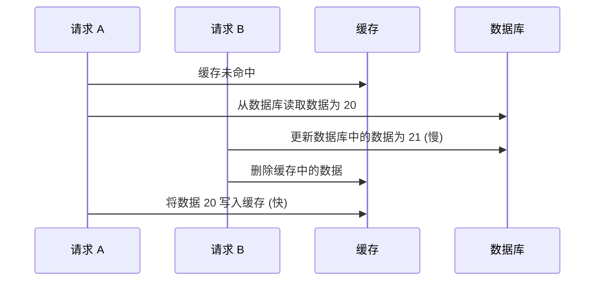
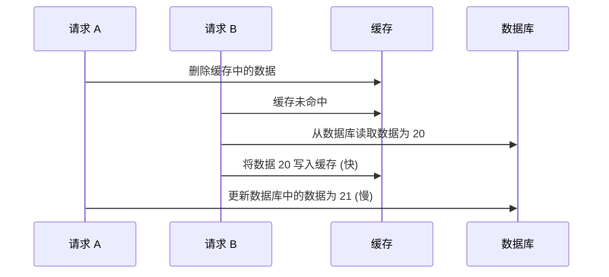

# Redis

REmote DIctionary Service 内存 kv 数据库

## 使用 redis

```shell
docker exec -it redis /bin/bash
redis-cli
redis-cli -h <host> -p <port> -a <password>
```

### 配置

```shell
config get <param> [<param2> ...]
config set <param> <value> [<param2> <value2> ...]

# e.g.
config get loglevel
config set loglevel "notice" # 默认 notice
```

## 数据类型

- string 字符串
- hash 哈希
- list 列表
- set 集合
- zset (sorted set) 有序集合

### string 字符串

- 键是 redisObject, 包含 type 类型, encoding 编码方式, ptr 值指针
- 值可以是字符串, 也可以是整数或浮点数
- 底层数据结构是 int 和 SDS (简单动态字符串)
- redisObject.encoding 编码方式有 3 种: int, embstr, raw
  - 如果值是整数, 则使用 int 编码
  - 如果值是字符串且长度 \<= 44 字节, 则使用 SDS 和 embstr 编码, embstr 编码通过 1 次内存分配保存 redisObject 和 SDS
    - 优点: 1 次内存分配, 键值的内存地址连续
    - 缺点: 如果增加 embstr 编码的字符串的长度, redisObject 和 SDS 都需要重新分配内存; 所以 embstr 编码的 kv 实际上是只读的, 修改 embstr 编码的字符串时, 先将编码方式从 embstr 转换为 raw, 再执行修改
  - 如果值是字符串且长度 > 44 字节, 则使用 SDS 和 raw 编码, raw 编码通过 2 次内存分配分别保存 redisObject 和 SDS

对比 SDS 和 C 字符串

- SDS 可以保存文本数据, 也可以保存二进制数据
- SDS 获取字符串长度的时间复杂度是 O(1)
- SDS 拼接字符串可以动态扩容, 不会导致缓冲区溢出

```shell
set <key> <value>
get <key>
exists <key>
strlen <key>
incr <key> # increase
incrby <key> <increment>
decr <key> # decrease
decrby <key> <decrement>
append <key> <value>
del <key> [<key2> ...]

mset <key> <value> [<key2> <value2> ...] # mset: multiple set
mget <key> [<key2> ...] # mget: multiple get

# 过期, 默认不会过期
expire <key> <seconds>
ttl <key>
set <key> <value> ex <seconds> # ex: EXpire
setex <key> <seconds> <value>
setnx <key> <value> # setnx: SET if Not eXist
```

#### 应用场景

- 缓存对象
- 计数器
- 分布式锁
- 共享 session 数据

### list 列表

- list 类似 ts `string[]`, go `[]string`, 值是字符串列表
- 底层数据结构是 quicklist: 由多个 listpack 节点组成的双向链表

```shell
lpush <key> <elem> [<elem2> ...]
rpush <key> <elem> [<elem2> ...]
lpop <key>
rpop <key>
lrange <key> <start> <stop> # 左闭右闭

# 从列表表头弹出一个元素, 如果没有则阻塞 timeout 秒, 如果 timeout=0 则一直阻塞, 直到有新元素入队
blpop <key> [<key2> ...] timeout
# 从列表表尾弹出一个元素, 如果没有则阻塞 timeout 秒, 如果 timeout=0 则一直阻塞, 直到有新元素入队
brpop <key> [<key2> ...] timeout
```

#### 应用场景: 消息队列

消息队列存取消息时, 必须满足

- 消息保序性 + 阻塞读取: 使用 `lpush + brpop` 或 `rpush + blpop`
- 处理重复消息
  - 生产者为每条消息生成一个全局唯一 ID
  - 消费者记录已处理的消息的 ID
- 消息可靠性: 消费者从 list 中读取一条消息, 如果消费者处理这条消息时抛出异常, 则这条消息未处理完成; 消费者重新启动后, list 中没有这条消息, 导致消息丢失; 可以使用 `blmove` 命令, 将消费者从源 list 中读取的一条消息再插入到另一个目的 list (备份 list) 中

缺点: list 不支持多个消费者 (消费组) 消费同一条消息

### hash 哈希

- hash 类似 ts `Map<string, string>`, go `map[string]string`
- 底层数据结构: 如果字段数量 \<= 512 且每个字段值大小 \<= 64 字节, 则使用 listpack; 否则使用 hashtable

```shell
hset <key> <field> <value> [<field2> <value2> ...]
hget <key> <field>
hgetall <key>
hdel <key> <field> [<field2> ...]
hlen <key>
hincrby <key> <field> <increment>
```

### set 集合

- set 类似 ts `Set<string>`, go `map[string]struct{}`; 无序不重复; 支持交集, 并集, 差集
- 底层数据结构
  - 如果成员都是整数且成员数量 \<= 512, 则使用 intset 整数集合
  - 如果成员数量较少且成员大小较小, 则使用 listpack, 否则使用 hashtable

```shell
sadd <key> <member> [<member2> ...]
srem <key> <member> [<member2> ...]
smembers <key>
# 获取成员数量
scard <key>
sismember <key> <value>
# 随机选择 count 个成员
srandmember <key> <count>
# 随机删除 count 个成员
spop <key> <count>
# 交集
sinter <key> [<key2> ...]
# 将交集结果保存到新集合 destination
sinterstore <destination> <key> [<key2> ...]
# 并集
sunion <key> [<key2> ...]
# 将并集结果保存到新集合 destination
sunionstore <destination> <key> [<key2> ...]
# 差集
sdiff <key> [<key2> ...]
# 将差集结果保存到新集合 destination
sdiffstore <destination> <key> [<key2> ...]
```

### zset (sorted set) 有序集合

- zset 类似 ts 的 `[score: number, member: string][]`, 成员不重复; 成员排序规则: zset 的每个成员都关联一个 float64 类型的分数, 成员按照分数从小到大排序, 分数相同时, 按照成员的字典序从小到大排序
- 底层数据结构: 如果成员数量 \<= 128 且每个成员大小 \<= 64 字节, 则使用 listpack; 否则使用 skiplist (按分数排序) + hashtable (成员到分数的映射)

```shell
zadd <key> <score> <member> [<score2> <member2> ...]
zrem <key> <member> [<member2> ...]
zscore <key> <member>
# 获取成员数量
zcard <key>
zincrby <key> <increment> <member>
zrange <key> <start> <stop> [withscores] # 正序返回
zrange <key> <start> <stop> rev [withscores] # 逆序返回
```

### 数据结构总结

- string: 可以存储字符串、整数或浮点数, redisObject.encoding 编码方式有 3 种: int, embstr, raw
  - int 编码: 值是整数
  - embstr 编码: 值是字符串且长度 \<= 44 字节, redisObject 和 SDS 连续分配内存
  - raw 字符串: 值是字符串且长度 > 44 字节, redisObject 和 SDS 分别分配内存
- list: 双向链表, 底层数据结构是 quicklist (由多个 listpack 节点组成)
- hash: 无序 `Map<string, string>`, 如果字段数量 \<= 512 且每个字段值大小 \<= 64 字节, 则使用 listpack; 否则使用 hashtable
- set: 无序 `Set<string>`, 如果成员都是整数且成员数量 \<= 512, 则使用 intset 整数集合; 如果成员数量较少且成员大小较小, 则使用 listpack, 否则使用 hashtable
- zset: 有序 `Set<string>`, 如果成员数量 \<= 128 且每个成员大小 \<= 64 字节, 则使用 listpack; 否则使用 skiplist (按分数排序) + hashtable (存储成员到分数的映射)

## redis 对比 lru-cache

相同

- 都是内存数据库, 支持 lru 缓存
- 都有过期策略

不同

- redis 支持 string、hash、list、set、zset 等多种数据类型, lru-cache 只支持 kv
- redis 支持数据持久化, 可以将内存中的数据写入磁盘, redis 服务器重启时, 重放命令重建数据集
- redis 支持发布订阅、lua 脚本、事务、集群模式...

## redis 线程模型

- redis6.0 前, 使用单线程处理网络 I/O
- redis6.0 后, 使用多线程处理网络 I/O, 以提升网络 I/O 性能
- redis 执行命令是「单线程」, 称为主线程
- redis 启动时, 同时启动后台线程, 负责处理耗时任务, 不会导致 redis 主线程阻塞
- redis 线程模型
  - 主线程 redis-server
  - 3 个 I/O 线程: io_thd_1、io_thd_2、io_thd_3
  - 3 个后台线程: bio_close_file、bio_aof_fsync、bio_lazy_free

生产者 (主线程) 将耗时任务加入队列, 消费者 (后台线程) 轮询队列, 处理耗时任务; 后台线程包括

- 关闭文件的后台线程, 消费关闭文件任务队列
- 将 AOF 日志刷新到磁盘 (刷盘) 的后台线程, 消费 AOF 日志刷盘任务队列
- 异步释放 redis 内存的线程, 即 lazyfree 线程; 执行 `unlink <key>`, `flushdb async`, `flushall async` 等命令时, 使用 lazyfree 线程异步释放 redis 内存, 消费 lazyfree 任务队列

### redis 主线程事件循环

- 调用 `epoll_create()` 函数, 创建 epoll 对象
- 调用 `socket()` 函数, 创建监听 socket
- 调用 `bind()` 函数, 绑定监听的端口
- 调用 `listen()` 函数, 监听连接请求
- 调用 `epoll_ctl()` 函数, 将监听 socket 加入 epoll 关注集合, 注册「连接事件」的回调函数

主线程进入事件循环

- 先查看发送队列中是否有发送任务
  - 如果有发送任务, 则调用 `write()` 函数发送缓冲区中的数据
  - 如果数据没有发送完, 则注册「写事件」的回调函数, 等待可写时调用 `write()` 函数发送剩余数据
- 调用 `epoll_wait()` 函数, 等待 epoll 对象上的事件
  - 如果是「连接事件」, 则调用连接事件的回调函数
    - 调用 `accept()` 函数获取客户端 socket
    - 调用 `epoll_ctl()` 将客户端 socket 加入 epoll 关注集合
    - 注册「读事件」的回调函数
  - 如果是「读事件」, 则调用读事件的回调函数
    - 调用 `read()` 获取客户端请求
    - 解析命令、执行命令
    - 将执行结果写入到发送缓冲区
  - 如果是「写事件」, 则调用写事件的回调函数
    - 调用 `write()` 发送缓冲区中的数据
    - 如果数据没有发送完, 则注册「写事件」的回调函数, 等待可写时调用 `write()` 函数发送剩余数据

### redis 为什么快

- redis 是内存数据库, 使用了高效的数据结构
- redis 使用 I/O 多路复用 epoll 处理客户端请求
  - epoll: 高效的 I/O 事件通知机制, 监听大量 fd (文件描述符) 的可读/可写事件
- redis 是单线程的, 没有线程切换的开销, 没有多线程间的锁竞争

### redis 执行命令是单线程

- redis 性能的瓶颈不是 cpu, 而是内存大小、网络 I/O
- 如果引入多线程, 则会导致
  - 线程切换的开销
  - 线程间的锁竞争: 加锁、解锁、甚至死锁
  - 时序竞争
  - 并发读写导致数据不一致

## redis 持久化

三种持久化方式

- rdb 快照 (redis database): 周期性的将某一时刻的内存数据, 以二进制格式写入到磁盘中的 rdb 快照中
- AOF 日志 (Append Only File 仅附加文件): 每执行 1 条写命令, 就将该写命令追加到 AOF 缓冲区中; redis 服务器重启时, 重新执行 AOF 日志恢复数据
- 混合持久化 (rdb + AOF): 混合使用 rdb 快照和 AOF 日志

### AOF 日志

先执行写命令, 后将该写命令追加到 AOF 缓冲区

#### AOF 日志写回策略

- Always: 每执行 1 条写命令, 将 AOF 缓冲区「同步」写回磁盘
- Everysec: 每隔 1s 将 AOF 缓冲区写回磁盘
- No: 由操作系统控制将 AOF 缓冲区写回磁盘的时机

#### AOF 重写机制

AOF 日志大小超过阈值时, 会触发 AOF 重写机制压缩 AOF 日志

bgrewriteaof 子进程执行 AOF 重写: 读取内存数据库中的所有键值对, 将每个键值对以一条 set 命令写入新的 AOF 日志, 并使用新的 AOF 日志替换旧的 AOF 日志

写时复制 (Copy-on-Write): fork 子进程时, 父子进程共享内存; 只有父进程或子进程写内存时, 才会复制发生写操作的内存页

- bgrewriteaof 子进程执行 AOF 重写, 不会阻塞主进程
- 如果使用线程, 多线程共享内存, 修改共享内存中的数据时需要加锁
- 如果使用进程, 是「写时复制」, 不需要加锁
  - fork 子进程时, 父子进程共享内存
  - 只有父进程或子进程写内存时, 才会复制发生写操作的内存页

AOF 重写时, 如果主进程修改内存中的数据, 则会发生「写时复制」, 导致数据不一致; 解决方法

- AOF 重写时, fork bgrewriteaof 子进程, 分配 AOF 重写缓冲区
- AOF 重写时, 主进程执行写命令后, 同时将写命令追加到「AOF 缓冲区」和「AOF 重写缓冲区」
- AOF 重写完成后, bgrewriteaof 子进程通过 IPC 进程间通信, 通知主进程
- 主进程收到通知后
  1. 将「AOF」重写缓冲区中的数据, 追加到新的 AOF 日志
  2. 使用新的 AOF 日志替换旧的 AOF 日志

### rdb 快照

- AOF 日志是文本文件, 故障恢复时较慢, 需要执行 AOF 日志中的命令
- rdb 快照是二进制文件, 故障恢复时较快, 只需要将 rdb 快照读入内存

redis 提供 save 和 bgsave 两个命令以生成 rdb 快照

- save: 在主线程生成 rdb 文件, 会阻塞主线程
- bgsave: fork 子进程生成 rdb 文件, 不会阻塞主线程
  - bgsave 时, 如果主进程修改内存中的数据, 则会发生「写时复制」, 将修改的数据写入副本
  - 子进程会将副本中的数据写入 rdb 文件

rdb 快照: 全量数据

- 如果 rdb 快照频率过高, 会影响 redis 性能
- 如果 rdb 快照频率过低, 故障时快照间的数据丢失更多

```shell
# 满足以下条件的任意 1 个, 就会执行 bgsave
save 3600 1 # 3600s 内, 对内存数据库进行了至少 1 次修改
save 300 10 # 300s 内, 对内存数据库进行了至少 10 次修改
save 60 100000 # 60s 内, 对内存数据库进行了至少 100000 次修改
```

### 混合持久化 (rdb + AOF)

|          | 优点       | 缺点       |
| -------- | ---------- | ---------- |
| rdb 快照 | 数据丢失少 | 数据恢复快 |
| AOF 文件 | 数据丢失多 | 数据恢复慢 |

#### AOF 重写时, 触发混合持久化

- AOF 重写时, 触发混合持久化, fork 子进程
- 将与主进程共享的全量数据以「rdb 快照」格式写入「AOF 文件」
- 将 AOF 重写时, 主进程执行的写命令写入「AOF 重写缓冲区」
- 将「AOF 重写缓冲区」的增量写命令以「AOF 日志」格式写入「AOF 文件」

使用混合持久化, AOF 文件包括 rdb 快照格式的全量数据 (数据恢复快)、AOF 日志格式的增量写命令 (数据丢失少)

## redis 架构

- 单个 redis 节点: 如果开启了持久化, 则每隔某个时间间隔, 有一个 fork 进程, 生成 RDB 快照或 AOF 仅附加文件, 快照通过异步拷贝内存中的数据实现持久化, 缺点是可能在快照间隔期间丢失数据
- 主从模式: 数据副本, 读写分离
- 哨兵模式: 高可用, 主节点故障时自动选举新主节点
- 集群模式: 数据分片 (shard), 方便集群扩容

### 主从模式

**架构**: 1 个主节点, 多个只读的副本节点

- 读写分离: 主节点可读可写, 副本节点 只读
- 主节点执行写命令, 同时将写命令同步给副本节点
- 问题: 主副本节点 故障时, 不能自动故障转移

### 哨兵模式 (sentinel)

**架构**: 1 个主节点, 多个副本节点 , 多个哨兵节点

自动故障转移: 哨兵节点可以相互通信, 如果法定数量 (quorum) 的哨兵节点都判定某个节点主观下线时, 则判定该节点客观下线, 执行故障转移

### 集群模式 (cluster)

**架构**

- 集群模式没有哨兵节点; 有多个主节点 (master), 每个主节点有多个副本节点 (replica)
- 集群模式有多个主节点, 将数据分片 (shard) 到多个主节点

集群扩容时, 例如分片数量 (主节点数量) 从 2 个增加到 3 个, 传统哈希 + 取模移动数据速度慢, 影响 redis 集群的可用性; redis 集群使用哈希槽, 相当于在 key 和分片间增加了一层映射: key -> 0x3fff (16384) 个哈希槽 -> 多个分片 (多个主节点); 集群扩容时, 只需要移动部分哈希槽, 速度快, 不会影响 redis 集群的可用性, key 到哈希槽的映射是固定的, 不会随着分片数量的改变而改变

2 个分片

- M1 包含从 0 到 0x1fff 的哈希槽
- M2 包含从 0x2000 到 0x3fff 的哈希槽

3 个分片

- M1 包含从 0 到 0x1554 的哈希槽
- M2 包含从 0x1555 到 0x2aaa 的哈希槽
- M3 包含从 0x2aab 到 0x3fff 的哈希槽

```ts
function keyHashSlot(key: string) {
  // return crc16(key) % 2;
  return crc16(key) % 3;
}

function keyHashSlot(key: string) {
  return crc16(key) % 0x4000;
}
```

### Gossip 流言协议

redis 集群使用 Gossip 流言协议保持集群健康

redis 集群的所有节点可以相互通信; 如果法定数量 (quorum) 的副本节点都判定主节点 M1 主观下线时, 则判定 M1 客观下线, 执行故障转移; 选举 M1 的一个副本节点 R1, 提升为主节点以保持集群健康

### 集群脑裂

1. 主节点 M1 和集群连接断开, 客户端向 M1 写数据, 但 M1 无法将写命令同步给副本节点
2. redis 使用 Gossip 流言协议判定 M1 客观下线, 选举新的主节点 R1 (脑裂)
3. M1 重新连接到集群, 第一次同步会清空 M1 的数据并全量同步, 即集群脑裂导致数据丢失

解决方案: 主节点发现和集群连接断开, 即连接的副本节点数量小于阈值, 或主节点和副本节点数据同步延迟大于阈值时, 禁止主节点执行写命令, 直接返回错误给客户端

## 过期删除、内存淘汰

过期字典 (expires dict): 保存 key 到过期时间的映射

查询 key 时, redis 先检查该 key 是否在过期字典中

- 如果不在, 则该 key 不会过期, 直接返回 value
- 如果在, 则先检查该 key 是否过期
  - 如果过期时间 > 当前时间, 则该 key 未过期, 返回 value
  - 否则该 key 未过期

### 惰性删除 + 定期删除

redis 使用的过期删除策略是: 惰性删除 + 定期删除

- 惰性删除: redis 不会主动删除过期的 key, 每次查询 key 时, 都会检查该 key 是否过期, 如果过期则删除该 key
- 惰性删除 cpu 友好, 内存占用不友好
- 定期删除: 每隔一段时间, 随机检查一定数量的 key, 并删除过期的 key
  1. 从过期字典中随机选择 20 个 key
  2. 检查这 20 个 key 是否过期, 并删除过期的 key
  3. 如果本轮检查时间超过 25ms, 则 break, 等待下一轮检查
  4. 如果已过期的 key 数量超过 5 个 (5 / 20 = 25%), 则重复步骤 1; 否则 break, 等待下一轮检查

### redis 持久化对过期键的处理

对于 rdb 快照持久化

- rdb 快照生成阶段: 过期键不会被写入新的 rdb 快照
- rdb 快照加载阶段
  - 如果是主节点, 则加载 rdb 快照时, 过期键不会被加载到内存数据库
  - 如果是从节点, 则加载 rdb 快照时, 过期键会被加载到内存数据库

对于 AOF 日志持久化

- AOF 文件生成阶段
  - 如果某个过期键没有被删除, 则该过期键会被写入新的 AOF 文件
  - 如果该过期键后续被删除, 则向 AOF 文件中追加一条 del 命令
- AOF 重写阶段: AOF 重写时, 会检查 redis 中的键值对, 过期键不会被保存到重写后的 AOF 文件

### 主从模式对过期键的处理

主库在 key 到期时, 向 AOF 文件中追加一条 del 命令, 同步到从库

### redis 内存淘汰

- redis 内存到阈值时, 会发生「内存淘汰」
- 不进行数据淘汰的内存淘汰策略
  - noeviction: 不进行数据淘汰, 直接返回错误
- 有过期时间的键值对范围内, 进行数据淘汰的内存淘汰策略
  - volatile-random: 随机淘汰有过期时间的任意键值对
  - volatile-ttl: 淘汰有过期时间的、过期时间较早的键值对
  - volatile-lru: 淘汰有过期时间的、最近最少使用的键值对
  - volatile-lfu: 淘汰有过期时间的、最少使用的键值对
- 所有键值对范围内, 进行数据淘汰的内存淘汰策略
  - allkeys-random: 随机淘汰任意键值对
  - allkeys-lru: 淘汰最近最少使用的键值对
  - allkeys-lfu: 淘汰最少使用的键值对

### lru (least recently used) v.s. lfu (least frequently used)

- lru: 最近最少使用, 淘汰最长时间没有访问的数据
  - lru 无法解决缓存污染问题, 例如读取大量的数据, 但是只读取 1 次; 这些数据会缓存一段时间, 导致缓存污染
- lfu: 最少使用, 淘汰一段时间内访问次数最少的数据

## redis 缓存

### 缓存雪崩、缓存击穿、缓存穿透

- 缓存雪崩: 大量缓存数据在同一时刻过期, 大量请求打到数据库
- 缓存击穿: 某个热点数据过期, 大量请求打到数据库
- 缓存穿透: 某个数据既不在缓存中, 也不在数据库中, 大量请求打到数据库

#### 缓存雪崩

- 过期时间随机化: 原过期时间 + 随机值
- 不设置过期时间, 后台线程异步更新缓存; 或者热点数据即将过期时, 提前通知后台线程异步更新缓存

#### 缓存击穿

- 互斥锁: 使用互斥锁, 保证同一时刻只有一个线程读缓存; 没有获取到互斥锁的线程, 要么等待互斥锁释放后读缓存, 要么返回空值或默认值
- 热点数据不设置过期时间, 后台线程异步更新缓存; 或者热点数据即将过期时, 提前通知后台线程异步更新缓存

#### 缓存穿透

- 发现缓存穿透后, 在缓存中对该 key 设置一个空值或默认值
- 限制非法请求, 避免请求打到数据库
- 使用布隆过滤器, 快速判断数据是否存在, 避免请求打到数据库

### 缓存更新策略

- Cache Aside 旁路缓存策略, 分为: 读策略、写策略
  - 适合读多写少的场景, 不适合写多的场景
- Read/Write Through 读穿/写穿策略
- Write Back 写回策略
  - 适合写多的场景, 缺点是可能数据不一致、可能有数据丢失的风险

#### Cache Aside 旁路缓存策略

实际开发中, 使用 Cache Aside 旁路缓存策略

- 写策略: 先更新数据库中的数据, 再删除缓存中的数据
- 读策略
  - 如果缓存命中, 则直接返回数据
  - 如果缓存未命中, 则先从数据库读取数据, 再将数据写入缓存, 并返回数据

写策略必须先更新数据库中的数据, 后删除缓存中的数据, 不会导致数据不一致

以下场景出现的概率极低, 因为写缓存的速度远快于写数据库的速度



写策略如果先删除缓存中的数据, 后更新数据库中的数据, 会导致数据不一致



#### Read/Write Through 读穿/写穿策略

客户端只与缓存交互, 不与数据库交互

**Read Through 读穿策略**

- 如果缓存命中, 则直接返回数据
- 如果缓存未命中, 则先从数据库读取数据, 再将数据写入缓存, 最后返回缓存中的数据

**Write Through 写穿策略**

- 如果缓存中有数据: 先更新缓存、再更新数据库后, 缓存返回客户端更新完成
- 如果缓存中没有数据: 直接更新数据库后, 缓存返回客户端更新完成

#### Write Back 写回策略

- 更新数据时, 只更新缓存中的数据, 并将该缓存数据标记为脏的, 立刻返回
- 为了减少磁盘 I/O 次数, 不会立刻将脏数据写回数据库, 而是由后台线程定期将脏数据写回数据库
- 例: mysql buffer pool、[redis AOF 日志写回策略](#aof-日志写回策略)

## redis 实战

### redis 实现分布式锁

### 缓存热点数据

根据最近访问时间排序, 过滤不经常访问的数据

### 查找和删除大 key

#### 大 key: value 很大

- string 类型的值大于 10 KB
- hash, list, set, zset 类型的元素数量超过 5000 个

#### 大 key 的影响

- 阻塞主线程: redis 执行命令是「单线程」, 操作大 key 比较耗时; 使用 del 删除大 key 时, 主线程同步释放内存, 会阻塞后续命令 (使用 unlink 异步删除)
- 传输大 key 时, 占用的网络带宽较多
- 内存、请求倾斜: 有大 key 的 redis 节点占用内存更多、热点大 key 会导致请求倾斜

#### 查找大 key

```shell
redis-cli -h 127.0.0.1 -p 6379 -a "pass" --bigkeys [-i 0.1] # 间隔 0.1s
```

### redis 管道

redis 管道是客户端的批量发送/接收机制: 客户端一次性发送多个命令以减少 rtt, redis 按顺序执行命令并返回多个执行结果

### redis 事务

::: code-group

```shell [redis 支持事务]
set count 1
get count  # 1
multi      # 开启事务
decr count # queued
discard    # 取消事务
get count  # 1
```

```shell [redis 不支持事务回滚]
set name swifty
get name        # swifty
multi           # 开启事务
set name opus   # queued
# 下面的命令有语法错误, 但是入队成功
expire name 10s # queued
exec            # 提交事务
# 1) OK
# 2) (error) ERR value is not an integer or out of range
get name        # opus
```

:::
